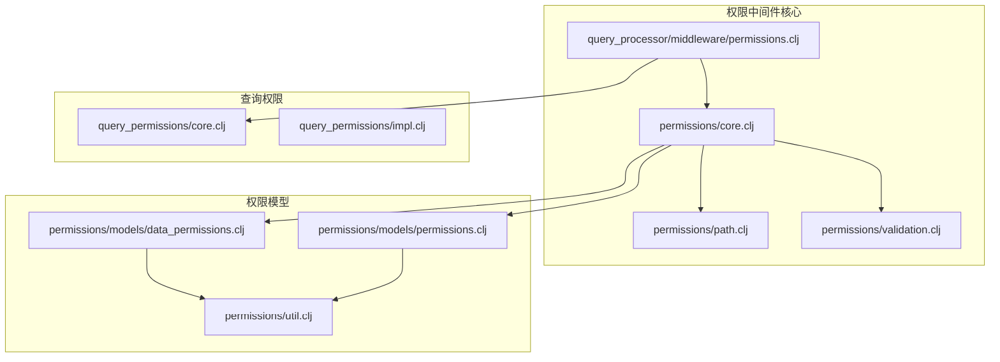
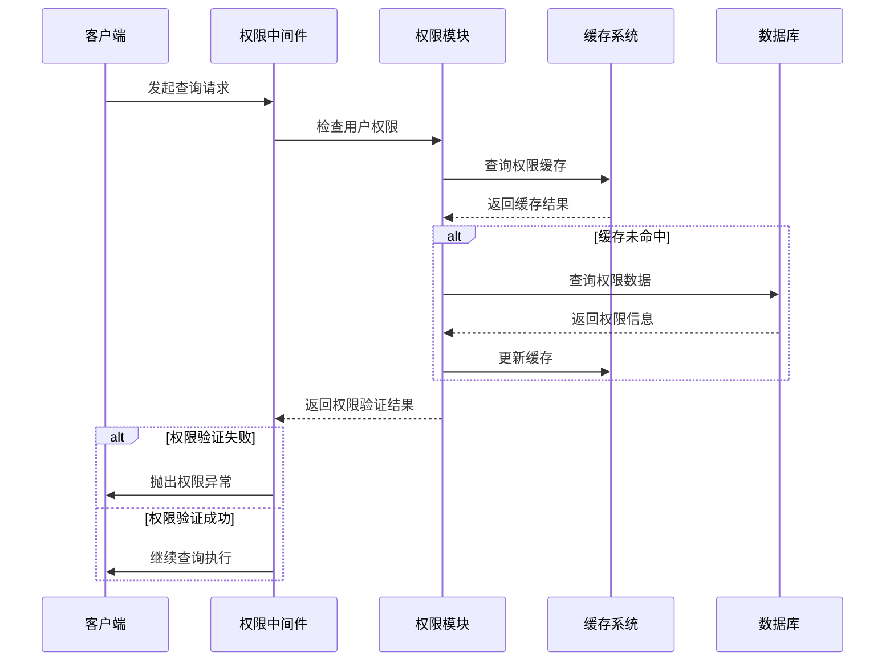
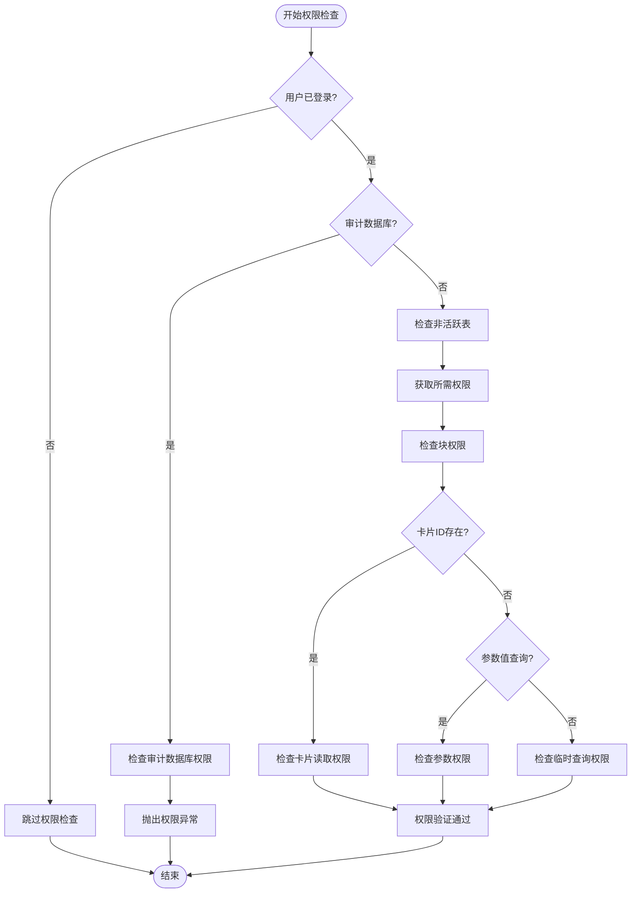
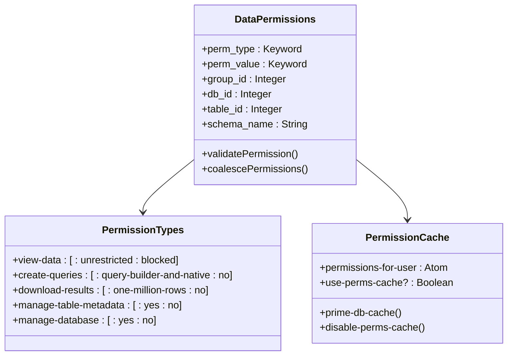
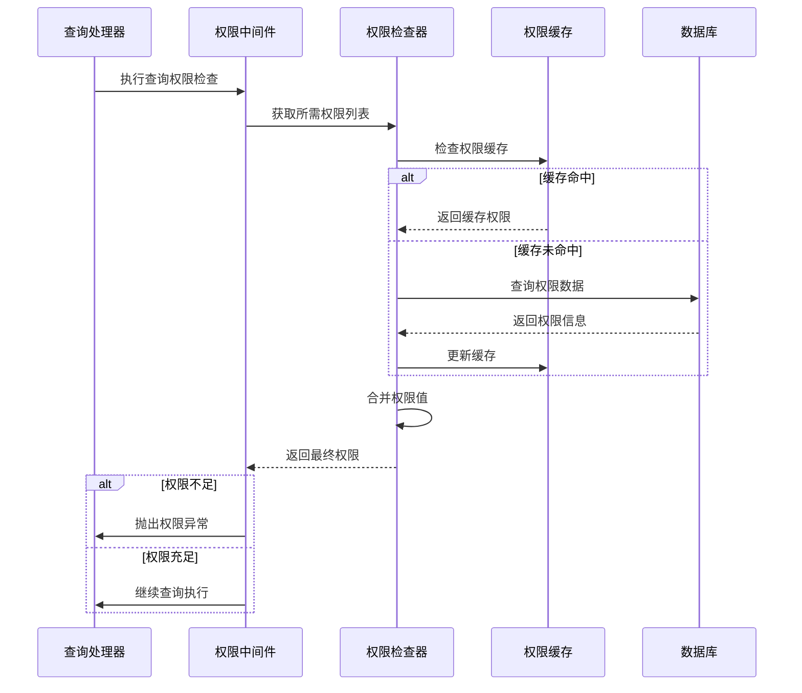
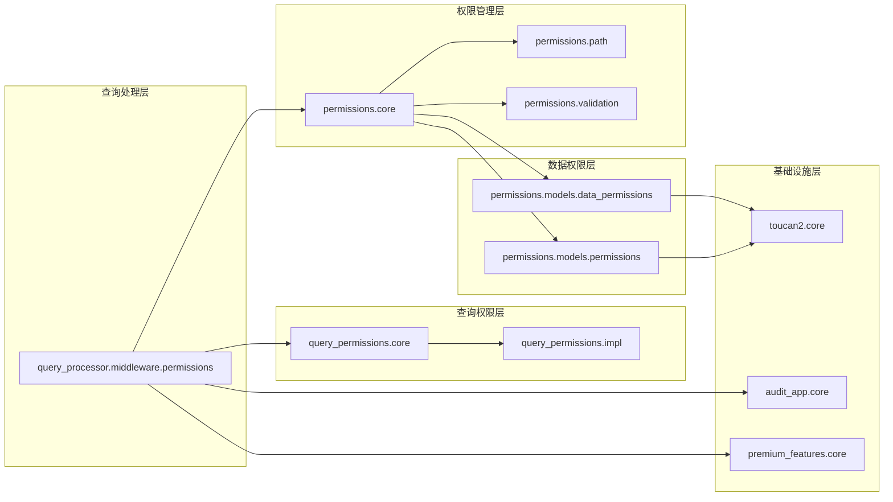
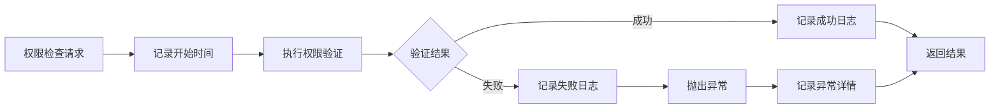

# 权限中间件

<cite>
**本文档中引用的文件**
- [permissions.clj](file://src/metabase/query_processor/middleware/permissions.clj)
- [core.clj](file://src/metabase/permissions/core.clj)
- [path.clj](file://src/metabase/permissions/path.clj)
- [validation.clj](file://src/metabase/permissions/validation.clj)
- [data_permissions.clj](file://src/metabase/permissions/models/data_permissions.clj)
- [permissions.clj](file://src/metabase/permissions/models/permissions.clj)
- [util.clj](file://src/metabase/permissions/util.clj)
- [query_permissions.clj](file://src/metabase/query_permissions/core.clj)
</cite>

## 目录
1. [简介](#简介)
2. [项目结构](#项目结构)
3. [核心组件](#核心组件)
4. [架构概览](#架构概览)
5. [详细组件分析](#详细组件分析)
6. [依赖关系分析](#依赖关系分析)
7. [性能考虑](#性能考虑)
8. [故障排除指南](#故障排除指南)
9. [结论](#结论)

## 简介

Metabase的权限中间件是一个复杂而精密的安全系统，负责在查询执行前验证用户对数据库、表和字段的访问权限。该中间件与`metabase.permissions`模块紧密协作，实现了多层次的权限控制机制，包括权限路径生成、集合权限检查以及敏感数据过滤策略。

权限中间件的核心职责是在查询执行前进行严格的权限验证，确保只有具备相应权限的用户才能访问特定的数据资源。它通过拦截无权限请求并抛出适当的异常来维护系统的安全性，同时记录详细的审计日志以支持合规性要求。

## 项目结构

权限中间件相关的文件主要分布在以下目录结构中：

**图表来源**
- [permissions.clj](file://src/metabase/query_processor/middleware/permissions.clj#L1-L202)
- [core.clj](file://src/metabase/permissions/core.clj#L1-L127)

**章节来源**
- [permissions.clj](file://src/metabase/query_processor/middleware/permissions.clj#L1-L50)
- [core.clj](file://src/metabase/permissions/core.clj#L1-L30)

## 核心组件

权限中间件由以下几个核心组件构成：

### 查询权限检查器
负责在查询执行前验证用户权限的核心组件，包括数据权限、集合权限和块权限的综合检查。

### 权限路径生成器
根据数据库、表和字段信息生成标准化的权限路径，支持前缀匹配和层次化权限管理。

### 缓存优化器
实现智能缓存机制，减少重复的数据库查询，提高权限检查的性能。

### 审计日志记录器
记录所有权限检查操作，支持安全审计和合规性要求。

**章节来源**
- [permissions.clj](file://src/metabase/query_processor/middleware/permissions.clj#L160-L202)
- [data_permissions.clj](file://src/metabase/permissions/models/data_permissions.clj#L137-L174)

## 架构概览

权限中间件采用分层架构设计，从底层的权限模型到顶层的查询处理器形成完整的权限控制链：

**图表来源**
- [permissions.clj](file://src/metabase/query_processor/middleware/permissions.clj#L160-L184)
- [data_permissions.clj](file://src/metabase/permissions/models/data_permissions.clj#L150-L174)

## 详细组件分析

### 权限中间件核心逻辑

权限中间件的核心逻辑在`check-query-permissions*`函数中实现，该函数负责全面的权限验证流程：

**图表来源**
- [permissions.clj](file://src/metabase/query_processor/middleware/permissions.clj#L100-L160)

### 权限路径生成机制

权限路径生成遵循严格的层次化结构，支持多种类型的权限路径：

| 权限类型 | 路径格式 | 描述 |
|---------|---------|------|
| 数据库权限 | `/db/:id/` | 对整个数据库的完全访问权限 |
| 数据库原生查询权限 | `/db/:id/native/` | 允许执行原生SQL查询 |
| 数据库模式权限 | `/db/:id/schema/` | 允许查询所有模式 |
| 表权限 | `/db/:id/schema/:name/table/:id/` | 对特定表的完全访问权限 |
| 集合权限 | `/collection/:id/` | 对集合及其子项目的读写权限 |
| 应用程序权限 | `/application/:type/` | 对应用程序功能的访问权限 |

**章节来源**
- [path.clj](file://src/metabase/permissions/path.clj#L15-L48)
- [permissions.clj](file://src/metabase/permissions/models/permissions.clj#L126-L147)

### 数据权限模型

数据权限模型实现了细粒度的访问控制，支持多种权限级别：

**图表来源**
- [data_permissions.clj](file://src/metabase/permissions/models/data_permissions.clj#L15-L50)
- [data_permissions.clj](file://src/metabase/permissions/models/data_permissions.clj#L137-L174)

### 权限验证流程

权限验证采用多层检查机制，确保安全性和性能的平衡：

**图表来源**
- [permissions.clj](file://src/metabase/query_processor/middleware/permissions.clj#L160-L184)
- [data_permissions.clj](file://src/metabase/permissions/models/data_permissions.clj#L200-L250)

**章节来源**
- [permissions.clj](file://src/metabase/query_processor/middleware/permissions.clj#L100-L160)
- [data_permissions.clj](file://src/metabase/permissions/models/data_permissions.clj#L200-L300)

### 企业版功能扩展

权限中间件支持多种企业版功能，提供更高级的权限控制：

| 功能特性 | 描述 | 实现位置 |
|---------|------|---------|
| 分段权限 | 基于行级规则的访问控制 | `metabase-enterprise.sandbox` |
| 块权限 | 反向权限，阻止集合访问 | `metabase-enterprise.advanced-permissions` |
| 连接伪装 | 用户身份伪装访问数据库 | `metabase-enterprise.impersonation` |
| 审计应用 | 专门的审计数据库访问 | `metabase-enterprise.audit-app` |

**章节来源**
- [validation.clj](file://src/metabase/permissions/validation.clj#L10-L30)
- [permissions.clj](file://src/metabase/permissions/models/permissions.clj#L60-L80)

## 依赖关系分析

权限中间件与多个系统组件存在复杂的依赖关系：

**图表来源**
- [permissions.clj](file://src/metabase/query_processor/middleware/permissions.clj#L1-L20)
- [core.clj](file://src/metabase/permissions/core.clj#L1-L20)

**章节来源**
- [permissions.clj](file://src/metabase/query_processor/middleware/permissions.clj#L1-L30)
- [core.clj](file://src/metabase/permissions/core.clj#L1-L50)

## 性能考虑

权限中间件实现了多项性能优化策略：

### 缓存优化策略

1. **权限缓存机制**：使用动态绑定的原子变量缓存用户权限，避免重复查询
2. **数据库预加载**：批量预加载相关数据库的权限信息
3. **缓存失效策略**：在权限变更时自动清理相关缓存

### 查询优化技术

1. **前缀索引利用**：权限路径采用前缀匹配，支持高效的数据库查询
2. **批量权限检查**：一次性检查多个权限需求，减少数据库往返
3. **延迟加载**：按需加载权限信息，避免不必要的计算

### 内存管理

1. **动态缓存控制**：支持禁用缓存以满足特殊场景需求
2. **内存泄漏防护**：定期清理过期的缓存条目
3. **垃圾回收友好**：使用不可变数据结构减少GC压力

**章节来源**
- [data_permissions.clj](file://src/metabase/permissions/models/data_permissions.clj#L137-L174)
- [util.clj](file://src/metabase/permissions/util.clj#L140-L168)

## 故障排除指南

### 常见权限配置错误

#### 1. 权限路径格式错误
**症状**：权限检查失败，出现路径格式异常
**原因**：权限路径缺少必要的斜杠或包含非法字符
**解决方案**：使用`permissions.path`命名空间中的工具函数生成正确的路径格式

#### 2. 缓存不一致问题
**症状**：权限变更后仍然使用旧的权限设置
**原因**：权限缓存未正确更新
**解决方案**：调用`permissions.models.permissions/clear-current-user-cached-permissions!`清理缓存

#### 3. 数据库连接权限缺失
**症状**：无法访问特定数据库或表
**原因**：数据库或表级别的权限未正确配置
**解决方案**：检查并更新相应的数据权限配置

#### 4. 企业版功能未启用
**症状**：高级权限功能（如分段权限）不可用
**原因**：企业版功能未正确激活
**解决方案**：确认企业版许可证有效并启用相应功能

### 审计日志分析

权限中间件会记录详细的审计日志，帮助诊断权限问题：

**图表来源**
- [util.clj](file://src/metabase/permissions/util.clj#L15-L30)

### 性能监控指标

建议监控以下关键指标以确保权限中间件的正常运行：

| 指标类型 | 监控内容 | 正常范围 |
|---------|---------|---------|
| 响应时间 | 权限检查平均耗时 | < 100ms |
| 缓存命中率 | 权限缓存命中比例 | > 90% |
| 错误率 | 权限验证失败比例 | < 1% |
| 并发数 | 同时进行的权限检查 | < 最大连接数的50% |

**章节来源**
- [util.clj](file://src/metabase/permissions/util.clj#L15-L50)
- [data_permissions.clj](file://src/metabase/permissions/models/data_permissions.clj#L750-L786)

## 结论

Metabase的权限中间件是一个功能完整、设计精良的安全控制系统。它通过多层次的权限验证、智能缓存机制和详细的审计日志，为数据访问提供了强有力的保护。

该系统的主要优势包括：
- **全面的权限覆盖**：支持数据库、表、字段和集合的细粒度权限控制
- **高性能设计**：通过缓存和优化查询显著提升权限检查效率
- **可扩展架构**：支持企业版功能扩展，适应复杂的业务需求
- **完善的审计**：提供详细的权限操作记录，满足合规性要求

对于开发者而言，理解权限中间件的工作原理有助于更好地设计和实现安全的应用程序，同时也有助于快速定位和解决权限相关的问题。