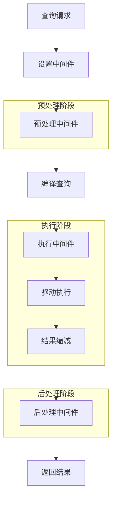
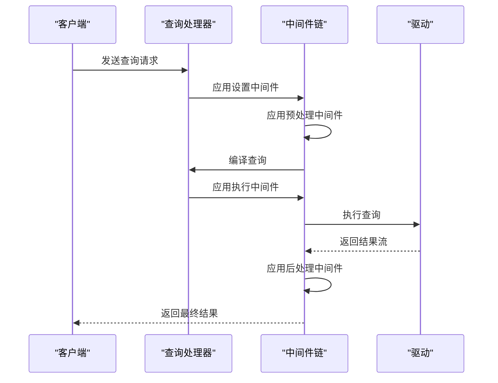
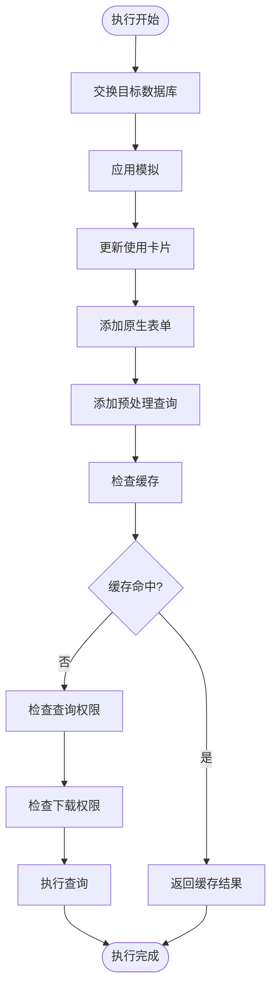
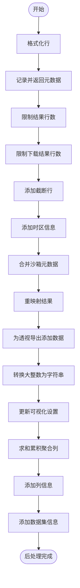
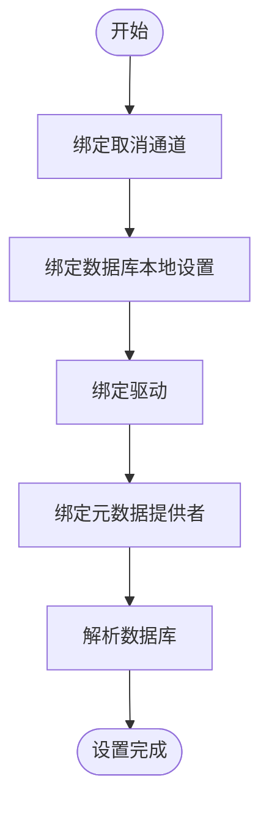
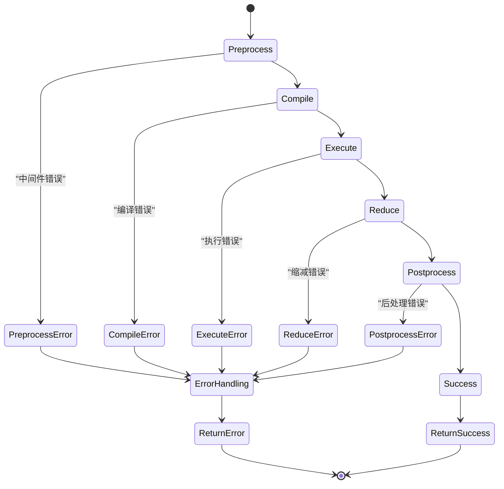

# 查询管道与中间件

<cite>
**本文档引用的文件**
- [pipeline.clj](file://src/metabase/query_processor/pipeline.clj)
- [preprocess.clj](file://src/metabase/query_processor/preprocess.clj)
- [postprocess.clj](file://src/metabase/query_processor/postprocess.clj)
- [execute.clj](file://src/metabase/query_processor/execute.clj)
- [setup.clj](file://src/metabase/query_processor/setup.clj)
- [query_processor.clj](file://src/metabase/query_processor.clj)
- [permissions.clj](file://src/metabase/query_processor/middleware/permissions.clj)
- [cache.clj](file://src/metabase/query_processor/middleware/cache.clj)
- [parameters.clj](file://src/metabase/query_processor/middleware/parameters.clj)
- [validate.clj](file://src/metabase/query_processor/middleware/validate.clj)
</cite>

## 目录
1. [引言](#引言)
2. [查询管道架构](#查询管道架构)
3. [中间件注册与执行机制](#中间件注册与执行机制)
4. [预处理中间件](#预处理中间件)
5. [执行阶段中间件](#执行阶段中间件)
6. [后处理中间件](#后处理中间件)
7. [设置中间件](#设置中间件)
8. [错误传播与调试](#错误传播与调试)
9. [中间件链调试技巧](#中间件链调试技巧)
10. [结论](#结论)

## 引言
Metabase的查询处理器采用函数式组合的方式构建查询处理流水线，通过一系列中间件对查询进行预处理、执行和后处理。该系统允许在查询生命周期的不同阶段插入功能，如权限检查、缓存、参数替换和验证等。本文档详细描述了`pipeline`模块如何通过函数式组合构建查询处理流水线，解释每个中间件的执行顺序、输入输出契约及其在查询生命周期中的作用。

## 查询管道架构



**Diagram sources**
- [query_processor.clj](file://src/metabase/query_processor.clj#L24-L52)
- [pipeline.clj](file://src/metabase/query_processor/pipeline.clj#L1-L129)

**Section sources**
- [query_processor.clj](file://src/metabase/query_processor.clj#L1-L116)
- [pipeline.clj](file://src/metabase/query_processor/pipeline.clj#L1-L129)

## 中间件注册与执行机制

Metabase的查询处理器采用分层中间件架构，通过函数式组合构建查询处理流水线。系统定义了四种主要的中间件类型，每种类型在查询生命周期的不同阶段执行：

1. **around-middleware**: 包围`process-query`的中间件，处理审计查询和用户查询的特殊逻辑
2. **setup-middleware**: 设置中间件，负责解析数据库、驱动和元数据提供者
3. **preprocessing-middleware**: 预处理中间件，在查询编译前修改查询结构
4. **post-processing-middleware**: 后处理中间件，在结果缩减后修改结果

中间件通过`rebuild-process-query-fn!`函数动态重建，当任何中间件发生变化时，系统会自动重新构建处理函数。这种设计允许在运行时动态修改中间件链，而无需重启服务。



**Diagram sources**
- [query_processor.clj](file://src/metabase/query_processor.clj#L49-L82)
- [setup.clj](file://src/metabase/query_processor/setup.clj#L200-L256)

**Section sources**
- [query_processor.clj](file://src/metabase/query_processor.clj#L1-L116)
- [setup.clj](file://src/metabase/query_processor/setup.clj#L1-L256)

## 预处理中间件

预处理中间件在查询编译前执行，负责修改查询结构。这些中间件按照定义的顺序从上到下执行，每个中间件接收查询并返回修改后的查询。

```mermaid
flowchart TD
Start([开始]) --> Normalize["标准化查询"]
Normalize --> RemovePerms["移除权限键"]
RemovePerms --> Validate["验证查询"]
Validate --> ResolveSource["解析源表"]
ResolveSource --> AutoBucket["自动时间桶"]
AutoBucket --> ExpandAggregations["展开聚合"]
ExpandAggregations --> Parameters["替换参数"]
Parameters --> ResolveFields["解析字段"]
ResolveFields --> Binning["更新分箱策略"]
Binning --> Desugar["去糖化"]
Desugar --> AddDefaults["添加默认时间单位"]
AddDefaults --> AddJoins["添加隐式连接"]
AddJoins --> FixBadRefs["修复错误字段引用"]
FixBadRefs --> RemoveInactive["移除非活动字段引用"]
RemoveInactive --> ApplySandboxing["应用沙箱"]
ApplySandboxing --> RewriteCumulative["重写累积聚合"]
RewriteCumulative --> WrapLiterals["包装字面量"]
WrapLiterals --> ParseFilterValues["解析过滤值"]
ParseFilterValues --> ValidateBucketing["验证时间桶"]
ValidateBucketing --> OptimizeFilters["优化时间过滤"]
OptimizeFilters --> AddLimit["添加默认限制"]
AddLimit --> ApplyDownloadLimit["应用下载限制"]
ApplyDownloadLimit --> CheckFeatures["检查功能"]
CheckFeatures --> End([预处理完成])
```



**Diagram sources**
- [preprocess.clj](file://src/metabase/query_processor/preprocess.clj#L20-L37)
- [preprocess.clj](file://src/metabase/query_processor/preprocess.clj#L37-L69)

**Section sources**
- [preprocess.clj](file://src/metabase/query_processor/preprocess.clj#L1-L158)

## 执行阶段中间件

执行阶段中间件在查询编译后、执行前应用，主要负责权限检查、缓存和执行前的最后处理。



**Diagram sources**
- [execute.clj](file://src/metabase/query_processor/execute.clj#L30-L63)
- [execute.clj](file://src/metabase/query_processor/execute.clj#L63-L99)

**Section sources**
- [execute.clj](file://src/metabase/query_processor/execute.clj#L1-L99)

## 后处理中间件

后处理中间件在结果缩减后执行，负责修改查询结果。这些中间件按照定义的顺序从下到上执行，每个中间件接收预处理查询和结果缩减函数(rff)，返回修改后的rff。



**Diagram sources**
- [postprocess.clj](file://src/metabase/query_processor/postprocess.clj#L20-L37)
- [postprocess.clj](file://src/metabase/query_processor/postprocess.clj#L37-L54)

**Section sources**
- [postprocess.clj](file://src/metabase/query_processor/postprocess.clj#L1-L65)

## 设置中间件

设置中间件在查询处理的最开始阶段执行，负责解析和绑定查询所需的上下文信息。



**Diagram sources**
- [setup.clj](file://src/metabase/query_processor/setup.clj#L200-L256)
- [setup.clj](file://src/metabase/query_processor/setup.clj#L150-L200)

**Section sources**
- [setup.clj](file://src/metabase/query_processor/setup.clj#L1-L256)

## 错误传播与调试

查询处理器采用分层错误处理机制，确保错误能够正确传播并提供有用的调试信息。



**Diagram sources**
- [pipeline.clj](file://src/metabase/query_processor/pipeline.clj#L100-L129)
- [execute.clj](file://src/metabase/query_processor/execute.clj#L80-L99)

**Section sources**
- [pipeline.clj](file://src/metabase/query_processor/pipeline.clj#L1-L129)
- [execute.clj](file://src/metabase/query_processor/execute.clj#L1-L99)

## 中间件链调试技巧

### 启用调试日志
通过设置`qp.debug/debug>`可以启用详细的中间件执行日志，查看每个中间件的输入输出差异。

```clojure
(qp.debug/debug> (list `preprocess query))
```

### 监控慢速中间件
系统会监控执行时间超过阈值的中间件，并记录警告日志：

```clojure
(when (> duration-ms slow-middleware-warning-threshold-ms)
  (log/warnf "Slow middleware: %s took %s" middleware-fn (u/format-milliseconds duration-ms)))
```

### 动态重载
中间件支持动态重载，当中间件代码发生变化时，系统会自动重新构建处理函数：

```clojure
(doseq [varr  around-middleware
        :when varr]
  (add-watch varr ::reload (fn [_key _ref _old-state _new-state]
                             (log/infof "%s changed, rebuilding %s" varr `process-query*)
                             (rebuild-process-query-fn!))))
```

### 条件执行
某些中间件支持条件执行，可以通过查询的`middleware`键控制：

```clojure
(defn- is-cacheable? [{:keys [cache-strategy], :as _query}]
  (and (cache/enable-query-caching)
       (some? cache-strategy)
       (not= (:type cache-strategy) :nocache)))
```

**Section sources**
- [preprocess.clj](file://src/metabase/query_processor/preprocess.clj#L121-L143)
- [cache.clj](file://src/metabase/query_processor/middleware/cache.clj#L200-L246)
- [query_processor.clj](file://src/metabase/query_processor.clj#L70-L82)

## 结论
Metabase的查询管道与中间件系统采用函数式组合的方式构建查询处理流水线，通过分层中间件架构实现了高度可扩展和可维护的查询处理系统。预处理、执行和后处理三个阶段的中间件分别负责查询结构的修改、执行前的准备和结果的修饰。系统支持动态中间件重载和详细的调试日志，便于开发和维护。通过合理的中间件设计和执行顺序，系统能够高效地处理复杂的查询请求，同时保证安全性和性能。