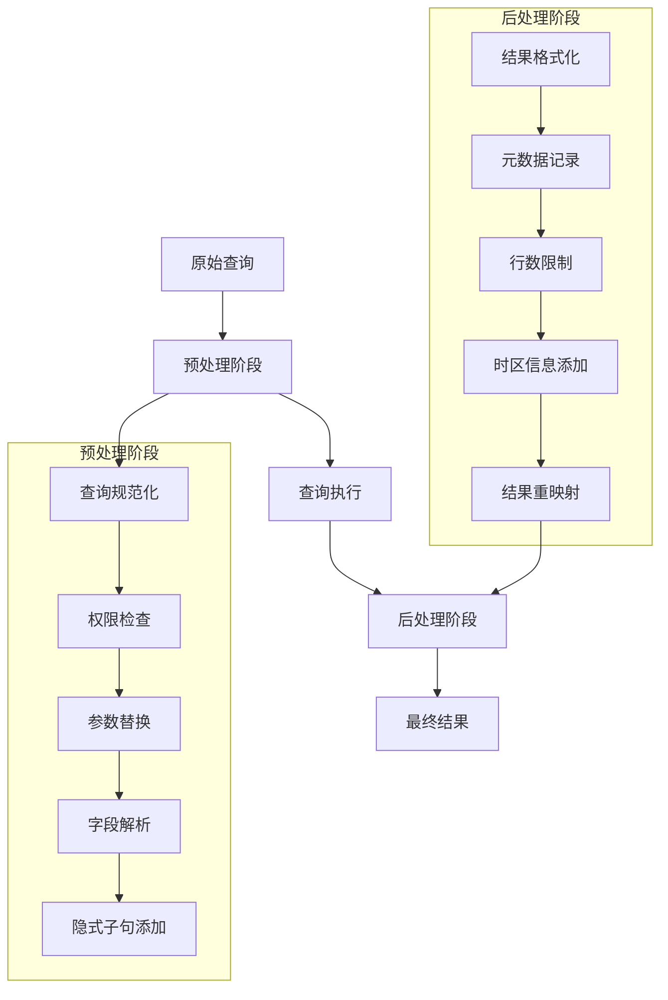
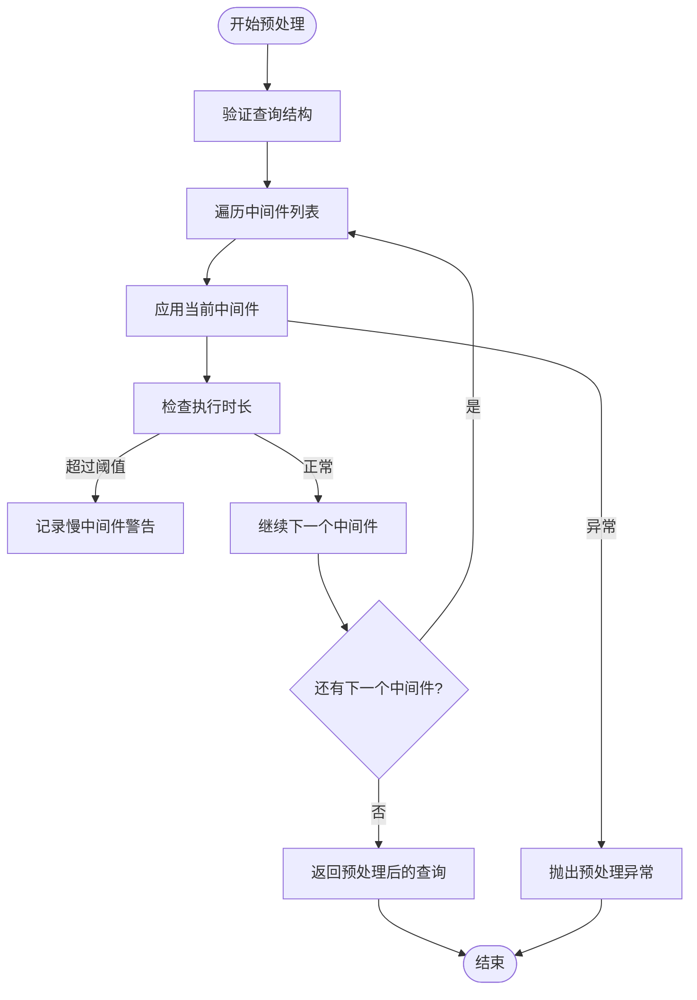
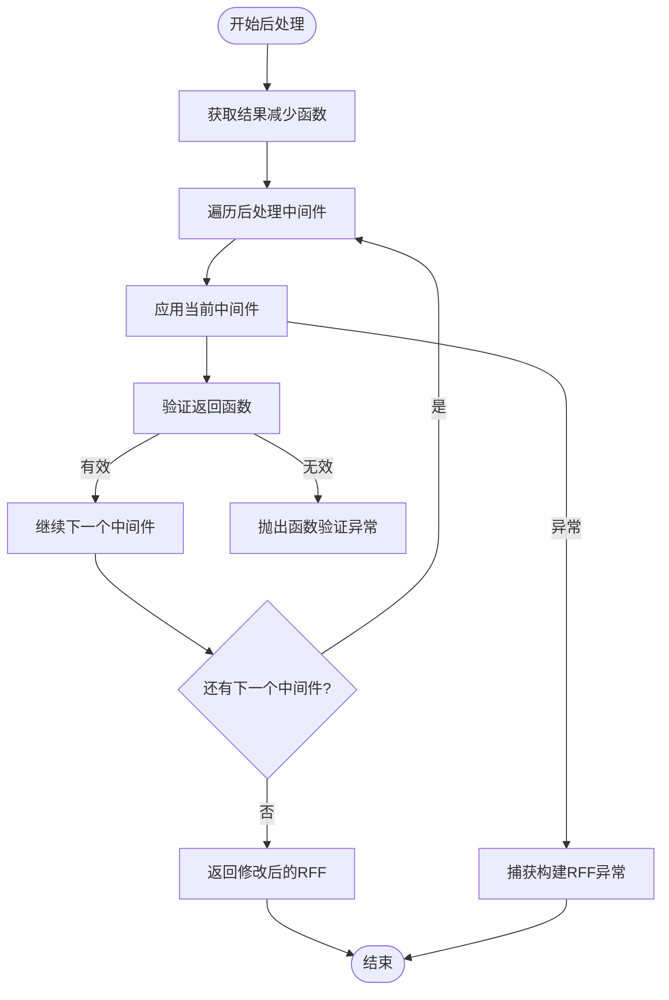
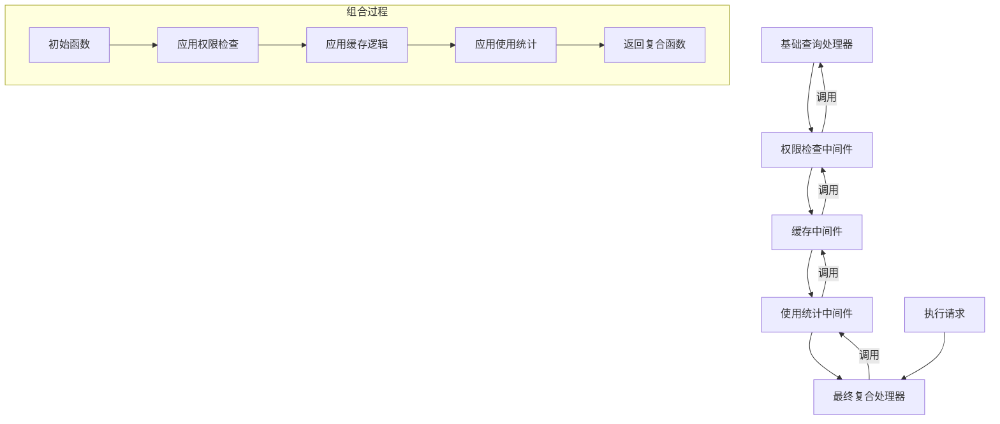
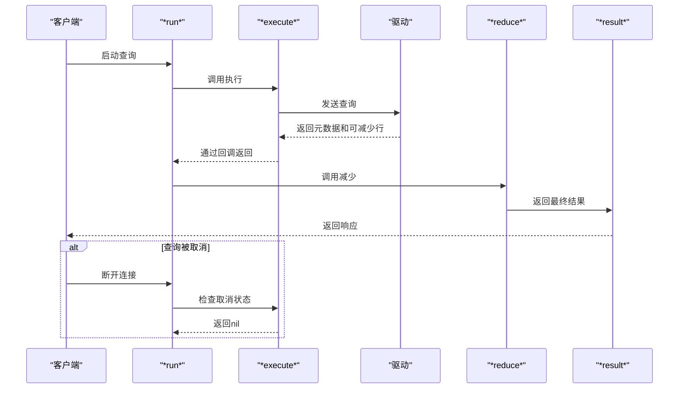
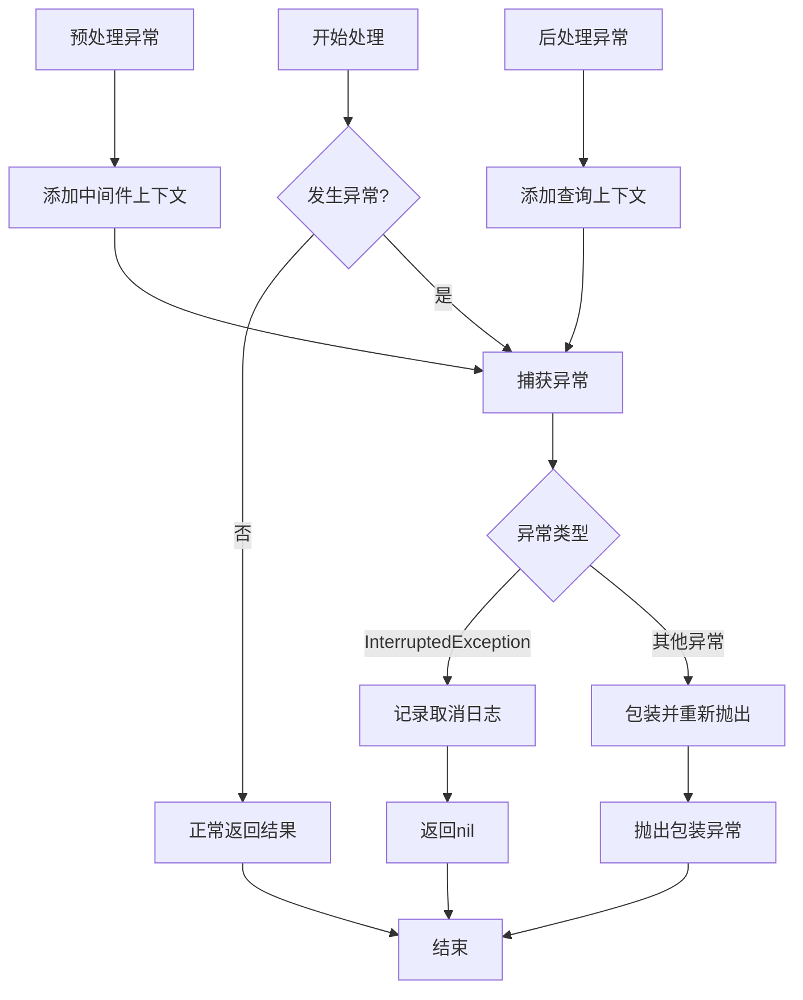
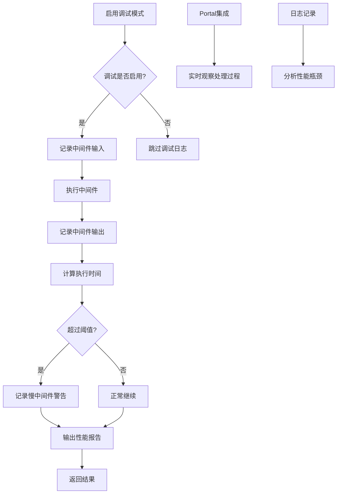

# 查询管道核心机制

<cite>
**本文档引用的文件**  
- [pipeline.clj](file://src/metabase/query_processor/pipeline.clj)
- [preprocess.clj](file://src/metabase/query_processor/preprocess.clj)
- [postprocess.clj](file://src/metabase/query_processor/postprocess.clj)
- [execute.clj](file://src/metabase/query_processor/execute.clj)
- [permissions.clj](file://src/metabase/query_processor/middleware/permissions.clj)
- [parameters.clj](file://src/metabase/query_processor/middleware/parameters.clj)
- [cache.clj](file://src/metabase/query_processor/middleware/cache.clj)
- [debug.clj](file://src/metabase/query_processor/debug.clj)
- [schema.clj](file://src/metabase/query_processor/schema.clj)
</cite>

## 目录
1. [引言](#引言)
2. [查询管道架构概览](#查询管道架构概览)
3. [预处理阶段](#预处理阶段)
4. [后处理阶段](#后处理阶段)
5. [中间件函数式组合机制](#中间件函数式组合机制)
6. [执行管道与上下文传递](#执行管道与上下文传递)
7. [异常传播机制](#异常传播机制)
8. [可插拔设计与依赖管理](#可插拔设计与依赖管理)
9. [性能监控与调试工具](#性能监控与调试工具)
10. [结论](#结论)

## 引言
Metabase查询管道核心机制采用函数式编程范式，通过高阶函数和函数组合模式构建灵活的查询处理链。该机制将查询处理分解为预处理、执行和后处理三个阶段，每个阶段由一系列中间件函数组成，这些函数通过`comp`等组合操作串联起来，形成完整的处理管道。这种设计实现了关注点分离，使得每个中间件只需关注特定功能，同时保持了系统的可扩展性和可维护性。

## 查询管道架构概览

**图示来源**  
- [preprocess.clj](file://src/metabase/query_processor/preprocess.clj#L25-L45)
- [postprocess.clj](file://src/metabase/query_processor/postprocess.clj#L25-L45)

**本节来源**  
- [pipeline.clj](file://src/metabase/query_processor/pipeline.clj#L1-L130)
- [execute.clj](file://src/metabase/query_processor/execute.clj#L1-L100)

## 预处理阶段

查询管道的预处理阶段负责在查询执行前对查询对象进行一系列转换和验证操作。该阶段通过`preprocess`函数实现，采用`transduce`模式对查询应用一系列中间件函数。预处理中间件以查询对象为输入，返回处理后的查询对象，形成`(f query) -> query`的函数签名模式。

预处理阶段的执行顺序从上到下，按照中间件在`middleware`向量中的定义顺序依次执行。每个中间件都有机会修改查询结构，如添加默认时间单位、解析字段引用、展开宏等。系统还包含性能监控机制，当某个中间件执行时间超过阈值（生产环境1000ms，开发环境100ms）时会记录警告日志。

**图示来源**  
- [preprocess.clj](file://src/metabase/query_processor/preprocess.clj#L121-L143)

**本节来源**  
- [preprocess.clj](file://src/metabase/query_processor/preprocess.clj#L1-L160)

## 后处理阶段

后处理阶段发生在查询执行之后，负责对查询结果进行转换和增强。与预处理阶段不同，后处理中间件采用`(f preprocessed-query rff) -> rff`的函数签名模式，其中`rff`是结果减少函数（reducing function factory）。后处理中间件通过修改结果减少函数来影响最终结果的生成过程。

后处理阶段的执行顺序从下到上，与预处理阶段相反。这种逆序执行确保了后处理操作的逻辑一致性，例如结果格式化应该在元数据记录之后进行。后处理管道通过`post-processing-rff`函数实现，使用`reduce`操作将中间件依次应用到结果减少函数上。

**图示来源**  
- [postprocess.clj](file://src/metabase/query_processor/postprocess.clj#L54-L64)

**本节来源**  
- [postprocess.clj](file://src/metabase/query_processor/postprocess.clj#L1-L66)

## 中间件函数式组合机制

查询管道的核心在于中间件的函数式组合机制。系统采用高阶函数模式，将每个中间件设计为接受查询处理器函数并返回新查询处理器函数的包装器。这种设计允许通过`comp`函数将多个中间件组合成一个复合函数，实现功能的灵活组装。

中间件函数遵循`(f qp) -> qp`的模式，其中`qp`是查询处理器函数。当多个中间件需要组合时，系统使用`reduce`操作从右到左依次应用中间件，形成嵌套的函数调用结构。这种组合方式确保了中间件执行顺序的可预测性，最右边的中间件最先执行，最左边的中间件最后执行。

**图示来源**  
- [execute.clj](file://src/metabase/query_processor/execute.clj#L63-L98)

**本节来源**  
- [execute.clj](file://src/metabase/query_processor/execute.clj#L1-L100)
- [permissions.clj](file://src/metabase/query_processor/middleware/permissions.clj#L1-L202)

## 执行管道与上下文传递

查询执行管道通过动态变量和闭包机制实现上下文传递。系统使用`*canceled-chan*`动态变量来传递查询取消状态，允许在查询执行过程中检查是否需要中止操作。这种设计特别适用于HTTP请求场景，当客户端断开连接时可以及时取消长时间运行的查询。

执行管道的核心是`*run*`、`*execute*`和`*reduce*`三个动态函数。`*run*`函数协调整个执行过程，调用`*execute*`函数启动查询执行，并通过回调函数接收结果，然后调用`*reduce*`函数对结果进行减少操作。上下文信息通过闭包和函数参数在各个阶段之间传递，确保了数据的一致性和安全性。

**本节来源**  
- [pipeline.clj](file://src/metabase/query_processor/pipeline.clj#L1-L130)

## 异常传播机制

查询管道具有完善的异常传播机制，确保错误信息能够正确传递并被适当处理。系统采用分层异常处理策略，在每个处理阶段都包含异常捕获和传播逻辑。当预处理或后处理阶段发生异常时，系统会包装原始异常并添加上下文信息，然后重新抛出。

对于执行阶段的异常，系统特别处理`InterruptedException`，将其识别为查询取消操作而非真正的错误。其他异常则直接传播，确保上层调用者能够获得完整的错误信息。结果处理函数`*result*`也包含异常处理逻辑，确保即使在结果处理阶段发生错误也能正确报告。

**本节来源**  
- [pipeline.clj](file://src/metabase/query_processor/pipeline.clj#L1-L130)
- [preprocess.clj](file://src/metabase/query_processor/preprocess.clj#L1-L160)

## 可插拔设计与依赖管理

查询管道采用可插拔架构设计，允许动态添加或移除中间件而无需修改核心逻辑。系统通过向量存储中间件列表，使用`reduce`操作进行组合，这种数据驱动的设计使得中间件的管理更加灵活。每个中间件都是独立的命名空间，遵循统一的接口规范。

依赖管理通过命名空间依赖和动态变量实现。中间件通过`require`声明其依赖，并通过动态变量访问共享状态。系统还支持中间件热重载，当中间件代码发生变化时，会自动重建执行函数，确保新代码立即生效。这种设计既保证了模块间的松耦合，又提供了足够的灵活性来满足不同场景的需求。

**本节来源**  
- [execute.clj](file://src/metabase/query_processor/execute.clj#L1-L100)
- [permissions.clj](file://src/metabase/query_processor/middleware/permissions.clj#L1-L202)
- [parameters.clj](file://src/metabase/query_processor/middleware/parameters.clj#L1-L148)

## 性能监控与调试工具

系统内置了全面的性能监控和调试工具，帮助开发者分析和优化查询处理过程。性能监控主要通过`u/start-timer`和`u/since-ms`工具函数实现，记录每个中间件的执行时间，并在超过阈值时发出警告。这对于识别性能瓶颈和优化查询处理链非常有用。

调试工具通过`debug.clj`模块提供，包含`*debug*`动态变量和`debug>`宏。当启用调试模式时，系统会记录详细的处理日志，包括每个中间件的输入输出差异。开发者可以使用Portal等工具实时观察查询处理过程，这对于问题排查和功能验证非常有帮助。

**图示来源**  
- [preprocess.clj](file://src/metabase/query_processor/preprocess.clj#L121-L143)

**本节来源**  
- [debug.clj](file://src/metabase/query_processor/debug.clj#L1-L23)
- [preprocess.clj](file://src/metabase/query_processor/preprocess.clj#L1-L160)

## 结论
Metabase查询管道核心机制通过函数式编程范式实现了高度模块化和可扩展的查询处理系统。该机制利用高阶函数、函数组合和动态变量等技术，构建了一个灵活、可维护的处理管道。预处理和后处理阶段的分离设计，以及完善的异常处理和性能监控机制，确保了系统的稳定性和可观察性。这种架构不仅满足了当前的功能需求，还为未来的扩展和优化提供了坚实的基础。