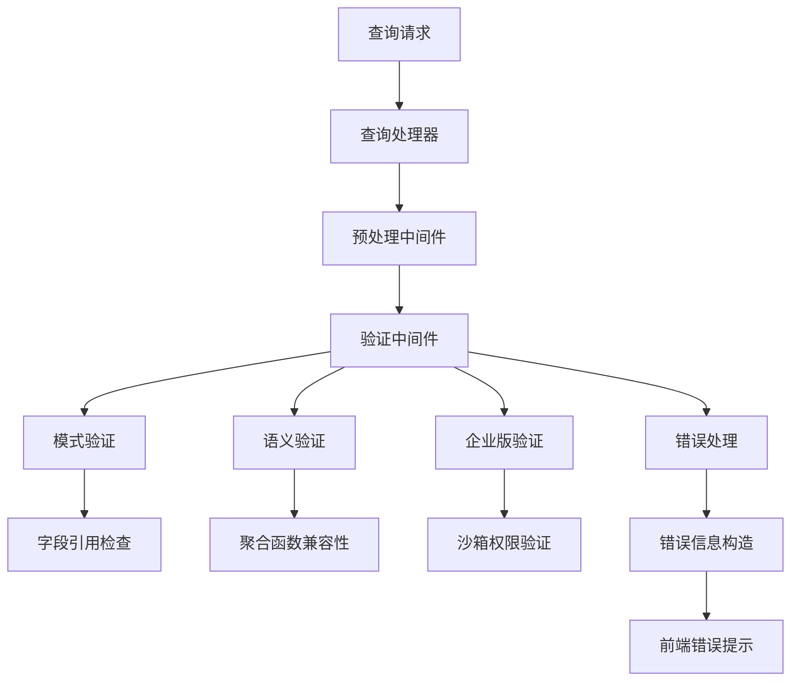
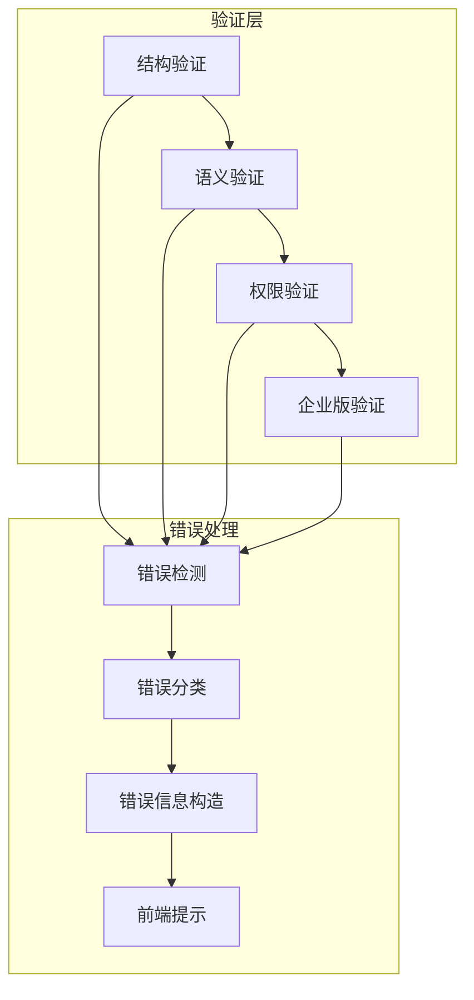
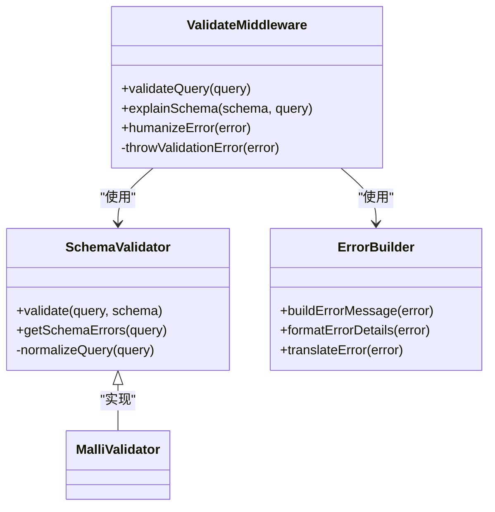
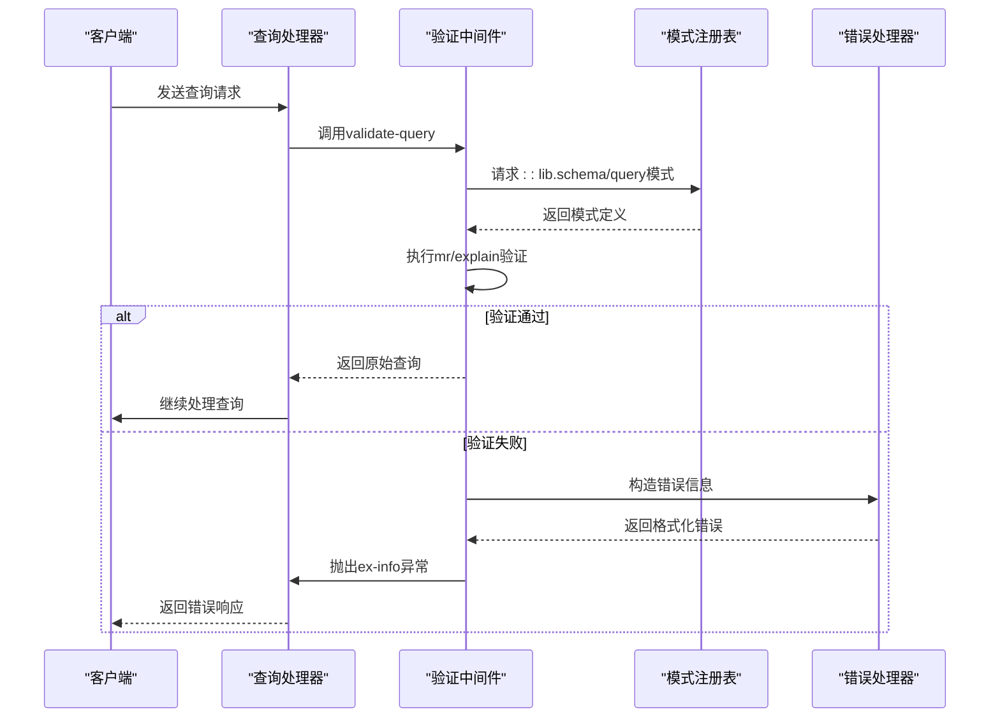
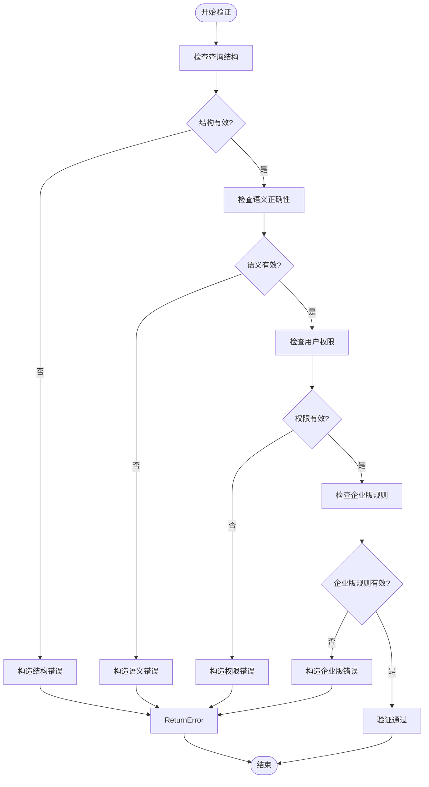
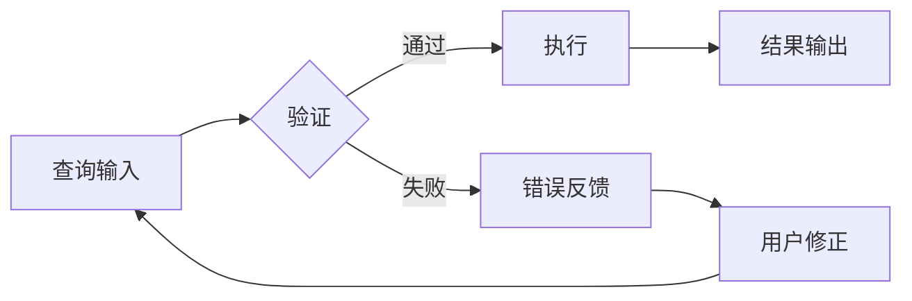
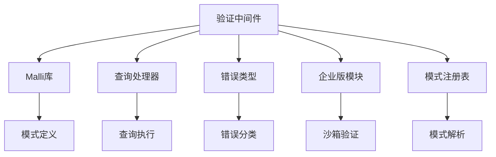

# 查询验证中间件

<cite>
**本文档引用的文件**   
- [validate.clj](file://src/metabase/query_processor/middleware/validate.clj)
- [lib.schema.cljc](file://src/metabase/lib/schema.cljc)
- [query_processor.clj](file://src/metabase/query_processor.clj)
- [preprocess.clj](file://src/metabase/query_processor/preprocess.clj)
- [error_type.clj](file://src/metabase/query_processor/error_type.clj)
- [validate_temporal_bucketing.clj](file://src/metabase/query_processor/middleware/validate_temporal_bucketing.clj)
- [common.cljc](file://src/metabase/lib/schema/common.cljc)
- [aggregation.cljc](file://src/metabase/lib/schema/aggregation.cljc)
- [enterprise.clj](file://src/metabase/query_processor/middleware/enterprise.clj)
</cite>

## 目录
1. [简介](#简介)
2. [项目结构](#项目结构)
3. [核心组件](#核心组件)
4. [架构概述](#架构概述)
5. [详细组件分析](#详细组件分析)
6. [依赖分析](#依赖分析)
7. [性能考虑](#性能考虑)
8. [故障排除指南](#故障排除指南)
9. [结论](#结论)

## 简介
查询验证中间件是Metabase查询处理器中的关键组件，负责在查询执行前对MBQL查询进行结构完整性和语义正确性检查。该中间件确保所有查询在进入执行阶段前符合预定义的模式和业务规则，防止无效或恶意查询对系统造成影响。验证过程包括检查字段引用、聚合函数、过滤条件等元素的有效性，并提供详细的错误信息以帮助用户修正查询。

## 项目结构
Metabase的查询验证功能主要分布在`query_processor`模块中，特别是`middleware`子目录下的验证相关文件。核心验证逻辑位于`validate.clj`文件中，而相关的模式定义则分散在`lib.schema`命名空间下的多个文件中。整个验证系统采用分层设计，从基础数据类型验证到复杂的语义规则检查，形成完整的验证链条。

**图表来源**
- [validate.clj](file://src/metabase/query_processor/middleware/validate.clj#L1-L20)
- [preprocess.clj](file://src/metabase/query_processor/preprocess.clj#L37-L69)

**章节来源**
- [validate.clj](file://src/metabase/query_processor/middleware/validate.clj#L1-L20)
- [preprocess.clj](file://src/metabase/query_processor/preprocess.clj#L1-L150)

## 核心组件
查询验证中间件的核心功能由`validate-query`函数实现，该函数作为查询处理器预处理阶段的一部分，在查询规范化后立即执行。它使用Malli库对查询进行模式验证，检查查询的各个组成部分是否符合定义的模式。验证规则涵盖了从基本字段引用到复杂聚合操作的各个方面，确保查询的每个元素都有效且语义正确。

**章节来源**
- [validate.clj](file://src/metabase/query_processor/middleware/validate.clj#L1-L20)
- [lib.schema.cljc](file://src/metabase/lib/schema.cljc#L1-L50)

## 架构概述
查询验证中间件的架构设计遵循分层验证原则，将验证过程分解为多个独立但相互关联的阶段。第一层是结构验证，确保查询的JSON结构符合MBQL规范；第二层是语义验证，检查字段引用、聚合函数和过滤条件的逻辑正确性；第三层是权限验证，确认用户对查询涉及的资源具有适当的访问权限。这种分层设计使得验证逻辑清晰且易于扩展。

**图表来源**
- [validate.clj](file://src/metabase/query_processor/middleware/validate.clj#L1-L20)
- [error_type.clj](file://src/metabase/query_processor/error_type.clj#L1-L112)

## 详细组件分析

### 验证中间件分析
查询验证中间件的主要职责是在查询执行前进行全面的检查，确保查询的每个部分都有效。它通过调用`mr/explain`函数对查询进行模式验证，如果发现任何不符合模式的元素，则抛出包含详细错误信息的异常。错误信息经过人性化处理，便于用户理解和修正。

#### 对象导向组件：

**图表来源**
- [validate.clj](file://src/metabase/query_processor/middleware/validate.clj#L1-L20)
- [lib.schema.cljc](file://src/metabase/lib/schema.cljc#L1-L50)

#### API/服务组件：

**图表来源**
- [validate.clj](file://src/metabase/query_processor/middleware/validate.clj#L1-L20)
- [error_type.clj](file://src/metabase/query_processor/error_type.clj#L1-L112)

#### 复杂逻辑组件：

**图表来源**
- [validate.clj](file://src/metabase/query_processor/middleware/validate.clj#L1-L20)
- [enterprise.clj](file://src/metabase/query_processor/middleware/enterprise.clj#L1-L52)

**章节来源**
- [validate.clj](file://src/metabase/query_processor/middleware/validate.clj#L1-L20)
- [validate_temporal_bucketing.clj](file://src/metabase/query_processor/middleware/validate_temporal_bucketing.clj#L1-L32)

### 概念概述
查询验证中间件的设计理念是"尽早失败"，即在查询生命周期的最早阶段发现并报告问题。这种设计避免了无效查询占用系统资源，提高了整体系统的稳定性和安全性。验证过程不仅检查语法正确性，还关注语义合理性，例如确保聚合函数与字段类型兼容，过滤条件中的字段确实存在于数据源中。

## 依赖分析
查询验证中间件依赖于多个核心组件和库，形成了复杂的依赖网络。主要依赖包括Malli模式验证库、查询处理器的核心模块、错误类型定义以及企业版功能模块。这些依赖关系确保了验证中间件能够访问必要的模式定义、错误处理机制和扩展功能。

**图表来源**
- [validate.clj](file://src/metabase/query_processor/middleware/validate.clj#L1-L20)
- [lib.schema.cljc](file://src/metabase/lib/schema.cljc#L1-L50)

**章节来源**
- [validate.clj](file://src/metabase/query_processor/middleware/validate.clj#L1-L20)
- [lib.schema.cljc](file://src/metabase/lib/schema.cljc#L1-L50)

## 性能考虑
查询验证中间件的性能影响主要体现在查询处理的延迟上。由于验证过程需要对整个查询结构进行深度检查，对于复杂的查询可能会增加显著的处理时间。然而，这种开销被认为是必要的，因为它避免了无效查询进入执行阶段可能造成的更大资源消耗。系统通过缓存模式定义和优化验证算法来最小化性能影响。

## 故障排除指南
当查询验证失败时，系统会返回详细的错误信息，帮助用户定位和解决问题。常见的验证错误包括无效字段ID、不兼容的聚合操作、缺失的关键子句等。错误信息通常包含具体的错误位置和建议的修正方法。对于企业版用户，还可能遇到与沙箱权限或下载限制相关的特殊错误。

**章节来源**
- [error_type.clj](file://src/metabase/query_processor/error_type.clj#L1-L112)
- [validate.clj](file://src/metabase/query_processor/middleware/validate.clj#L1-L20)

## 结论
查询验证中间件是Metabase查询处理管道中的关键安全屏障，通过全面的结构和语义检查确保所有查询的有效性。其分层架构设计使得验证逻辑清晰且易于扩展，支持从基础验证到企业级高级功能的完整验证链条。尽管验证过程会增加一定的处理开销，但其带来的系统稳定性和安全性提升远超成本。未来的发展方向可能包括更智能的错误建议和更高效的验证算法优化。