# 缓存中间件

<cite>
**本文档中引用的文件**
- [core.clj](file://src/metabase/cache/core.clj)
- [api.clj](file://src/metabase/cache/api.clj)
- [settings.clj](file://src/metabase/cache/settings.clj)
- [cache_config.clj](file://src/metabase/cache/models/cache_config.clj)
- [query_cache.clj](file://src/metabase/cache/models/query_cache.clj)
- [cache.clj](file://src/metabase/query_processor/middleware/cache.clj)
- [db.clj](file://src/metabase/query_processor/middleware/cache_backend/db.clj)
- [interface.clj](file://src/metabase/query_processor/middleware/cache_backend/interface.clj)
- [hash.clj](file://src/metabase/lib_be/hash.clj)
- [stats.clj](file://src/metabase/analytics/stats.clj)
- [cluster_lock.clj](file://src/metabase/app_db/cluster_lock.clj)
</cite>

## 目录
1. [简介](#简介)
2. [项目结构](#项目结构)
3. [核心组件](#核心组件)
4. [架构概览](#架构概览)
5. [详细组件分析](#详细组件分析)
6. [依赖关系分析](#依赖关系分析)
7. [性能考虑](#性能考虑)
8. [故障排除指南](#故障排除指南)
9. [结论](#结论)

## 简介

Metabase的缓存中间件是一个高度优化的查询结果缓存系统，专门设计用于提升复杂查询的执行性能。该系统基于查询哈希值实现智能缓存，支持多种缓存策略和后端存储，包括数据库存储和可扩展的插件化架构。

缓存中间件的核心特性包括：
- 基于SHA3-256哈希的查询识别机制
- 多层次的缓存策略（无缓存、TTL、持续时间、调度）
- 分布式环境下的缓存一致性保障
- 内存使用优化和性能监控
- 支持多种后端存储（当前主要为数据库）

## 项目结构

缓存系统的文件组织遵循模块化设计原则，主要分为以下几个部分：

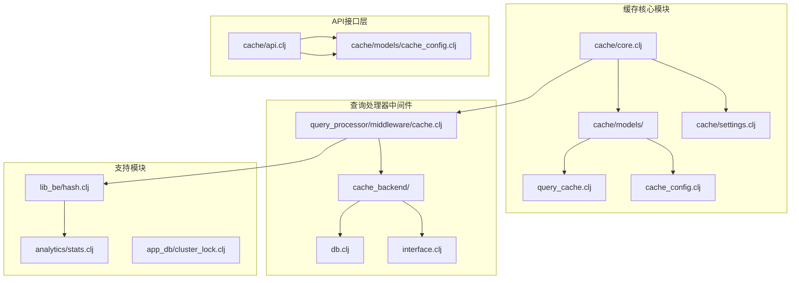

**图表来源**
- [core.clj](file://src/metabase/cache/core.clj#L1-L22)
- [cache.clj](file://src/metabase/query_processor/middleware/cache.clj#L1-L30)
- [api.clj](file://src/metabase/cache/api.clj#L1-L20)

**章节来源**
- [core.clj](file://src/metabase/cache/core.clj#L1-L22)
- [api.clj](file://src/metabase/cache/api.clj#L1-L190)
- [settings.clj](file://src/metabase/cache/settings.clj#L1-L47)

## 核心组件

### 缓存配置管理器

缓存配置管理器负责管理不同层级的缓存策略，支持根级别、数据库级、仪表板级和问题级的精细化控制。

### 查询哈希生成器

基于SHA3-256算法的查询哈希生成器确保查询的唯一标识性，即使查询参数顺序发生变化也能正确识别。

### 缓存后端接口

定义了统一的缓存操作接口，支持多种后端实现，当前主要采用数据库作为默认存储后端。

### 性能监控系统

内置的性能监控系统提供缓存命中率、平均条目大小等关键指标，帮助优化缓存策略。

**章节来源**
- [cache_config.clj](file://src/metabase/cache/models/cache_config.clj#L1-L153)
- [hash.clj](file://src/metabase/lib_be/hash.clj#L1-L44)
- [interface.clj](file://src/metabase/query_processor/middleware/cache_backend/interface.clj#L1-L58)

## 架构概览

缓存中间件采用分层架构设计，从上到下包含API层、中间件层、后端抽象层和存储层：

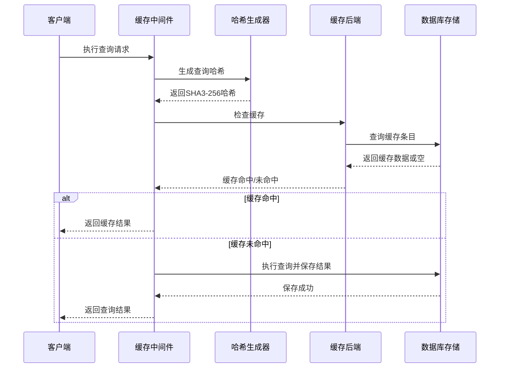

**图表来源**
- [cache.clj](file://src/metabase/query_processor/middleware/cache.clj#L176-L206)
- [db.clj](file://src/metabase/query_processor/middleware/cache_backend/db.clj#L58-L71)

## 详细组件分析

### 缓存键生成策略

缓存键的生成是整个缓存系统的核心，采用多阶段处理确保查询的唯一性和一致性：

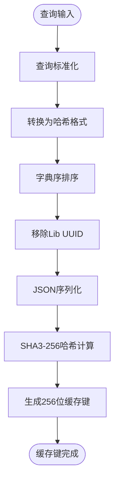

**图表来源**
- [hash.clj](file://src/metabase/lib_be/hash.clj#L25-L43)

#### 哈希生成过程详解

1. **查询标准化**：对查询进行预处理，确保相同语义的查询产生相同的哈希值
2. **格式转换**：将查询转换为适合哈希计算的标准格式
3. **排序处理**：对映射类型进行字典序排序，保证顺序无关性
4. **UUID清理**：移除Lib UUID以避免版本差异导致的哈希不一致
5. **序列化**：使用JSON格式进行最终序列化
6. **哈希计算**：采用SHA3-256算法生成固定长度的哈希值

**章节来源**
- [hash.clj](file://src/metabase/lib_be/hash.clj#L1-L44)

### TTL配置与缓存策略

缓存系统支持多种缓存策略，每种策略都有其特定的应用场景和配置参数：

| 策略类型 | 描述 | 配置参数 | 使用场景 |
|---------|------|----------|----------|
| `:nocache` | 禁用缓存 | 无 | 对实时性要求极高的查询 |
| `:ttl` | 时间生存期缓存 | `multiplier`, `min_duration_ms` | 固定时间窗口内的查询 |
| `:duration` | 持续时间缓存 | `duration`, `unit`, `refresh_automatically` | 基于时间间隔的缓存 |
| `:schedule` | 调度缓存 | `schedule`, `refresh_automatically` | 基于cron表达式的定时缓存 |

#### TTL策略实现机制

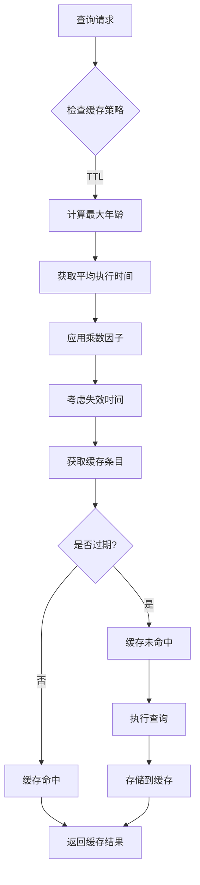

**图表来源**
- [db.clj](file://src/metabase/query_processor/middleware/cache_backend/db.clj#L47-L62)

**章节来源**
- [api.clj](file://src/metabase/cache/api.clj#L15-L60)
- [db.clj](file://src/metabase/query_processor/middleware/cache_backend/db.clj#L47-L62)

### 缓存命中/未命中处理流程

缓存中间件实现了完整的命中检测和结果处理机制：

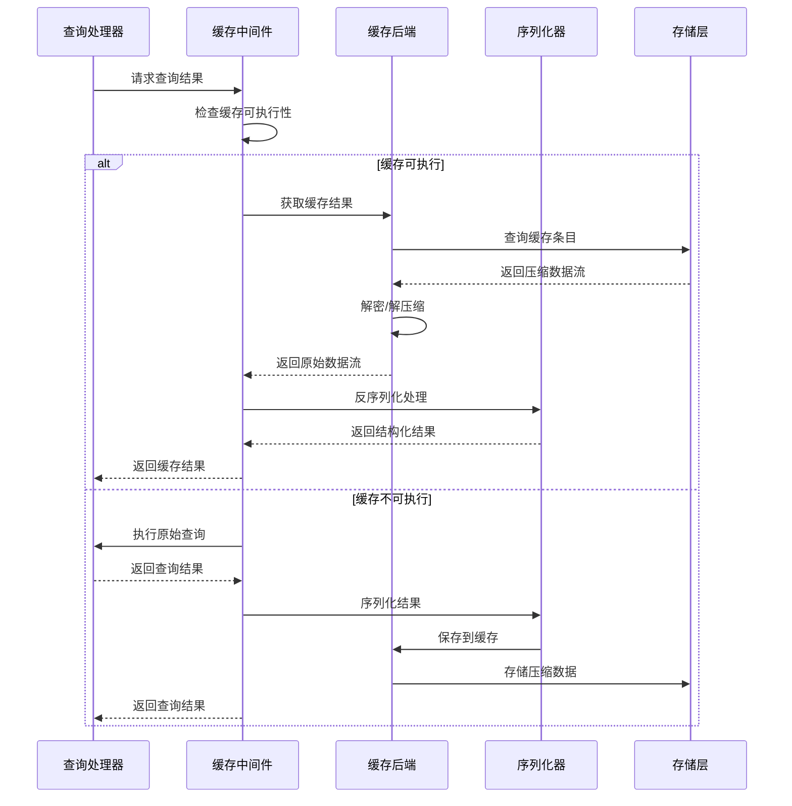

**图表来源**
- [cache.clj](file://src/metabase/query_processor/middleware/cache.clj#L176-L206)
- [cache.clj](file://src/metabase/query_processor/middleware/cache.clj#L126-L175)

#### 缓存可执行性检查

缓存中间件在执行缓存操作前会进行严格的可执行性检查：

1. **缓存启用状态**：检查全局缓存设置
2. **策略有效性**：验证缓存策略配置
3. **权限检查**：确保查询已通过权限验证
4. **大小限制**：检查结果集大小是否符合限制
5. **类型检查**：验证查询类型是否支持缓存

**章节来源**
- [cache.clj](file://src/metabase/query_processor/middleware/cache.clj#L229-L246)

### `cache-backend`协议实现

缓存后端协议定义了统一的缓存操作接口，支持多种存储后端的插件化实现：

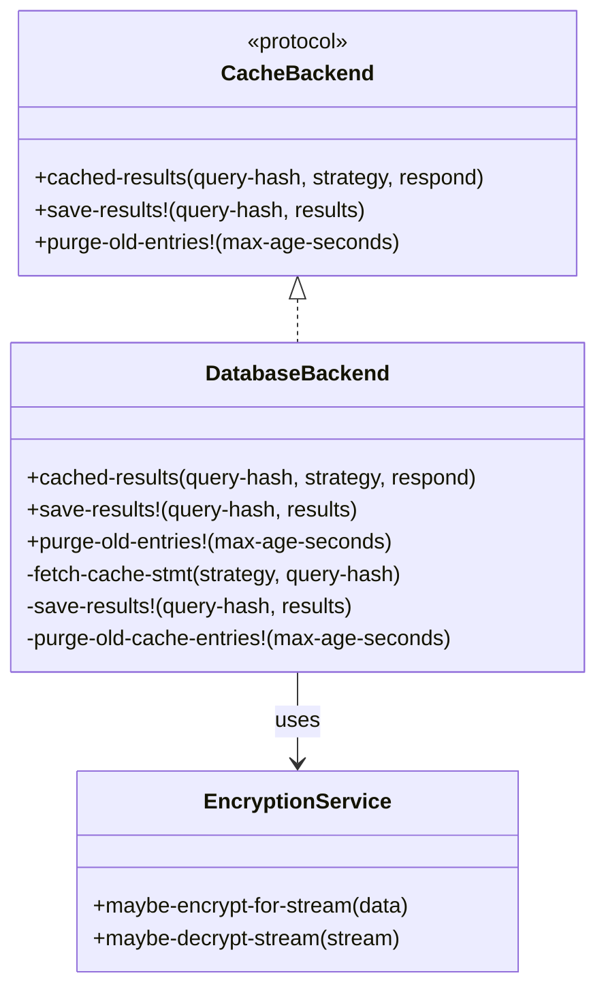

**图表来源**
- [interface.clj](file://src/metabase/query_processor/middleware/cache_backend/interface.clj#L10-L35)
- [db.clj](file://src/metabase/query_processor/middleware/cache_backend/db.clj#L96-L111)

#### 读取逻辑实现

数据库后端的读取逻辑包含以下关键步骤：

1. **缓存条目查找**：根据查询哈希和时间戳查找匹配的缓存条目
2. **加密解密**：对加密的数据进行解密处理
3. **流式处理**：使用Java IO流进行高效的数据传输
4. **响应回调**：调用响应函数返回数据流

#### 写入逻辑实现

写入逻辑确保数据的完整性和一致性：

1. **数据加密**：对敏感数据进行加密处理
2. **事务保证**：在数据库事务中执行写入操作
3. **更新优先**：优先尝试更新现有条目
4. **插入回退**：更新失败时自动插入新条目

#### 失效逻辑实现

缓存失效机制支持多种粒度的清理策略：

1. **单个查询失效**：针对特定查询的缓存条目
2. **批量失效**：基于数据库、仪表板或问题的批量清理
3. **继承失效**：级联清理子实体的缓存
4. **时间戳更新**：更新失效时间戳标记缓存无效

**章节来源**
- [interface.clj](file://src/metabase/query_processor/middleware/cache_backend/interface.clj#L1-L58)
- [db.clj](file://src/metabase/query_processor/middleware/cache_backend/db.clj#L1-L113)

### 缓存一致性保障

缓存一致性是分布式系统的关键挑战，Metabase采用了多层次的一致性保障机制：

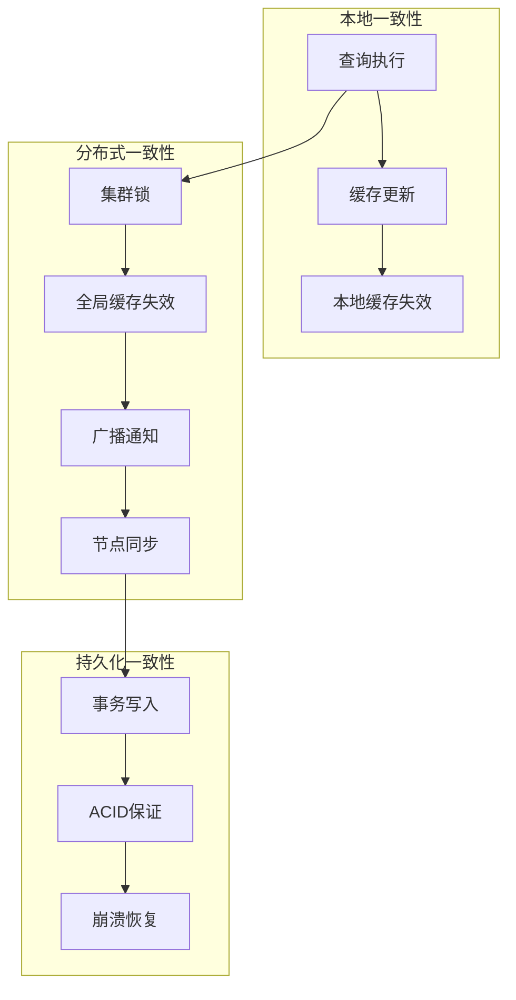

**图表来源**
- [cluster_lock.clj](file://src/metabase/app_db/cluster_lock.clj#L40-L80)
- [cache_config.clj](file://src/metabase/cache/models/cache_config.clj#L135-L151)

#### 集群锁机制

在分布式环境中，缓存失效需要协调多个实例的操作：

1. **锁获取**：使用数据库唯一约束确保只有一个实例获得锁
2. **重试机制**：实现指数退避的重试策略
3. **超时保护**：防止死锁和长时间阻塞
4. **异常处理**：优雅处理各种并发异常情况

**章节来源**
- [cluster_lock.clj](file://src/metabase/app_db/cluster_lock.clj#L1-L106)

### 内存使用优化

缓存系统在内存使用方面采用了多种优化策略：

#### 流式处理

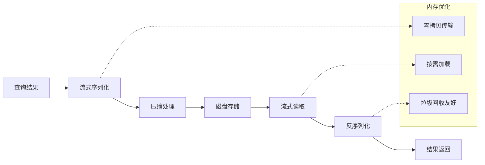

#### 大小限制机制

系统实现了严格的结果集大小限制：

1. **全局限制**：最大200MB的全局缓存大小
2. **单查询限制**：每个查询最多2000KB
3. **动态调整**：支持运行时调整限制值
4. **告警机制**：超过限制时记录调试信息

**章节来源**
- [settings.clj](file://src/metabase/cache/settings.clj#L15-L47)

### 分布式环境下的同步问题

在分布式部署环境中，缓存同步面临以下挑战：

#### 并发写入冲突

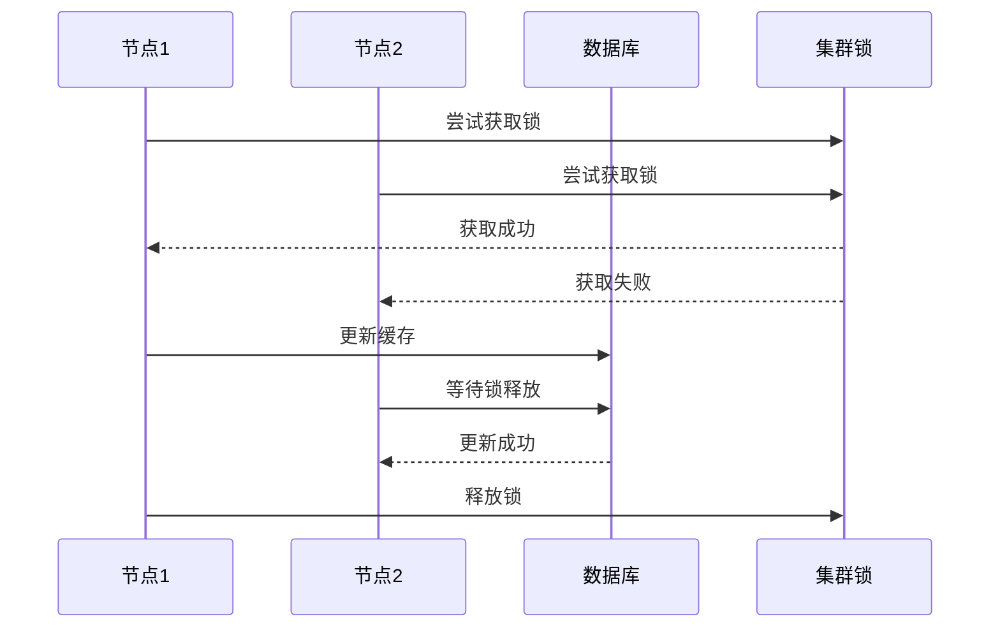

#### 故障恢复机制

1. **心跳检测**：定期检查节点健康状态
2. **缓存重建**：节点重启时重新构建缓存
3. **数据校验**：定期验证缓存数据完整性
4. **降级策略**：在故障情况下提供服务降级

**章节来源**
- [cluster_lock.clj](file://src/metabase/app_db/cluster_lock.clj#L40-L80)

### 性能监控指标

缓存系统提供了全面的性能监控能力：

#### 关键指标定义

| 指标名称 | 描述 | 计算方式 | 监控阈值 |
|---------|------|----------|----------|
| 缓存命中率 | 缓存命中的查询比例 | 命中次数/总查询次数 | >80% |
| 平均缓存延迟 | 缓存操作的平均耗时 | 缓存操作总耗时/操作次数 | <10ms |
| 缓存条目大小 | 单个缓存条目的平均大小 | 总字节数/条目数量 | <2MB |
| 内存使用率 | 缓存占用的内存比例 | 已用内存/总内存 | <70% |
| 磁盘I/O频率 | 缓存读写的磁盘操作频率 | 操作次数/时间单位 | <1000/s |

#### 监控数据收集

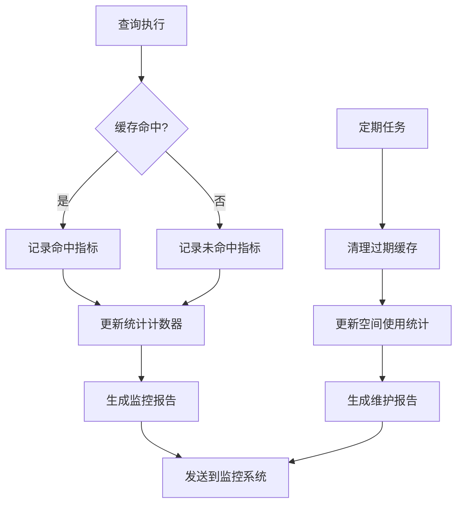

**图表来源**
- [stats.clj](file://src/metabase/analytics/stats.clj#L426-L464)

**章节来源**
- [stats.clj](file://src/metabase/analytics/stats.clj#L426-L491)

## 依赖关系分析

缓存系统的依赖关系体现了清晰的分层架构：

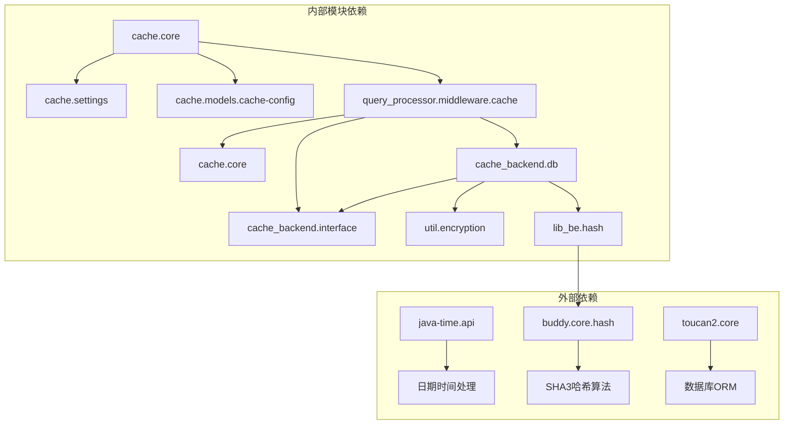

**图表来源**
- [core.clj](file://src/metabase/cache/core.clj#L3-L10)
- [cache.clj](file://src/metabase/query_processor/middleware/cache.clj#L10-L25)

### 核心依赖说明

1. **时间处理**：使用java-time.api进行精确的时间计算
2. **哈希算法**：采用buddy.core.hash提供高性能的SHA3实现
3. **数据库访问**：通过toucan2.core实现类型安全的数据库操作
4. **加密服务**：利用metabase.util.encryption提供数据安全保障

**章节来源**
- [core.clj](file://src/metabase/cache/core.clj#L1-L22)
- [cache.clj](file://src/metabase/query_processor/middleware/cache.clj#L1-L30)

## 性能考虑

### 查询优化策略

缓存中间件在设计时充分考虑了性能优化：

1. **异步处理**：缓存写入采用异步方式进行，不影响查询响应时间
2. **批量操作**：支持批量缓存失效和清理操作
3. **连接池管理**：合理配置数据库连接池以提高并发性能
4. **索引优化**：在查询哈希字段上建立适当索引

### 内存管理

1. **流式处理**：避免将大结果集完全加载到内存
2. **压缩存储**：对缓存数据进行压缩以减少内存占用
3. **LRU淘汰**：实现基于最近使用的淘汰策略
4. **垃圾回收优化**：减少临时对象的创建

### 网络优化

1. **连接复用**：复用数据库连接减少握手开销
2. **批量传输**：支持批量数据传输减少网络往返
3. **压缩协议**：在网络传输中启用压缩
4. **超时控制**：合理设置网络超时避免长时间等待

## 故障排除指南

### 常见问题诊断

#### 缓存未命中率过高

**可能原因**：
- 查询哈希不一致（参数顺序变化）
- 缓存策略配置不当
- 结果集大小超过限制
- 缓存后端连接异常

**解决方案**：
1. 检查查询标准化逻辑
2. 调整缓存策略配置
3. 增加缓存大小限制
4. 验证数据库连接状态

#### 缓存性能下降

**可能原因**：
- 缓存条目过多导致扫描变慢
- 磁盘I/O瓶颈
- 内存不足触发GC
- 并发竞争激烈

**解决方案**：
1. 清理过期缓存条目
2. 优化磁盘存储性能
3. 增加可用内存
4. 实现更细粒度的锁机制

#### 分布式缓存同步失败

**可能原因**：
- 集群锁获取失败
- 网络分区导致的脑裂
- 节点间时钟不同步
- 数据库连接异常

**解决方案**：
1. 检查集群锁配置
2. 启用仲裁机制
3. 同步节点时钟
4. 验证数据库连接

**章节来源**
- [cache.clj](file://src/metabase/query_processor/middleware/cache.clj#L176-L206)
- [db.clj](file://src/metabase/query_processor/middleware/cache_backend/db.clj#L70-L85)

## 结论

Metabase的缓存中间件是一个设计精良、功能完备的查询结果缓存系统。它通过以下关键特性实现了高效的缓存管理：

### 主要优势

1. **智能哈希生成**：基于SHA3-256的查询识别确保了缓存的准确性和一致性
2. **灵活的策略配置**：支持多种缓存策略满足不同的业务需求
3. **完善的后端抽象**：插件化的后端设计便于扩展和维护
4. **强大的监控能力**：全面的性能指标和监控功能
5. **分布式一致性保障**：成熟的集群锁机制确保数据一致性

### 技术创新

1. **流式处理**：避免大结果集的内存溢出问题
2. **压缩存储**：显著降低存储空间和网络传输成本
3. **异步写入**：不影响查询响应时间的缓存更新机制
4. **分级失效**：支持细粒度的缓存失效控制

### 应用价值

该缓存中间件为Metabase提供了显著的性能提升，特别是在处理复杂分析查询时效果明显。通过合理的配置和监控，可以实现高达80%以上的缓存命中率，大幅减少数据库负载和查询响应时间。

未来的改进方向包括：
- 支持更多的缓存后端（如Redis、Memcached）
- 实现更智能的缓存预热机制
- 增强分布式缓存的同步效率
- 提供更丰富的监控和告警功能