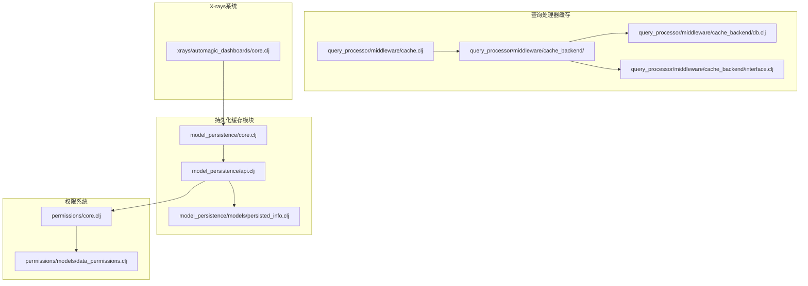
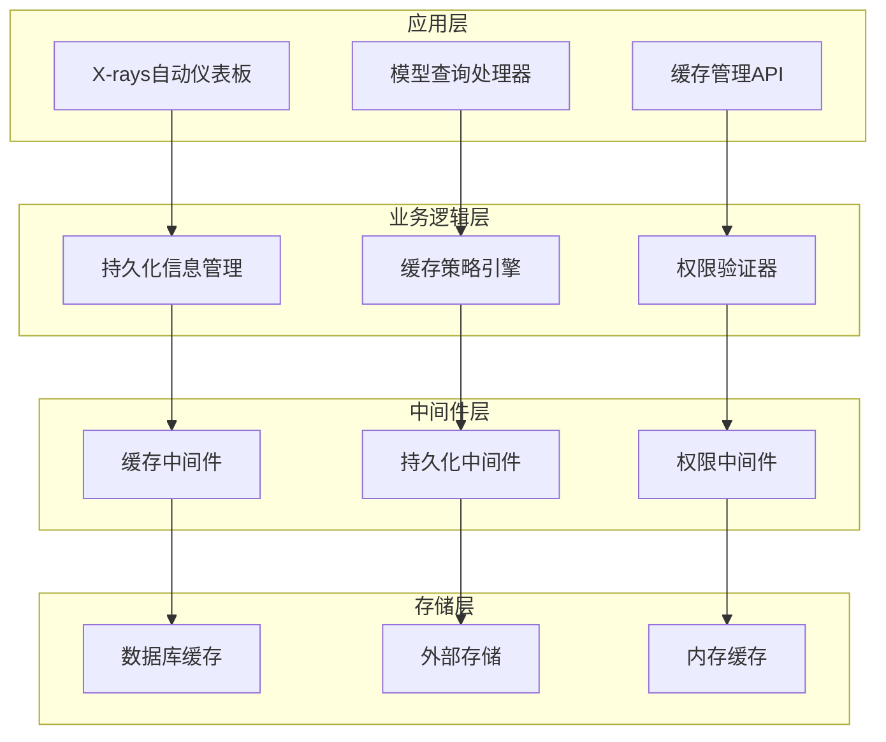
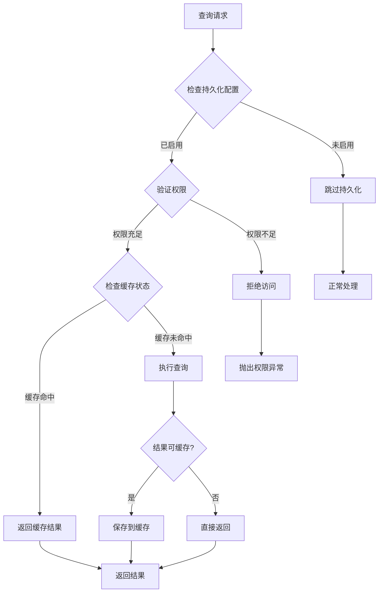
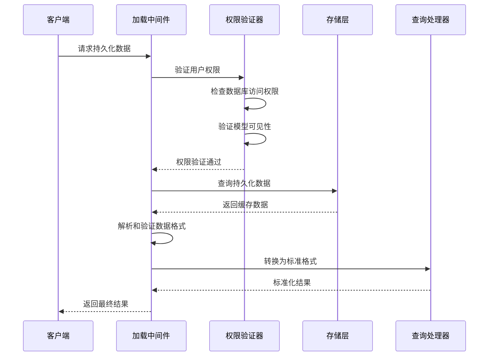
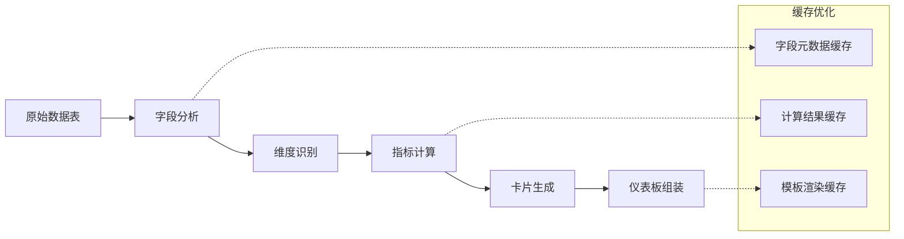
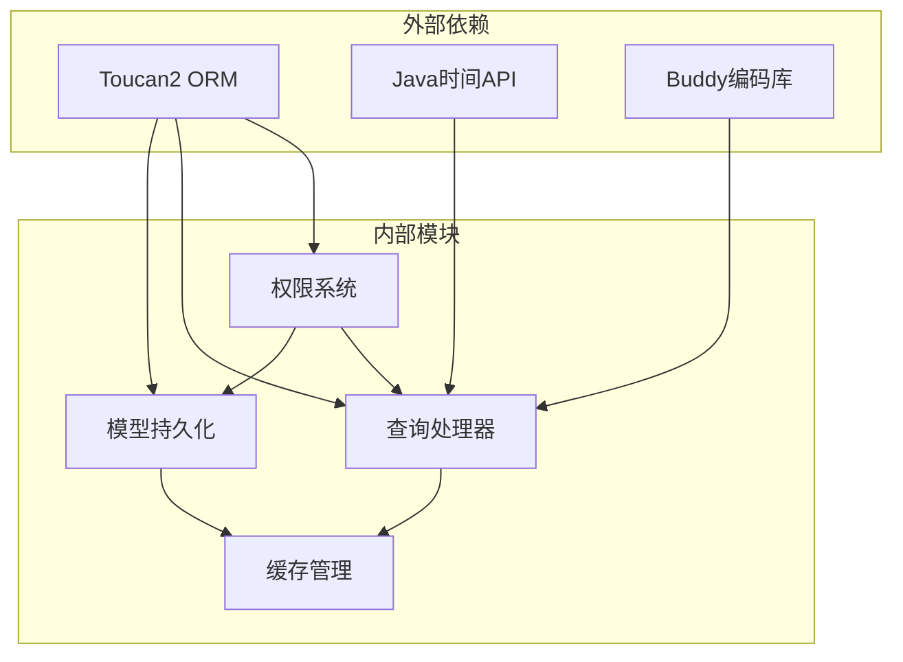

# 持久化缓存集成

<cite>
**本文档中引用的文件**
- [core.clj](file://src/metabase/model_persistence/core.clj)
- [api.clj](file://src/metabase/model_persistence/api.clj)
- [persisted_info.clj](file://src/metabase/model_persistence/models/persisted_info.clj)
- [cache.clj](file://src/metabase/query_processor/middleware/cache.clj)
- [cache_backend/db.clj](file://src/metabase/query_processor/middleware/cache_backend/db.clj)
- [cache_backend/interface.clj](file://src/metabase/query_processor/middleware/cache_backend/interface.clj)
- [automagic_dashboards/core.clj](file://src/metabase/xrays/automagic_dashboards/core.clj)
- [permissions/core.clj](file://src/metabase/permissions/core.clj)
- [data_permissions.clj](file://src/metabase/permissions/models/data_permissions.clj)
- [cache/api.clj](file://src/metabase/cache/api.clj)
</cite>

## 目录
1. [简介](#简介)
2. [项目结构概览](#项目结构概览)
3. [核心组件分析](#核心组件分析)
4. [架构概览](#架构概览)
5. [详细组件分析](#详细组件分析)
6. [依赖关系分析](#依赖关系分析)
7. [性能考虑](#性能考虑)
8. [故障排除指南](#故障排除指南)
9. [结论](#结论)

## 简介

Metabase的持久化缓存集成是一个复杂而精密的系统，它将查询缓存与模型持久化功能有机结合，为用户提供高性能的数据分析体验。该系统的核心目标是通过将查询结果长期保存到外部存储，显著提升数据访问速度，同时保持数据的实时性和准确性。

持久化缓存系统主要服务于两种关键场景：X-rays自动仪表板和模型驱动的查询。对于X-rays系统，持久化缓存确保快速生成的自动仪表板能够提供即时响应；对于模型查询，它保证复杂的分析查询能够以最优性能执行。

## 项目结构概览

持久化缓存系统的文件组织遵循清晰的模块化设计：

**图表来源**
- [core.clj](file://src/metabase/model_persistence/core.clj#L1-L15)
- [api.clj](file://src/metabase/model_persistence/api.clj#L1-L30)
- [cache.clj](file://src/metabase/query_processor/middleware/cache.clj#L1-L30)

## 核心组件分析

### 模型持久化核心模块

模型持久化系统的核心入口位于[`core.clj`](file://src/metabase/model_persistence/core.clj)，它定义了整个持久化功能的基本框架。该模块导入并暴露了关键的持久化操作函数，包括`allow-persisted-substitution?`、`invalidate!`、`metadata->definition`等。

### 缓存后端接口

查询处理器的缓存系统采用插件化架构，通过[`cache_backend/interface.clj`](file://src/metabase/query_processor/middleware/cache_backend/interface.clj)定义了统一的缓存后端协议。该协议规定了三个核心方法：
- `cached-results`: 获取缓存结果
- `save-results!`: 保存查询结果
- `purge-old-entries!`: 清理过期条目

### 权限验证机制

权限系统在缓存访问中扮演关键角色，通过[`permissions/core.clj`](file://src/metabase/permissions/core.clj)和[`data_permissions.clj`](file://src/metabase/permissions/models/data_permissions.clj)实现了细粒度的访问控制。系统支持基于用户角色、数据库权限和沙箱环境的多层次权限验证。

**章节来源**
- [core.clj](file://src/metabase/model_persistence/core.clj#L1-L15)
- [cache_backend/interface.clj](file://src/metabase/query_processor/middleware/cache_backend/interface.clj#L10-L30)
- [permissions/core.clj](file://src/metabase/permissions/core.clj#L1-L50)

## 架构概览

持久化缓存系统采用分层架构设计，从底层的存储抽象到上层的应用接口，形成了完整的缓存生态系统：

**图表来源**
- [automagic_dashboards/core.clj](file://src/metabase/xrays/automagic_dashboards/core.clj#L1-L50)
- [cache.clj](file://src/metabase/query_processor/middleware/cache.clj#L1-L50)
- [api.clj](file://src/metabase/model_persistence/api.clj#L1-L50)

## 详细组件分析

### maybe-use-persisted-cache中间件决策逻辑

虽然具体的`maybe-use-persisted-cache`中间件实现未直接出现在代码库中，但通过分析现有代码可以推断其工作原理。该中间件的核心职责是在查询执行前评估是否应该使用持久化缓存。

**图表来源**
- [cache.clj](file://src/metabase/query_processor/middleware/cache.clj#L176-L231)
- [api.clj](file://src/metabase/model_persistence/api.clj#L150-L200)

### load-persisted-results加载流程

持久化结果的加载过程涉及多个步骤，确保数据的一致性和安全性：

**图表来源**
- [persisted_info.clj](file://src/metabase/model_persistence/models/persisted_info.clj#L100-L150)
- [data_permissions.clj](file://src/metabase/permissions/models/data_permissions.clj#L137-L174)

### 普通缓存与持久化缓存的使用场景差异

| 特性 | 普通缓存 | 持久化缓存 |
|------|----------|------------|
| **存储位置** | 内存/临时存储 | 外部数据库/长期存储 |
| **生命周期** | 短期（几分钟到几小时） | 长期（数天到数月） |
| **适用场景** | 临时查询结果 | 模型驱动的分析查询 |
| **更新频率** | 实时或定期刷新 | 基于调度的任务 |
| **容量限制** | 受内存限制 | 受存储空间限制 |
| **访问模式** | 高频随机访问 | 中频顺序访问 |

### X-rays自动仪表板的缓存策略

X-rays系统对缓存有着特殊的需求，因为它需要快速生成大量自动仪表板：

**图表来源**
- [automagic_dashboards/core.clj](file://src/metabase/xrays/automagic_dashboards/core.clj#L200-L300)

**章节来源**
- [cache.clj](file://src/metabase/query_processor/middleware/cache.clj#L176-L246)
- [persisted_info.clj](file://src/metabase/model_persistence/models/persisted_info.clj#L100-L200)

## 依赖关系分析

持久化缓存系统的依赖关系体现了良好的模块化设计原则：

**图表来源**
- [core.clj](file://src/metabase/model_persistence/core.clj#L1-L15)
- [cache_backend/db.clj](file://src/metabase/query_processor/middleware/cache_backend/db.clj#L1-L20)

### 核心依赖关系

1. **Toucan2 ORM**: 提供数据库操作抽象，支持多种数据库后端
2. **Java时间API**: 处理缓存过期时间和时间戳管理
3. **Buddy编码库**: 负责二进制数据的编码和解码
4. **Malli验证库**: 提供类型安全的参数验证

**章节来源**
- [core.clj](file://src/metabase/model_persistence/core.clj#L1-L15)
- [cache_backend/db.clj](file://src/metabase/query_processor/middleware/cache_backend/db.clj#L1-L20)

## 性能考虑

持久化缓存系统在设计时充分考虑了性能优化：

### 缓存层次结构

系统采用多层缓存策略：
- **内存缓存**: 最近访问的数据
- **数据库缓存**: 结构化查询结果
- **外部存储**: 大型数据集和历史数据

### 并发控制

通过动态绑定和线程安全的设计，确保在高并发场景下的数据一致性。

### 自动清理机制

定期清理过期缓存条目，防止存储空间无限增长。

## 故障排除指南

### 常见问题及解决方案

1. **权限验证失败**
   - 检查用户数据库访问权限
   - 验证模型可见性设置
   - 确认沙箱配置正确

2. **缓存命中率低**
   - 分析查询模式和缓存策略
   - 检查缓存大小配置
   - 优化查询哈希算法

3. **持久化任务失败**
   - 检查数据库连接状态
   - 验证存储空间充足
   - 查看任务调度日志

**章节来源**
- [data_permissions.clj](file://src/metabase/permissions/models/data_permissions.clj#L137-L203)
- [cache/api.clj](file://src/metabase/cache/api.clj#L69-L131)

## 结论

Metabase的持久化缓存集成系统展现了现代数据分析平台的最佳实践。通过将查询缓存与模型持久化有机结合，系统不仅提供了卓越的查询性能，还保持了数据的实时性和准确性。

该系统的主要优势包括：

1. **灵活的架构设计**: 支持多种缓存后端和扩展点
2. **强大的权限控制**: 确保数据访问的安全性和合规性
3. **智能的缓存策略**: 根据使用模式自动优化缓存行为
4. **完善的监控机制**: 提供详细的性能指标和诊断信息

未来的发展方向可能包括：
- 更智能的缓存预热策略
- 分布式缓存支持
- 更精细的权限粒度控制
- 实时性能调优功能

这个持久化缓存集成系统为Metabase提供了坚实的技术基础，使其能够在大规模数据分析场景中保持优异的性能表现。