# 查询缓存机制

<cite>
**本文档中引用的文件**
- [src/metabase/cache/core.clj](file://src/metabase/cache/core.clj)
- [src/metabase/cache/settings.clj](file://src/metabase/cache/settings.clj)
- [src/metabase/cache/models/cache_config.clj](file://src/metabase/cache/models/cache_config.clj)
- [src/metabase/cache/api.clj](file://src/metabase/cache/api.clj)
- [src/metabase/cache/init.clj](file://src/metabase/cache/init.clj)
- [src/metabase/query_processor/middleware/cache.clj](file://src/metabase/query_processor/middleware/cache.clj)
- [src/metabase/query_processor/middleware/cache_backend/interface.clj](file://src/metabase/query_processor/middleware/cache_backend/interface.clj)
- [src/metabase/query_processor/middleware/cache_backend/db.clj](file://src/metabase/query_processor/middleware/cache_backend/db.clj)
- [src/metabase/query_processor/middleware/cache_impl.clj](file://src/metabase/query_processor/middleware/cache_impl.clj)
- [src/metabase/query_processor/util.clj](file://src/metabase/query_processor/util.clj)
- [src/metabase/lib_be/hash.clj](file://src/metabase/lib_be/hash.clj)
- [src/metabase/cache/models/query_cache.clj](file://src/metabase/cache/models/query_cache.clj)
</cite>

## 目录
1. [简介](#简介)
2. [系统架构概览](#系统架构概览)
3. [核心组件分析](#核心组件分析)
4. [缓存键生成策略](#缓存键生成策略)
5. [缓存策略类型](#缓存策略类型)
6. [后端存储实现](#后端存储实现)
7. [缓存生命周期管理](#缓存生命周期管理)
8. [配置选项详解](#配置选项详解)
9. [手动清除机制](#手动清除机制)
10. [性能优化与监控](#性能优化与监控)
11. [与persisted_cache集成](#与persisted_cache集成)
12. [故障排除指南](#故障排除指南)
13. [总结](#总结)

## 简介

Metabase的查询缓存机制是一个基于中间件的高性能缓存系统，旨在显著提升复杂查询的执行效率。该系统通过智能的缓存键生成、多种缓存策略和灵活的后端存储，为用户提供了强大的查询加速能力。

核心特性包括：
- 基于SHA3-256算法的查询哈希生成
- 多种缓存策略（TTL、Duration、Schedule、Nocache）
- 可插拔的后端存储架构
- 智能的缓存失效和清理机制
- 支持企业级的细粒度缓存控制

## 系统架构概览

查询缓存系统采用分层架构设计，主要包含以下层次：

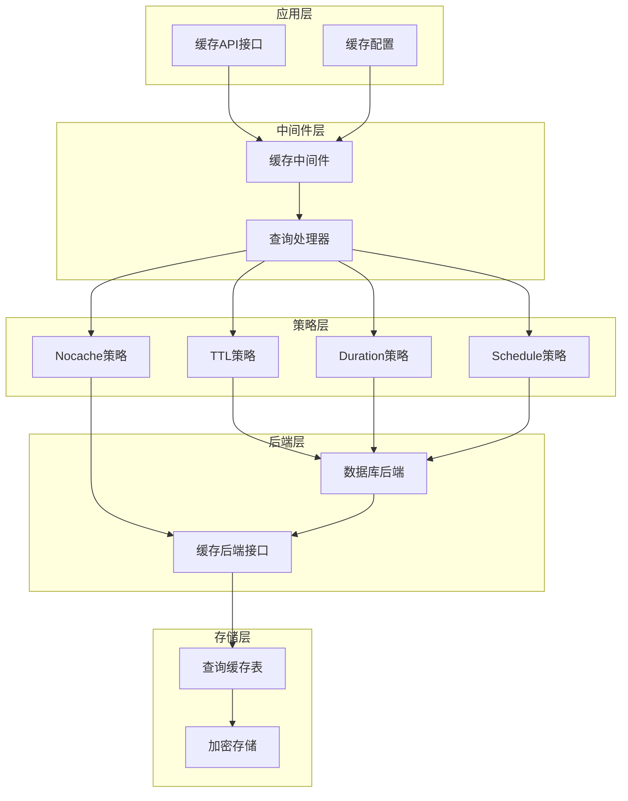

**图表来源**
- [src/metabase/cache/core.clj](file://src/metabase/cache/core.clj#L1-L22)
- [src/metabase/query_processor/middleware/cache.clj](file://src/metabase/query_processor/middleware/cache.clj#L1-L30)

## 核心组件分析

### 缓存中间件

缓存中间件是整个系统的核心入口点，负责拦截查询请求并决定是否从缓存中返回结果。

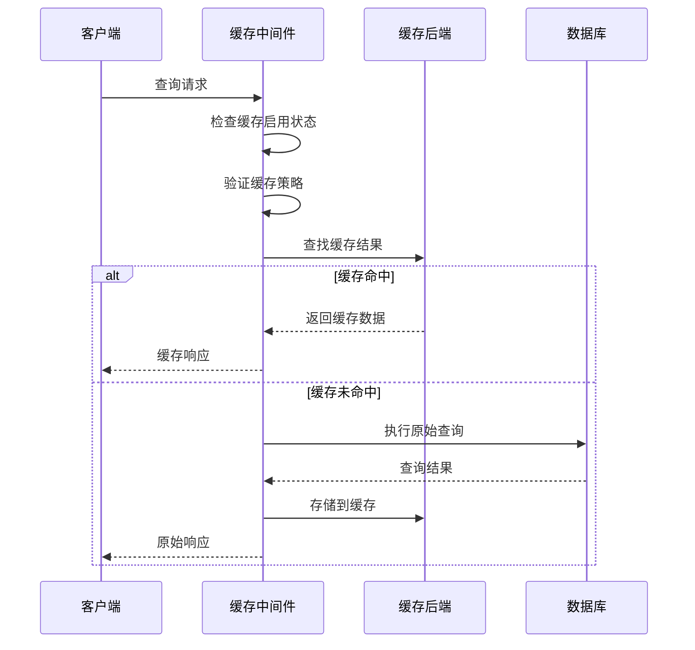

**图表来源**
- [src/metabase/query_processor/middleware/cache.clj](file://src/metabase/query_processor/middleware/cache.clj#L199-L231)

### 缓存后端接口

缓存后端采用协议模式设计，支持多种存储后端的插拔式架构。

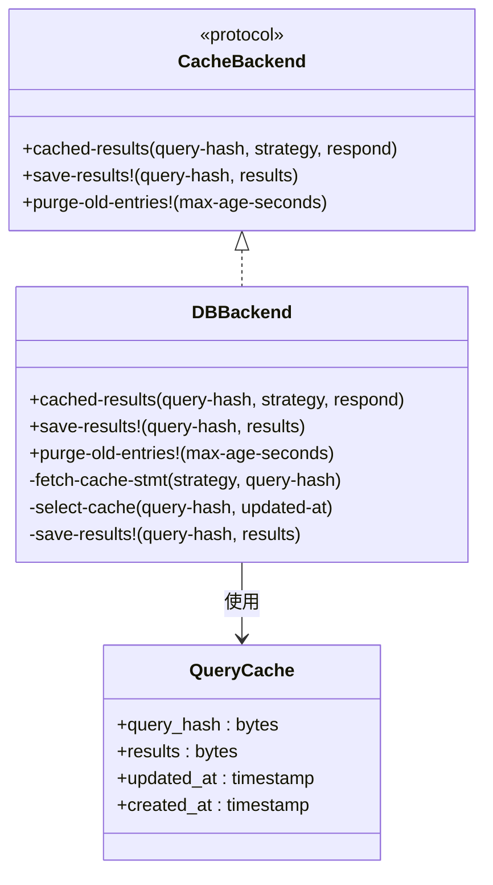

**图表来源**
- [src/metabase/query_processor/middleware/cache_backend/interface.clj](file://src/metabase/query_processor/middleware/cache_backend/interface.clj#L10-L26)
- [src/metabase/query_processor/middleware/cache_backend/db.clj](file://src/metabase/query_processor/middleware/cache_backend/db.clj#L96-L111)

**章节来源**
- [src/metabase/query_processor/middleware/cache.clj](file://src/metabase/query_processor/middleware/cache.clj#L1-L246)
- [src/metabase/query_processor/middleware/cache_backend/interface.clj](file://src/metabase/query_processor/middleware/cache_backend/interface.clj#L1-L26)

## 缓存键生成策略

### 查询哈希计算

缓存键的生成是确保缓存准确性的关键环节。系统采用多阶段的哈希生成策略：

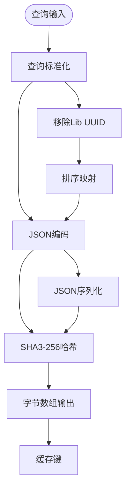

**图表来源**
- [src/metabase/lib_be/hash.clj](file://src/metabase/lib_be/hash.clj#L25-L42)
- [src/metabase/query_processor/util.clj](file://src/metabase/query_processor/util.clj#L15-L25)

### 哈希生成流程

1. **查询标准化**：将查询转换为规范化的形式
2. **字段过滤**：移除不影响查询语义的字段
3. **排序处理**：对映射结构进行排序以确保一致性
4. **JSON编码**：序列化为标准JSON格式
5. **哈希计算**：使用SHA3-256算法生成256位哈希值

**章节来源**
- [src/metabase/lib_be/hash.clj](file://src/metabase/lib_be/hash.clj#L1-L42)
- [src/metabase/query_processor/util.clj](file://src/metabase/query_processor/util.clj#L15-L30)

## 缓存策略类型

### TTL（Time To Live）策略

TTL策略是最常用的缓存策略，基于查询执行时间动态计算缓存有效期。

| 参数 | 类型 | 描述 | 默认值 |
|------|------|------|--------|
| multiplier | PositiveInt | 执行时间倍数因子 | 可配置 |
| min_duration_ms | IntGreaterThanOrEqualToZero | 最小缓存持续时间 | 0 |
| avg_execution_ms | PositiveInt | 平均执行时间（毫秒） | 动态计算 |

### Duration策略

Duration策略允许用户指定固定的缓存时长。

| 参数 | 类型 | 描述 | 示例 |
|------|------|------|------|
| duration | PositiveInt | 缓存持续时间 | 24 |
| unit | enum | 时间单位 | hours, minutes, seconds, days |
| refresh_automatically | boolean | 是否自动刷新 | true/false |

### Schedule策略

Schedule策略基于Cron表达式定义复杂的缓存刷新计划。

| 参数 | 类型 | 描述 | 示例 |
|------|------|------|------|
| schedule | CronScheduleString | Cron表达式 | "0 0 * * * ? *" |
| refresh_automatically | boolean | 是否自动刷新 | true/false |

### Nocache策略

Nocache策略明确禁用特定查询的缓存功能。

**章节来源**
- [src/metabase/cache/api.clj](file://src/metabase/cache/api.clj#L25-L75)

## 后端存储实现

### 数据库后端架构

数据库后端是默认的缓存存储解决方案，使用专门的查询缓存表进行数据持久化。

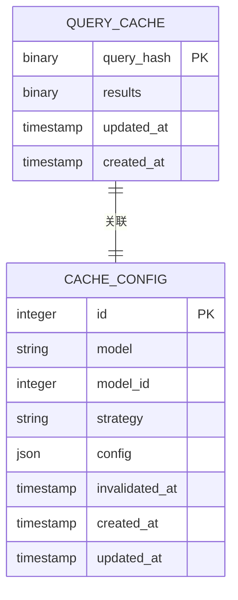

**图表来源**
- [src/metabase/cache/models/query_cache.clj](file://src/metabase/cache/models/query_cache.clj#L1-L11)

### 存储优化特性

1. **压缩存储**：查询结果经过GZIP压缩后再存储
2. **加密保护**：敏感数据采用透明加密
3. **批量操作**：支持批量插入和更新操作
4. **索引优化**：基于查询哈希的快速查找

### 清理机制

系统实现了智能的缓存清理机制：

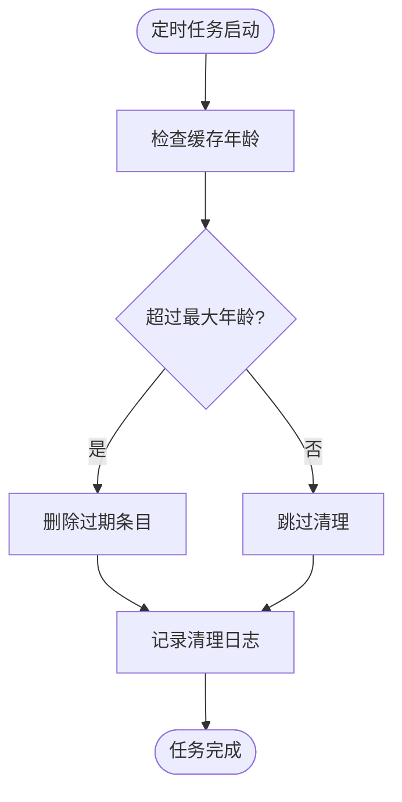

**图表来源**
- [src/metabase/query_processor/middleware/cache_backend/db.clj](file://src/metabase/query_processor/middleware/cache_backend/db.clj#L70-L85)

**章节来源**
- [src/metabase/query_processor/middleware/cache_backend/db.clj](file://src/metabase/query_processor/middleware/cache_backend/db.clj#L1-L112)

## 缓存生命周期管理

### 缓存命中流程

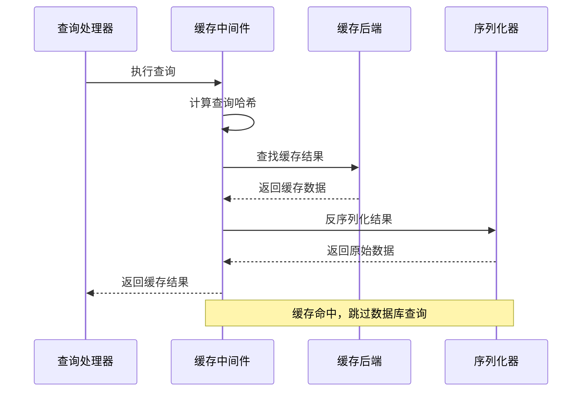

**图表来源**
- [src/metabase/query_processor/middleware/cache.clj](file://src/metabase/query_processor/middleware/cache.clj#L176-L206)

### 缓存存储流程

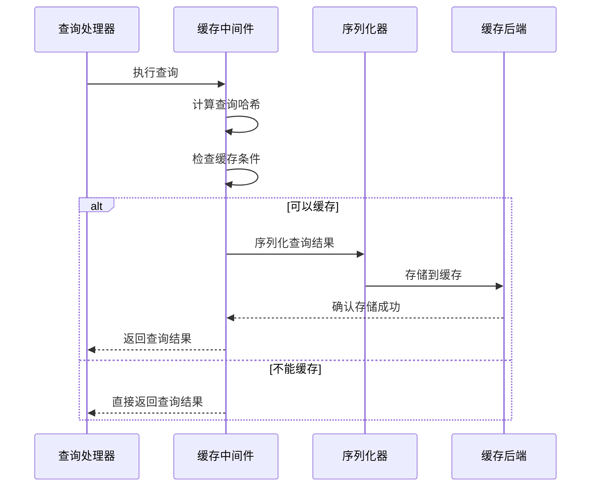

**图表来源**
- [src/metabase/query_processor/middleware/cache.clj](file://src/metabase/query_processor/middleware/cache.clj#L199-L231)

### 缓存有效性验证

系统在返回缓存结果前会进行多层验证：

1. **版本检查**：验证缓存数据的序列化版本兼容性
2. **时间窗口**：检查缓存是否仍在有效期内
3. **完整性验证**：确保缓存数据的完整性

**章节来源**
- [src/metabase/query_processor/middleware/cache.clj](file://src/metabase/query_processor/middleware/cache.clj#L150-L246)

## 配置选项详解

### 全局配置参数

| 配置项 | 类型 | 默认值 | 描述 |
|--------|------|--------|------|
| enable-query-caching | boolean | true | 启用查询缓存功能 |
| query-caching-max-kb | integer | 2000 | 单个查询的最大缓存大小（KB） |
| query-caching-max-ttl | double | 35天 | 缓存的最大生存时间（秒） |

### 配置验证规则

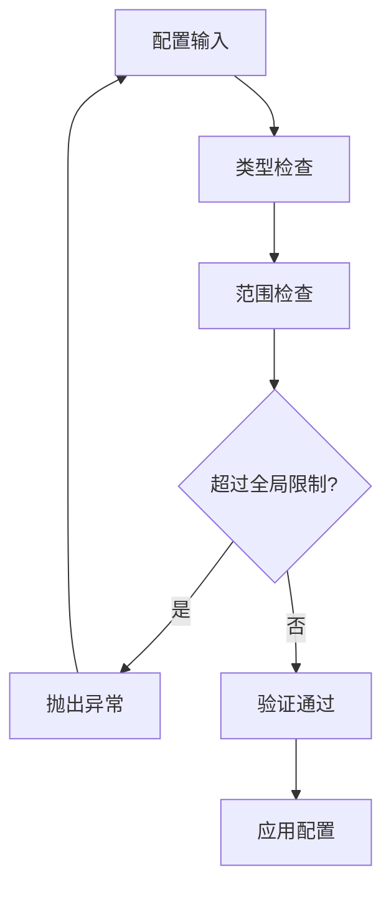

**图表来源**
- [src/metabase/cache/settings.clj](file://src/metabase/cache/settings.clj#L20-L40)

### 动态配置更新

系统支持运行时动态更新缓存配置，无需重启服务：

1. **配置变更检测**：监听配置文件变化
2. **原子性更新**：确保配置更新的原子性
3. **向后兼容**：保持旧版本配置的兼容性

**章节来源**
- [src/metabase/cache/settings.clj](file://src/metabase/cache/settings.clj#L1-L46)

## 手动清除机制

### 缓存失效API

系统提供了丰富的API接口用于手动管理缓存：

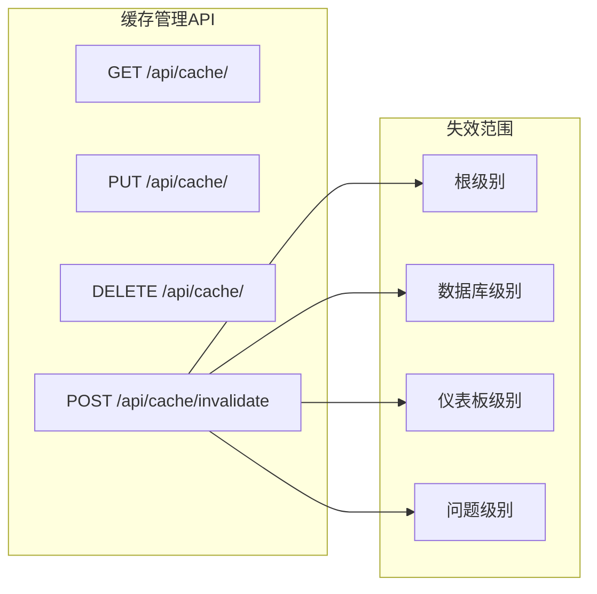

**图表来源**
- [src/metabase/cache/api.clj](file://src/metabase/cache/api.clj#L127-L189)

### 批量失效策略

系统支持基于模型级别的批量缓存失效：

| 模型类型 | 失效范围 | 触发条件 |
|----------|----------|----------|
| root | 全局缓存 | 系统配置变更 |
| database | 特定数据库 | 数据源结构变更 |
| dashboard | 特定仪表板 | 仪表板内容更新 |
| question | 特定问题 | 查询逻辑变更 |

### 失效传播机制

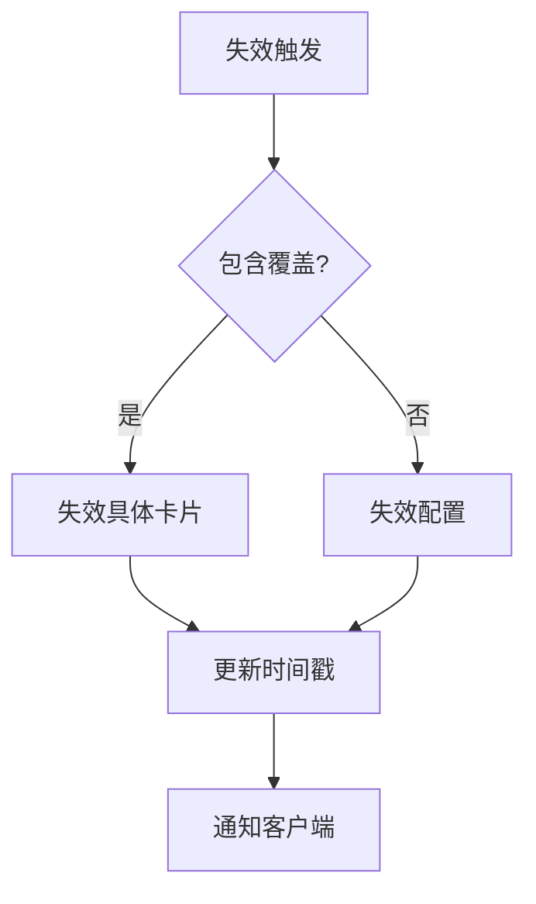

**图表来源**
- [src/metabase/cache/models/cache_config.clj](file://src/metabase/cache/models/cache_config.clj#L126-L151)

**章节来源**
- [src/metabase/cache/api.clj](file://src/metabase/cache/api.clj#L127-L189)
- [src/metabase/cache/models/cache_config.clj](file://src/metabase/cache/models/cache_config.clj#L126-L151)

## 性能优化与监控

### 缓存效率指标

系统内置了多种性能监控指标：

| 指标名称 | 描述 | 计算方式 |
|----------|------|----------|
| 缓存命中率 | 缓存命中的查询比例 | 命中次数 / 总查询次数 |
| 平均缓存延迟 | 缓存查找的平均时间 | 缓存查找总时间 / 查找次数 |
| 缓存利用率 | 缓存空间的实际使用率 | 已用缓存大小 / 总缓存大小 |

### 内存优化策略

1. **流式处理**：大结果集采用流式处理避免内存溢出
2. **压缩存储**：查询结果压缩存储减少内存占用
3. **懒加载**：按需加载缓存数据避免不必要的内存分配

### 监控告警机制

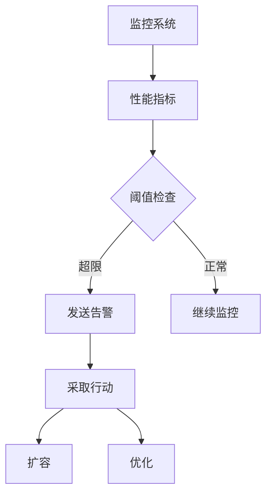

## 与persisted_cache集成

### 集成架构

persisted_cache是Metabase的企业级持久化缓存功能，与查询缓存机制紧密集成：

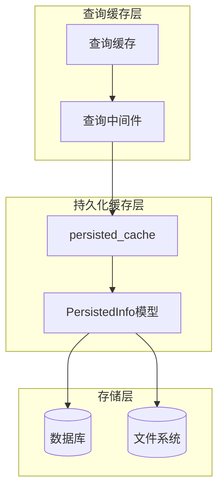

**图表来源**
- [src/metabase/model_persistence/models/persisted_info.clj](file://src/metabase/model_persistence/models/persisted_info.clj#L91-L151)

### 使用场景对比

| 功能特性 | 查询缓存 | persisted_cache |
|----------|----------|-----------------|
| 存储位置 | 内存/数据库 | 数据库/文件系统 |
| 生命周期 | 动态管理 | 长期持久化 |
| 更新频率 | 实时更新 | 定期刷新 |
| 适用场景 | 热点查询加速 | 大数据分析 |

### 配置协调

两个缓存系统的配置相互协调，避免冲突：

1. **优先级控制**：查询缓存优先于持久化缓存
2. **资源隔离**：分别管理内存和磁盘资源
3. **状态同步**：保持缓存状态的一致性

**章节来源**
- [src/metabase/model_persistence/models/persisted_info.clj](file://src/metabase/model_persistence/models/persisted_info.clj#L91-L151)

## 故障排除指南

### 常见问题诊断

#### 缓存不生效

**症状**：查询结果没有被缓存或无法从缓存中读取

**排查步骤**：
1. 检查`enable-query-caching`配置是否启用
2. 验证查询是否满足缓存条件
3. 确认缓存策略配置正确
4. 检查缓存后端连接状态

#### 缓存命中率低

**症状**：缓存命中率低于预期

**优化建议**：
1. 调整缓存策略的TTL值
2. 优化查询标准化过程
3. 增加缓存预热机制
4. 分析查询热点分布

#### 内存使用过高

**症状**：系统内存使用率持续上升

**解决方案**：
1. 减少`query-caching-max-kb`配置
2. 缩短缓存的最大生存时间
3. 增加缓存清理频率
4. 监控大查询的缓存行为

### 日志分析

系统提供了详细的日志记录用于问题诊断：

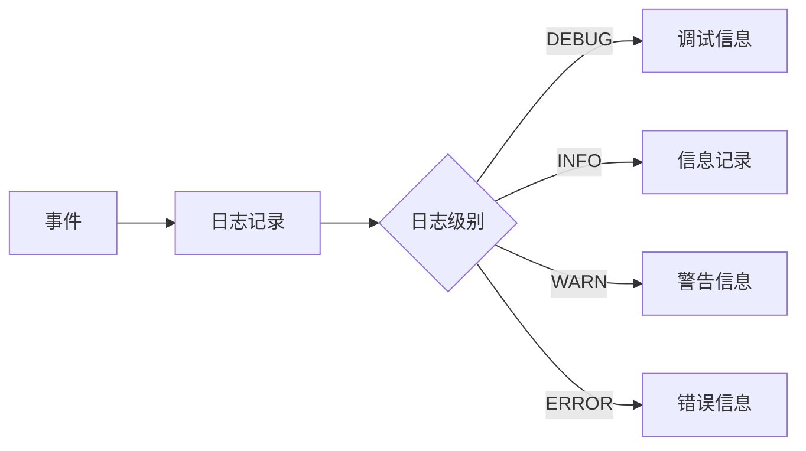

### 性能调优建议

1. **合理设置缓存大小**：根据系统内存容量调整最大缓存大小
2. **优化查询结构**：避免频繁变化的查询参与缓存
3. **定期清理**：建立定期的缓存清理维护机制
4. **监控关键指标**：持续监控缓存命中率和性能指标

## 总结

Metabase的查询缓存机制是一个设计精良、功能完备的高性能缓存系统。它通过以下核心特性实现了卓越的查询性能：

### 主要优势

1. **智能缓存策略**：支持多种缓存策略适应不同业务场景
2. **可扩展架构**：模块化设计支持多种后端存储
3. **企业级功能**：提供细粒度的缓存控制和管理
4. **性能优化**：内置多种性能优化机制

### 技术亮点

- 基于SHA3-256的安全哈希算法
- 流式序列化和压缩技术
- 智能的缓存失效和清理机制
- 完善的监控和诊断工具

### 应用价值

该缓存系统显著提升了Metabase的查询性能，特别是在处理复杂分析查询和大数据量场景下表现突出。通过合理的配置和使用，可以实现查询响应时间的大幅降低和系统资源的有效利用。

对于开发者而言，理解这套缓存机制的工作原理有助于更好地优化查询性能，对于管理员而言，则能够更有效地管理和维护系统的缓存性能。