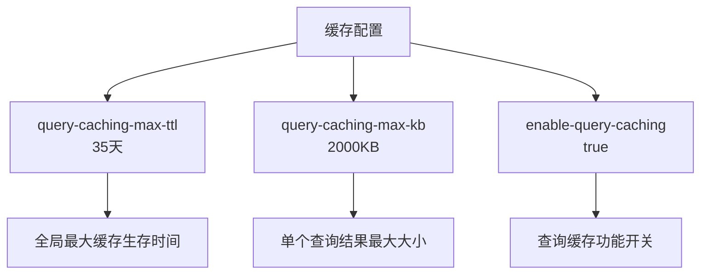
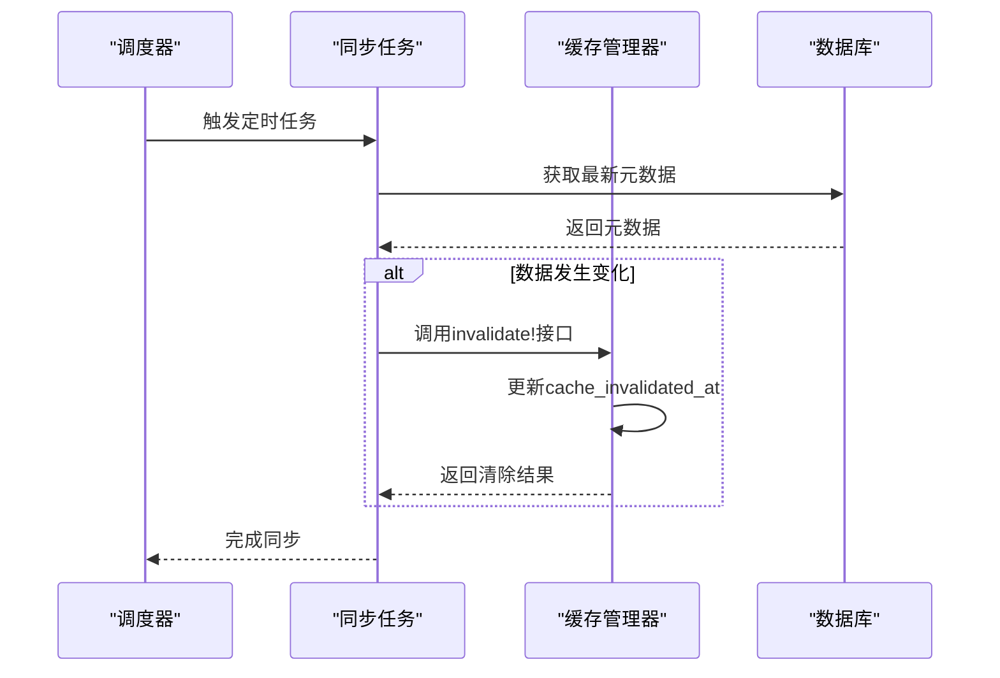
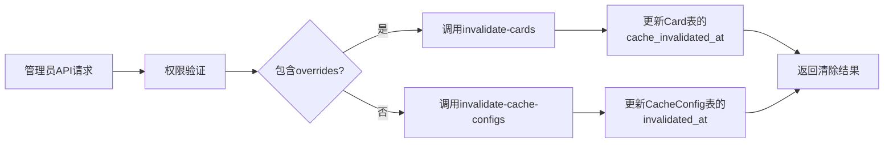

# 缓存失效与清除机制

<cite>
**本文档引用的文件**
- [settings.clj](file://src/metabase/cache/settings.clj)
- [api.clj](file://src/metabase/cache/api.clj)
- [cache_config.clj](file://src/metabase/cache/models/cache_config.clj)
- [db.clj](file://src/metabase/query_processor/middleware/cache_backend/db.clj)
- [cache.clj](file://src/metabase/query_processor/middleware/cache.clj)
- [sync.clj](file://src/metabase/sync/sync_metadata.clj)
- [field_values.clj](file://src/metabase/sync/field_values.clj)
</cite>

## 目录
1. [引言](#引言)
2. [缓存失效策略](#缓存失效策略)
3. [TTL配置项作用范围](#ttl配置项作用范围)
4. [数据同步任务触发机制](#数据同步任务触发机制)
5. [手动清除接口实现](#手动清除接口实现)
6. [缓存雪崩预防措施](#缓存雪崩预防措施)
7. [批量清除性能考量](#批量清除性能考量)
8. [结论](#结论)

## 引言
Metabase系统采用多层缓存机制来优化查询性能，通过时间驱动和事件驱动两种模式实现缓存失效。本系统设计了精细化的缓存管理策略，支持基于TTL（Time To Live）的自动失效机制以及基于事件的主动清除机制。缓存配置允许在不同粒度级别（根级别、数据库级别、仪表板级别和问题级别）进行设置，为管理员提供了灵活的控制能力。系统通过定期同步任务和事件监听器确保缓存数据的一致性，同时提供了API接口支持手动清除操作。

## 缓存失效策略
Metabase实现了时间驱动和事件驱动两种缓存失效模式。时间驱动模式基于TTL策略，通过计算查询平均执行时间和预设乘数确定缓存有效期。当缓存条目超过设定的有效期时，系统会自动将其标记为过期。事件驱动模式则通过监听数据变更事件来触发缓存清除，当底层数据源发生变化时，相关查询缓存会被立即清除。这两种模式协同工作，确保了缓存数据的时效性和一致性。系统还实现了全局最大缓存生存时间限制，防止缓存条目无限期存在。

**Section sources**
- [settings.clj](file://src/metabase/cache/settings.clj#L25-L45)
- [db.clj](file://src/metabase/query_processor/middleware/cache_backend/db.clj#L40-L71)
- [cache.clj](file://src/metabase/query_processor/middleware/cache.clj#L26-L63)

## TTL配置项作用范围
`cache-ttl-ms`配置项在Metabase中具有明确的作用范围和默认值设置。该配置项定义了基于TTL策略的缓存有效期，其作用范围覆盖所有启用了TTL缓存策略的查询。系统默认的全局最大缓存生存时间为35天，这是通过`query-caching-max-ttl`设置项定义的。对于单个查询结果，最大缓存大小限制为2000KB，由`query-caching-max-kb`设置项控制。这些配置项共同构成了缓存管理的基础规则，确保系统资源的合理使用。

**Diagram sources**
- [settings.clj](file://src/metabase/cache/settings.clj#L25-L45)

**Section sources**
- [settings.clj](file://src/metabase/cache/settings.clj#L25-L45)

## 数据同步任务触发机制
数据同步任务如元数据刷新和字段值更新会触发相关查询缓存的自动清除。系统通过定时任务调度机制，定期执行`cache_field_values`和`metadata_sync`任务。`cache_field_values`任务每天执行一次，负责更新字段值缓存；`metadata_sync`任务每小时执行一次，用于同步数据库元数据。当这些任务检测到数据变化时，会调用缓存清除接口，使受影响的查询缓存失效。这种机制确保了缓存数据与源数据的一致性，避免了陈旧数据的展示。

**Diagram sources**
- [sync.clj](file://src/metabase/sync/sync_metadata.clj#L55-L73)
- [field_values.clj](file://src/metabase/sync/field_values.clj#L110-L128)

**Section sources**
- [sync.clj](file://src/metabase/sync/sync_metadata.clj#L55-L73)
- [field_values.clj](file://src/metabase/sync/field_values.clj#L110-L128)

## 手动清除接口实现
手动清除接口通过`clear-cache-for-query`等关键函数实现，提供了管理员API进行缓存管理。系统在`/api/cache/invalidate`端点暴露了缓存清除功能，支持通过数据库ID、仪表板ID和问题ID等参数指定清除范围。当接收到清除请求时，系统会验证用户权限，然后调用`cache-config/invalidate!`函数执行清除操作。该函数根据`with-overrides?`参数决定是清除特定缓存配置还是级联清除所有相关卡片的缓存。清除操作通过更新数据库中的`cache_invalidated_at`字段来标记缓存失效。

**Diagram sources**
- [api.clj](file://src/metabase/cache/api.clj#L154-L188)
- [cache_config.clj](file://src/metabase/cache/models/cache_config.clj#L126-L151)

**Section sources**
- [api.clj](file://src/metabase/cache/api.clj#L154-L188)
- [cache_config.clj](file://src/metabase/cache/models/cache_config.clj#L126-L151)

## 缓存雪崩预防措施
系统通过多种机制预防缓存雪崩风险。首先，设置了全局最大缓存生存时间限制，防止大量缓存同时过期。其次，采用随机化调度策略，避免定时任务在同一时间点集中执行。对于查询缓存，系统实现了基于查询平均执行时间的动态TTL计算，使不同查询的缓存有效期呈现差异化。此外，系统还设置了单个查询结果的最大大小限制，防止单个大查询耗尽缓存资源。这些措施共同降低了缓存系统在高并发场景下的风险。

**Section sources**
- [settings.clj](file://src/metabase/cache/settings.clj#L25-L45)
- [db.clj](file://src/metabase/query_processor/middleware/cache_backend/db.clj#L70-L98)

## 批量清除性能考量
批量清除操作经过优化以确保性能。系统采用数据库批量更新操作，通过单条SQL语句更新多个缓存条目的失效时间戳，减少了数据库交互次数。在实现上，系统首先通过查询确定需要清除的卡片ID集合，然后执行批量更新操作。对于大规模清除场景，系统会分批处理ID列表，避免单次操作过于庞大。清除操作仅更新时间戳字段，不涉及数据删除，保证了操作的高效性。同时，系统记录了清除操作的审计日志，便于追踪和监控。

**Section sources**
- [cache_config.clj](file://src/metabase/cache/models/cache_config.clj#L126-L151)
- [db.clj](file://src/metabase/query_processor/middleware/cache_backend/db.clj#L70-L98)

## 结论
Metabase的缓存失效与清除机制设计完善，通过时间驱动和事件驱动两种模式实现了缓存的自动管理。系统提供了精细的配置选项和强大的API接口，使管理员能够灵活控制缓存行为。数据同步任务与缓存清除机制紧密结合，确保了数据的一致性。通过合理的性能优化和风险预防措施，系统在保证查询性能的同时，有效控制了缓存相关的风险。这一综合性的缓存管理方案为用户提供了高效、可靠的数据分析体验。