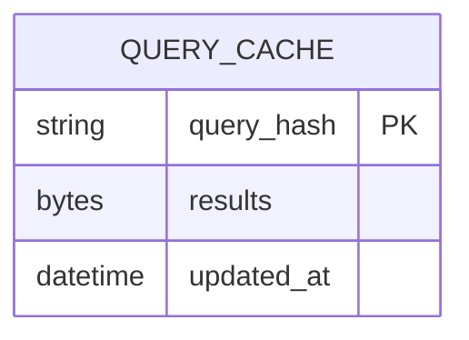
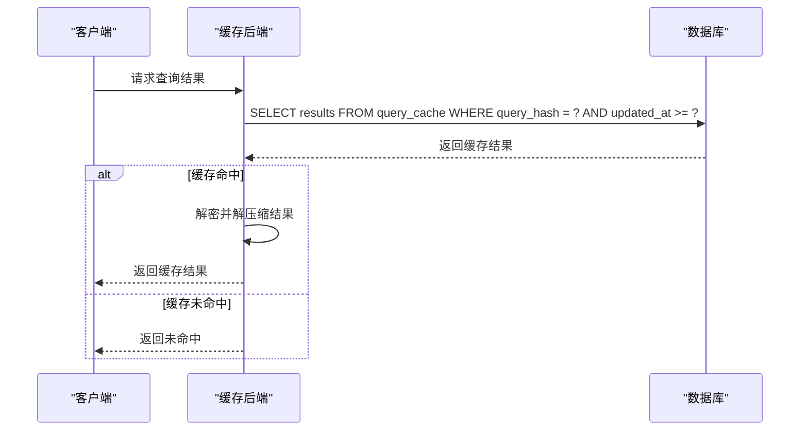
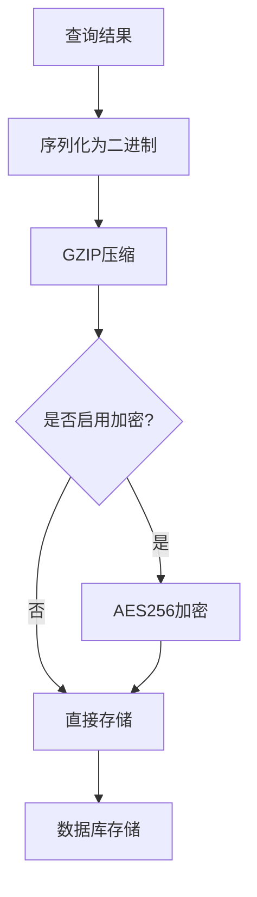

# 缓存存储后端实现

<cite>
**本文档中引用的文件**  
- [query_cache.clj](file://src/metabase/cache/models/query_cache.clj)
- [db.clj](file://src/metabase/query_processor/middleware/cache_backend/db.clj)
- [interface.clj](file://src/metabase/query_processor/middleware/cache_backend/interface.clj)
- [settings.clj](file://src/metabase/cache/settings.clj)
- [core.clj](file://src/metabase/query_processor/middleware/cache.clj)
- [encryption.clj](file://src/metabase/util/encryption.clj)
- [app-db/core.clj](file://src/metabase/app_db/core.clj)
</cite>

## 目录
1. [简介](#简介)
2. [QueryCache模型表结构设计](#querycache模型表结构设计)
3. [读写流程分析](#读写流程分析)
4. [持久化操作实现](#持久化操作实现)
5. [缓存条目序列化格式](#缓存条目序列化格式)
6. [容量管理策略](#容量管理策略)
7. [数据库查询性能优化建议](#数据库查询性能优化建议)

## 简介
本文档详细描述了Metabase系统中基于数据库的缓存存储后端实现。系统通过`QueryCache`模型在应用数据库中存储查询结果，实现了查询结果的高效缓存和检索。缓存后端支持可配置的TTL（Time To Live）机制和容量限制，确保缓存数据的时效性和系统资源的合理利用。整个缓存系统通过`app-db`模块与底层数据库进行交互，实现了跨数据库平台的兼容性。

**Section sources**
- [query_cache.clj](file://src/metabase/cache/models/query_cache.clj)
- [db.clj](file://src/metabase/query_processor/middleware/cache_backend/db.clj)

## QueryCache模型表结构设计
`QueryCache`模型用于在数据库中缓存查询结果，其表结构设计经过优化以支持高效的查询和更新操作。

### 字段类型
- **query_hash**: 主键字段，存储查询的SHA3哈希值（256字节），作为缓存条目的唯一标识符
- **results**: 存储压缩后的查询结果字节数组，使用数据库的BLOB或字节数组类型存储
- **updated_at**: 时间戳字段，记录缓存条目最后更新时间，用于TTL过期判断

### 索引策略
系统利用`query_hash`作为主键，确保了基于查询哈希的查找操作具有O(1)的时间复杂度。`updated_at`字段用于范围查询，支持基于时间的缓存清理操作。

### TTL机制
TTL（Time To Live）机制通过`updated_at`字段实现，系统定期清理超过最大生存时间的缓存条目。最大生存时间由`query-caching-max-ttl`设置控制，默认为35天。

**Diagram sources**
- [query_cache.clj](file://src/metabase/cache/models/query_cache.clj)
- [db.clj](file://src/metabase/query_processor/middleware/cache_backend/db.clj)

**Section sources**
- [query_cache.clj](file://src/metabase/cache/models/query_cache.clj)
- [db.clj](file://src/metabase/query_processor/middleware/cache_backend/db.clj)

## 读写流程分析
缓存系统的读写流程通过`db-read-backend`和`db-write-backend`实现，遵循严格的协议和错误处理机制。

### 写入流程 (db-write-backend)
1. 计算查询的SHA3哈希值作为`query_hash`
2. 压缩并加密查询结果
3. 检查是否存在相同`query_hash`的现有条目
4. 如果存在则更新现有条目，否则插入新条目
5. 更新`updated_at`时间戳
6. 执行缓存清理，删除过期条目

### 读取流程 (db-read-backend)
1. 根据查询哈希值构造查找条件
2. 检查缓存策略是否允许使用缓存
3. 查询数据库获取匹配的缓存条目
4. 验证缓存条目是否过期
5. 解密并解压缩缓存结果
6. 返回缓存结果或指示未命中

**Diagram sources**
- [db.clj](file://src/metabase/query_processor/middleware/cache_backend/db.clj)
- [interface.clj](file://src/metabase/query_processor/middleware/cache_backend/interface.clj)

**Section sources**
- [db.clj](file://src/metabase/query_processor/middleware/cache_backend/db.clj)
- [core.clj](file://src/metabase/query_processor/middleware/cache.clj)

## 持久化操作实现
持久化操作通过`app-db`模块执行，该模块提供了与应用数据库交互的统一接口。

### app-db模块功能
- 提供数据库连接池管理
- 处理不同数据库平台的兼容性
- 执行SQL查询和更新操作
- 管理事务和连接生命周期

### 持久化操作流程
1. 通过`app-db`获取数据库连接
2. 构造参数化SQL语句
3. 执行数据库操作
4. 处理异常和错误
5. 释放数据库连接

系统使用Toucan2 ORM框架简化数据库操作，支持H2、MySQL、PostgreSQL等多种数据库。

**Section sources**
- [app-db/core.clj](file://src/metabase/app_db/core.clj)
- [db.clj](file://src/metabase/query_processor/middleware/cache_backend/db.clj)

## 缓存条目序列化格式
缓存条目采用高效的二进制序列化格式存储查询结果。

### 序列化格式
- 使用Nippy库进行序列化，支持复杂数据结构
- 序列化格式版本号存储在元数据中，便于格式升级
- 数据在存储前经过GZIP压缩，减少存储空间占用

### JSON存储查询结果
虽然底层使用二进制格式，但查询结果本质上是JSON结构的序列化表示，包含：
- 查询元数据（版本、执行时间等）
- 查询结果行数据
- 结果集元数据（列信息、统计信息等）

### 加密机制
当系统配置了加密密钥时，缓存结果在存储前会进行AES256加密，确保数据安全性。

**Diagram sources**
- [core.clj](file://src/metabase/query_processor/middleware/cache.clj)
- [encryption.clj](file://src/metabase/util/encryption.clj)

**Section sources**
- [core.clj](file://src/metabase/query_processor/middleware/cache.clj)
- [encryption.clj](file://src/metabase/util/encryption.clj)

## 容量管理策略
系统实施多层次的容量管理策略，确保缓存系统的稳定运行。

### 最大缓存大小限制
- 通过`query-caching-max-kb`设置控制单个查询结果的最大缓存大小
- 默认限制为2000KB，可配置
- 全局最大限制为200MB，防止内存溢出

### 缓存清理机制
- 定期清理超过最大生存时间的缓存条目
- 最大生存时间由`query-caching-max-ttl`设置控制，默认35天
- 清理操作在后台异步执行，不影响正常查询性能

### 缓存策略
- 支持多种缓存策略（nocache, ttl等）
- 可根据查询执行时间动态决定是否缓存
- 提供企业版的精细化缓存控制

**Section sources**
- [settings.clj](file://src/metabase/cache/settings.clj)
- [core.clj](file://src/metabase/query_processor/middleware/cache.clj)

## 数据库查询性能优化建议
为提高缓存系统的数据库层面性能，建议实施以下优化策略。

### 分区表策略
对`query_cache`表实施时间分区，按`updated_at`字段进行范围分区：
- 提高过期数据清理效率
- 改善查询性能
- 便于数据归档和备份

### 归档策略
- 定期将过期的缓存数据归档到历史表
- 使用数据库的分区交换功能快速移动数据
- 在低峰期执行归档操作，减少对系统性能的影响

### 索引优化
- 确保`query_hash`主键索引的高效性
- 考虑为`updated_at`字段创建辅助索引
- 定期分析和优化表统计信息

### 连接池配置
- 适当增加应用数据库连接池大小
- 配置合理的连接超时和空闲超时
- 监控连接池使用情况，及时调整配置

**Section sources**
- [db.clj](file://src/metabase/query_processor/middleware/cache_backend/db.clj)
- [app-db/core.clj](file://src/metabase/app_db/core.clj)