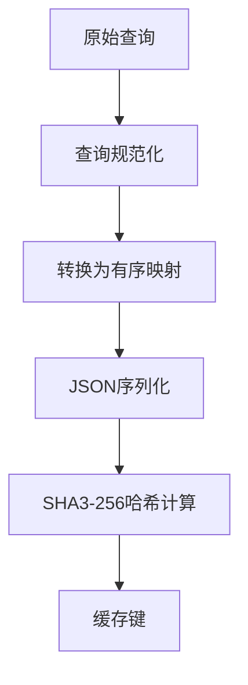
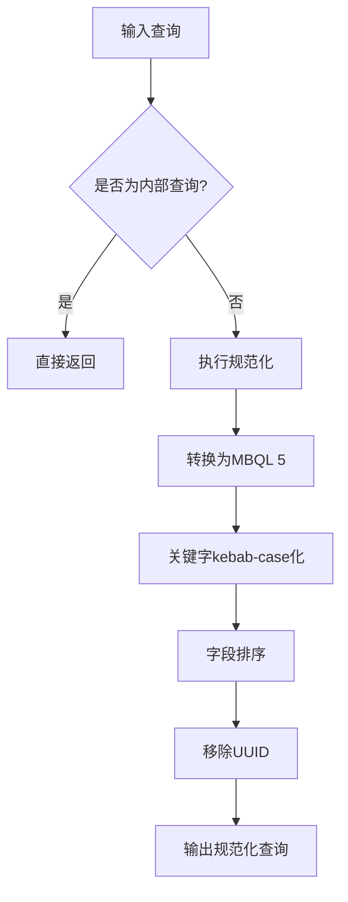
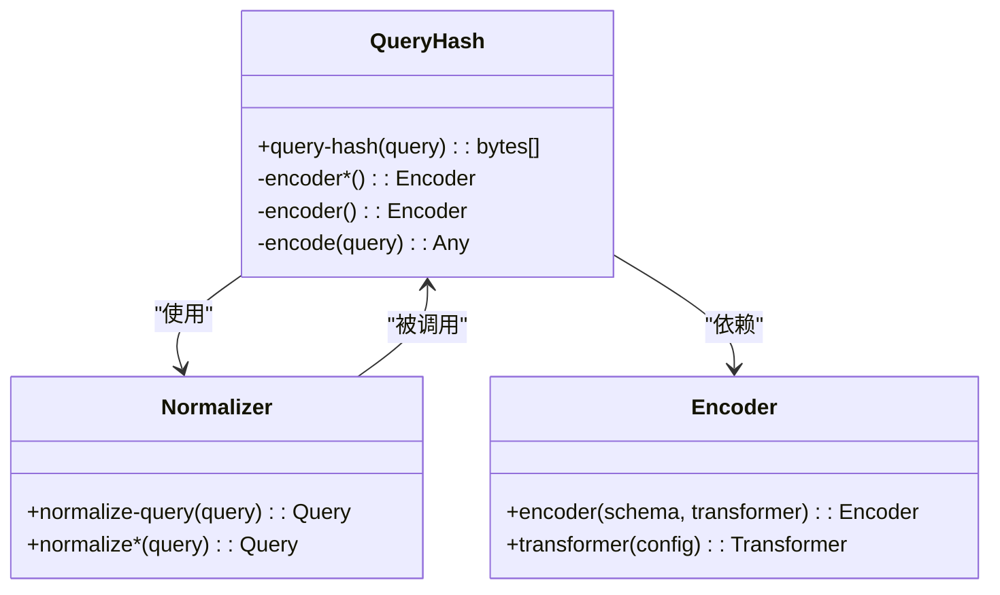
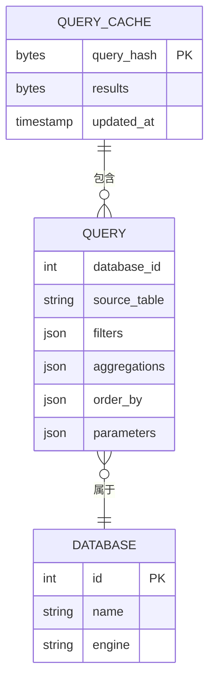

# 缓存键生成策略

<cite>
**本文档中引用的文件**  
- [hash.clj](file://src/metabase/lib_be/hash.clj)
- [normalize_query.clj](file://src/metabase/query_processor/middleware/normalize_query.clj)
- [query_cache.clj](file://src/metabase/cache/models/query_cache.clj)
- [db.clj](file://src/metabase/query_processor/middleware/cache_backend/db.clj)
- [util.clj](file://src/metabase/query_processor/util.clj)
- [transforms.clj](file://src/metabase/lib_be/models/transforms.clj)
</cite>

## 目录
1. [引言](#引言)
2. [缓存键生成机制](#缓存键生成机制)
3. [查询规范化处理](#查询规范化处理)
4. [哈希算法实现](#哈希算法实现)
5. [缓存键结构分析](#缓存键结构分析)
6. [性能影响与优化建议](#性能影响与优化建议)
7. [结论](#结论)

## 引言
Metabase通过查询缓存机制提升系统性能，其中缓存键的生成是核心环节。本文深入解析Metabase中查询缓存键的生成机制，详细说明如何基于MBQL查询结构、参数值、数据库ID等要素构造唯一缓存键。通过分析代码实现，揭示规范化查询在键生成中的作用，包括字段排序、空值处理和语法归一化等关键步骤。

**Section sources**
- [hash.clj](file://src/metabase/lib_be/hash.clj#L1-L10)
- [normalize_query.clj](file://src/metabase/query_processor/middleware/normalize_query.clj#L1-L10)

## 缓存键生成机制
Metabase的查询缓存键生成机制基于SHA3-256哈希算法，通过对查询对象进行规范化处理后生成唯一标识。缓存键的生成过程包含多个关键步骤：首先对查询进行规范化处理，确保相同语义的查询生成相同的键；然后将规范化后的查询转换为有序映射；最后通过JSON序列化和SHA3哈希计算生成最终的缓存键。

缓存键生成的主要目的是确保相同查询能够命中缓存，同时避免不同查询产生哈希冲突。该机制在查询执行前进行，通过比对生成的缓存键来判断是否可以直接返回缓存结果，从而避免重复执行耗时的数据库查询。

**Diagram sources**
- [hash.clj](file://src/metabase/lib_be/hash.clj#L15-L42)
- [transforms.clj](file://src/metabase/lib_be/models/transforms.clj#L59-L88)

**Section sources**
- [hash.clj](file://src/metabase/lib_be/hash.clj#L1-L42)
- [util.clj](file://src/metabase/query_processor/util.clj#L50-L60)

## 查询规范化处理
查询规范化是缓存键生成的关键预处理步骤，其主要目标是将不同形式但语义相同的查询转换为统一的标准化形式。规范化处理包含以下几个核心操作：

1. **关键字归一化**：将查询中的所有关键字转换为kebab-case格式，确保不同命名风格的查询能够正确匹配。
2. **字段排序**：对查询中的字段和子句按照预定义的顺序进行排序，消除因字段顺序不同导致的哈希差异。
3. **UUID移除**：移除查询中可能存在的lib/uuid字段，避免因生成的UUID不同而影响缓存命中。
4. **MBQL版本转换**：将查询转换为MBQL 5格式，确保不同版本的查询能够正确比较。

规范化处理通过`normalize-query`函数实现，该函数会检查查询类型，对于非内部查询会执行完整的规范化流程。处理后的查询具有确定性的结构，为后续的哈希计算提供了可靠的基础。

**Diagram sources**
- [normalize_query.clj](file://src/metabase/query_processor/middleware/normalize_query.clj#L15-L32)
- [transforms.clj](file://src/metabase/lib_be/models/transforms.clj#L59-L88)

**Section sources**
- [normalize_query.clj](file://src/metabase/query_processor/middleware/normalize_query.clj#L1-L32)
- [transforms.clj](file://src/metabase/lib_be/models/transforms.clj#L1-L88)

## 哈希算法实现
Metabase采用SHA3-256算法生成查询缓存键，该实现位于`lib-be.hash`命名空间中。哈希计算过程通过`query-hash`函数完成，其核心逻辑如下：

1. **条件规范化**：根据查询类型决定是否执行规范化处理，内部查询跳过此步骤。
2. **编码器应用**：使用malli库的编码器将查询转换为有序映射，确保相同内容的映射生成相同的序列化结果。
3. **JSON序列化**：将处理后的查询对象序列化为JSON字符串，为哈希计算准备输入数据。
4. **SHA3-256计算**：对序列化后的JSON字符串应用SHA3-256哈希算法，生成256位的二进制哈希值。

哈希算法的选择基于其抗碰撞性和安全性，SHA3作为新一代加密哈希标准，相比SHA2具有更好的安全特性。生成的哈希值以字节数组形式返回，可直接用作缓存系统的键值。

**Diagram sources**
- [hash.clj](file://src/metabase/lib_be/hash.clj#L15-L42)
- [transforms.clj](file://src/metabase/lib_be/models/transforms.clj#L59-L88)

**Section sources**
- [hash.clj](file://src/metabase/lib_be/hash.clj#L1-L42)
- [transforms.clj](file://src/metabase/lib_be/models/transforms.clj#L59-L88)

## 缓存键结构分析
缓存键的结构设计充分考虑了查询的各个关键要素，确保能够准确反映查询的语义特征。通过对源码的分析，可以确定缓存键包含以下主要组成部分：

- **数据库标识**：通过数据库ID确保不同数据库的查询不会发生缓存冲突。
- **查询结构**：包含数据源、过滤条件、聚合函数、排序规则等MBQL核心元素。
- **参数值**：查询中使用的参数值会被纳入哈希计算，确保参数化查询的正确缓存。
- **连接信息**：相关的表连接和子查询信息也被包含在内。

缓存键生成过程中，系统会将所有映射类型的数据转换为有序映射（sorted map），这一设计至关重要，因为它消除了因字段顺序不同而导致的哈希差异。同时，系统会移除查询中可能存在的临时标识符（如lib/uuid），避免这些动态生成的值影响缓存一致性。

**Diagram sources**
- [query_cache.clj](file://src/metabase/cache/models/query_cache.clj#L1-L12)
- [hash.clj](file://src/metabase/lib_be/hash.clj#L15-L42)

**Section sources**
- [query_cache.clj](file://src/metabase/cache/models/query_cache.clj#L1-L12)
- [hash.clj](file://src/metabase/lib_be/hash.clj#L15-L42)

## 性能影响与优化建议
缓存键生成机制对系统性能有重要影响，合理的优化策略可以显著提升查询响应速度和系统吞吐量。以下是基于代码分析的性能影响评估和优化建议：

**性能影响因素：**
1. **规范化开销**：查询规范化处理需要消耗CPU资源，对于复杂查询可能成为性能瓶颈。
2. **哈希计算成本**：SHA3-256算法虽然安全，但计算成本相对较高。
3. **内存使用**：缓存键生成过程中需要在内存中构建完整的查询对象。

**优化建议：**
1. **缓存规范化结果**：对于频繁执行的查询，可以考虑缓存其规范化后的形式，避免重复处理。
2. **选择合适的哈希算法**：在安全性要求不高的场景下，可考虑使用计算成本更低的哈希算法。
3. **查询结构优化**：简化查询结构，减少不必要的字段和子句，可以降低哈希计算的复杂度。
4. **参数化查询**：合理使用参数化查询，可以提高缓存命中率，减少重复的哈希计算。

通过合理配置缓存策略和优化查询设计，可以最大化缓存机制的性能收益，同时避免潜在的性能问题。

**Section sources**
- [db.clj](file://src/metabase/query_processor/middleware/cache_backend/db.clj#L96-L111)
- [hash.clj](file://src/metabase/lib_be/hash.clj#L35-L42)

## 结论
Metabase的查询缓存键生成机制通过规范化处理和SHA3-256哈希计算，实现了高效可靠的查询缓存功能。该机制充分考虑了查询的语义特征，通过字段排序、关键字归一化等技术确保相同语义的查询生成相同的缓存键。系统设计中对有序映射的使用和UUID的移除，有效解决了哈希一致性问题。了解这一机制有助于优化查询性能，提高缓存命中率，为构建高效的BI系统提供技术支持。