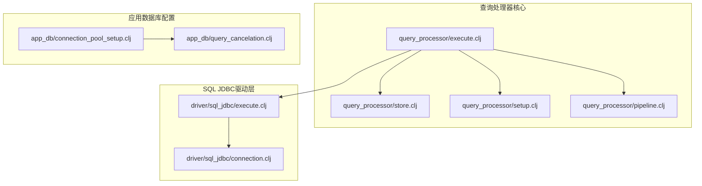
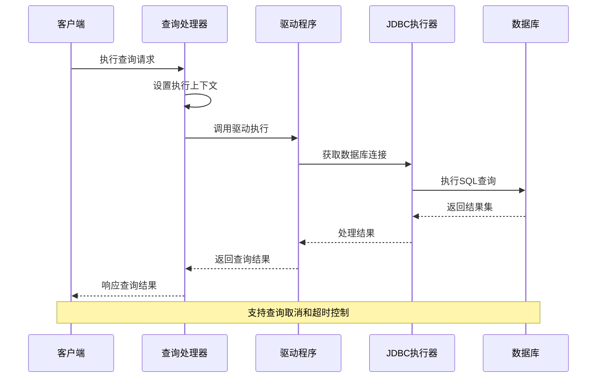
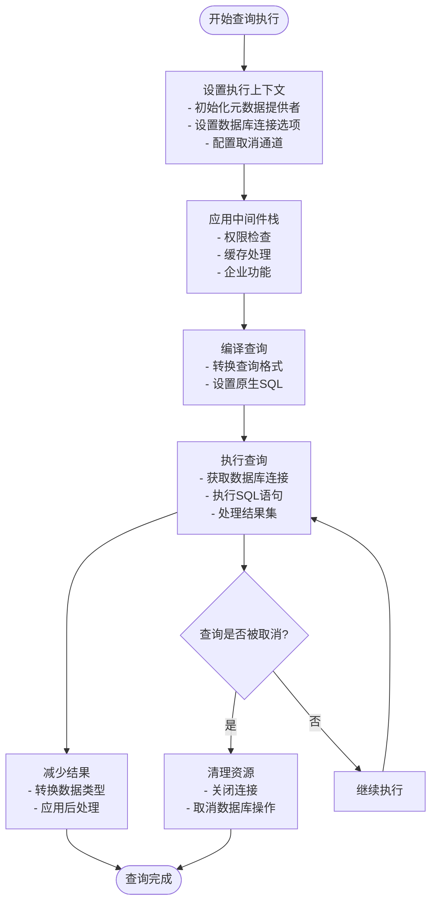
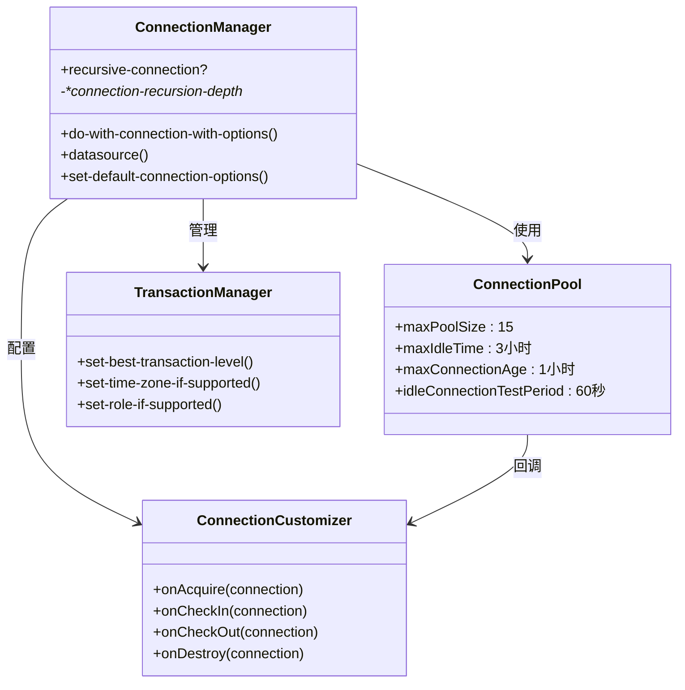
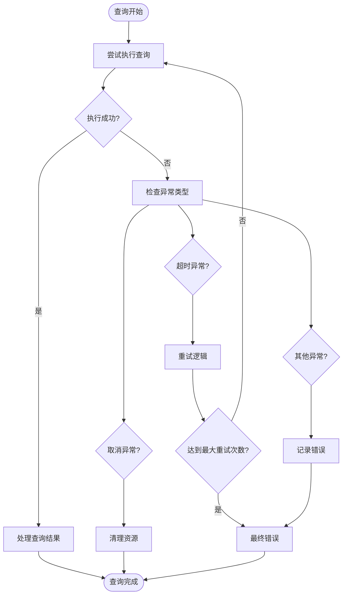
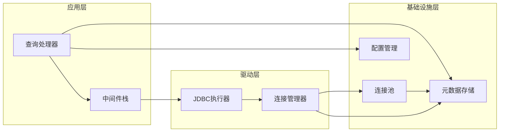

# 查询执行阶段

<cite>
**本文档中引用的文件**
- [execute.clj](file://src/metabase/query_processor/execute.clj)
- [store.clj](file://src/metabase/query_processor/store.clj)
- [execute.clj](file://src/metabase/driver/sql_jdbc/execute.clj)
- [setup.clj](file://src/metabase/query_processor/setup.clj)
- [pipeline.clj](file://src/metabase/query_processor/pipeline.clj)
- [connection_pool_setup.clj](file://src/metabase/app_db/connection_pool_setup.clj)
- [query_cancelation.clj](file://src/metabase/app_db/query_cancelation.clj)
- [connection.clj](file://src/metabase/driver/sql_jdbc/connection.clj)
</cite>

## 目录
1. [简介](#简介)
2. [项目结构概览](#项目结构概览)
3. [核心组件分析](#核心组件分析)
4. [架构概览](#架构概览)
5. [详细组件分析](#详细组件分析)
6. [依赖关系分析](#依赖关系分析)
7. [性能考虑](#性能考虑)
8. [故障排除指南](#故障排除指南)
9. [结论](#结论)

## 简介

Metabase的查询执行阶段是整个查询处理流程中最关键的部分，负责将编译后的查询转换为实际的数据库操作。本文档深入分析了`execute.clj`如何管理查询上下文、获取数据库连接、执行已编译SQL并处理结果集，以及`store.clj`在元数据缓存中的作用，同时探讨了与`sql_jdbc/execute.clj`的协作机制。

查询执行阶段涉及多个复杂的子系统，包括连接池管理、查询超时控制、异常捕获与重试机制、执行上下文隔离等关键设计模式。这些组件共同确保了查询执行的可靠性、性能和可扩展性。

## 项目结构概览

Metabase的查询执行相关代码主要分布在以下目录结构中：

**图表来源**
- [execute.clj](file://src/metabase/query_processor/execute.clj#L1-L100)
- [store.clj](file://src/metabase/query_processor/store.clj#L1-L235)
- [execute.clj](file://src/metabase/driver/sql_jdbc/execute.clj#L1-L970)

## 核心组件分析

### 查询执行器 (`execute.clj`)

查询执行器是查询处理管道的核心入口点，负责协调整个查询执行过程。它定义了查询执行的中间件栈和执行流程。

主要功能包括：
- **中间件管理**：维护查询执行前后的处理链
- **查询预处理**：将编译后的查询转换为驱动可识别的格式
- **执行上下文建立**：设置查询执行所需的环境
- **结果处理**：协调查询结果的收集和返回

**章节来源**
- [execute.clj](file://src/metabase/query_processor/execute.clj#L1-L100)

### 元数据存储器 (`store.clj`)

元数据存储器负责在查询执行期间缓存和管理数据库元数据，提供高效的元数据访问机制。

核心特性：
- **元数据缓存**：缓存表和字段信息以避免重复查询
- **动态绑定**：支持查询执行期间的元数据提供者动态切换
- **兼容性处理**：提供向后兼容的元数据接口
- **缓存失效**：智能的缓存清理和更新机制

**章节来源**
- [store.clj](file://src/metabase/query_processor/store.clj#L1-L235)

### 连接池管理

连接池管理是保证查询性能和系统稳定性的关键基础设施。

主要配置参数：
- **最大连接数**：限制同时活跃的数据库连接数量
- **空闲连接测试**：定期验证空闲连接的有效性
- **连接生命周期**：控制连接的创建、使用和销毁周期
- **资源清理**：PostgreSQL连接的会话资源自动清理

**章节来源**
- [connection_pool_setup.clj](file://src/metabase/app_db/connection_pool_setup.clj#L1-L152)

## 架构概览

查询执行的整体架构采用分层设计，从上到下包括查询处理层、驱动抽象层、JDBC执行层和数据库连接层。

**图表来源**
- [execute.clj](file://src/metabase/query_processor/execute.clj#L70-L100)
- [pipeline.clj](file://src/metabase/query_processor/pipeline.clj#L50-L130)
- [execute.clj](file://src/metabase/driver/sql_jdbc/execute.clj#L800-L970)

## 详细组件分析

### 查询执行流程

查询执行遵循严格的流程控制，确保每个步骤都得到正确处理：

**图表来源**
- [setup.clj](file://src/metabase/query_processor/setup.clj#L200-L257)
- [pipeline.clj](file://src/metabase/query_processor/pipeline.clj#L100-L130)

### 连接获取与管理

数据库连接的获取和管理采用了多层次的策略，确保性能和可靠性：

**图表来源**
- [execute.clj](file://src/metabase/driver/sql_jdbc/execute.clj#L300-L400)
- [connection_pool_setup.clj](file://src/metabase/app_db/connection_pool_setup.clj#L80-L152)

### 异常处理与重试机制

查询执行过程中的异常处理采用了多层防护策略：

**图表来源**
- [pipeline.clj](file://src/metabase/query_processor/pipeline.clj#L115-L130)
- [query_cancelation.clj](file://src/metabase/app_db/query_cancelation.clj#L40-L52)

**章节来源**
- [pipeline.clj](file://src/metabase/query_processor/pipeline.clj#L1-L130)
- [query_cancelation.clj](file://src/metabase/app_db/query_cancelation.clj#L1-L52)

### 性能监控与优化

查询执行过程中的性能监控通过多种机制实现：

| 监控指标 | 实现方式 | 用途 |
|---------|---------|------|
| 连接活动监控 | 最近活动时间戳 | 检测连接池健康状态 |
| 查询执行时间 | 内置计时器 | 性能分析和优化 |
| 结果集大小 | 行数统计 | 内存使用监控 |
| 错误率统计 | 异常计数器 | 系统稳定性评估 |
| 连接池利用率 | 活跃连接数 | 资源分配优化 |

**章节来源**
- [connection_pool_setup.clj](file://src/metabase/app_db/connection_pool_setup.clj#L20-L50)

## 依赖关系分析

查询执行系统的依赖关系呈现清晰的层次结构：

**图表来源**
- [setup.clj](file://src/metabase/query_processor/setup.clj#L1-L50)
- [execute.clj](file://src/metabase/driver/sql_jdbc/execute.clj#L1-L50)

**章节来源**
- [setup.clj](file://src/metabase/query_processor/setup.clj#L1-L257)
- [store.clj](file://src/metabase/query_processor/store.clj#L1-L235)

## 性能考虑

查询执行阶段的性能优化主要集中在以下几个方面：

### 连接池优化
- **动态连接数调整**：根据负载自动调整连接池大小
- **连接预热**：在系统启动时预创建部分连接
- **连接复用**：最大化连接的使用效率

### 查询优化
- **结果集流式处理**：避免将大结果集加载到内存
- **延迟加载**：按需加载元数据和相关资源
- **批量操作**：合并多个小查询为单个批量操作

### 缓存策略
- **元数据缓存**：缓存频繁访问的表和字段信息
- **查询结果缓存**：对相同查询的结果进行缓存
- **智能过期**：基于访问频率和时效性设置缓存过期

## 故障排除指南

### 常见问题及解决方案

| 问题类型 | 症状 | 可能原因 | 解决方案 |
|---------|------|---------|---------|
| 连接超时 | 查询长时间无响应 | 连接池耗尽 | 增加连接池大小或优化查询 |
| 内存溢出 | JVM堆内存不足 | 结果集过大 | 启用流式处理或增加内存 |
| 查询取消 | 查询意外终止 | 客户端断开连接 | 检查网络连接和超时设置 |
| 权限错误 | 访问被拒绝 | 用户权限不足 | 验证用户权限和数据库配置 |

### 监控和诊断

查询执行过程中的监控指标包括：
- **执行时间分布**：分析查询性能瓶颈
- **连接池使用率**：监控资源使用情况
- **错误率统计**：识别系统稳定性问题
- **并发度分析**：评估系统负载能力

**章节来源**
- [connection_pool_setup.clj](file://src/metabase/app_db/connection_pool_setup.clj#L100-L152)

## 结论

Metabase的查询执行阶段展现了现代数据分析平台在性能、可靠性和可扩展性方面的最佳实践。通过精心设计的分层架构、完善的异常处理机制和智能的资源管理策略，该系统能够高效地处理各种规模的查询请求。

关键设计亮点包括：
- **模块化架构**：清晰的职责分离和良好的解耦
- **容错机制**：多层次的异常处理和恢复策略
- **性能优化**：连接池管理、结果集流式处理等优化技术
- **监控体系**：全面的性能监控和故障诊断能力

这些设计原则和实现技巧为构建高性能的数据分析平台提供了宝贵的参考价值。