# 查询编译与执行

<cite>
**本文档中引用的文件**
- [compile.clj](file://src/metabase/query_processor/compile.clj)
- [execute.clj](file://src/metabase/query_processor/execute.clj)
- [store.clj](file://src/metabase/query_processor/store.clj)
- [card.clj](file://src/metabase/query_processor/card.clj)
- [pipeline.clj](file://src/metabase/query_processor/pipeline.clj)
- [cache.clj](file://src/metabase/query_processor/middleware/cache.clj)
- [connection.clj](file://src/metabase/driver/sql_jdbc/connection.clj)
- [execute.clj](file://src/metabase/driver/sql_jdbc/execute.clj)
- [streaming.clj](file://src/metabase/query_processor/streaming.clj)
- [error_type.clj](file://src/metabase/query_processor/error_type.clj)
- [log.clj](file://src/metabase/util/log.clj)
</cite>

## 目录
1. [简介](#简介)
2. [系统架构概览](#系统架构概览)
3. [查询编译阶段](#查询编译阶段)
4. [查询执行阶段](#查询执行阶段)
5. [中间件管道系统](#中间件管道系统)
6. [连接池管理](#连接池管理)
7. [缓存机制](#缓存机制)
8. [错误处理与性能监控](#错误处理与性能监控)
9. [流式响应处理](#流式响应处理)
10. [总结](#总结)

## 简介

Metabase查询编译与执行子系统是一个复杂而精密的架构，负责将用户通过MBQL（Metabase Query Language）构建的查询转换为特定数据库的原生SQL语句，并高效地执行这些查询以获取结果。该系统采用分层架构设计，包含查询编译、执行管道、中间件处理、连接管理和结果流式化等多个核心组件。

系统的核心设计理念是：
- **分离关注点**：编译、执行、缓存等职责明确分离
- **可扩展性**：支持多种数据库驱动程序
- **性能优化**：通过连接池、缓存和流式处理提升性能
- **可靠性**：完善的错误处理和监控机制

## 系统架构概览

查询编译与执行系统采用多层架构，从上到下包括API层、查询处理器层、编译层、执行层和驱动层。

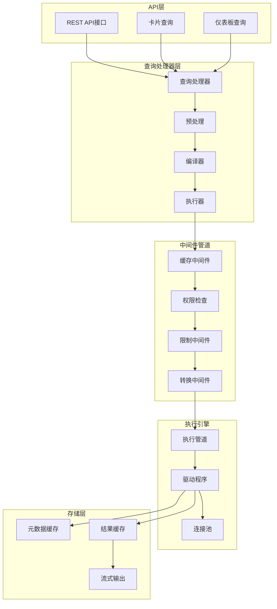

**图表来源**
- [query_processor.clj](file://src/metabase/query_processor.clj#L24-L82)
- [compile.clj](file://src/metabase/query_processor/compile.clj#L1-L97)
- [execute.clj](file://src/metabase/query_processor/execute.clj#L1-L100)

## 查询编译阶段

查询编译阶段是整个系统的关键环节，负责将MBQL查询转换为特定数据库的原生SQL语句。该阶段包含预处理、编译和后处理三个主要步骤。

### 编译流程架构

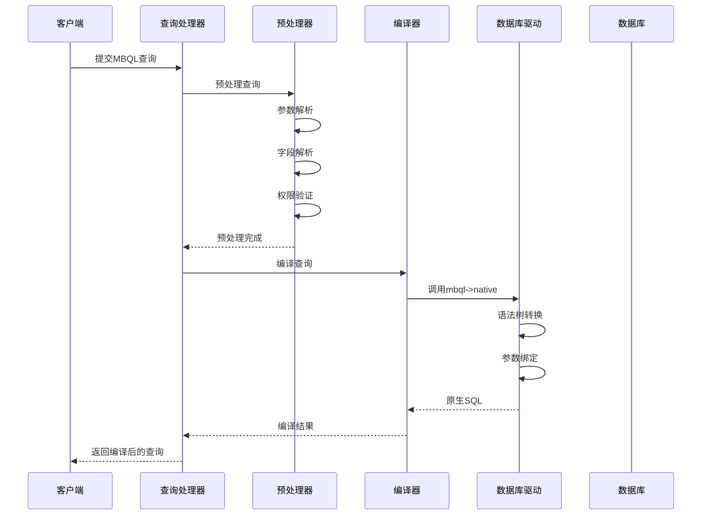

**图表来源**
- [compile.clj](file://src/metabase/query_processor/compile.clj#L45-L80)
- [execute.clj](file://src/metabase/query_processor/execute.clj#L63-L98)

### 编译核心功能

编译器的核心功能包括：

1. **MBQL到原生SQL转换**：将抽象的MBQL查询转换为具体数据库的SQL语句
2. **参数内联处理**：支持参数直接内联到SQL中的功能
3. **查询优化**：在编译阶段进行基本的查询优化
4. **类型验证**：确保查询结构符合预期格式

### 编译状态定义

系统定义了多种编译状态来跟踪查询的不同阶段：

| 状态类型 | 描述 | 结构 |
|---------|------|------|
| `::compiled` | 编译后的查询和参数 | `{:query :any, :params [:maybe [:sequential :any]]}` |
| `::compiled-with-inlined-parameters` | 包含内联参数的查询 | `{:query :any, :params [:maybe [:sequential {:max 0} :any]]}` |
| `::query-with-compiled-query` | 包含编译查询的MBQL查询 | 合并MBQL模式和编译结果 |

**章节来源**
- [compile.clj](file://src/metabase/query_processor/compile.clj#L18-L36)

## 查询执行阶段

查询执行阶段负责管理查询的完整生命周期，从执行上下文建立到结果流式返回。该阶段采用中间件模式，提供了灵活的扩展能力。

### 执行管道架构

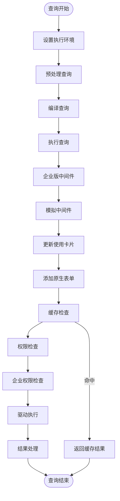

**图表来源**
- [execute.clj](file://src/metabase/query_processor/execute.clj#L40-L60)
- [pipeline.clj](file://src/metabase/query_processor/pipeline.clj#L1-L130)

### 中间件执行顺序

执行阶段的中间件按照特定顺序执行，形成完整的查询处理流水线：

1. **企业版中间件**：处理数据库交换和模拟功能
2. **模拟中间件**：应用模拟后的处理逻辑
3. **更新使用卡片**：记录卡片使用情况
4. **添加原生表单**：附加原生查询形式
5. **添加预处理查询**：保存预处理查询信息
6. **缓存检查**：尝试从缓存获取结果
7. **权限检查**：验证查询权限
8. **企业权限检查**：额外的企业级权限验证

### 执行上下文管理

执行器负责管理查询执行的完整上下文，包括：

- **连接管理**：建立和维护数据库连接
- **事务控制**：管理查询的事务边界
- **超时控制**：设置查询执行超时时间
- **取消机制**：支持查询取消操作

**章节来源**
- [execute.clj](file://src/metabase/query_processor/execute.clj#L40-L98)
- [pipeline.clj](file://src/metabase/query_processor/pipeline.clj#L40-L130)

## 中间件管道系统

中间件管道系统是查询编译与执行子系统的核心架构模式，采用函数组合的方式实现查询处理的各个阶段。

### 中间件架构设计

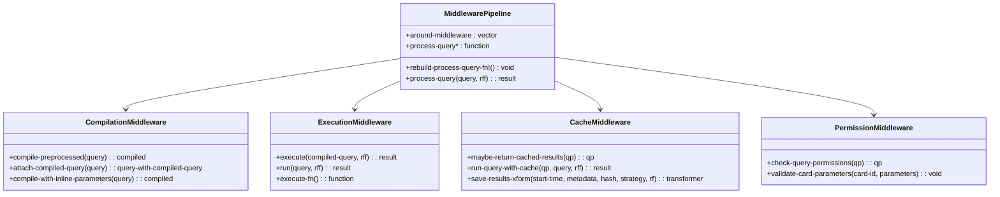

**图表来源**
- [query_processor.clj](file://src/metabase/query_processor.clj#L24-L52)
- [execute.clj](file://src/metabase/query_processor/execute.clj#L40-L60)
- [cache.clj](file://src/metabase/query_processor/middleware/cache.clj#L200-L247)

### 中间件类型分类

系统中的中间件按功能可分为以下几类：

| 中间件类型 | 功能描述 | 执行时机 |
|-----------|----------|----------|
| **预处理中间件** | 查询预处理、参数解析、字段解析 | 查询编译前 |
| **编译中间件** | MBQL到原生SQL转换 | 查询编译时 |
| **执行中间件** | 查询执行、结果处理 | 查询执行时 |
| **后处理中间件** | 结果转换、格式化、缓存 | 查询完成后 |

### 中间件动态重载

系统支持中间件的动态重载，当中间件发生变化时，会自动重建执行函数：

```clojure
(defn- rebuild-execute-fn! []
  (alter-var-root #'execute* (constantly (execute-fn))))

(doseq [varr middleware]
  (add-watch varr ::reload (fn [_key _ref _old-state _new-state]
                             (log/infof "%s changed, rebuilding %s" varr `execute*)
                             (rebuild-execute-fn!))))
```

**章节来源**
- [execute.clj](file://src/metabase/query_processor/execute.clj#L80-L98)
- [query_processor.clj](file://src/metabase/query_processor.clj#L49-L82)

## 连接池管理

连接池管理系统负责高效地管理数据库连接，确保查询执行的性能和稳定性。系统采用C3P0连接池作为底层实现。

### 连接池架构

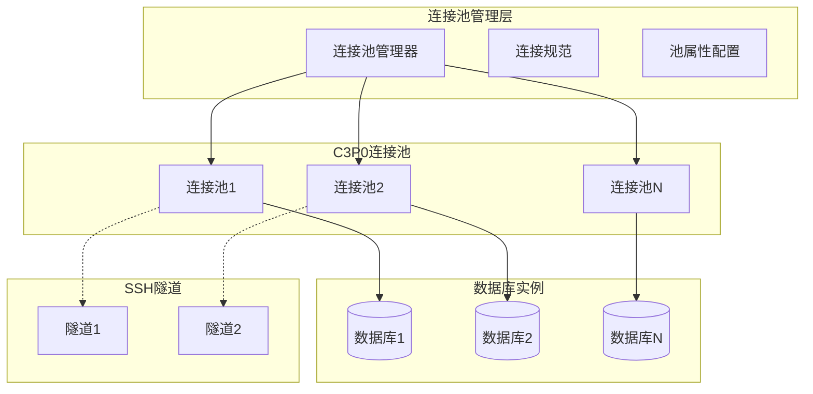

**图表来源**
- [connection.clj](file://src/metabase/driver/sql_jdbc/connection.clj#L1-L383)

### 连接池配置策略

系统为不同类型的数据库配置了专门的连接池属性：

| 配置项 | 数据仓库 | 应用数据库 |
|--------|----------|------------|
| `acquireIncrement` | 1 | 3 |
| `maxIdleTime` | 3小时 | 10分钟 |
| `minPoolSize` | 0 | 1 |
| `maxPoolSize` | 可配置 | 10 |
| `testConnectionOnCheckout` | true | true |
| `unreturnedConnectionTimeout` | 查询超时 | 30秒 |

### 连接生命周期管理

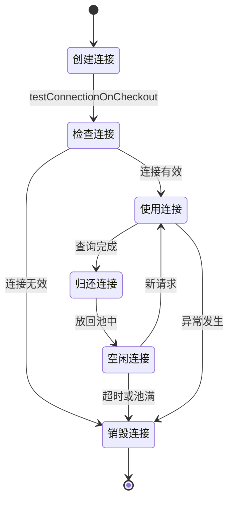

**图表来源**
- [connection.clj](file://src/metabase/driver/sql_jdbc/connection.clj#L100-L200)

### SSH隧道支持

系统支持通过SSH隧道连接远程数据库，提供了完整的隧道生命周期管理：

- **隧道建立**：动态建立SSH连接
- **隧道验证**：定期检查隧道状态
- **隧道重连**：自动重连断开的隧道
- **隧道清理**：查询完成后清理资源

**章节来源**
- [connection.clj](file://src/metabase/driver/sql_jdbc/connection.clj#L150-L383)

## 缓存机制

缓存机制是查询性能优化的重要组成部分，系统实现了多层次的缓存策略。

### 缓存架构设计

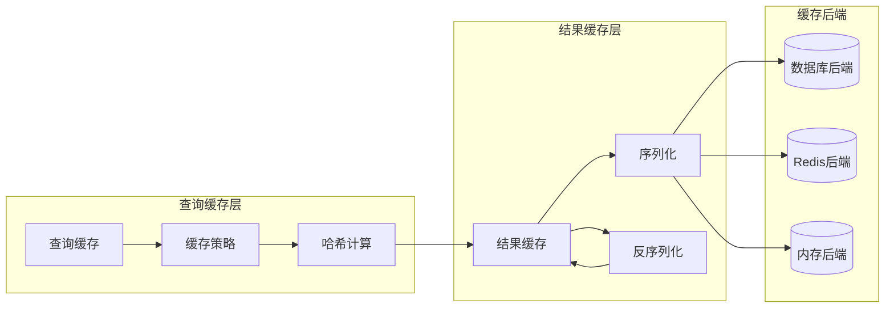

**图表来源**
- [cache.clj](file://src/metabase/query_processor/middleware/cache.clj#L1-L247)

### 缓存策略类型

系统支持多种缓存策略：

| 策略类型 | 描述 | 适用场景 |
|---------|------|----------|
| `:ttl` | 基于生存时间的缓存 | 通用查询 |
| `:nocache` | 不缓存 | 敏感数据查询 |
| `:manual` | 手动控制缓存 | 特殊业务需求 |

### 缓存工作流程

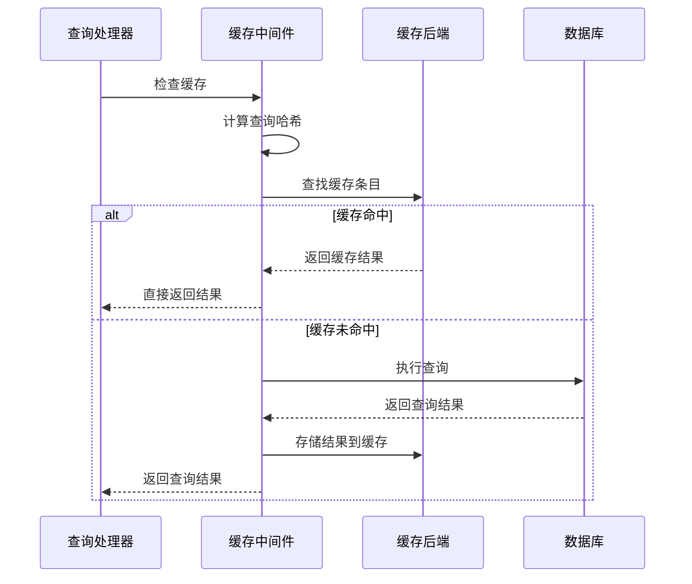

**图表来源**
- [cache.clj](file://src/metabase/query_processor/middleware/cache.clj#L150-L200)

### 缓存序列化版本

系统使用版本化的序列化格式确保缓存的兼容性：

```clojure
(def ^:private cache-version
  "当前序列化格式版本"
  3)

;; 缓存格式：[初始元数据 行1 行2 ... 行n 最终元数据]
```

**章节来源**
- [cache.clj](file://src/metabase/query_processor/middleware/cache.clj#L30-L50)
- [cache.clj](file://src/metabase/query_processor/middleware/cache.clj#L100-L150)

## 错误处理与性能监控

系统建立了完善的错误处理和性能监控体系，确保查询执行的可靠性和可观测性。

### 错误类型层次结构

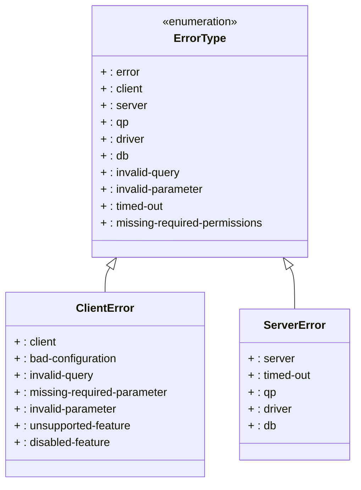

**图表来源**
- [error_type.clj](file://src/metabase/query_processor/error_type.clj#L1-L112)

### 错误处理策略

系统根据错误类型采用不同的处理策略：

| 错误类型 | 处理策略 | 用户可见性 |
|---------|----------|-----------|
| `:client` | 返回具体错误信息 | 是 |
| `:server` | 返回通用错误信息 | 否 |
| `:qp` | 记录详细日志 | 否 |
| `:driver` | 返回驱动错误信息 | 否 |
| `:db` | 返回数据库错误信息 | 否 |

### 性能监控指标

系统收集以下关键性能指标：

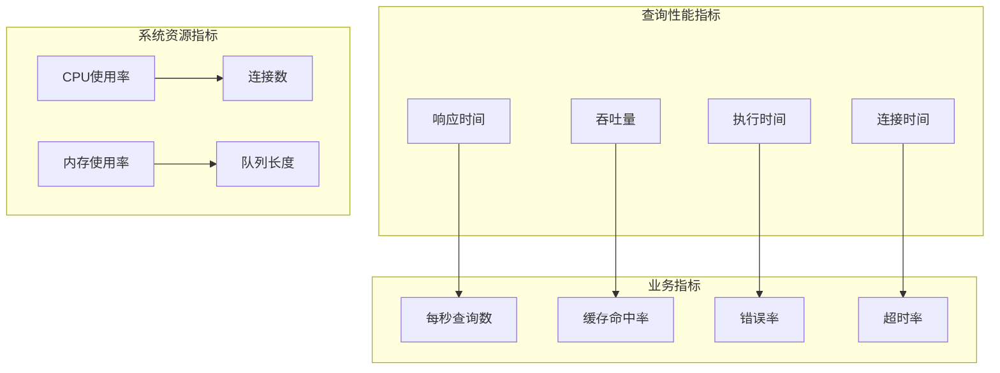

**图表来源**
- [log.clj](file://src/metabase/util/log.clj#L1-L350)

### 日志上下文管理

系统提供了强大的日志上下文管理功能，支持在异常传播过程中保留上下文信息：

```clojure
(defmacro with-context
  "执行体与给定的上下文映射和消息前缀在ThreadContext中。
   上下文映射的键和值被单独添加到ThreadContext中。
   在执行期间保留任何现有的上下文值并在执行后恢复它们。"
  [context-map & body]
  `(with-thread-context ~context-map
     (with-exception-context ~context-map
       ~@body)))
```

**章节来源**
- [error_type.clj](file://src/metabase/query_processor/error_type.clj#L15-L50)
- [log.clj](file://src/metabase/util/log.clj#L250-L350)

## 流式响应处理

流式响应处理系统支持大结果集的高效传输，避免内存溢出问题。

### 流式处理架构

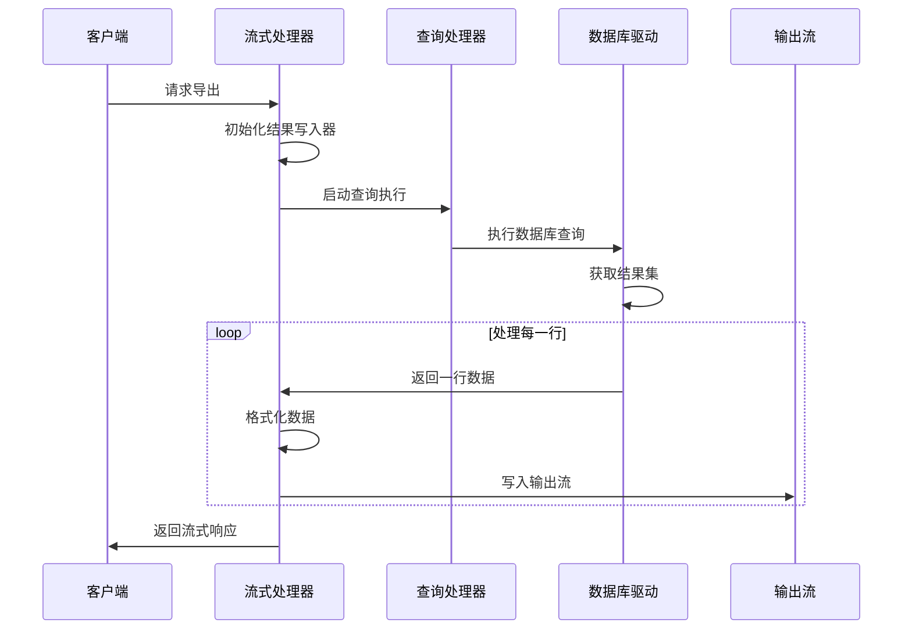

**图表来源**
- [streaming.clj](file://src/metabase/query_processor/streaming.clj#L1-L266)

### 支持的导出格式

系统支持多种导出格式，每种格式都有专门的处理器：

| 格式 | 处理器 | 特点 |
|------|--------|------|
| `:api` | JSON处理器 | 标准JSON格式 |
| `:json` | JSON处理器 | 流式JSON输出 |
| `:csv` | CSV处理器 | 逗号分隔值 |
| `:xlsx` | Excel处理器 | Microsoft Excel格式 |

### 列排序和映射

系统提供了智能的列排序和映射功能，确保导出数据的正确性：

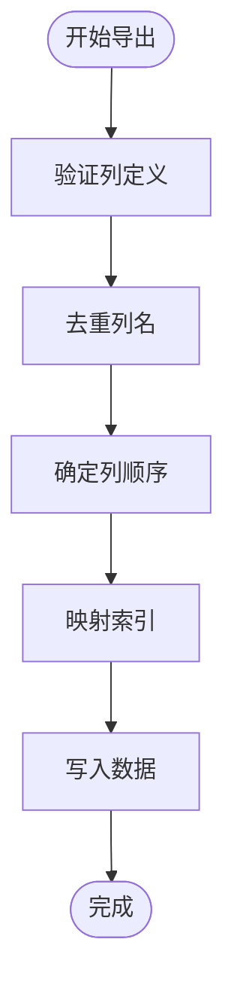

**图表来源**
- [streaming.clj](file://src/metabase/query_processor/streaming.clj#L50-L150)

### 取消机制

流式处理支持查询取消功能，当客户端断开连接时能够及时释放资源：

```clojure
(defn canceled?*
  "查询执行是否已被取消。
   通常由HTTP连接关闭触发。"
  [canceled-chan]
  (some-> canceled-chan a/poll!))
```

**章节来源**
- [streaming.clj](file://src/metabase/query_processor/streaming.clj#L200-L266)
- [pipeline.clj](file://src/metabase/query_processor/pipeline.clj#L10-L20)

## 总结

Metabase查询编译与执行子系统是一个高度模块化和可扩展的架构，具有以下核心特点：

### 架构优势

1. **分层设计**：清晰的职责分离，便于维护和扩展
2. **中间件模式**：灵活的功能组合和扩展机制
3. **连接池管理**：高效的数据库连接复用
4. **缓存策略**：多层次的性能优化
5. **错误处理**：完善的异常管理和监控

### 性能特性

- **并发处理**：支持多个查询同时执行
- **流式传输**：大结果集的高效处理
- **智能缓存**：基于查询特征的缓存策略
- **连接复用**：减少连接建立开销

### 可靠性保障

- **错误隔离**：不同类型的错误采用不同的处理策略
- **资源管理**：完善的连接和内存管理
- **监控告警**：全面的性能和错误监控
- **故障恢复**：自动的连接重试和故障转移

该系统为Metabase提供了强大而可靠的查询处理能力，支撑了复杂的BI应用场景，是整个系统的核心基础设施。