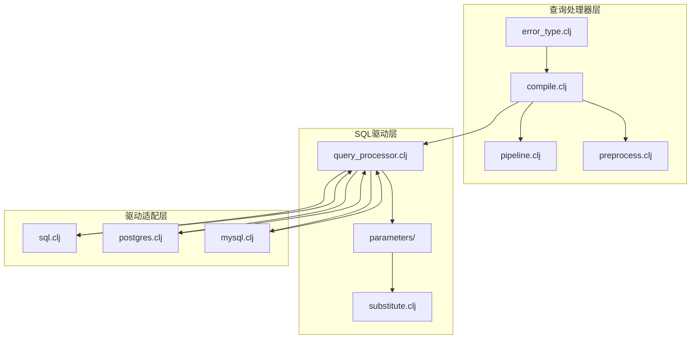
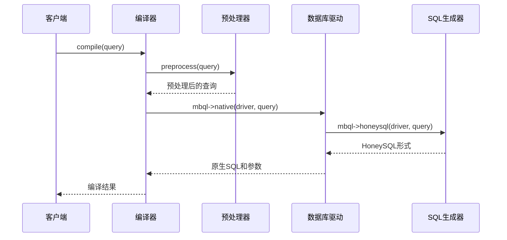
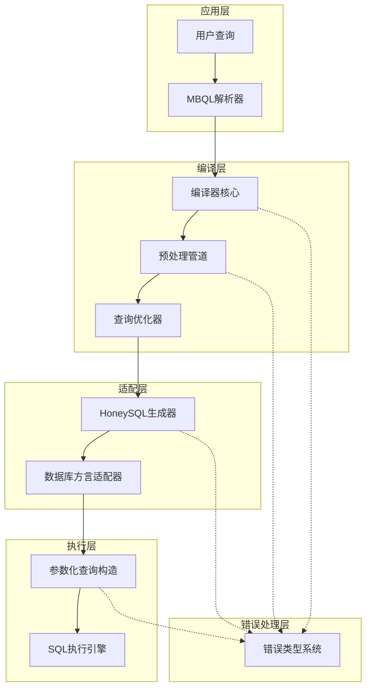
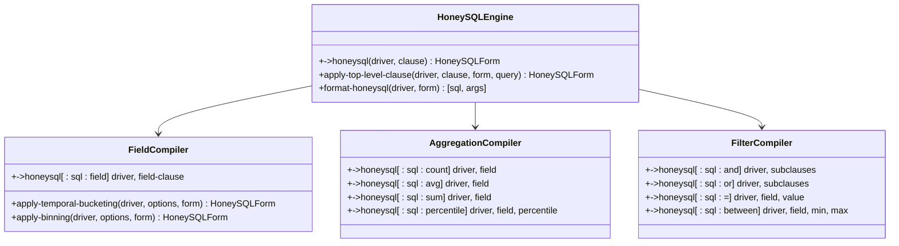
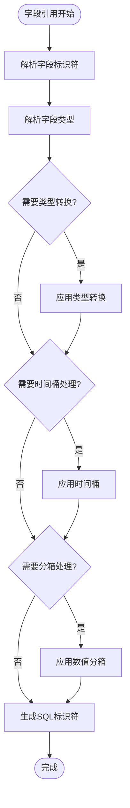
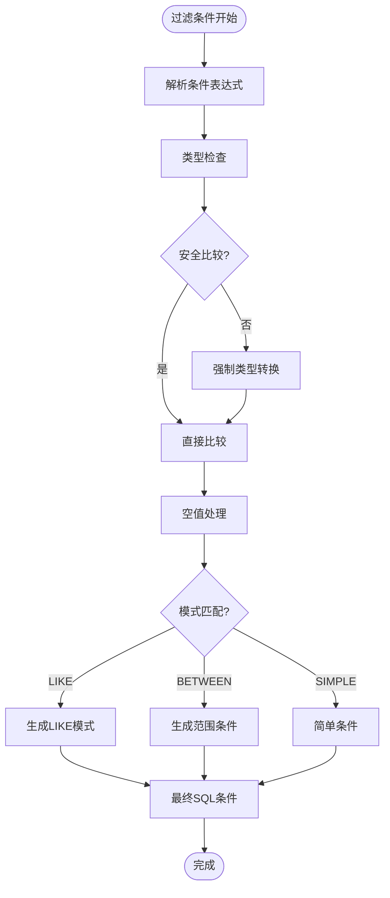
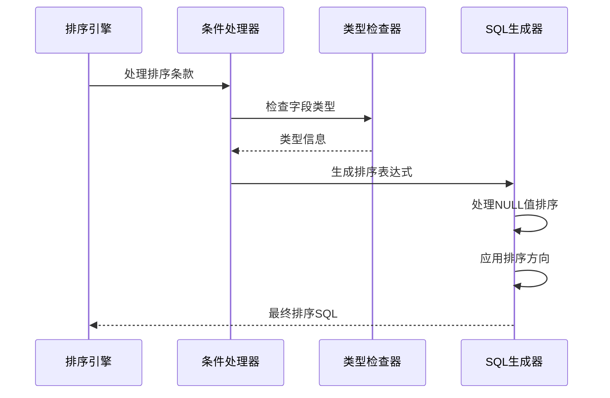
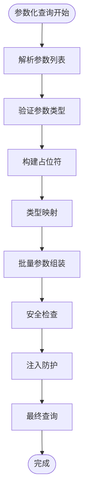
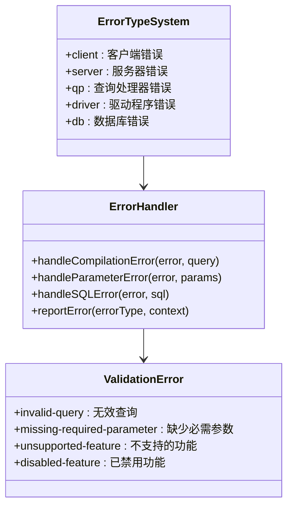
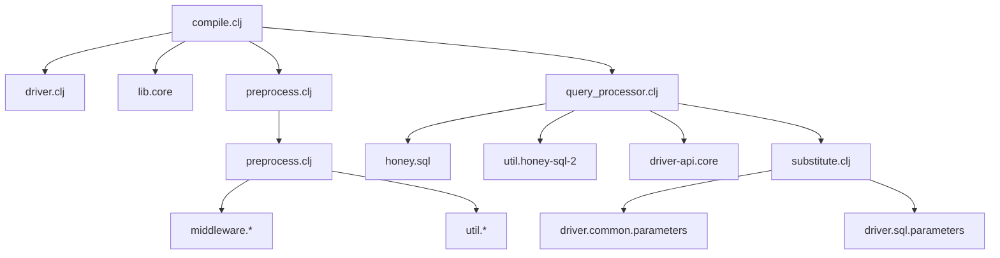

# 查询编译阶段

<cite>
**本文档中引用的文件**
- [compile.clj](file://src/metabase/query_processor/compile.clj)
- [pipeline.clj](file://src/metabase/query_processor/pipeline.clj)
- [query_processor.clj](file://src/metabase/driver/sql/query_processor.clj)
- [preprocess.clj](file://src/metabase/query_processor/preprocess.clj)
- [error_type.clj](file://src/metabase/query_processor/error_type.clj)
- [substitute.clj](file://src/metabase/driver/sql/parameters/substitute.clj)
</cite>

## 目录
1. [简介](#简介)
2. [项目结构概览](#项目结构概览)
3. [核心组件分析](#核心组件分析)
4. [架构概览](#架构概览)
5. [详细组件分析](#详细组件分析)
6. [依赖关系分析](#依赖关系分析)
7. [性能考虑](#性能考虑)
8. [故障排除指南](#故障排除指南)
9. [结论](#结论)

## 简介

Metabase的查询编译阶段是将用户定义的MBQL（Metabase Query Language）抽象语法树转换为目标数据库原生SQL语句的核心机制。这一过程涉及多个层次的转换和优化，确保查询在不同数据库系统间的兼容性和性能。

查询编译阶段主要包括以下关键功能：
- 将MBQL抽象语法树转换为HoneySQL形式
- 处理字段引用、聚合函数、过滤条件和排序规则
- 适配不同数据库方言的SQL生成
- 构造参数化查询以防止SQL注入
- 实现编译管道的执行流程和错误处理机制

## 项目结构概览

Metabase查询编译系统的文件组织结构体现了清晰的分层架构：

**图表来源**
- [compile.clj](file://src/metabase/query_processor/compile.clj#L1-L97)
- [query_processor.clj](file://src/metabase/driver/sql/query_processor.clj#L1-L50)

**章节来源**
- [compile.clj](file://src/metabase/query_processor/compile.clj#L1-L97)
- [query_processor.clj](file://src/metabase/driver/sql/query_processor.clj#L1-L2077)

## 核心组件分析

### 编译器核心（compile.clj）

编译器核心负责整个查询编译流程的协调和控制。主要功能包括：

1. **查询预处理**：调用预处理中间件链对原始查询进行标准化和优化
2. **编译执行**：根据查询类型选择合适的编译路径
3. **参数内联**：支持将参数直接内嵌到SQL语句中

**图表来源**
- [compile.clj](file://src/metabase/query_processor/compile.clj#L59-L80)
- [query_processor.clj](file://src/metabase/driver/sql/query_processor.clj#L2017-L2048)

### 预处理管道（preprocess.clj）

预处理管道实现了查询的多阶段转换，每个中间件负责特定的转换任务：

| 中间件名称 | 功能描述 | 执行顺序 |
|------------|----------|----------|
| normalize | 查询规范化和标准化 | 1 |
| validate | 查询语法和语义验证 | 2 |
| parameters | 参数值替换和绑定 | 3 |
| resolve-fields | 字段解析和引用解析 | 4 |
| expand-aggregations | 聚合函数展开 | 5 |
| desugar | 语法糖简化和转换 | 6 |

**章节来源**
- [preprocess.clj](file://src/metabase/query_processor/preprocess.clj#L40-L120)

## 架构概览

查询编译系统采用多层架构设计，确保了良好的可扩展性和维护性：

**图表来源**
- [compile.clj](file://src/metabase/query_processor/compile.clj#L32-L61)
- [query_processor.clj](file://src/metabase/driver/sql/query_processor.clj#L1856-L1881)

## 详细组件分析

### MBQL到HoneySQL转换

MBQL到HoneySQL的转换是编译过程的核心环节，通过多态方法实现：

**图表来源**
- [query_processor.clj](file://src/metabase/driver/sql/query_processor.clj#L880-L942)
- [query_processor.clj](file://src/metabase/driver/sql/query_processor.clj#L922-L942)

### 字段引用处理

字段引用的处理涉及复杂的元数据解析和类型推断：

**图表来源**
- [query_processor.clj](file://src/metabase/driver/sql/query_processor.clj#L880-L920)

### 聚合函数处理

聚合函数的处理遵循严格的类型检查和优化规则：

| 聚合函数 | 支持的数据类型 | 特殊处理 |
|----------|----------------|----------|
| COUNT | 所有类型 | 支持DISTINCT |
| SUM | 数值类型 | 自动类型提升 |
| AVG | 数值类型 | 浮点数精度处理 |
| MIN/MAX | 所有可比较类型 | 类型兼容性检查 |
| PERCENTILE | 数值类型 | 百分位数计算 |
| STDDEV/VAR | 数值类型 | 统计函数优化 |

**章节来源**
- [query_processor.clj](file://src/metabase/driver/sql/query_processor.clj#L922-L942)

### 过滤条件处理

过滤条件的处理实现了复杂表达式的安全转换：

**图表来源**
- [query_processor.clj](file://src/metabase/driver/sql/query_processor.clj#L1550-L1650)

### 排序规则处理

排序规则的处理确保了查询结果的一致性和可预测性：

**图表来源**
- [query_processor.clj](file://src/metabase/driver/sql/query_processor.clj#L1750-L1770)

### 数据库方言适配

数据库方言适配通过多态方法实现，支持不同数据库的特殊语法：

| 数据库类型 | 特殊语法处理 | 示例 |
|------------|--------------|------|
| PostgreSQL | 窗口函数优化 | RANK() OVER (PARTITION BY ...) |
| MySQL | LIMIT子句 | LIMIT offset, count |
| Oracle | ROW_NUMBER() | ROW_NUMBER() OVER (...) |
| Snowflake | 时间戳处理 | TIMESTAMP_TRUNC() |
| BigQuery | JSON字段访问 | JSON_EXTRACT() |

**章节来源**
- [query_processor.clj](file://src/metabase/driver/sql/query_processor.clj#L547-L572)

### 参数化查询构造

参数化查询构造确保了SQL注入防护和性能优化：

**图表来源**
- [substitute.clj](file://src/metabase/driver/sql/parameters/substitute.clj#L87-L108)

**章节来源**
- [substitute.clj](file://src/metabase/driver/sql/parameters/substitute.clj#L1-L110)

### 编译管道执行流程

编译管道按照预定的顺序执行各个转换步骤：

**图表来源**
- [preprocess.clj](file://src/metabase/query_processor/preprocess.clj#L40-L120)

**章节来源**
- [preprocess.clj](file://src/metabase/query_processor/preprocess.clj#L1-L159)

### 错误处理机制

错误处理机制提供了多层次的异常捕获和报告：

**图表来源**
- [error_type.clj](file://src/metabase/query_processor/error_type.clj#L20-L111)

**章节来源**
- [error_type.clj](file://src/metabase/query_processor/error_type.clj#L1-L112)

## 依赖关系分析

查询编译系统的依赖关系体现了清晰的分层架构：

**图表来源**
- [compile.clj](file://src/metabase/query_processor/compile.clj#L1-L20)
- [query_processor.clj](file://src/metabase/driver/sql/query_processor.clj#L1-L30)

**章节来源**
- [compile.clj](file://src/metabase/query_processor/compile.clj#L1-L97)
- [query_processor.clj](file://src/metabase/driver/sql/query_processor.clj#L1-L2077)

## 性能考虑

查询编译系统在设计时充分考虑了性能优化：

1. **编译缓存**：避免重复编译相同的查询结构
2. **延迟求值**：只在需要时才进行复杂的转换
3. **批量处理**：合并相似的操作以减少开销
4. **索引优化**：利用数据库索引加速查询执行

## 故障排除指南

### 常见编译错误及解决方案

| 错误类型 | 症状 | 解决方案 |
|----------|------|----------|
| 字段未找到 | Unknown field reference | 检查字段名称和表结构 |
| 类型不匹配 | Type mismatch in comparison | 确认字段类型一致性 |
| 参数缺失 | Missing required parameter | 提供所有必需参数 |
| 功能不支持 | Unsupported feature | 使用替代方法或升级驱动 |

### SQL注入防护措施

1. **参数化查询**：所有用户输入都通过参数化处理
2. **类型验证**：严格验证参数类型和范围
3. **白名单机制**：只允许预定义的安全操作
4. **审计日志**：记录所有查询编译活动

**章节来源**
- [error_type.clj](file://src/metabase/query_processor/error_type.clj#L40-L90)

## 结论

Metabase的查询编译阶段是一个高度模块化和可扩展的系统，通过精心设计的分层架构实现了从MBQL到原生SQL的高效转换。该系统的主要优势包括：

1. **类型安全**：通过严格的类型检查确保查询正确性
2. **性能优化**：多层次的优化策略保证查询效率
3. **可扩展性**：模块化设计支持新数据库类型的快速集成
4. **安全性**：完善的参数化和注入防护机制
5. **可维护性**：清晰的代码结构便于维护和调试

这个编译系统为Metabase提供了强大的查询处理能力，使其能够支持多种数据库系统并保持良好的用户体验。