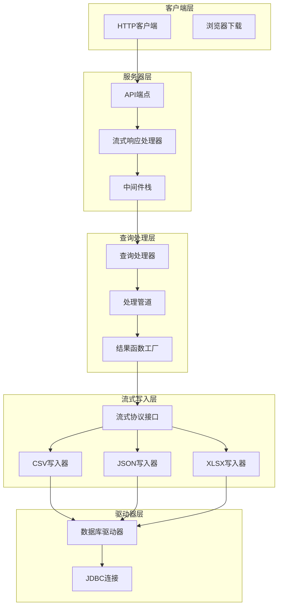
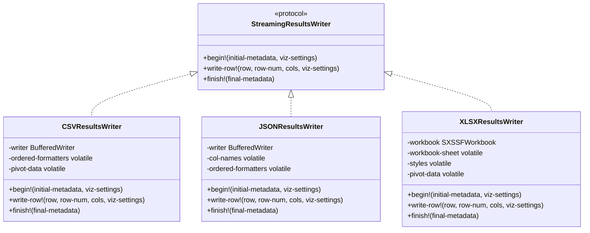
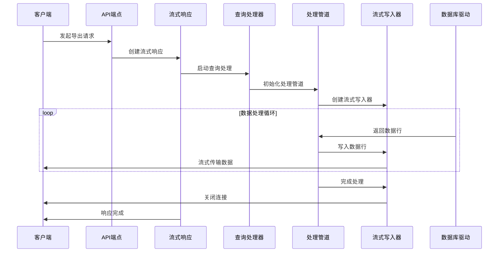
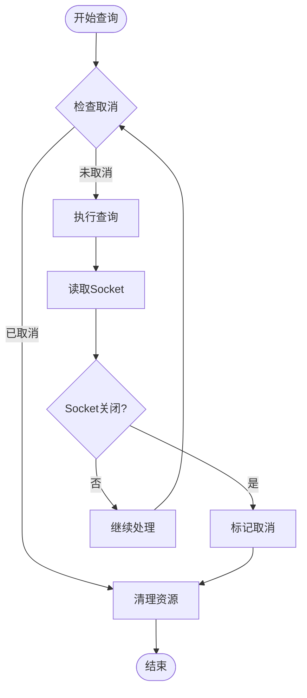

# 结果流式返回

<cite>
**本文档中引用的文件**
- [interface.clj](file://src/metabase/query_processor/streaming/interface.clj)
- [csv.clj](file://src/metabase/query_processor/streaming/csv.clj)
- [json.clj](file://src/metabase/query_processor/streaming/json.clj)
- [xlsx.clj](file://src/metabase/query_processor/streaming/xlsx.clj)
- [common.clj](file://src/metabase/query_processor/streaming/common.clj)
- [streaming.clj](file://src/metabase/query_processor/streaming.clj)
- [pipeline.clj](file://src/metabase/query_processor/pipeline.clj)
- [reducible.clj](file://src/metabase/query_processor/reducible.clj)
- [streaming_response.clj](file://src/metabase/server/streaming_response.clj)
- [api.clj](file://src/metabase/query_processor/api.clj)
</cite>

## 目录
1. [简介](#简介)
2. [系统架构概览](#系统架构概览)
3. [流式协议接口](#流式协议接口)
4. [格式化实现](#格式化实现)
5. [核心组件分析](#核心组件分析)
6. [内存控制与分块传输](#内存控制与分块传输)
7. [客户端断点续传支持](#客户端断点续传支持)
8. [性能优化策略](#性能优化策略)
9. [故障排除指南](#故障排除指南)
10. [总结](#总结)

## 简介

Metabase的查询结果流式处理机制是一个高度优化的数据传输系统，专门设计用于处理大规模数据集的高效传输。该系统通过流式协议、多格式支持和智能内存管理，实现了在有限资源下处理海量数据的能力。

流式处理的核心优势包括：
- **内存效率**：避免将整个结果集加载到内存中
- **实时传输**：数据生成的同时即可开始传输
- **断点续传**：支持客户端中断后的恢复
- **格式多样性**：支持CSV、JSON、XLSX等多种导出格式

## 系统架构概览

流式处理系统采用分层架构设计，从底层的驱动器到上层的HTTP响应处理，形成了完整的数据流管道。

**图表来源**
- [api.clj](file://src/metabase/query_processor/api.clj#L1-L50)
- [streaming_response.clj](file://src/metabase/server/streaming_response.clj#L1-L50)
- [pipeline.clj](file://src/metabase/query_processor/pipeline.clj#L1-L50)

## 流式协议接口

### 核心协议定义

流式协议通过`StreamingResultsWriter`协议定义了统一的写入接口，确保不同格式的写入器具有一致的行为模式。

**图表来源**
- [interface.clj](file://src/metabase/query_processor/streaming/interface.clj#L15-L32)
- [csv.clj](file://src/metabase/query_processor/streaming/csv.clj#L60-L120)
- [json.clj](file://src/metabase/query_processor/streaming/json.clj#L40-L80)
- [xlsx.clj](file://src/metabase/query_processor/streaming/xlsx.clj#L400-L500)

### 协议方法详解

#### begin! 方法
初始化阶段，准备写入环境和元数据：

- **参数**：`initial-metadata`（初始元数据）、`viz-settings`（可视化设置）
- **功能**：设置列标题、创建格式化器、初始化输出流
- **实现**：根据导出格式调用相应的初始化逻辑

#### write-row! 方法  
逐行写入数据：

- **参数**：`row`（行数据）、`row-num`（行号）、`cols`（列信息）、`viz-settings`（可视化设置）
- **功能**：格式化数据、应用样式、写入输出流
- **实现**：支持增量写入和批量处理

#### finish! 方法
清理阶段，完成输出：

- **参数**：`final-metadata`（最终元数据）
- **功能**：关闭输出流、释放资源、生成最终报告
- **实现**：确保所有缓冲数据被正确写入并关闭连接

**章节来源**
- [interface.clj](file://src/metabase/query_processor/streaming/interface.clj#L15-L32)

## 格式化实现

### CSV格式实现

CSV格式是最基础也是最高效的流式导出格式，特别适合大数据量场景。

#### 关键特性
- **自定义CSV写入器**：优化的quote处理和字符转义
- **内存优化**：使用BufferedWriter减少I/O操作
- **格式化支持**：支持货币、日期、数字等各种格式
- **透视表处理**：特殊处理透视查询结果

#### 性能优化
- **延迟格式化**：仅在需要时进行格式转换
- **批量写入**：累积一定行数后批量写入磁盘
- **内存控制**：透视表数据在内存中累积，完成后一次性写入

### JSON格式实现

JSON格式提供结构化的数据导出，支持API和纯JSON两种模式。

#### 实现特点
- **流式JSON生成**：使用Jackson库的流式API
- **双重编码策略**：混合Cheshire和Jackson的优化方案
- **类型安全**：保持数据类型的准确性
- **API兼容性**：支持标准API响应格式

#### 技术挑战与解决方案
- **内存泄漏风险**：避免过度刷新导致的性能问题
- **格式一致性**：确保导出格式与API格式的一致性
- **大对象处理**：优化复杂对象的序列化过程

### XLSX格式实现

XLSX格式是最复杂的导出格式，需要处理Excel特有的格式和样式。

#### 核心技术
- **Apache POI集成**：使用SXSSFWorkbook处理大数据量
- **样式管理**：动态计算和应用单元格样式
- **自动调整**：根据内容自动调整列宽
- **透视支持**：完整的透视表导出功能

#### 内存管理策略
- **流式工作簿**：SXSSFWorkbook的流式写入能力
- **样式缓存**：格式化样式的内存缓存
- **延迟计算**：样式计算的延迟执行

**章节来源**
- [csv.clj](file://src/metabase/query_processor/streaming/csv.clj#L1-L156)
- [json.clj](file://src/metabase/query_processor/streaming/json.clj#L1-L155)
- [xlsx.clj](file://src/metabase/query_processor/streaming/xlsx.clj#L1-L757)

## 核心组件分析

### 查询处理器管道

查询处理器管道是流式处理的核心调度器，负责协调整个数据流的生命周期。

**图表来源**
- [pipeline.clj](file://src/metabase/query_processor/pipeline.clj#L85-L130)
- [streaming.clj](file://src/metabase/query_processor/streaming.clj#L195-L230)

### 结果函数工厂（RFF）

结果函数工厂是流式处理的关键抽象，它创建了能够处理流式数据的缩减函数。

#### 工厂模式实现
- **动态创建**：根据导出格式动态选择写入器
- **状态管理**：维护行计数和状态信息
- **错误处理**：统一的异常处理机制

#### 执行流程
1. **初始化阶段**：创建写入器和状态变量
2. **处理阶段**：逐行处理和写入数据
3. **完成阶段**：清理资源和返回最终结果

### 中间件栈

流式处理通过中间件栈实现功能的模块化和可扩展性。

#### 核心中间件
- **约束中间件**：限制结果大小和行数
- **权限中间件**：验证用户访问权限
- **格式化中间件**：应用可视化设置
- **缓存中间件**：智能缓存机制

**章节来源**
- [pipeline.clj](file://src/metabase/query_processor/pipeline.clj#L1-L130)
- [streaming.clj](file://src/metabase/query_processor/streaming.clj#L150-L200)

## 内存控制与分块传输

### 内存管理策略

流式处理系统采用多层次的内存管理策略，确保在处理大数据集时不会耗尽系统资源。

#### 分层内存控制
1. **流式写入层**：直接写入输出流，不缓存数据
2. **缓冲管理层**：小规模缓冲提升性能
3. **临时存储层**：透视表等特殊情况的内存缓存

#### 内存监控指标
- **堆内存使用率**：监控JVM堆内存使用情况
- **GC压力**：跟踪垃圾回收频率和耗时
- **网络缓冲区**：控制网络层面的内存占用

### 分块传输机制

#### 自适应分块策略
- **动态大小调整**：根据数据特征调整分块大小
- **背压处理**：根据客户端接收能力调整发送速度
- **优先级队列**：重要数据优先传输

#### 传输优化
- **压缩支持**：GZIP压缩减少传输时间
- **并发控制**：限制同时处理的请求数量
- **超时管理**：防止长时间空闲连接

**章节来源**
- [streaming_response.clj](file://src/metabase/server/streaming_response.clj#L100-L200)

## 客户端断点续传支持

### 取消检测机制

系统实现了完善的取消检测机制，能够在客户端断开连接时优雅地终止处理。

**图表来源**
- [streaming_response.clj](file://src/metabase/server/streaming_response.clj#L150-L200)

### 断点续传实现

#### 连接状态监控
- **心跳检测**：定期检查连接状态
- **异常捕获**：捕获网络异常和超时
- **优雅关闭**：确保资源正确释放

#### 错误恢复策略
- **重试机制**：对临时错误进行重试
- **降级处理**：在资源不足时降低质量
- **进度保存**：记录处理进度以便恢复

**章节来源**
- [streaming_response.clj](file://src/metabase/server/streaming_response.clj#L120-L180)

## 性能优化策略

### 查询优化

#### 并行处理
- **多线程执行**：利用多核CPU并行处理
- **异步I/O**：非阻塞的网络和磁盘操作
- **连接池管理**：优化数据库连接使用

#### 缓存策略
- **结果缓存**：缓存频繁查询的结果
- **元数据缓存**：缓存表结构和字段信息
- **格式化缓存**：缓存格式化器实例

### 传输优化

#### 网络优化
- **TCP优化**：调整TCP缓冲区大小
- **HTTP/2支持**：利用多路复用特性
- **CDN集成**：分布式内容分发

#### 压缩算法
- **GZIP压缩**：通用的压缩算法
- **Brotli压缩**：更高效的现代压缩
- **自定义格式**：针对特定数据的优化格式

### 内存优化

#### 对象池化
- **缓冲区池**：重用字节缓冲区
- **格式化器池**：重用格式化器实例
- **连接池**：重用数据库连接

#### 垃圾回收优化
- **对象分配最小化**：减少临时对象创建
- **弱引用使用**：避免内存泄漏
- **及时释放**：主动释放不再需要的对象

**章节来源**
- [reducible.clj](file://src/metabase/query_processor/reducible.clj#L1-L38)

## 故障排除指南

### 常见问题诊断

#### 内存溢出问题
**症状**：OutOfMemoryError异常
**原因**：大数据集处理时内存不足
**解决方案**：
- 调整JVM堆内存大小
- 优化查询条件减少数据量
- 使用分页查询替代全量导出

#### 网络超时问题
**症状**：连接超时或传输中断
**原因**：网络不稳定或数据量过大
**解决方案**：
- 增加网络超时时间
- 启用断点续传功能
- 优化网络配置

#### 格式化错误
**症状**：导出文件格式不正确
**原因**：数据类型不匹配或格式设置错误
**解决方案**：
- 检查数据类型映射
- 验证格式化设置
- 使用默认格式重新导出

### 性能监控

#### 关键指标
- **处理时间**：从查询开始到完成的时间
- **内存使用**：峰值内存和平均内存使用
- **网络吞吐**：数据传输速率
- **错误率**：失败请求的比例

#### 监控工具
- **JVM监控**：Heap使用、GC频率
- **网络监控**：带宽使用、连接数
- **应用监控**：请求响应时间、成功率

**章节来源**
- [streaming_response.clj](file://src/metabase/server/streaming_response.clj#L50-L100)

## 总结

Metabase的查询结果流式处理机制是一个精心设计的高性能系统，通过以下关键特性实现了大规模数据集的高效传输：

### 核心优势
1. **架构灵活性**：模块化设计支持多种格式和扩展
2. **内存效率**：流式处理避免内存溢出
3. **性能优化**：多层次优化策略提升处理速度
4. **可靠性保障**：完善的错误处理和恢复机制

### 技术创新
- **协议抽象**：统一的流式协议简化了多种格式的支持
- **智能缓存**：基于使用模式的智能缓存策略
- **自适应优化**：根据数据特征动态调整处理策略

### 应用价值
该系统不仅满足了当前的大数据分析需求，还为未来的扩展奠定了坚实的基础。通过持续的优化和改进，它将继续为用户提供快速、可靠、高效的查询结果导出服务。