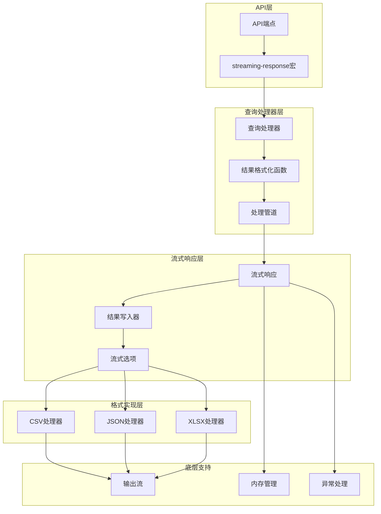
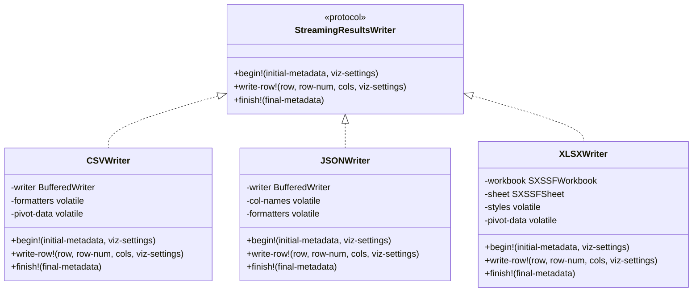
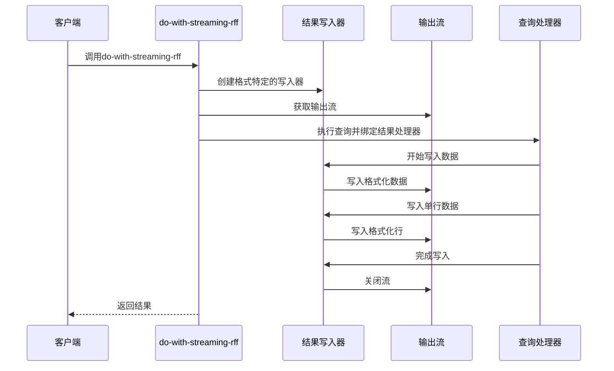
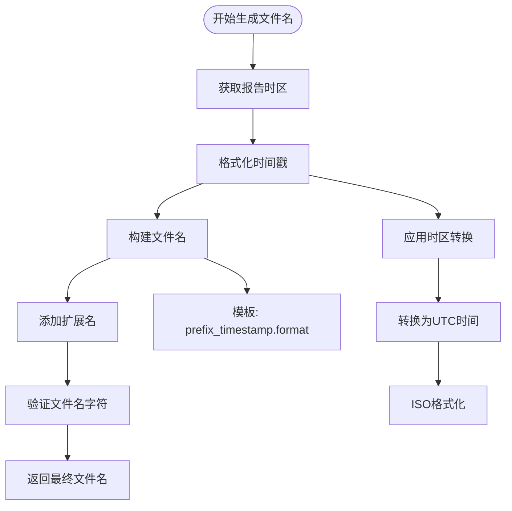
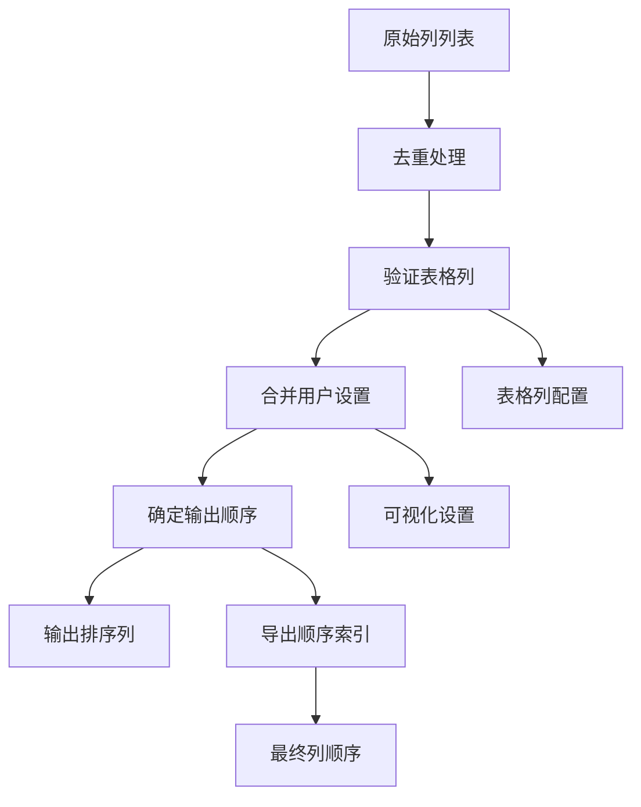
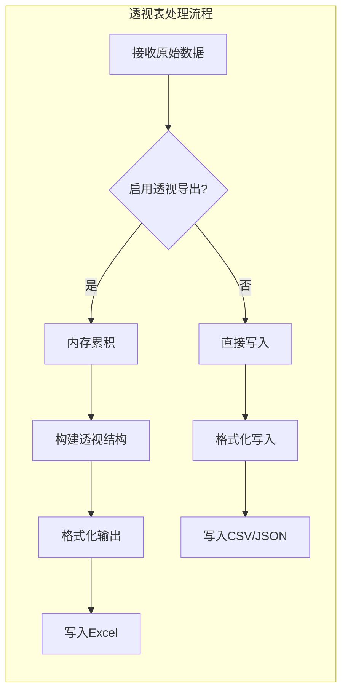
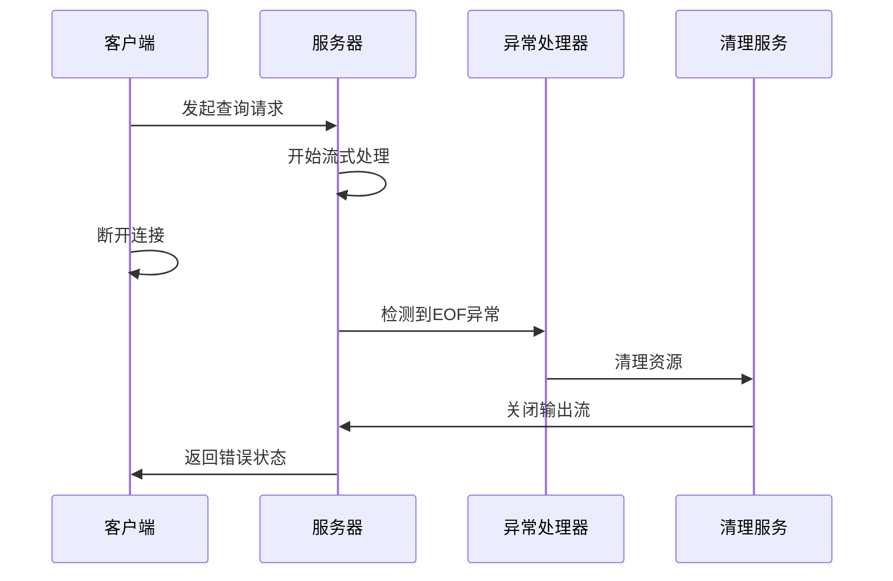
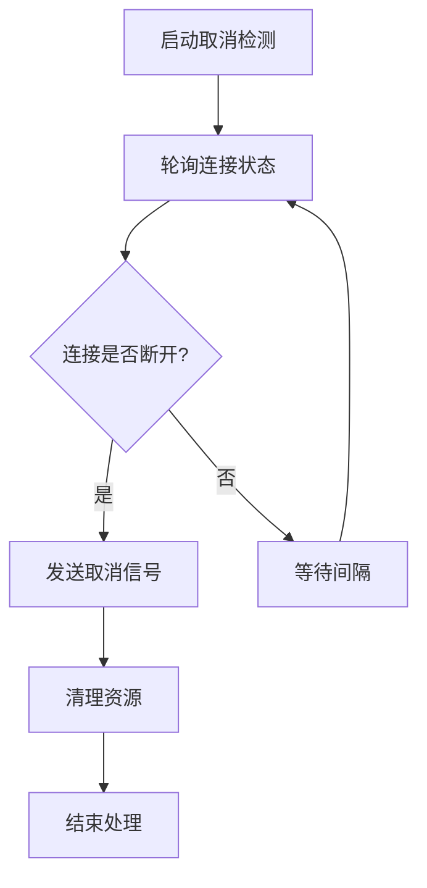

# 流式输出支持

<cite>
**本文档中引用的文件**
- [streaming.clj](file://src/metabase/query_processor/streaming.clj)
- [interface.clj](file://src/metabase/query_processor/streaming/interface.clj)
- [common.clj](file://src/metabase/query_processor/streaming/common.clj)
- [csv.clj](file://src/metabase/query_processor/streaming/csv.clj)
- [xlsx.clj](file://src/metabase/query_processor/streaming/xlsx.clj)
- [json.clj](file://src/metabase/query_processor/streaming/json.clj)
- [streaming_response.clj](file://src/metabase/server/streaming_response.clj)
- [api.clj](file://src/metabase/query_processor/api.clj)
- [card.clj](file://src/metabase/query_processor/card.clj)
- [public_sharing_rest/api.clj](file://src/metabase/public_sharing_rest/api.clj)
</cite>

## 目录
1. [简介](#简介)
2. [系统架构](#系统架构)
3. [核心组件](#核心组件)
4. [格式实现](#格式实现)
5. [使用方式](#使用方式)
6. [文件名生成](#文件名生成)
7. [列顺序控制](#列顺序控制)
8. [内存管理](#内存管理)
9. [异常处理](#异常处理)
10. [最佳实践](#最佳实践)

## 简介

Metabase的流式输出支持模块提供了高效的数据导出功能，支持多种格式（CSV、JSON、XLSX）的流式响应生成。该系统通过分层架构设计，实现了统一的接口规范和差异化处理，确保大数据量查询结果能够以流式方式高效传输给客户端。

## 系统架构



**图表来源**
- [streaming.clj](file://src/metabase/query_processor/streaming.clj#L1-L32)
- [streaming_response.clj](file://src/metabase/server/streaming_response.clj#L1-L40)

## 核心组件

### StreamingResultsWriter协议

所有格式实现都遵循`StreamingResultsWriter`协议，提供统一的接口规范：



**图表来源**
- [interface.clj](file://src/metabase/query_processor/streaming/interface.clj#L10-L30)
- [csv.clj](file://src/metabase/query_processor/streaming/csv.clj#L80-L155)
- [json.clj](file://src/metabase/query_processor/streaming/json.clj#L30-L154)
- [xlsx.clj](file://src/metabase/query_processor/streaming/xlsx.clj#L640-L756)

### do-with-streaming-rff函数

`do-with-streaming-rff`是绑定输出流与结果写入器的核心函数：



**图表来源**
- [streaming.clj](file://src/metabase/query_processor/streaming.clj#L195-L229)

**章节来源**
- [streaming.clj](file://src/metabase/query_processor/streaming.clj#L195-L229)
- [interface.clj](file://src/metabase/query_processor/streaming/interface.clj#L10-L30)

## 格式实现

### CSV格式实现

CSV格式实现提供了高效的文本数据导出功能：

| 特性 | 实现细节 | 性能考虑 |
|------|----------|----------|
| 字符编码 | UTF-8编码 | 避免字符集转换开销 |
| 引号处理 | 自定义quote?谓词 | 减少不必要的字符串操作 |
| 格式化 | 延迟格式化器 | 使用memoize优化重复列格式化 |
| 分区处理 | 支持透视表导出 | 内存中累积后批量写入 |
| 缓冲 | BufferedWriter包装 | 提高I/O性能 |

### JSON格式实现

JSON格式实现支持两种模式：完整API响应和简化数据数组：

| 模式 | 输出结构 | 用途 |
|------|----------|------|
| :api | 包含元数据的完整响应 | Web界面显示 |
| :json | 纯数据数组 | 数据交换和程序消费 |

### XLSX格式实现

XLSX格式实现是最复杂的实现，支持丰富的格式化功能：

| 功能 | 实现方式 | 技术特点 |
|------|----------|----------|
| 工作簿管理 | SXSSFWorkbook | 流式工作簿，避免内存溢出 |
| 样式系统 | 多层次样式计算 | 支持条件格式化和单元格样式 |
| 透视表 | 内存中处理 | 先在内存构建透视结构再写入 |
| 自动调整 | 列宽自动计算 | 基于内容长度动态调整 |
| 单元格类型 | 多态单元格设置 | 支持数值、日期、文本等多种类型 |

**章节来源**
- [csv.clj](file://src/metabase/query_processor/streaming/csv.clj#L80-L155)
- [json.clj](file://src/metabase/query_processor/streaming/json.clj#L30-L154)
- [xlsx.clj](file://src/metabase/query_processor/streaming/xlsx.clj#L640-L756)

## 使用方式

### streaming-response宏

`streaming-response`宏是主要的使用入口，提供简洁的API：

```clojure
(api.macros/defendpoint :get "/query" []
  (qp.streaming/streaming-response [rff :csv]
    (qp/process-query (qp/userland-query-with-default-constraints query) rff)))
```

### do-with-streaming-rff函数

对于需要更细粒度控制的场景，可以使用`do-with-streaming-rff`：

```clojure
(with-open [os ...]
  (qp.streaming/do-with-streaming-rff
   :csv os
   (fn [rff]
     (qp/process-query query rff))))
```

### 参数说明

| 参数 | 类型 | 描述 | 必需 |
|------|------|------|------|
| map-binding | 变量名 | RFF绑定变量名 | 是 |
| export-format | :keyword | 导出格式(:csv/:json/:xlsx) | 是 |
| filename-prefix | string | 文件名前缀 | 否 |

**章节来源**
- [streaming.clj](file://src/metabase/query_processor/streaming.clj#L249-L264)
- [api.clj](file://src/metabase/query_processor/api.clj#L79-L85)

## 文件名生成

系统自动生成符合标准的文件名，包含时间戳确保唯一性：



**图表来源**
- [common.clj](file://src/metabase/query_processor/streaming/common.clj#L15-L25)

### 文件名规则

| 组件 | 规则 | 示例 |
|------|------|------|
| 前缀 | 用户提供的或默认值 | "query_result" |
| 时间戳 | 当前时间，时区感知 | "2024-01-15T10:30:45Z" |
| 扩展名 | 格式对应的扩展名 | ".csv", ".json", ".xlsx" |
| 字符限制 | 最大200字符 | 防止文件系统限制 |

**章节来源**
- [common.clj](file://src/metabase/query_processor/streaming/common.clj#L15-L25)

## 列顺序控制

系统支持灵活的列顺序控制，基于可视化设置和用户偏好：



**图表来源**
- [streaming.clj](file://src/metabase/query_processor/streaming.clj#L60-L120)

### 排序逻辑

| 步骤 | 处理内容 | 实现位置 |
|------|----------|----------|
| 1. 去重 | 处理同名列冲突 | `deduplicate-col-names` |
| 2. 验证 | 确保列存在性 | `validate-table-columns` |
| 3. 合并 | 应用用户设置 | `not-explicitly-excluded-columns` |
| 4. 排序 | 生成输出顺序 | `export-column-order` |

**章节来源**
- [streaming.clj](file://src/metabase/query_processor/streaming.clj#L60-L120)

## 内存管理

系统采用多种策略优化内存使用：

### 流式处理策略

| 格式 | 内存策略 | 适用场景 |
|------|----------|----------|
| CSV | 行级写入，无缓存 | 大数据量，简单结构 |
| JSON | 数组级写入，流式输出 | 中等大小数据 |
| XLSX | 工作簿级别管理 | 复杂格式，小到中等数据 |

### 透视表优化



**图表来源**
- [csv.clj](file://src/metabase/query_processor/streaming/csv.clj#L120-L155)
- [xlsx.clj](file://src/metabase/query_processor/streaming/xlsx.clj#L700-L756)

### 内存监控

系统提供内存使用监控机制，防止内存溢出：

| 监控指标 | 阈值检查 | 处理策略 |
|----------|----------|----------|
| 行数限制 | 自动调整阈值 | 动态调整列宽计算时机 |
| 缓冲区大小 | 流式写入 | 避免大对象缓存 |
| 对象生命周期 | 及时释放 | 显式关闭资源 |

**章节来源**
- [csv.clj](file://src/metabase/query_processor/streaming/csv.clj#L120-L155)
- [xlsx.clj](file://src/metabase/query_processor/streaming/xlsx.clj#L700-L756)

## 异常处理

系统实现了完善的异常处理机制，确保客户端断开连接时的正确清理：



**图表来源**
- [streaming_response.clj](file://src/metabase/server/streaming_response.clj#L80-L100)

### 异常类型处理

| 异常类型 | 处理策略 | 实现位置 |
|----------|----------|----------|
| EofException | 记录日志，优雅退出 | `write-error!` |
| InterruptedException | 设置取消标志 | 取消循环检测 |
| SocketException | 标记连接断开 | 连接状态检查 |
| 其他异常 | 标准错误响应 | `write-error!` |

### 取消机制

系统提供异步取消机制，定期检查客户端连接状态：



**图表来源**
- [streaming_response.clj](file://src/metabase/server/streaming_response.clj#L180-L220)

**章节来源**
- [streaming_response.clj](file://src/metabase/server/streaming_response.clj#L60-L100)
- [streaming_response.clj](file://src/metabase/server/streaming_response.clj#L180-L220)

## 最佳实践

### 性能优化建议

1. **选择合适的格式**
   - 小数据量：优先使用JSON格式
   - 大数据量：使用CSV格式
   - 需要格式化：使用XLSX格式

2. **内存使用优化**
   - 控制并发请求数量
   - 监控内存使用情况
   - 及时释放资源

3. **网络传输优化**
   - 启用GZIP压缩
   - 使用流式传输
   - 避免大对象缓存

### 错误处理最佳实践

1. **客户端异常处理**
   ```clojure
   (try
     (qp.streaming/streaming-response [rff :csv]
       (qp/process-query query rff))
     (catch EofException e
       (log/warn "客户端提前断开连接")
       {:status :client-disconnected}))
   ```

2. **服务器端资源清理**
   ```clojure
   (finally
     (u/ignore-exceptions
       (.flush os)
       (.close os)))
   ```

### 监控和调试

1. **日志记录**
   - 记录查询执行时间
   - 监控内存使用情况
   - 跟踪异常发生频率

2. **性能指标**
   - 响应时间分布
   - 内存峰值使用
   - 并发请求数量

**章节来源**
- [streaming.clj](file://src/metabase/query_processor/streaming.clj#L249-L264)
- [streaming_response.clj](file://src/metabase/server/streaming_response.clj#L60-L100)