# 结果后处理与格式化

<cite>
**本文档中引用的文件**
- [postprocess.clj](file://src/metabase/query_processor/postprocess.clj)
- [pivot.clj](file://src/metabase/query_processor/pivot.clj)
- [streaming.clj](file://src/metabase/query_processor/streaming.clj)
- [format_rows.clj](file://src/metabase/query_processor/middleware/format_rows.clj)
- [csv.clj](file://src/metabase/query_processor/streaming/csv.clj)
- [json.clj](file://src/metabase/query_processor/streaming/json.clj)
- [xlsx.clj](file://src/metabase/query_processor/streaming/xlsx.clj)
- [impl.clj](file://src/metabase/formatter/impl.clj)
- [postprocess.clj](file://src/metabase/query_processor/pivot/postprocess.clj)
</cite>

## 目录
1. [简介](#简介)
2. [系统架构概览](#系统架构概览)
3. [后处理中间件系统](#后处理中间件系统)
4. [行列格式化机制](#行列格式化机制)
5. [透视表生成与处理](#透视表生成与处理)
6. [流式输出格式化](#流式输出格式化)
7. [性能优化策略](#性能优化策略)
8. [内存管理策略](#内存管理策略)
9. [故障排除指南](#故障排除指南)
10. [总结](#总结)

## 简介

Metabase的结果后处理与格式化系统是一个复杂而精密的数据转换管道，负责将原始查询结果转换为用户友好的格式。该系统包含三个核心模块：`postprocess`（后处理）、`pivot`（透视表）和`streaming`（流式输出），每个模块都承担着特定的数据转换职责。

系统的设计理念是模块化和可扩展性，通过中间件模式实现了灵活的数据处理流程。无论是简单的行列格式化还是复杂的透视表生成，系统都能提供高效且准确的转换服务。

## 系统架构概览

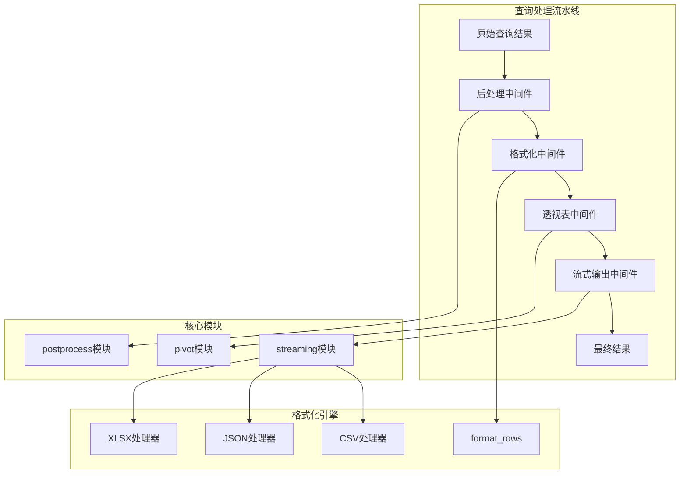

**图表来源**
- [postprocess.clj](file://src/metabase/query_processor/postprocess.clj#L1-L66)
- [streaming.clj](file://src/metabase/query_processor/streaming.clj#L1-L266)

**章节来源**
- [postprocess.clj](file://src/metabase/query_processor/postprocess.clj#L1-L66)
- [streaming.clj](file://src/metabase/query_processor/streaming/streaming.clj#L1-L266)

## 后处理中间件系统

后处理中间件系统是整个数据转换管道的核心入口点，它定义了一个标准化的中间件链来处理查询结果。

### 中间件架构设计

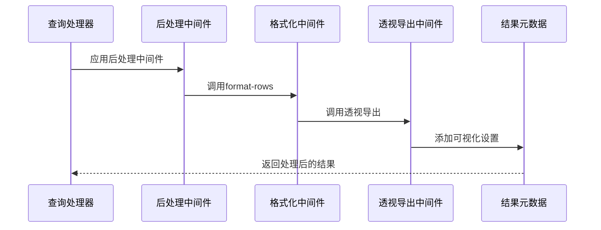

**图表来源**
- [postprocess.clj](file://src/metabase/query_processor/postprocess.clj#L30-L66)

### 中间件执行顺序

后处理中间件按照严格的执行顺序排列，确保数据在每个阶段都能得到正确的处理：

1. **format-rows** - 基础格式化处理
2. **results-metadata** - 元数据记录
3. **limit** - 行数限制
4. **enterprise/limit-download** - 下载限制
5. **add-rows-truncated** - 截断标记
6. **add-timezone-info** - 时区信息
7. **enterprise/merge-sandboxing** - 沙箱合并
8. **add-remaps** - 字段重映射
9. **pivot-export** - 透视导出
10. **large-int** - 大整数处理
11. **visualization-settings** - 可视化设置
12. **cumulative-aggregations** - 累积聚合
13. **add-column-info** - 列信息添加
14. **add-dataset-info** - 数据集信息

**章节来源**
- [postprocess.clj](file://src/metabase/query_processor/postprocess.clj#L30-L66)

## 行列格式化机制

行列格式化是数据转换的基础层，负责将原始数据值转换为适合展示的格式。

### format_rows中间件实现

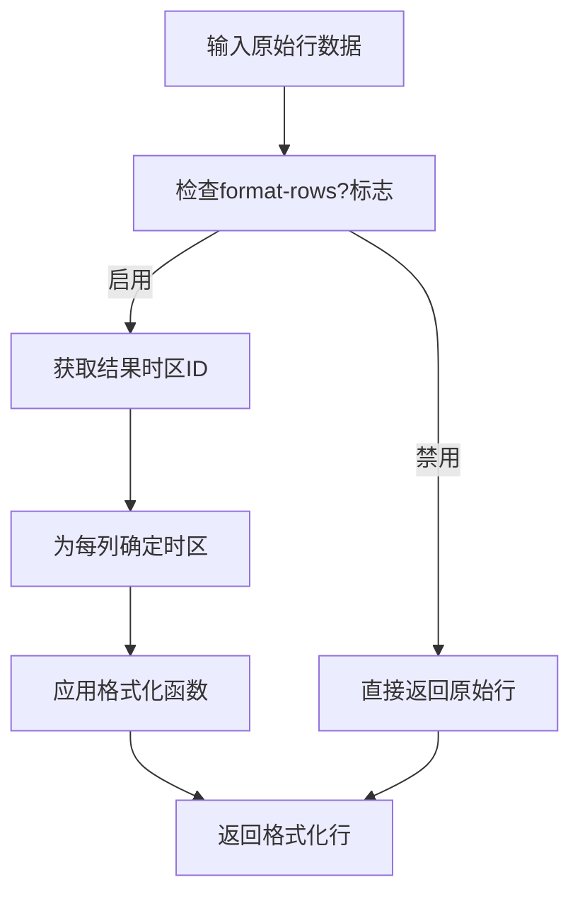

**图表来源**
- [format_rows.clj](file://src/metabase/query_processor/middleware/format_rows.clj#L60-L85)

### 支持的数据类型格式化

系统为多种Java时间类型提供了专门的格式化处理：

| 数据类型 | 格式化方式 | 输出示例 |
|---------|-----------|----------|
| `LocalDate` | ISO-8601日期格式 | `"2024-01-15"` |
| `LocalDateTime` | ISO-8601日期时间格式 | `"2024-01-15T10:30:00Z"` |
| `LocalTime` | ISO-8601时间格式 | `"10:30:00Z"` |
| `OffsetDateTime` | 带时区偏移的ISO格式 | `"2024-01-15T10:30:00+08:00"` |
| `Instant` | UTC时间戳格式 | `"2024-01-15T02:30:00Z"` |

### 格式化协议扩展

系统使用自定义协议来支持不同类型的格式化需求：

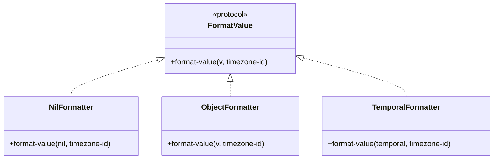

**图表来源**
- [format_rows.clj](file://src/metabase/query_processor/middleware/format_rows.clj#L15-L55)

**章节来源**
- [format_rows.clj](file://src/metabase/query_processor/middleware/format_rows.clj#L1-L86)

## 透视表生成与处理

透视表功能是Metabase的核心特性之一，它能够将扁平的查询结果转换为具有层次结构的表格形式。

### 透视表生成算法

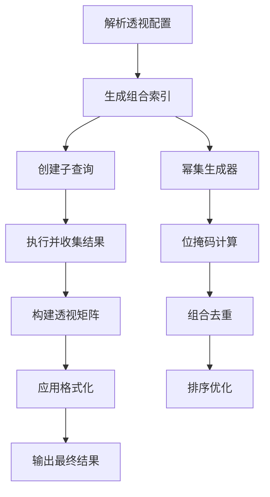

**图表来源**
- [pivot.clj](file://src/metabase/query_processor/pivot.clj#L209-L250)

### 子查询生成策略

透视表系统采用智能的子查询生成策略，通过位掩码技术优化查询效率：

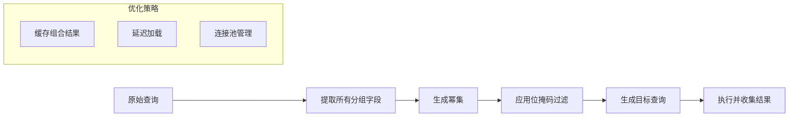

**图表来源**
- [pivot.clj](file://src/metabase/query_processor/pivot.clj#L107-L166)

### 透视数据处理流程

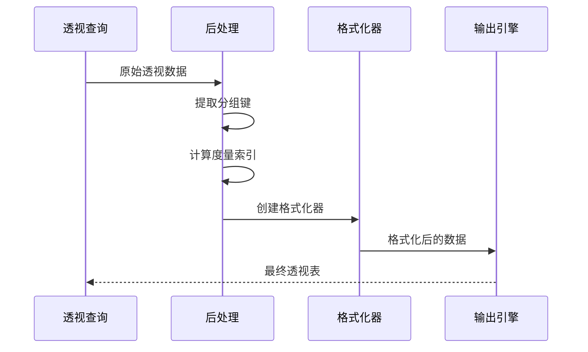

**图表来源**
- [postprocess.clj](file://src/metabase/query_processor/pivot/postprocess.clj#L180-L202)

**章节来源**
- [pivot.clj](file://src/metabase/query_processor/pivot.clj#L1-L639)
- [postprocess.clj](file://src/metabase/query_processor/pivot/postprocess.clj#L1-L202)

## 流式输出格式化

流式输出系统支持多种数据格式的实时导出，包括CSV、JSON和XLSX格式。

### 流式写入器架构

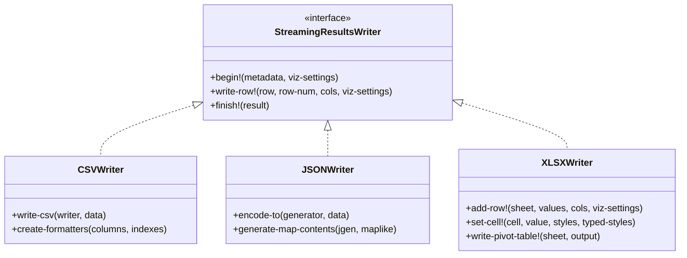

**图表来源**
- [csv.clj](file://src/metabase/query_processor/streaming/csv.clj#L70-L155)
- [json.clj](file://src/metabase/query_processor/streaming/json.clj#L40-L154)
- [xlsx.clj](file://src/metabase/query_processor/streaming/xlsx.clj#L600-L756)

### 格式化器工厂模式

系统采用工厂模式为不同列类型创建专用的格式化器：

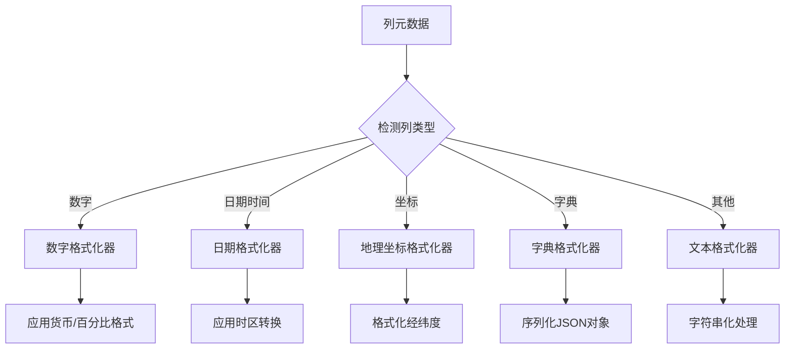

**图表来源**
- [impl.clj](file://src/metabase/formatter/impl.clj#L120-L199)

### 内容类型配置

| 格式 | MIME类型 | 文件扩展名 | 特殊配置 |
|------|----------|------------|----------|
| CSV | `text/csv` | `.csv` | UTF-8编码，逗号分隔符 |
| JSON | `application/json` | `.json` | 数组格式，流式输出 |
| XLSX | `application/vnd.openxmlformats-officedocument.spreadsheetml.sheet` | `.xlsx` | 工作簿格式，样式支持 |
| API | `application/json` | - | 完整响应格式 |

**章节来源**
- [streaming.clj](file://src/metabase/query_processor/streaming/streaming.clj#L1-L266)
- [csv.clj](file://src/metabase/query_processor/streaming/csv.clj#L1-L156)
- [json.clj](file://src/metabase/query_processor/streaming/json.clj#L1-L155)
- [xlsx.clj](file://src/metabase/query_processor/streaming/xlsx.clj#L1-L757)

## 性能优化策略

### 查询优化技术

系统采用多种策略来优化透视表查询的性能：

1. **幂集预计算**：预先计算所有可能的分组组合
2. **位掩码优化**：使用位运算快速识别分组关系
3. **查询去重**：避免重复的子查询执行
4. **连接池管理**：复用数据库连接减少开销

### 内存使用优化

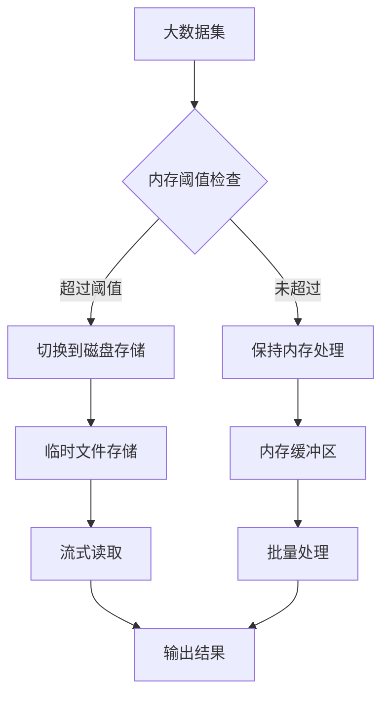

### 缓存策略

系统实现了多层缓存机制来提升性能：

- **格式化器缓存**：缓存已创建的格式化函数
- **查询结果缓存**：缓存子查询的结果
- **元数据缓存**：缓存列元数据和格式设置

**章节来源**
- [pivot.clj](file://src/metabase/query_processor/pivot.clj#L209-L250)

## 内存管理策略

### 流式处理机制

系统采用流式处理来控制内存使用：

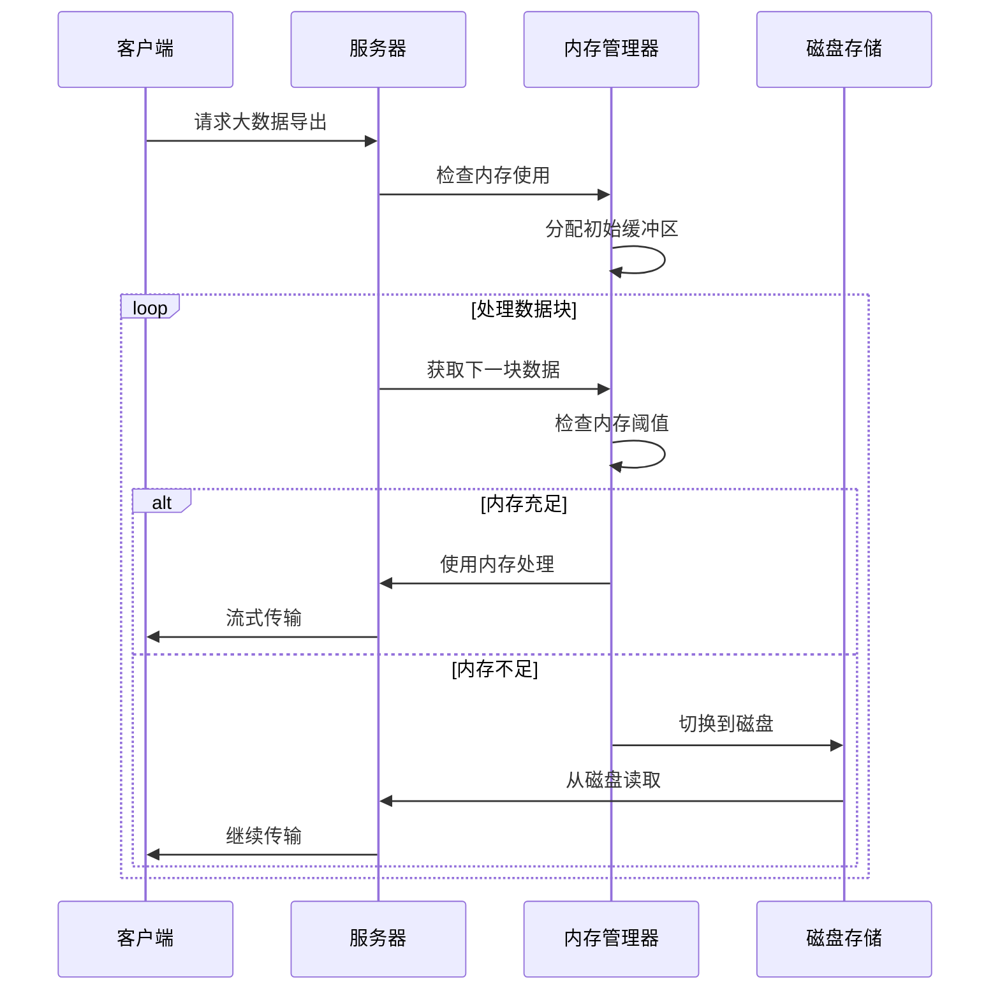

**图表来源**
- [temp_storage.clj](file://src/metabase/notification/payload/temp_storage.clj#L173-L319)

### 自动清理机制

系统实现了自动的资源清理机制：

1. **连接池清理**：定期释放空闲的数据库连接
2. **临时文件清理**：删除过期的临时文件
3. **内存泄漏防护**：监控内存使用情况并触发垃圾回收

### 阈值配置

| 操作类型 | 内存阈值 | 磁盘阈值 | 清理策略 |
|----------|----------|----------|----------|
| 透视表导出 | 100MB | 1GB | 分块处理 |
| 大数据集查询 | 50MB | 500MB | 流式输出 |
| 批量导入 | 200MB | 2GB | 分批处理 |

**章节来源**
- [temp_storage.clj](file://src/metabase/notification/payload/temp_storage.clj#L173-L319)

## 故障排除指南

### 常见问题诊断

#### 透视表性能问题

**症状**：透视表生成缓慢或内存溢出

**解决方案**：
1. 检查分组字段数量，减少不必要的分组
2. 优化查询条件，减少数据量
3. 调整内存阈值配置
4. 启用异步处理模式

#### 格式化错误

**症状**：数据格式化异常或显示错误

**解决方案**：
1. 验证列元数据完整性
2. 检查时区设置是否正确
3. 确认格式化器配置
4. 查看详细错误日志

#### 流式输出失败

**症状**：导出过程中断或文件损坏

**解决方案**：
1. 检查磁盘空间是否充足
2. 验证网络连接稳定性
3. 调整超时设置
4. 启用断点续传功能

### 性能监控指标

系统提供以下关键性能指标：

- **查询执行时间**：透视表子查询的平均执行时间
- **内存使用率**：处理过程中的内存占用情况
- **并发连接数**：数据库连接池的使用状态
- **错误率统计**：各类错误的发生频率

**章节来源**
- [pivot.clj](file://src/metabase/query_processor/pivot.clj#L209-L250)
- [streaming.clj](file://src/metabase/query_processor/streaming/streaming.clj#L195-L266)

## 总结

Metabase的结果后处理与格式化系统是一个高度优化的数据转换平台，通过模块化的设计和先进的算法实现了高效的数据处理能力。系统的主要优势包括：

1. **模块化架构**：清晰的职责分离和可扩展的中间件系统
2. **高性能处理**：优化的算法和智能的缓存策略
3. **内存安全**：完善的流式处理和自动清理机制
4. **格式丰富**：支持多种数据格式的实时导出
5. **可配置性强**：灵活的格式化选项和性能调优参数

该系统为Metabase提供了强大的数据处理能力，支撑了复杂查询结果的高效展示和导出需求。通过持续的优化和改进，系统能够应对日益增长的数据处理挑战，为用户提供优质的分析体验。