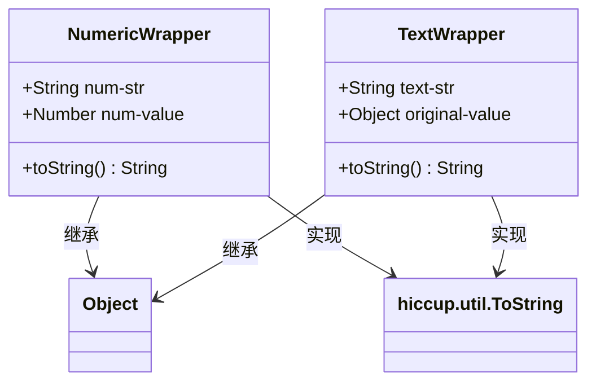
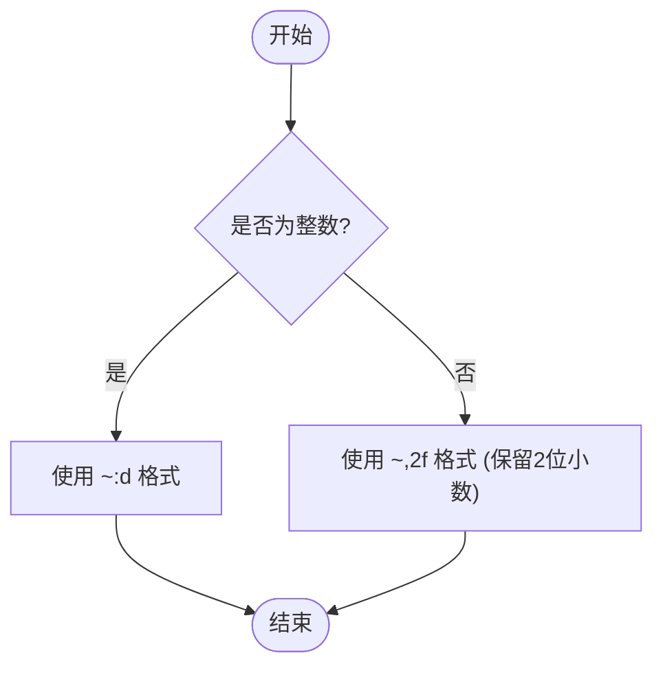
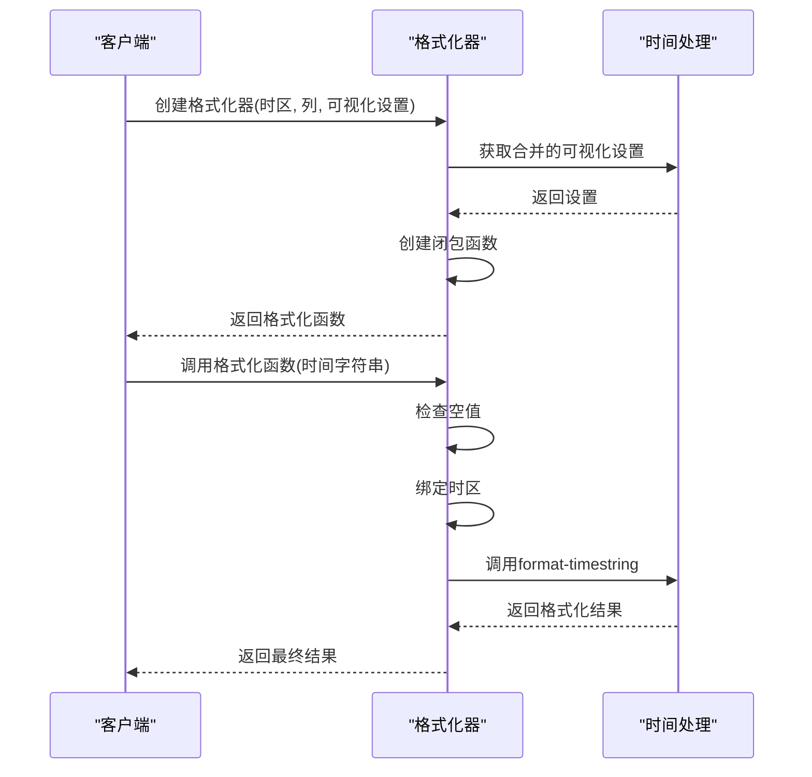
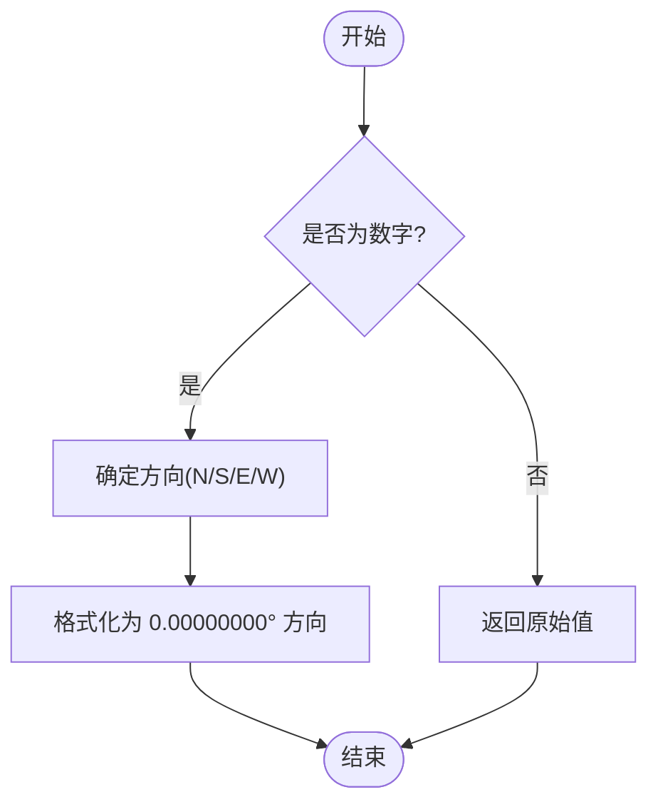
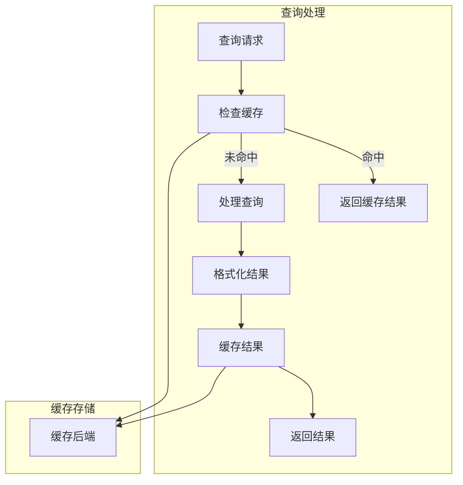

# 结果格式化规则

<cite>
**本文档中引用的文件**  
- [format_rows.clj](file://src/metabase/query_processor/middleware/format_rows.clj)
- [core.clj](file://src/metabase/formatter/core.clj)
- [impl.clj](file://src/metabase/formatter/impl.clj)
- [datetime.clj](file://src/metabase/formatter/datetime.clj)
- [constants.cljc](file://src/metabase/util/formatting/constants.cljc)
</cite>

## 目录
1. [简介](#简介)
2. [核心组件](#核心组件)
3. [格式化包装器机制](#格式化包装器机制)
4. [字段类型格式化规则](#字段类型格式化规则)
5. [性能影响与缓存策略](#性能影响与缓存策略)
6. [实际应用示例](#实际应用示例)
7. [结论](#结论)

## 简介
Metabase系统中的结果格式化功能通过`format_rows`中间件和`formatter.core`模块实现，为查询结果提供统一的格式化处理。该系统支持多种数据类型（如数值、时间、地理坐标）的格式化，并通过包装器（Wrapper）机制确保格式化结果的一致性和可扩展性。本文档详细说明了格式化中间件的工作原理、包装器机制的实现方式，以及如何在查询结果中应用自定义格式化规则。

**Section sources**
- [format_rows.clj](file://src/metabase/query_processor/middleware/format_rows.clj#L1-L85)
- [core.clj](file://src/metabase/formatter/core.clj#L1-L24)

## 核心组件

`format_rows`中间件是查询处理器管道中的关键组件，负责在查询结果返回前对数据进行格式化处理。该中间件主要处理时间类型数据的格式化，将其转换为ISO-8601标准的字符串格式，并考虑时区信息。`formatter.core`模块则提供了更高级的格式化功能，支持基于字段类型、可视化设置和时区信息的复杂格式化规则。

`create-formatter`函数是格式化系统的核心，它根据字段的元数据（如语义类型、有效类型、基础类型）和可视化设置创建相应的格式化函数。该函数通过条件判断选择适当的格式化策略，包括时间格式化、数值格式化、地理坐标格式化等。

**Section sources**
- [format_rows.clj](file://src/metabase/query_processor/middleware/format_rows.clj#L64-L85)
- [impl.clj](file://src/metabase/formatter/impl.clj#L285-L328)

## 格式化包装器机制

### 包装器类型
格式化系统使用两种主要的包装器类型来封装格式化后的值：



**Diagram sources**
- [impl.clj](file://src/metabase/formatter/impl.clj#L30-L40)
- [impl.clj](file://src/metabase/formatter/impl.clj#L42-L52)

### 包装器功能
`NumericWrapper`用于封装数值类型的格式化结果，包含格式化后的字符串表示和原始数值。`TextWrapper`用于封装文本类型的格式化结果，包含格式化后的字符串和原始值。这两种包装器都实现了`toString`方法，确保在需要字符串表示时能够正确返回格式化后的值。

包装器机制的主要优势在于：
- 保持原始值的引用，便于后续处理
- 提供统一的接口访问格式化结果
- 支持类型检查（通过`NumericWrapper?`和`TextWrapper?`函数）

**Section sources**
- [impl.clj](file://src/metabase/formatter/impl.clj#L30-L52)
- [core.clj](file://src/metabase/formatter/core.clj#L10-L12)

## 字段类型格式化规则

### 数值格式化
`format-scalar-number`函数用于格式化标量数值，根据数值类型选择适当的格式化模式：



**Diagram sources**
- [impl.clj](file://src/metabase/formatter/impl.clj#L249-L255)

### 时间格式化
`make-temporal-str-formatter`函数创建时间字符串格式化器，结合时区、列元数据和可视化设置生成最终的输出格式：



**Diagram sources**
- [datetime.clj](file://src/metabase/formatter/datetime.clj#L227-L248)
- [impl.clj](file://src/metabase/formatter/impl.clj#L285-L292)

### 地理坐标格式化
地理坐标格式化规则将经纬度值转换为度分秒格式，并添加方向标识：



**Diagram sources**
- [impl.clj](file://src/metabase/formatter/impl.clj#L249-L255)

**Section sources**
- [impl.clj](file://src/metabase/formatter/impl.clj#L249-L284)
- [datetime.clj](file://src/metabase/formatter/datetime.clj#L1-L254)

## 性能影响与缓存策略

### 性能考虑
格式化操作对查询性能有一定影响，主要体现在：
- 字符串转换的计算开销
- 时区转换的复杂性
- 多层条件判断的执行时间

为了优化性能，系统采用了以下策略：
- 使用`volatile!`缓存创建的格式化器实例
- 预计算格式化字符串以减少重复计算
- 使用`StringBuilder`优化字符串拼接

### 缓存机制
查询结果缓存系统与格式化系统协同工作，确保缓存的格式化结果可以被重复使用：



**Diagram sources**
- [cache.clj](file://src/metabase/query_processor/middleware/cache.clj#L199-L231)
- [interface.clj](file://src/metabase/query_processor/middleware/cache_backend/interface.clj#L1-L56)

**Section sources**
- [cache.clj](file://src/metabase/query_processor/middleware/cache.clj#L26-L63)
- [impl.clj](file://src/metabase/query_processor/middleware/cache/impl.clj#L1-L35)

## 实际应用示例

### 数值格式化示例
在查询结果中应用数值格式化规则：

```clojure
;; 创建数值格式化器
(def number-formatter 
  (formatter/number-formatter 
    {:semantic_type :type/Number 
     :effective_type :type/Float} 
    {:number-style "currency" 
     :currency "USD"}))

;; 应用格式化
(number-formatter 1234.56)
;; 返回: #metabase.formatter.impl.NumericWrapper{:num-str "$1,234.56", :num-value 1234.56}
```

### 时间格式化示例
在可视化设置中应用时间格式化：

```clojure
;; 创建时间格式化器
(def temporal-formatter
  (formatter/make-temporal-str-formatter
    "America/New_York"
    {:unit :day :effective_type :type/Date}
    {:date-style "MMMM d, yyyy" 
     :date-abbreviate true}))

;; 应用格式化
(temporal-formatter "2023-12-25")
;; 返回: "Dec 25, 2023"
```

**Section sources**
- [impl.clj](file://src/metabase/formatter/impl.clj#L124-L142)
- [datetime.clj](file://src/metabase/formatter/datetime.clj#L186-L206)

## 结论
Metabase的结果格式化系统通过`format_rows`中间件和`formatter.core`模块提供了强大而灵活的格式化功能。该系统采用包装器机制确保格式化结果的一致性，并支持多种数据类型的格式化规则。通过合理的缓存策略和性能优化，系统能够在保证功能完整性的同时维持良好的性能表现。开发者可以利用这些机制在查询结果中实现自定义的格式化需求，为用户提供更友好的数据展示体验。