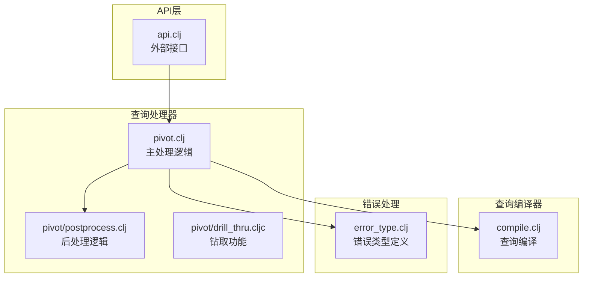
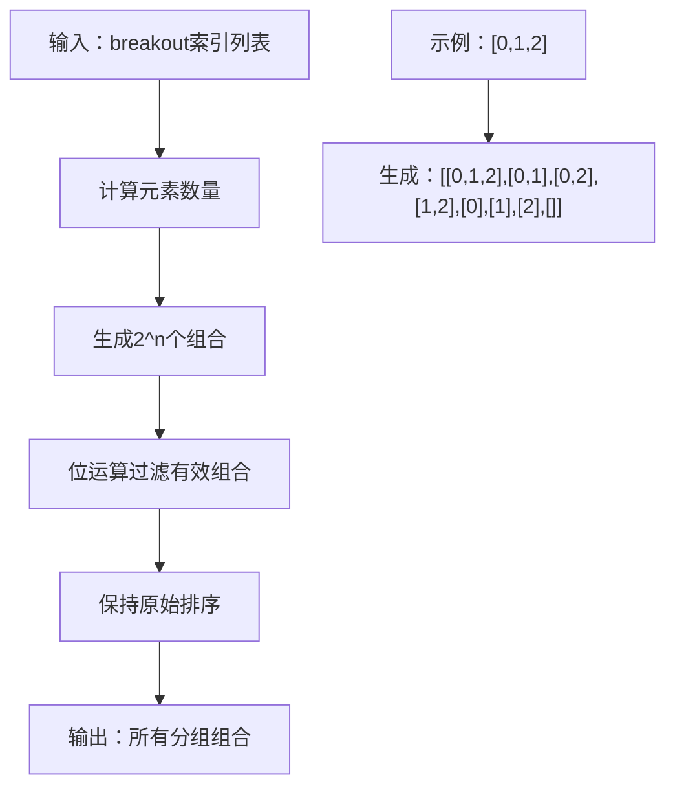
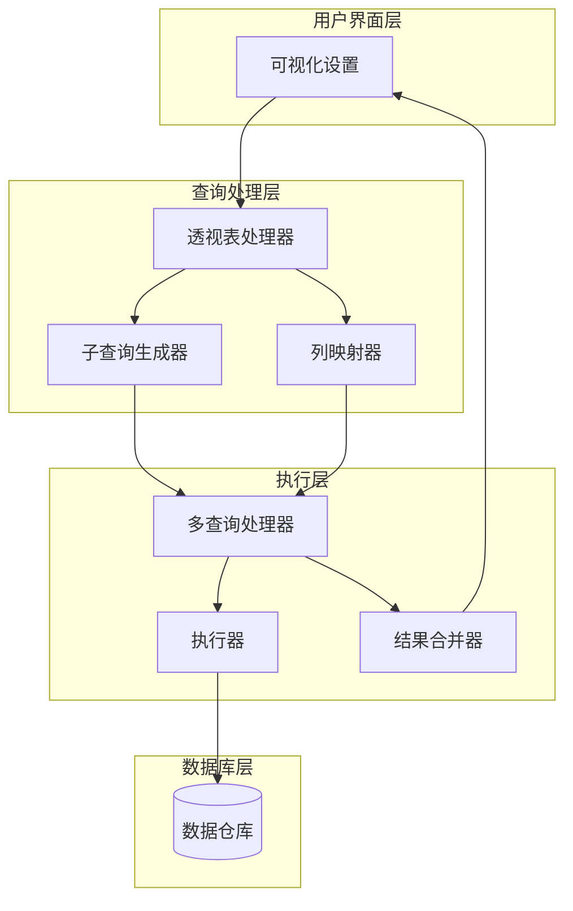
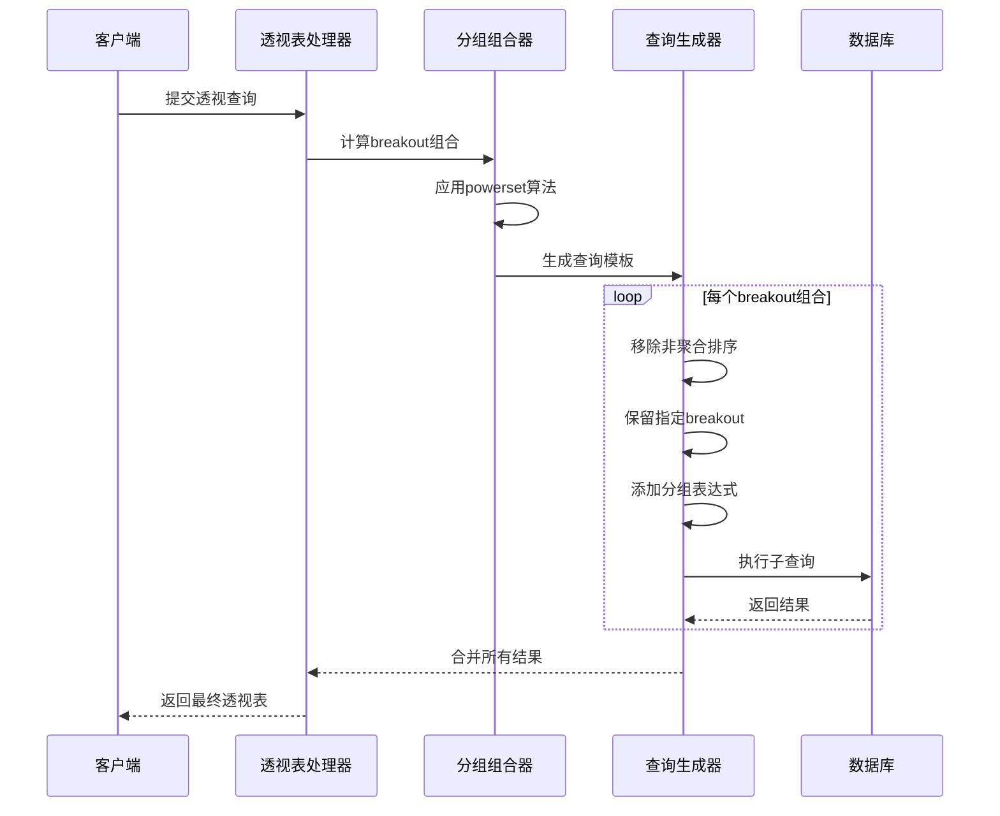
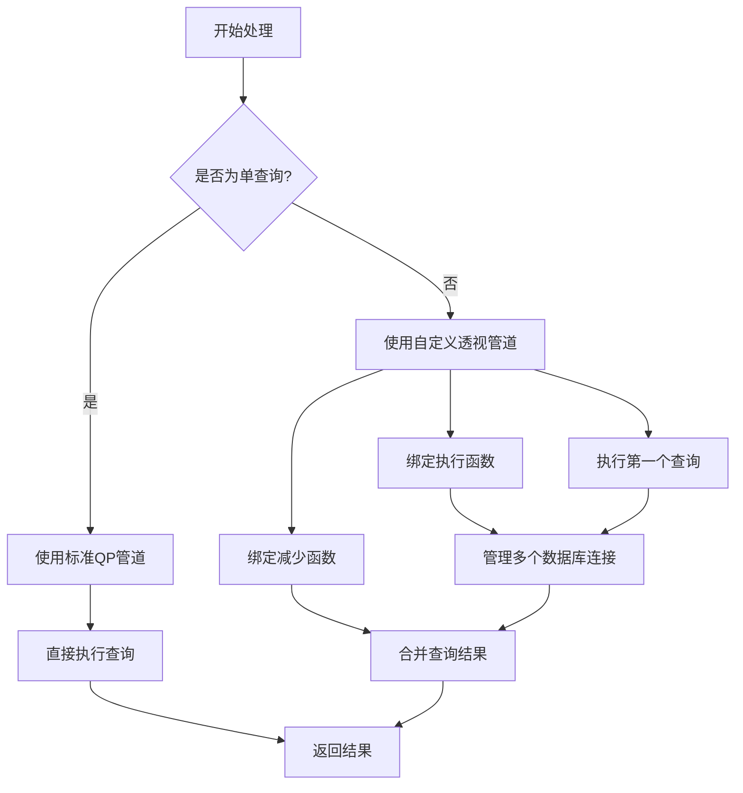
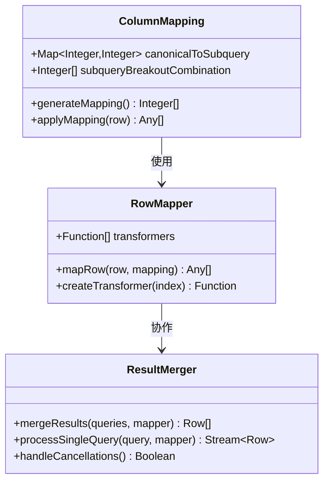
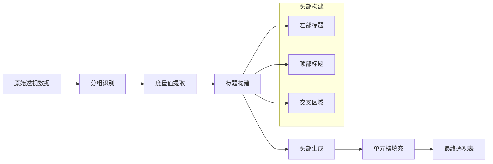
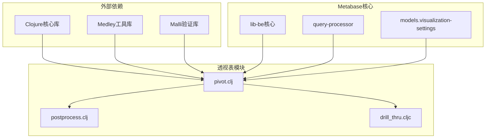

# 透视表处理机制

<cite>
**本文档中引用的文件**
- [pivot.clj](file://src/metabase/query_processor/pivot.clj)
- [postprocess.clj](file://src/metabase/query_processor/pivot/postprocess.clj)
- [pivot.cljc](file://src/metabase/lib/drill_thru/pivot.cljc)
- [compile.clj](file://src/metabase/query_processor/compile.clj)
- [error_type.clj](file://src/metabase/query_processor/error_type.clj)
- [api.clj](file://src/metabase/query_processor/api.clj)
</cite>

## 目录
1. [简介](#简介)
2. [项目结构](#项目结构)
3. [核心组件](#核心组件)
4. [架构概览](#架构概览)
5. [详细组件分析](#详细组件分析)
6. [依赖关系分析](#依赖关系分析)
7. [性能考虑](#性能考虑)
8. [故障排除指南](#故障排除指南)
9. [结论](#结论)

## 简介

Metabase的透视表处理机制是一个复杂而精密的数据处理系统，专门用于处理多维数据分析场景。该系统通过解析可视化设置中的`pivot_table.column_split`配置，生成子查询组合，使用`powerset`算法构建分组掩码，并通过`process-multiple-queries`串联执行多个子查询来合并结果。

本文档将深入分析这个系统的完整流程，包括数据透视表的生成、子查询的构建与执行、结果合并机制，以及运行时的错误处理和性能优化策略。

## 项目结构

透视表处理机制的核心文件位于以下目录结构中：

**图表来源**
- [pivot.clj](file://src/metabase/query_processor/pivot.clj#L1-L50)
- [postprocess.clj](file://src/metabase/query_processor/pivot/postprocess.clj#L1-L30)

**章节来源**
- [pivot.clj](file://src/metabase/query_processor/pivot.clj#L1-L639)

## 核心组件

### 透视表选项解析器

透视表处理系统的核心是`pivot-options`函数，它负责从可视化设置中提取透视表配置：

- **列分割配置**：解析`pivot_table.column_split`中的`rows`、`columns`和`values`参数
- **总计显示控制**：处理行总计和列总计的显示设置
- **字段映射**：支持基于列名和字段引用两种方式的配置

### Powerset算法实现

系统使用自定义的`powerset`函数生成所有可能的分组组合：

**图表来源**
- [pivot.clj](file://src/metabase/query_processor/pivot.clj#L30-L40)

### 分组掩码生成器

`group-bitmask`函数实现了基于位操作的分组标识符生成：

- **位掩码原理**：使用二进制位表示哪些breakout被包含在当前分组中
- **PostgreSQL兼容性**：确保生成的掩码与PostgreSQL的GROUP BY行为一致
- **性能优化**：通过位运算实现高效的分组识别

**章节来源**
- [pivot.clj](file://src/metabase/query_processor/pivot.clj#L51-L108)

## 架构概览

透视表处理系统采用分层架构设计，主要包含以下几个层次：

**图表来源**
- [pivot.clj](file://src/metabase/query_processor/pivot.clj#L617-L639)
- [api.clj](file://src/metabase/query_processor/api.clj#L74-L100)

## 详细组件分析

### 子查询生成机制

子查询生成是透视表处理的核心环节，通过`generate-queries`函数实现：

**图表来源**
- [pivot.clj](file://src/metabase/query_processor/pivot.clj#L180-L210)

#### 分组组合算法

系统使用复杂的算法生成所有必要的子查询：

1. **基础组合**：包含所有breakout的主数据查询
2. **小计查询**：按行维度生成的小计
3. **总计查询**：行总计和列总计
4. **交叉总计**：行列交叉的总计

**章节来源**
- [pivot.clj](file://src/metabase/query_processor/pivot.clj#L107-L166)

### 多查询处理管道

`process-multiple-queries`函数实现了复杂的多查询处理逻辑：

**图表来源**
- [pivot.clj](file://src/metabase/query_processor/pivot.clj#L342-L386)

#### 连接管理策略

系统采用智能的数据库连接管理策略：

- **连接池复用**：避免重复建立数据库连接
- **并发控制**：限制同时执行的查询数量
- **资源清理**：确保查询完成后正确释放资源

**章节来源**
- [pivot.clj](file://src/metabase/query_processor/pivot.clj#L302-L367)

### 结果合并机制

结果合并是透视表处理的最后一环，涉及复杂的列映射和数据重组：

**图表来源**
- [pivot.clj](file://src/metabase/query_processor/pivot.clj#L237-L273)

**章节来源**
- [pivot.clj](file://src/metabase/query_processor/pivot.clj#L271-L304)

### 后处理流水线

透视表结果需要经过复杂的后处理才能呈现给用户：

**图表来源**
- [postprocess.clj](file://src/metabase/query_processor/pivot/postprocess.clj#L150-L201)

**章节来源**
- [postprocess.clj](file://src/metabase/query_processor/pivot/postprocess.clj#L1-L201)

## 依赖关系分析

透视表处理系统的依赖关系体现了清晰的分层架构：

**图表来源**
- [pivot.clj](file://src/metabase/query_processor/pivot.clj#L1-L30)

**章节来源**
- [pivot.clj](file://src/metabase/query_processor/pivot.clj#L1-L30)

## 性能考虑

### 查询优化策略

1. **并行执行**：多个子查询可以并行执行以提高性能
2. **连接复用**：智能管理数据库连接避免重复开销
3. **内存管理**：流式处理大量数据避免内存溢出

### 缓存机制

虽然透视表处理不直接使用缓存，但系统提供了多种缓存策略：

- **查询编译缓存**：编译后的原生查询可以被缓存
- **元数据缓存**：数据库元数据可以被缓存以加速查询准备

### 内存使用优化

系统采用多种策略优化内存使用：

- **流式处理**：使用Reducible API进行流式数据处理
- **延迟计算**：只在需要时才计算结果
- **垃圾回收友好**：避免创建过多临时对象

## 故障排除指南

### 常见错误类型

透视表处理系统定义了多种错误类型：

| 错误类型 | 描述 | 处理策略 |
|---------|------|----------|
| `invalid-query` | 查询参数无效 | 验证输入参数，提供详细错误信息 |
| `missing-required-parameter` | 缺少必需参数 | 检查参数完整性 |
| `unsupported-feature` | 不支持的功能特性 | 提供替代方案或升级提示 |
| `qp` | 查询处理器内部错误 | 记录详细日志，提供回退机制 |

### 调试技巧

1. **启用调试日志**：设置适当的日志级别查看详细执行信息
2. **监控数据库连接**：检查数据库连接池状态
3. **分析查询性能**：使用EXPLAIN分析生成的SQL查询

### 性能监控指标

关键性能指标包括：

- **查询执行时间**：单个子查询的执行时间
- **数据库连接数**：并发连接的数量
- **内存使用量**：处理过程中的内存消耗
- **错误率**：各种错误类型的发生频率

**章节来源**
- [error_type.clj](file://src/metabase/query_processor/error_type.clj#L1-L111)

## 结论

Metabase的透视表处理机制是一个高度优化的数据分析系统，通过巧妙的设计实现了复杂多维数据的高效处理。系统的核心优势包括：

1. **算法效率**：使用powerset算法和位运算实现高效的分组组合生成
2. **架构优雅**：清晰的分层架构便于维护和扩展
3. **性能优化**：智能的连接管理和流式处理策略
4. **错误处理**：完善的错误类型定义和处理机制

该系统为用户提供了一个强大而灵活的数据透视分析工具，能够处理复杂的业务分析需求，同时保持良好的性能和稳定性。随着数据量的增长和分析需求的复杂化，这套系统展现了良好的可扩展性和适应性。