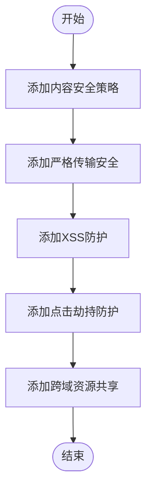

# 中间件与拦截器

<cite>
**本文档引用的文件**
- [auth.clj](file://src/metabase/server/middleware/auth.clj)
- [json.clj](file://src/metabase/server/middleware/json.clj)
- [permissions.clj](file://src/metabase/query_processor/middleware/permissions.clj)
- [cache.clj](file://src/metabase/query_processor/middleware/cache.clj)
- [session.clj](file://src/metabase/server/middleware/session.clj)
- [security.clj](file://src/metabase/server/middleware/security.clj)
- [catch_exceptions.clj](file://src/metabase/query_processor/middleware/catch_exceptions.clj)
- [validate.clj](file://src/metabase/query_processor/middleware/validate.clj)
- [pipeline.clj](file://src/metabase/query_processor/pipeline.clj)
</cite>

## 目录
1. [引言](#引言)
2. [服务器层中间件](#服务器层中间件)
3. [查询处理器中间件管道](#查询处理器中间件管道)
4. [权限检查中间件分析](#权限检查中间件分析)
5. [缓存中间件分析](#缓存中间件分析)
6. [中间件执行顺序与数据传递](#中间件执行顺序与数据传递)
7. [自定义中间件编写指南](#自定义中间件编写指南)
8. [中间件链执行流程图](#中间件链执行流程图)
9. [结论](#结论)

## 引言
Metabase系统采用中间件模式来处理HTTP请求和查询执行，通过一系列中间件组件构建了强大的请求处理管道。这些中间件在请求处理的不同阶段发挥作用，确保了系统的安全性、性能和功能正确性。本文档将深入分析Metabase中的中间件架构，重点关注服务器层中间件和查询处理器中间件管道的实现机制。

## 服务器层中间件
服务器层中间件主要负责HTTP请求的包装和处理，位于请求处理管道的最外层。这些中间件处理与HTTP协议相关的任务，如身份验证、JSON序列化和安全头设置。

### 身份验证中间件
身份验证中间件负责验证用户身份，确保只有经过授权的用户才能访问系统资源。`auth.clj`文件中的中间件实现了基于API密钥的身份验证机制。


**Diagram sources**
- [auth.clj](file://src/metabase/server/middleware/auth.clj#L1-L18)

**Section sources**
- [auth.clj](file://src/metabase/server/middleware/auth.clj#L1-L18)

### JSON处理中间件
JSON处理中间件负责请求和响应的JSON序列化与反序列化。`json.clj`文件中的中间件实现了JSON请求解析和响应流式处理功能。


**Diagram sources**
- [json.clj](file://src/metabase/server/middleware/json.clj#L1-L130)

**Section sources**
- [json.clj](file://src/metabase/server/middleware/json.clj#L1-L130)

### 会话管理中间件
会话管理中间件负责处理用户会话和权限绑定。`session.clj`文件中的中间件实现了基于会话ID和API密钥的用户身份识别。


**Diagram sources**
- [session.clj](file://src/metabase/server/middleware/session.clj#L1-L294)

**Section sources**
- [session.clj](file://src/metabase/server/middleware/session.clj#L1-L294)

### 安全头中间件
安全头中间件负责添加HTTP安全相关的响应头，防止常见的Web安全攻击。`security.clj`文件中的中间件实现了内容安全策略、跨域资源共享等安全功能。



**Diagram sources**
- [security.clj](file://src/metabase/server/middleware/security.clj#L1-L325)

**Section sources**
- [security.clj](file://src/metabase/server/middleware/security.clj#L1-L325)

## 查询处理器中间件管道
查询处理器中间件管道是Metabase核心功能的关键组成部分，负责处理查询请求的各个阶段。这些中间件按特定顺序执行，形成一个完整的查询处理流水线。

### 管道架构
查询处理器管道由多个中间件组成，每个中间件负责特定的处理任务。管道的执行遵循函数式编程的组合模式，每个中间件接收并可能修改查询，然后将其传递给下一个中间件。


**Diagram sources**
- [pipeline.clj](file://src/metabase/query_processor/pipeline.clj#L1-L130)

**Section sources**
- [pipeline.clj](file://src/metabase/query_processor/pipeline.clj#L1-L130)

## 权限检查中间件分析
权限检查中间件是查询处理器管道中的关键安全组件，负责验证用户是否有权执行特定查询。

### 权限检查机制
`permissions.clj`文件中的中间件实现了细粒度的权限控制，确保用户只能访问其有权限的数据。


**Diagram sources**
- [permissions.clj](file://src/metabase/query_processor/middleware/permissions.clj#L1-L202)

**Section sources**
- [permissions.clj](file://src/metabase/query_processor/middleware/permissions.clj#L1-L202)

### 权限检查流程
权限检查中间件的执行流程包括多个步骤，确保全面的安全验证：

1. 验证当前用户身份
2. 检查是否访问审计数据库
3. 验证查询中引用的表是否为活动状态
4. 检查源卡片的读取权限
5. 验证数据访问权限
6. 检查阻止权限（企业版功能）

这些检查确保了只有经过授权的用户才能执行查询，防止了数据泄露和未授权访问。

## 缓存中间件分析
缓存中间件是查询处理器管道中的性能优化组件，负责查询结果的缓存和检索。

### 缓存机制
`cache.clj`文件中的中间件实现了智能缓存策略，根据查询特征决定是否使用缓存。


**Diagram sources**
- [cache.clj](file://src/metabase/query_processor/middleware/cache.clj#L1-L247)

**Section sources**
- [cache.clj](file://src/metabase/query_processor/middleware/cache.clj#L1-L247)

### 缓存条件
查询要满足以下条件才能被缓存：

- 缓存功能已启用
- 查询传递了`cache-strategy`值
- 策略类型不是`nocache`
- 查询已经过权限检查
- 结果行在序列化后（压缩前）小于`query-caching-max-kb`

这些条件确保了缓存的安全性和有效性，防止了敏感数据的缓存和大结果集的存储。

## 中间件执行顺序与数据传递
中间件的执行顺序对系统行为有重要影响，数据通过上下文在中间件之间传递。

### 执行顺序
中间件按特定顺序执行，形成一个处理流水线：

1. 身份验证中间件
2. 会话管理中间件
3. 安全头中间件
4. JSON处理中间件
5. 权限检查中间件
6. 缓存中间件
7. 异常捕获中间件
8. 查询验证中间件

这个顺序确保了在处理查询之前完成必要的安全检查和预处理。

### 数据传递机制
中间件通过上下文对象传递数据，主要使用以下机制：

- 动态变量绑定
- 请求对象扩展
- 函数参数传递
- 全局状态管理

这种机制确保了数据在中间件之间的安全传递，同时保持了中间件的独立性和可组合性。

## 自定义中间件编写指南
编写自定义中间件需要遵循特定的模式和最佳实践。

### 中间件结构
一个典型的中间件应该包含以下部分：

```clojure
(defn my-middleware
  "中间件描述"
  [handler]
  (fn [request respond raise]
    ;; 预处理逻辑
    (let [processed-request (pre-process request)]
      ;; 调用下一个中间件
      (handler processed-request
               (fn [response]
                 ;; 后处理逻辑
                 (let [processed-response (post-process response)]
                   (respond processed-response)))
               raise))))
```

### 最佳实践
编写中间件时应遵循以下最佳实践：

1. 保持中间件的单一职责
2. 确保错误处理的完整性
3. 避免阻塞操作
4. 正确处理异步调用
5. 提供清晰的错误信息
6. 遵循函数式编程原则

这些实践确保了中间件的可靠性、可维护性和性能。

## 中间件链执行流程图
以下是完整的中间件链执行流程图，展示了从HTTP请求到查询结果的完整处理过程。


**Diagram sources**
- [auth.clj](file://src/metabase/server/middleware/auth.clj#L1-L18)
- [session.clj](file://src/metabase/server/middleware/session.clj#L1-L294)
- [security.clj](file://src/metabase/server/middleware/security.clj#L1-L325)
- [json.clj](file://src/metabase/server/middleware/json.clj#L1-L130)
- [permissions.clj](file://src/metabase/query_processor/middleware/permissions.clj#L1-L202)
- [cache.clj](file://src/metabase/query_processor/middleware/cache.clj#L1-L247)
- [catch_exceptions.clj](file://src/metabase/query_processor/middleware/catch_exceptions.clj#L1-L152)
- [validate.clj](file://src/metabase/query_processor/middleware/validate.clj#L1-L20)

**Section sources**
- [auth.clj](file://src/metabase/server/middleware/auth.clj#L1-L18)
- [session.clj](file://src/metabase/server/middleware/session.clj#L1-L294)
- [security.clj](file://src/metabase/server/middleware/security.clj#L1-L325)
- [json.clj](file://src/metabase/server/middleware/json.clj#L1-L130)
- [permissions.clj](file://src/metabase/query_processor/middleware/permissions.clj#L1-L202)
- [cache.clj](file://src/metabase/query_processor/middleware/cache.clj#L1-L247)
- [catch_exceptions.clj](file://src/metabase/query_processor/middleware/catch_exceptions.clj#L1-L152)
- [validate.clj](file://src/metabase/query_processor/middleware/validate.clj#L1-L20)

## 结论
Metabase的中间件系统通过分层架构和管道模式，实现了高效、安全的请求处理。服务器层中间件处理HTTP协议相关的任务，而查询处理器中间件管道则专注于查询的执行和优化。权限检查和缓存中间件在确保系统安全性和性能方面发挥着关键作用。通过理解中间件的执行顺序和数据传递机制，开发者可以更好地利用这一架构，编写高效的自定义中间件，满足特定的业务需求。