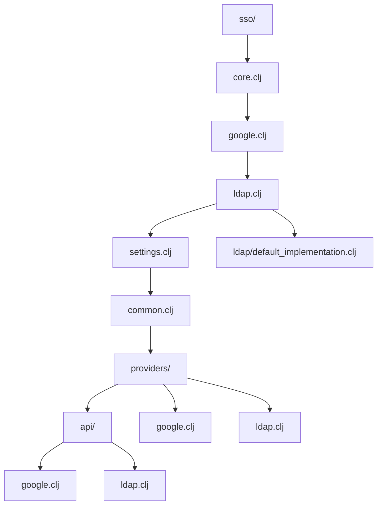
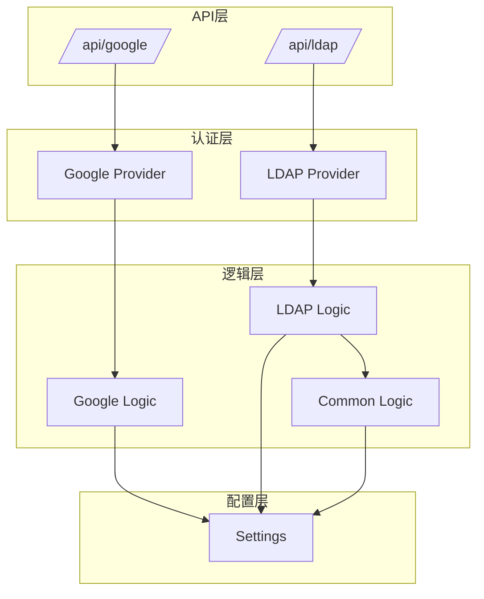
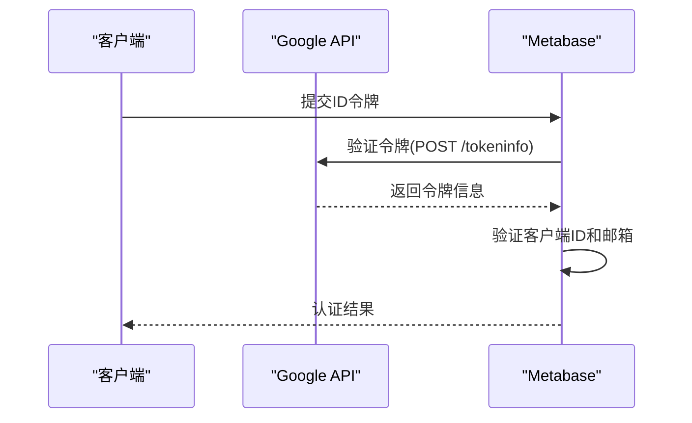
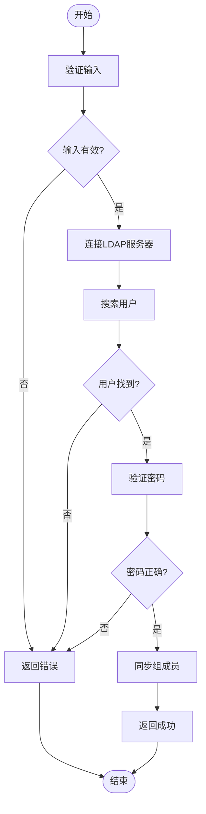
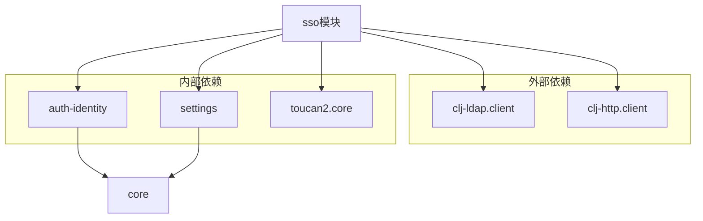
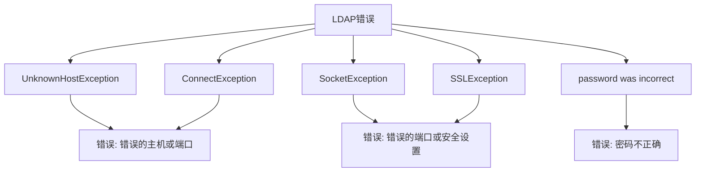

# 单点登录 (SSO) 集成

<cite>
**本文档引用的文件**  
- [core.clj](file://src/metabase/sso/core.clj)
- [google.clj](file://src/metabase/sso/google.clj)
- [ldap.clj](file://src/metabase/sso/ldap.clj)
- [settings.clj](file://src/metabase/sso/settings.clj)
- [common.clj](file://src/metabase/sso/common.clj)
- [providers/google.clj](file://src/metabase/sso/providers/google.clj)
- [providers/ldap.clj](file://src/metabase/sso/providers/ldap.clj)
- [api/google.clj](file://src/metabase/sso/api/google.clj)
- [api/ldap.clj](file://src/metabase/sso/api/ldap.clj)
- [default_implementation.clj](file://src/metabase/sso/ldap/default_implementation.clj)
</cite>

## 目录
1. [简介](#简介)
2. [项目结构](#项目结构)
3. [核心组件](#核心组件)
4. [架构概述](#架构概述)
5. [详细组件分析](#详细组件分析)
6. [依赖分析](#依赖分析)
7. [性能考虑](#性能考虑)
8. [故障排除指南](#故障排除指南)
9. [结论](#结论)

## 简介
本文档详细介绍了Metabase中Google和LDAP单点登录（SSO）的实现机制。文档涵盖了认证流程调度、具体认证逻辑、配置参数、安全最佳实践以及常见问题排查指南。通过分析核心代码文件，本文档为系统管理员和开发人员提供了全面的SSO集成指导。

## 项目结构
Metabase的SSO功能主要位于`src/metabase/sso`目录下，该目录包含多个子模块，分别处理不同的SSO提供商和通用功能。



**图示来源**  
- [core.clj](file://src/metabase/sso/core.clj)
- [google.clj](file://src/metabase/sso/google.clj)
- [ldap.clj](file://src/metabase/sso/ldap.clj)
- [settings.clj](file://src/metabase/sso/settings.clj)
- [common.clj](file://src/metabase/sso/common.clj)
- [providers/google.clj](file://src/metabase/sso/providers/google.clj)
- [providers/ldap.clj](file://src/metabase/sso/providers/ldap.clj)
- [api/google.clj](file://src/metabase/sso/api/google.clj)
- [api/ldap.clj](file://src/metabase/sso/api/ldap.clj)
- [default_implementation.clj](file://src/metabase/sso/ldap/default_implementation.clj)

**本节来源**  
- [core.clj](file://src/metabase/sso/core.clj)
- [google.clj](file://src/metabase/sso/google.clj)
- [ldap.clj](file://src/metabase/sso/ldap.clj)
- [settings.clj](file://src/metabase/sso/settings.clj)

## 核心组件
SSO功能的核心组件包括认证流程调度、具体认证逻辑和配置管理。`core.clj`文件通过`potemkin/import-vars`机制将不同模块的功能整合到统一的命名空间中，实现了模块间的解耦和功能复用。

**本节来源**  
- [core.clj](file://src/metabase/sso/core.clj#L1-L27)
- [settings.clj](file://src/metabase/sso/settings.clj#L1-L227)

## 架构概述
Metabase的SSO架构采用分层设计，将配置管理、认证逻辑和API接口分离，确保了系统的可维护性和可扩展性。



**图示来源**  
- [core.clj](file://src/metabase/sso/core.clj)
- [google.clj](file://src/metabase/sso/google.clj)
- [ldap.clj](file://src/metabase/sso/ldap.clj)
- [settings.clj](file://src/metabase/sso/settings.clj)
- [common.clj](file://src/metabase/sso/common.clj)
- [providers/google.clj](file://src/metabase/sso/providers/google.clj)
- [providers/ldap.clj](file://src/metabase/sso/providers/ldap.clj)
- [api/google.clj](file://src/metabase/sso/api/google.clj)
- [api/ldap.clj](file://src/metabase/sso/api/ldap.clj)

## 详细组件分析

### Google SSO 分析
Google SSO实现基于OAuth 2.0协议，通过ID令牌验证用户身份。

#### 认证流程


**图示来源**  
- [google.clj](file://src/metabase/sso/google.clj#L1-L52)
- [providers/google.clj](file://src/metabase/sso/providers/google.clj#L1-L73)

#### 配置参数
| 配置项 | 描述 | 默认值 |
|--------|------|--------|
| `google-auth-client-id` | Google Sign-In客户端ID | 无 |
| `google-auth-enabled` | 是否启用Google登录 | false |
| `google-auth-auto-create-accounts-domain` | 允许自动创建账户的域名 | 无 |

**本节来源**  
- [google.clj](file://src/metabase/sso/google.clj#L1-L52)
- [providers/google.clj](file://src/metabase/sso/providers/google.clj#L1-L73)
- [settings.clj](file://src/metabase/sso/settings.clj#L132-L162)

### LDAP SSO 分析
LDAP SSO实现提供了与企业目录服务的集成能力。

#### 认证流程


**图示来源**  
- [ldap.clj](file://src/metabase/sso/ldap.clj#L1-L221)
- [providers/ldap.clj](file://src/metabase/sso/providers/ldap.clj#L1-L135)
- [default_implementation.clj](file://src/metabase/sso/ldap/default_implementation.clj#L1-L142)

#### 配置参数
| 配置项 | 描述 | 默认值 |
|--------|------|--------|
| `ldap-host` | LDAP服务器主机名 | 无 |
| `ldap-port` | LDAP服务器端口 | 389 |
| `ldap-security` | 安全协议(none/ssl/starttls) | none |
| `ldap-bind-dn` | 绑定DN | 无 |
| `ldap-password` | 绑定密码 | 无 |
| `ldap-user-base` | 用户搜索基础 | 无 |
| `ldap-user-filter` | 用户过滤器 | (&(objectClass=inetOrgPerson)(|(uid={login})(mail={login}))) |
| `ldap-attribute-email` | 邮箱属性 | mail |
| `ldap-attribute-firstname` | 名字属性 | givenName |
| `ldap-attribute-lastname` | 姓氏属性 | sn |
| `ldap-group-sync` | 是否同步组成员 | false |
| `ldap-group-base` | 组搜索基础 | 无 |
| `ldap-group-mappings` | LDAP到Metabase组映射 | {} |

**本节来源**  
- [ldap.clj](file://src/metabase/sso/ldap.clj#L1-L221)
- [settings.clj](file://src/metabase/sso/settings.clj#L1-L227)
- [default_implementation.clj](file://src/metabase/sso/ldap/default_implementation.clj#L1-L142)

### 通用功能分析
#### 组成员同步
```mermaid
classDiagram
class sync-group-memberships! {
+sync-group-memberships!(user-or-id, new-groups-or-ids)
+sync-group-memberships!(user-or-id, new-groups-or-ids, mapped-groups-or-ids)
}
class PermissionsGroupMembership {
+user_id
+group_id
}
sync-group-memberships! --> PermissionsGroupMembership : "更新"
```

**图示来源**  
- [common.clj](file://src/metabase/sso/common.clj#L1-L65)
- [permissions/models/permissions_group.clj](file://src/metabase/permissions/models/permissions_group.clj#L113-L151)

**本节来源**  
- [common.clj](file://src/metabase/sso/common.clj#L1-L65)
- [providers/ldap.clj](file://src/metabase/sso/providers/ldap.clj#L1-L135)

## 依赖分析
SSO模块依赖于多个核心组件，形成了完整的认证体系。



**图示来源**  
- [core.clj](file://src/metabase/sso/core.clj#L1-L27)
- [google.clj](file://src/metabase/sso/google.clj#L1-L52)
- [ldap.clj](file://src/metabase/sso/ldap.clj#L1-L221)
- [providers/google.clj](file://src/metabase/sso/providers/google.clj#L1-L73)
- [providers/ldap.clj](file://src/metabase/sso/providers/ldap.clj#L1-L135)

**本节来源**  
- [core.clj](file://src/metabase/sso/core.clj#L1-L27)
- [google.clj](file://src/metabase/sso/google.clj#L1-L52)
- [ldap.clj](file://src/metabase/sso/ldap.clj#L1-L221)

## 性能考虑
SSO实现中包含多个性能优化措施：

1. **连接池**：LDAP连接使用连接池管理，减少重复连接开销
2. **超时控制**：设置LDAP操作超时时间，防止长时间阻塞
3. **缓存机制**：配置值通过`setting`模块缓存，减少数据库查询
4. **批量操作**：组成员同步采用批量处理，减少数据库事务

这些优化确保了SSO功能在高并发场景下的稳定性和响应速度。

## 故障排除指南
### 常见问题及解决方案

| 问题 | 可能原因 | 解决方案 |
|------|---------|---------|
| 登录失败 | 客户端ID无效 | 验证Google客户端ID以".apps.googleusercontent.com"结尾 |
| 登录失败 | LDAP连接失败 | 检查主机、端口和安全设置 |
| 登录失败 | 绑定DN或密码错误 | 验证绑定凭证 |
| 属性映射错误 | 属性名称不匹配 | 检查LDAP属性配置 |
| 超时问题 | 网络延迟 | 增加`ldap-timeout-seconds`值 |

### 错误消息映射


**本节来源**  
- [ldap.clj](file://src/metabase/sso/ldap.clj#L1-L221)
- [settings.clj](file://src/metabase/sso/settings.clj#L1-L227)

## 结论
Metabase的SSO集成提供了灵活、安全的单点登录解决方案。通过模块化设计和清晰的分层架构，系统能够有效地支持Google和LDAP等多种认证方式。配置管理、认证逻辑和API接口的分离确保了系统的可维护性和可扩展性。建议在生产环境中启用SSO功能时，仔细配置各项参数，并遵循安全最佳实践，以确保系统的安全性和稳定性。