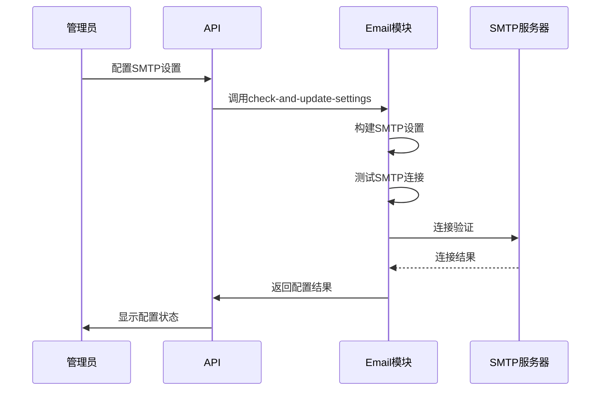
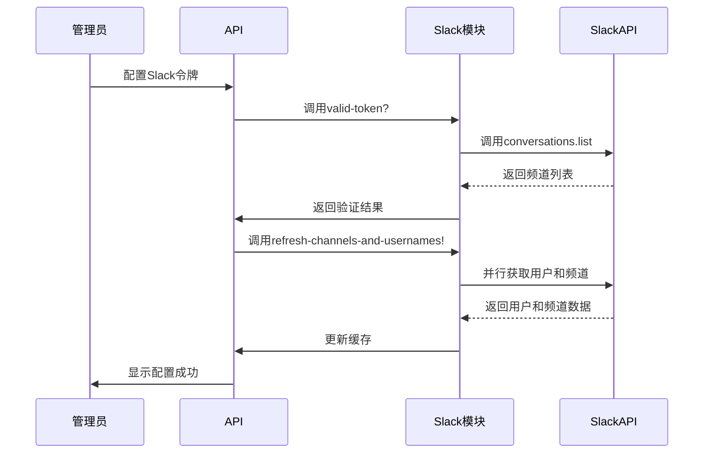
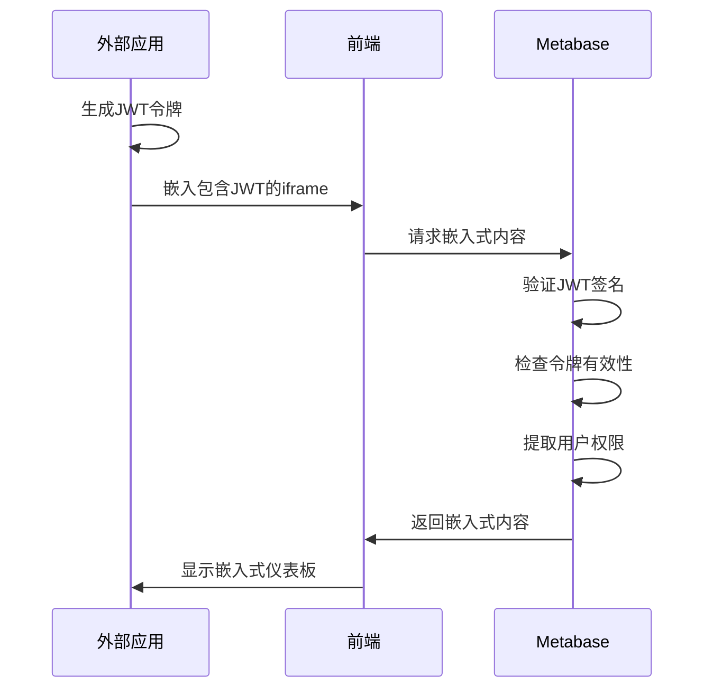

# 外部集成

<cite>
**本文档中引用的文件**  
- [core.clj](file://src/metabase/sso/core.clj)
- [google.clj](file://src/metabase/sso/google.clj)
- [ldap.clj](file://src/metabase/sso/ldap.clj)
- [settings.clj](file://src/metabase/sso/settings.clj)
- [jwt.clj](file://src/metabase/embedding/jwt.clj)
- [util.clj](file://src/metabase/embedding/util.clj)
- [validation.clj](file://src/metabase/embedding/validation.clj)
- [settings.clj](file://src/metabase/embedding/settings.clj)
- [email.clj](file://src/metabase/channel/email.clj)
- [slack.clj](file://src/metabase/channel/slack.clj)
- [channel.clj](file://src/metabase/channel/models/channel.clj)
- [api.clj](file://src/metabase/channel/api/email.clj)
- [api.clj](file://src/metabase/channel/api/slack.clj)
- [send.clj](file://src/metabase/pulse/send.clj)
</cite>

## 目录
1. [简介](#简介)
2. [SSO单点登录集成](#sso单点登录集成)
3. [通知渠道系统](#通知渠道系统)
4. [嵌入式BI功能](#嵌入式bi功能)
5. [安全最佳实践](#安全最佳实践)
6. [故障排除指南](#故障排除指南)

## 简介
本文档详细介绍了Metabase与第三方系统的外部集成方式，涵盖单点登录（SSO）、通知渠道和嵌入式BI三大核心功能。文档提供了详细的配置步骤、API调用说明和安全建议，帮助开发者顺利完成系统集成。

## SSO单点登录集成

### Google认证配置
Metabase支持通过Google Sign-In实现单点登录。配置需要设置Google客户端ID，并可选择性地启用自动用户创建功能。

**配置参数**：
- `google-auth-client-id`：Google Sign-In客户端ID，必须以`.apps.googleusercontent.com`结尾
- `google-auth-enabled`：是否启用Google认证
- `google-auth-auto-create-accounts-domain`：允许自动创建账户的域名列表

**认证流程**：
1. 用户通过Google登录
2. Metabase验证ID令牌的有效性
3. 检查令牌中的受众（audience）是否匹配配置的客户端ID
4. 验证邮箱是否已验证
5. 根据配置决定是否自动创建用户

**API调用**：
- `google-auth-token-info`：验证和解析Google Sign-In令牌信息
- `autocreate-user-allowed-for-email?`：检查指定邮箱是否允许自动创建用户

**Section sources**
- [google.clj](file://src/metabase/sso/google.clj#L1-L53)
- [settings.clj](file://src/metabase/sso/settings.clj#L150-L227)

### LDAP认证配置
Metabase支持通过LDAP协议与企业目录服务集成，实现统一身份认证。

**配置参数**：
- `ldap-host`：LDAP服务器主机名
- `ldap-port`：服务器端口（通常为389或636）
- `ldap-security`：安全协议（无、SSL或StartTLS）
- `ldap-bind-dn`：绑定用户的DN
- `ldap-password`：绑定用户的密码
- `ldap-user-base`：用户搜索基础
- `ldap-user-filter`：用户查找过滤器
- `ldap-attribute-*`：用户属性映射（邮箱、姓名等）
- `ldap-group-sync`：是否启用组同步
- `ldap-group-base`：组搜索基础
- `ldap-group-mappings`：LDAP组到Metabase组的映射

**认证流程**：
1. 使用配置的绑定DN和密码连接LDAP服务器
2. 根据用户提供的登录名查找用户
3. 验证用户密码
4. 同步用户组成员资格（如果启用）

**测试连接**：
使用`test-ldap-connection`函数测试LDAP连接配置，验证用户和组搜索基础是否存在且可读。

**Section sources**
- [ldap.clj](file://src/metabase/sso/ldap.clj#L1-L222)
- [settings.clj](file://src/metabase/sso/settings.clj#L1-L149)

## 通知渠道系统

### Email通知渠道
Metabase通过Email渠道发送Pulse报表和警报。系统使用Postal库发送邮件，支持SMTP配置。

**配置参数**：
- `email-smtp-host`：SMTP服务器主机
- `email-smtp-port`：SMTP端口
- `email-smtp-security`：安全协议（TLS、SSL、StartTLS）
- `email-smtp-username`：SMTP用户名
- `email-smtp-password`：SMTP密码
- `email-from-address`：发件人地址
- `email-reply-to`：回复地址
- `email-max-recipients-per-second`：每秒最大收件人数（用于节流）

**发送流程**：
1. 构建邮件详情（主题、收件人、内容类型、消息体）
2. 获取SMTP设置（支持覆盖设置）
3. 检查邮件节流限制
4. 使用Postal发送邮件
5. 记录发送统计信息

**API端点**：
- `PUT /api/email`：更新邮件设置
- `DELETE /api/email`：清除邮件设置
- `POST /api/email/test`：发送测试邮件

**Diagram sources**
- [email.clj](file://src/metabase/channel/email.clj#L1-L363)
- [api.clj](file://src/metabase/channel/api/email.clj#L1-L56)

**Section sources**
- [email.clj](file://src/metabase/channel/email.clj#L1-L363)
- [api.clj](file://src/metabase/channel/api/email.clj#L1-L56)

### Slack通知渠道
Metabase通过Slack渠道发送通知，支持将Pulse报表和警报发布到指定频道。

**配置参数**：
- `slack-app-token`：Slack应用令牌
- `slack-bug-report-channel`：错误报告频道
- `slack-cached-channels-and-usernames`：频道和用户缓存
- `slack-channels-and-usernames-last-updated`：缓存最后更新时间

**功能特性**：
- 支持OAuth 2.0认证
- 自动刷新频道和用户缓存（每10分钟）
- 支持文件上传和消息发布
- 错误处理和管理员通知

**API端点**：
- `PUT /api/slack/settings`：更新Slack设置
- `GET /api/slack/manifest`：获取Slack应用清单
- `POST /api/slack/bug-report`：发送错误报告

**Diagram sources**
- [slack.clj](file://src/metabase/channel/slack.clj#L1-L338)
- [api.clj](file://src/metabase/channel/api/slack.clj#L1-L154)

**Section sources**
- [slack.clj](file://src/metabase/channel/slack.clj#L1-L338)
- [api.clj](file://src/metabase/channel/api/slack.clj#L1-L154)

## 嵌入式BI功能

### JWT令牌认证
Metabase使用JWT（JSON Web Token）实现安全的嵌入式BI功能，允许将仪表板安全地嵌入到其他应用中。

**配置参数**：
- `embedding-secret-key`：用于签名JWT的密钥
- `enable-embedding-static`：是否启用静态嵌入
- `embedding-app-origins-sdk`：允许嵌入的源站列表

**验证流程**：
1. 解析JWT消息头，检查算法是否为"none"
2. 使用`embedding-secret-key`验证签名
3. 检查令牌是否过期（允许60秒时钟偏差）
4. 提取令牌中的关键信息

**API调用**：
- `unsign`：解析和验证JWT令牌
- `get-in-unsigned-token-or-throw`：从解码后的令牌中获取指定路径的值

**Diagram sources**
- [jwt.clj](file://src/metabase/embedding/jwt.clj#L1-L51)
- [validation.clj](file://src/metabase/embedding/validation.clj#L1-L12)

**Section sources**
- [jwt.clj](file://src/metabase/embedding/jwt.clj#L1-L51)
- [validation.clj](file://src/metabase/embedding/validation.clj#L1-L12)

### 嵌入式配置
Metabase支持多种嵌入式模式，包括静态嵌入、SDK嵌入和交互式嵌入。

**配置参数**：
- `enable-embedding-sdk`：是否启用SDK嵌入
- `enable-embedding-simple`：是否启用简单嵌入
- `enable-embedding-interactive`：是否启用交互式嵌入
- `embedding-app-origins-interactive`：交互式嵌入的源站列表
- `embedding-app-origins-sdk`：SDK嵌入的源站列表

**安全特性**：
- 支持CORS源站限制
- 自动处理localhost源站
- 环境变量配置同步
- 详细的审计日志

**Section sources**
- [settings.clj](file://src/metabase/embedding/settings.clj#L1-L315)
- [util.clj](file://src/metabase/embedding/util.clj#L1-L22)

## 安全最佳实践

### SSO安全
- 使用强密码和安全的绑定DN进行LDAP连接
- 定期轮换LDAP绑定密码
- 限制Google认证的客户端ID访问范围
- 启用SSL/TLS加密LDAP通信
- 设置合理的LDAP超时时间（默认15秒）

### 通知渠道安全
- 使用专用的SMTP账户发送邮件
- 避免在生产环境中使用明文SMTP
- 定期轮换Slack应用令牌
- 限制Slack应用的权限范围
- 监控邮件发送频率，防止滥用

### 嵌入式BI安全
- 使用强256位密钥作为`embedding-secret-key`
- 严格限制`embedding-app-origins`的源站列表
- 定期轮换嵌入式密钥
- 监控嵌入式请求的频率和来源
- 使用HTTPS保护嵌入式内容传输

## 故障排除指南

### SSO问题
**Google认证失败**：
- 检查客户端ID是否正确且以`.apps.googleusercontent.com`结尾
- 验证Google令牌是否有效
- 确认邮箱已验证
- 检查网络连接是否正常

**LDAP连接问题**：
- 使用`test-ldap-connection`函数测试配置
- 验证主机名和端口是否正确
- 检查绑定DN和密码是否有效
- 确认用户和组搜索基础是否存在
- 查看日志中的具体错误信息

### 通知渠道问题
**邮件发送失败**：
- 检查SMTP主机和端口配置
- 验证用户名和密码
- 确认安全协议设置正确
- 检查发件人地址格式
- 查看邮件节流设置

**Slack集成问题**：
- 验证Slack令牌是否有效
- 检查应用权限是否足够
- 确认频道名称正确
- 查看缓存是否需要刷新
- 检查网络连接是否正常

### 嵌入式BI问题
**嵌入式内容无法显示**：
- 验证JWT令牌签名是否正确
- 检查`embedding-secret-key`是否匹配
- 确认源站是否在允许列表中
- 验证令牌是否过期
- 检查嵌入式功能是否已启用