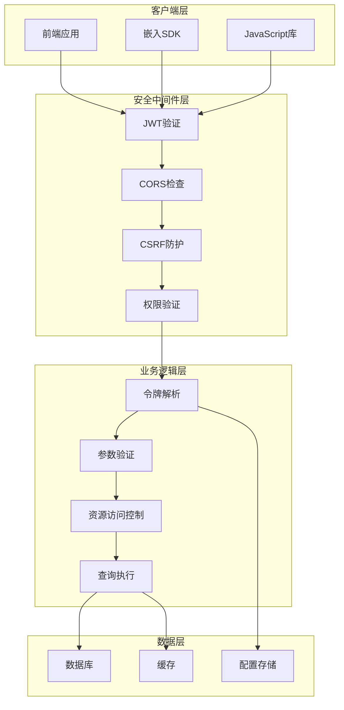
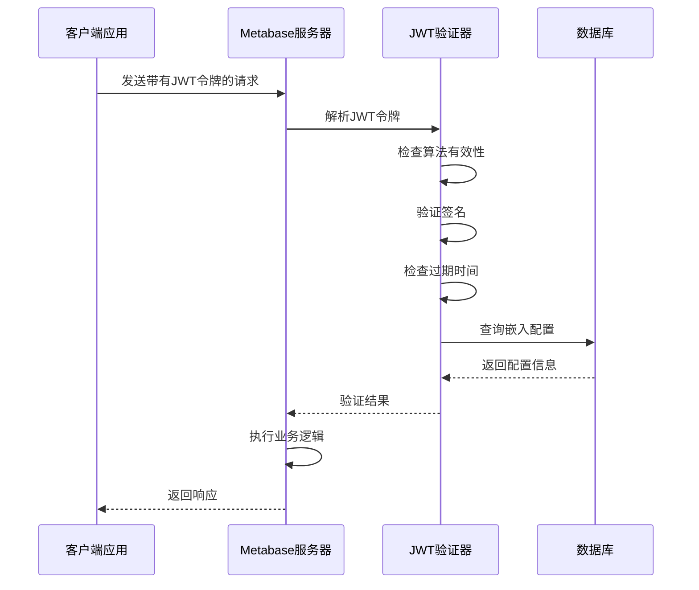
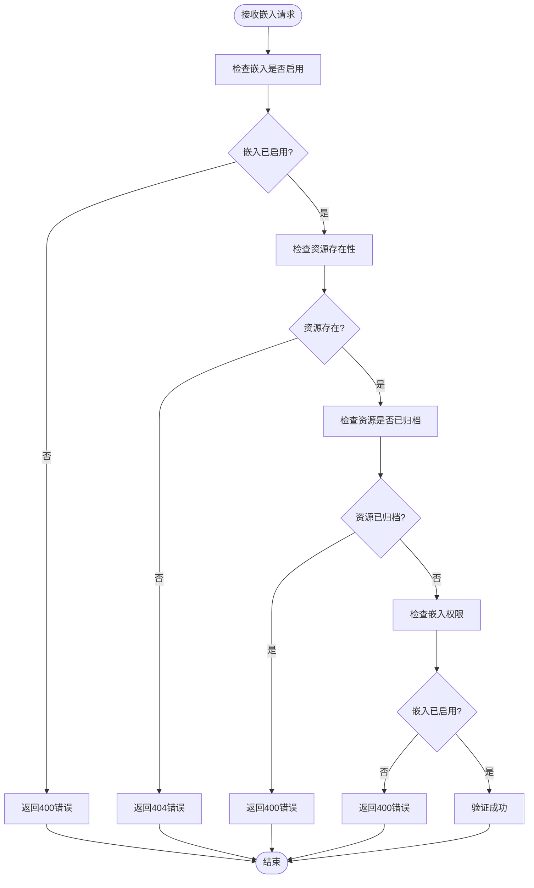
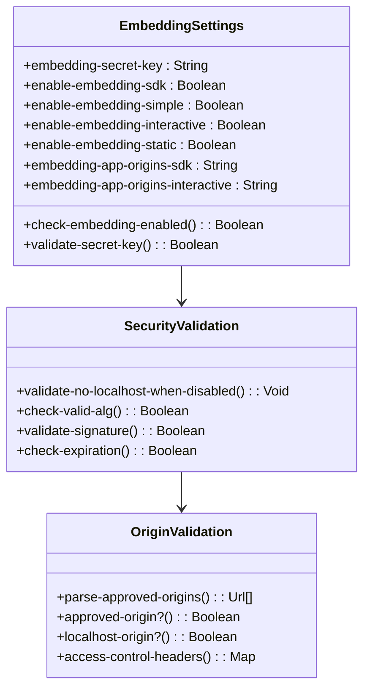
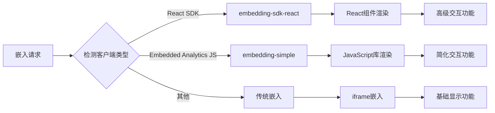
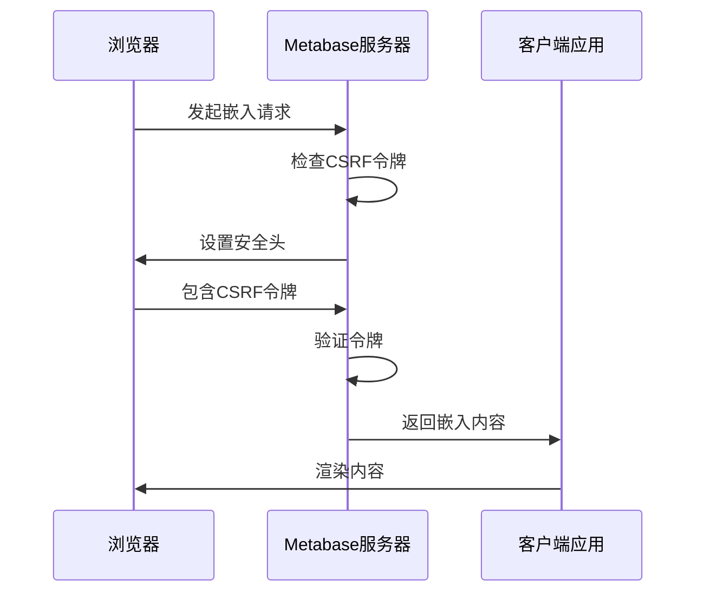
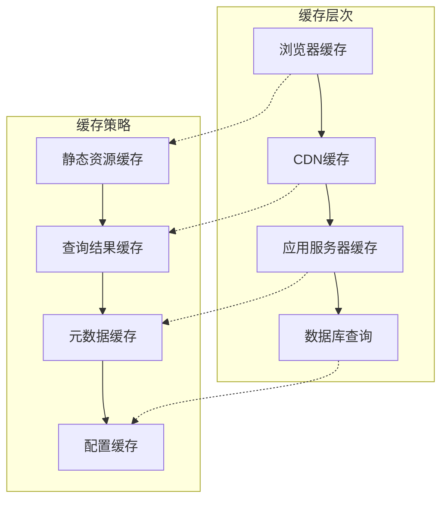

# 嵌入式BI (Embedding) 集成

<cite>
**本文档引用的文件**
- [jwt.clj](file://src/metabase/embedding/jwt.clj)
- [validation.clj](file://src/metabase/embedding/validation.clj)
- [settings.clj](file://src/metabase/embedding/settings.clj)
- [util.clj](file://src/metabase/embedding/util.clj)
- [embed.clj](file://src/metabase/embedding_rest/api/embed.clj)
- [common.clj](file://src/metabase/embedding_rest/api/common.clj)
- [preview_embed.clj](file://src/metabase/embedding_rest/api/preview_embed.clj)
- [init.clj](file://src/metabase/embedding/init.clj)
- [security.clj](file://src/metabase/server/middleware/security.clj)
</cite>

## 目录
1. [简介](#简介)
2. [系统架构概览](#系统架构概览)
3. [JWT令牌处理流程](#jwt令牌处理流程)
4. [权限验证机制](#权限验证机制)
5. [安全配置选项](#安全配置选项)
6. [端到端集成示例](#端到端集成示例)
7. [前端JavaScript集成](#前端javascript集成)
8. [安全最佳实践](#安全最佳实践)
9. [调试技巧与故障排除](#调试技巧与故障排除)
10. [性能优化建议](#性能优化建议)

## 简介

Metabase的嵌入式BI功能允许开发者将Metabase仪表板和卡片安全地嵌入到第三方应用程序中。该功能基于JWT（JSON Web Token）认证机制，提供了强大的安全保证和灵活的配置选项。

### 核心特性

- **JWT认证**：使用加密签名的JWT令牌进行身份验证
- **多层权限控制**：支持静态嵌入、SDK嵌入、简单嵌入和交互式嵌入
- **参数化过滤**：支持通过令牌和URL参数进行数据过滤
- **预览功能**：提供开发环境下的嵌入预览能力
- **CORS安全**：内置跨域资源共享保护机制

## 系统架构概览

嵌入式BI系统采用分层架构设计，确保安全性和可扩展性：



**图表来源**
- [embed.clj](file://src/metabase/embedding_rest/api/embed.clj#L1-L50)
- [common.clj](file://src/metabase/embedding_rest/api/common.clj#L1-L50)

## JWT令牌处理流程

### 令牌结构与验证

JWT令牌是嵌入式BI的核心认证机制，包含以下关键组件：



**图表来源**
- [jwt.clj](file://src/metabase/embedding/jwt.clj#L30-L50)

### 令牌签发与验证逻辑

令牌处理涉及多个关键步骤：

1. **算法验证**：确保使用非空算法
2. **签名验证**：使用配置的密钥验证令牌完整性
3. **过期检查**：验证令牌是否在有效期内
4. **参数提取**：从令牌中提取资源标识符和参数

**章节来源**
- [jwt.clj](file://src/metabase/embedding/jwt.clj#L1-L51)

## 权限验证机制

### 嵌入权限检查

权限验证确保只有授权的资源可以被访问：



**图表来源**
- [common.clj](file://src/metabase/embedding_rest/api/common.clj#L78-L95)

### 参数权限控制

嵌入式BI支持三种参数控制模式：

| 参数类型 | 描述 | 安全级别 | 使用场景 |
|---------|------|---------|----------|
| `disabled` | 禁用参数，无法设置 | 最高 | 敏感数据过滤 |
| `enabled` | 可通过JWT或URL设置 | 中等 | 动态参数过滤 |
| `locked` | 必须在JWT中设置 | 高 | 固定条件过滤 |

**章节来源**
- [common.clj](file://src/metabase/embedding_rest/api/common.clj#L55-L76)

## 安全配置选项

### 密钥管理

嵌入式BI的安全基础是配置有效的签名密钥：



**图表来源**
- [settings.clj](file://src/metabase/embedding/settings.clj#L15-L50)
- [security.clj](file://src/metabase/server/middleware/security.clj#L234-L263)

### 跨域资源共享(CORS)配置

CORS配置确保只有授权的源可以访问嵌入资源：

| 配置项 | 默认值 | 安全影响 | 推荐设置 |
|--------|--------|---------|----------|
| `embedding-app-origins-sdk` | "" | 中等 | 明确指定可信域名 |
| `embedding-app-origins-interactive` | "" | 高 | 严格限制源列表 |
| `disable-cors-on-localhost` | false | 低 | 开发环境可设为true |

**章节来源**
- [settings.clj](file://src/metabase/embedding/settings.clj#L148-L176)

## 端到端集成示例

### 后端令牌生成示例

以下是生成嵌入令牌的完整后端代码示例：

```clojure
(ns example.embed-token-generator
  (:require [metabase.embedding.jwt :as jwt]
            [metabase.embedding.settings :as embed.settings]
            [buddy.sign.jwt :as jwt-lib]
            [clojure.string :as str]))

(defn generate-card-token
  "生成用于嵌入卡片的JWT令牌"
  [card-id params]
  (let [secret-key (embed.settings/embedding-secret-key)
        token-claims {:resource {:question card-id}
                      :params   params
                      :exp      (+ (System/currentTimeMillis) (* 30 60 1000))}] ; 30分钟有效期
    (jwt-lib/sign token-claims secret-key {:alg :hs256})))

(defn generate-dashboard-token
  "生成用于嵌入仪表板的JWT令牌"
  [dashboard-id params]
  (let [secret-key (embed.settings/embedding-secret-key)
        token-claims {:resource {:dashboard dashboard-id}
                      :params   params
                      :exp      (+ (System/currentTimeMillis) (* 60 60 1000))}] ; 1小时有效期
    (jwt-lib/sign token-claims secret-key {:alg :hs256})))
```

### 前端嵌入代码示例

#### 静态嵌入HTML

```html
<!DOCTYPE html>
<html>
<head>
    <title>嵌入式仪表板</title>
    <meta charset="utf-8">
    <style>
        .metabase-container {
            width: 100%;
            height: 600px;
            border: none;
            margin: 0;
            padding: 0;
        }
    </style>
</head>
<body>
    <div id="metabase-container"></div>
    
    <script>
        // 获取嵌入令牌
        const token = 'eyJ0eXAiOiJKV1QiLCJhbGciOiJIUzI1NiJ9...'; // JWT令牌
        const cardId = '123';
        
        // 构建嵌入URL
        const embedUrl = `/api/embed/card/${encodeURIComponent(token)}`;
        
        // 创建iframe
        const iframe = document.createElement('iframe');
        iframe.src = embedUrl;
        iframe.className = 'metabase-container';
        iframe.allowFullscreen = true;
        iframe.frameBorder = '0';
        
        // 添加到页面
        document.getElementById('metabase-container').appendChild(iframe);
    </script>
</body>
</html>
```

#### 使用嵌入SDK

```javascript
// 初始化嵌入SDK
import { createEmbedCardElement } from '@metabase/embed-sdk';

// 创建嵌入元素
const embedElement = createEmbedCardElement({
  cardId: 123,
  token: 'eyJ0eXAiOiJKV1QiLCJhbGciOiJIUzI1NiJ9...',
  baseUrl: 'https://your-metabase-instance.com',
  params: {
    'date-filter': '2024-01-01'
  },
  filters: [
    {
      name: 'Department',
      values: ['Sales', 'Marketing']
    }
  ],
  onLoad: () => {
    console.log('仪表板加载完成');
  },
  onError: (error) => {
    console.error('嵌入失败:', error);
  }
});

// 将元素添加到DOM
document.getElementById('embed-container').appendChild(embedElement);
```

**章节来源**
- [embed.clj](file://src/metabase/embedding_rest/api/embed.clj#L61-L85)
- [preview_embed.clj](file://src/metabase/embedding_rest/api/preview_embed.clj#L30-L50)

## 前端JavaScript集成

### 嵌入类型检测

系统支持多种嵌入类型，每种都有特定的用途：



**图表来源**
- [util.clj](file://src/metabase/embedding/util.clj#L1-L22)

### 参数传递与过滤

嵌入式BI支持灵活的参数传递机制：

```javascript
// 参数传递示例
const embedConfig = {
  // 基础配置
  cardId: 123,
  token: 'jwt-token-here',
  
  // URL参数（优先级低于JWT）
  params: {
    'department': 'sales',
    'date-range': '2024-01-01,2024-12-31'
  },
  
  // 过滤器配置
  filters: [
    {
      name: 'Region',
      values: ['North', 'South'],
      type: 'multi-select'
    }
  ],
  
  // 视觉定制
  border: true,
  shadow: true,
  autoFit: true
};
```

**章节来源**
- [common.clj](file://src/metabase/embedding_rest/api/common.clj#L163-L186)

## 安全最佳实践

### CSRF攻击防护

嵌入式BI实现了多层次的CSRF防护机制：



**图表来源**
- [security.clj](file://src/metabase/server/middleware/security.clj#L261-L283)

### 嵌入范围限制

实施严格的嵌入范围限制策略：

| 限制类型 | 实现方式 | 安全效果 |
|---------|---------|---------|
| 域名白名单 | CORS配置 | 防止跨域攻击 |
| 协议限制 | HTTPS强制 | 防止中间人攻击 |
| 端口控制 | 端口验证 | 防止本地绕过 |
| 路径限制 | 路径匹配 | 控制访问范围 |

### 审计与监控

建立完整的嵌入访问日志系统：

```clojure
(ns metabase.embedding.audit
  (:require [metabase.util.log :as log]
            [metabase.events.core :as events]))

(defn log-embedding-access
  "记录嵌入访问日志"
  [user-id resource-id token-params]
  (log/infof "Embedding access: user=%s, resource=%s, params=%s"
             user-id resource-id token-params)
  
  (events/publish-event! :event/embedding-access
                         {:user-id user-id
                          :resource-id resource-id
                          :timestamp (System/currentTimeMillis)
                          :token-params token-params}))
```

**章节来源**
- [security.clj](file://src/metabase/server/middleware/security.clj#L305-L323)

## 调试技巧与故障排除

### 常见错误诊断

以下是嵌入式BI中常见的错误及其解决方案：

| 错误类型 | 错误消息 | 可能原因 | 解决方案 |
|---------|---------|---------|----------|
| 签名无效 | "JWT is missing `alg`" | 令牌格式错误 | 检查JWT编码和签名算法 |
| 权限不足 | "Embedding is not enabled" | 嵌入未启用 | 在设置中启用相应嵌入类型 |
| 密钥缺失 | "The embedding secret key has not been set" | 缺少签名密钥 | 设置有效的embedding-secret-key |
| 参数错误 | "Token is missing value for keypath" | 令牌缺少必要字段 | 检查令牌结构完整性 |
| 超时错误 | "Token has expired" | 令牌过期 | 增加令牌有效期或重新生成 |

### 调试工具与技巧

#### 令牌验证工具

```javascript
// JWT解码工具
function decodeJwt(token) {
  try {
    const parts = token.split('.');
    if (parts.length !== 3) {
      throw new Error('无效的JWT格式');
    }
    
    const header = JSON.parse(atob(parts[0]));
    const payload = JSON.parse(atob(parts[1]));
    
    return {
      header,
      payload,
      isValid: true
    };
  } catch (error) {
    return {
      error: error.message,
      isValid: false
    };
  }
}
```

#### 嵌入状态检查

```javascript
// 嵌入状态诊断
function diagnoseEmbedding(url, token) {
  return fetch(url, {
    method: 'HEAD',
    headers: {
      'Authorization': `Bearer ${token}`,
      'X-Metabase-Client': 'embedding-debug'
    }
  })
  .then(response => ({
    status: response.status,
    headers: Object.fromEntries(response.headers.entries()),
    isValid: response.ok
  }))
  .catch(error => ({
    error: error.message,
    isValid: false
  }));
}
```

**章节来源**
- [jwt.clj](file://src/metabase/embedding/jwt.clj#L30-L49)
- [validation.clj](file://src/metabase/embedding/validation.clj#L1-L12)

## 性能优化建议

### 缓存策略

实施多层缓存机制提升性能：



### 查询优化

针对嵌入式BI的查询优化建议：

1. **结果集限制**：预览嵌入默认限制2000行结果
2. **索引优化**：确保嵌入相关的字段有适当索引
3. **连接池管理**：合理配置数据库连接池大小
4. **异步处理**：对复杂查询使用异步处理机制

### 资源加载优化

```javascript
// 嵌入资源懒加载
class LazyEmbedLoader {
  constructor(config) {
    this.config = config;
    this.loaded = false;
  }
  
  load() {
    if (this.loaded) return Promise.resolve();
    
    return new Promise((resolve, reject) => {
      // 延迟加载嵌入脚本
      setTimeout(() => {
        const script = document.createElement('script');
        script.src = `${this.config.baseUrl}/app/embedding-sdk.js`;
        script.onload = resolve;
        script.onerror = reject;
        document.head.appendChild(script);
      }, 1000); // 1秒延迟
    });
  }
}
```

**章节来源**
- [preview_embed.clj](file://src/metabase/embedding_rest/api/preview_embed.clj#L35-L40)

## 结论

Metabase的嵌入式BI功能提供了强大而安全的仪表板嵌入解决方案。通过合理的配置和最佳实践，可以构建安全、高效的嵌入式数据分析体验。关键要点包括：

1. **安全性**：始终使用强签名密钥，实施严格的CORS策略
2. **灵活性**：支持多种嵌入类型和参数化过滤
3. **可维护性**：清晰的日志记录和错误处理机制
4. **性能**：合理的缓存策略和查询优化

通过遵循本文档的指导原则和最佳实践，开发团队可以成功集成Metabase嵌入式BI功能，为用户提供卓越的数据可视化体验。