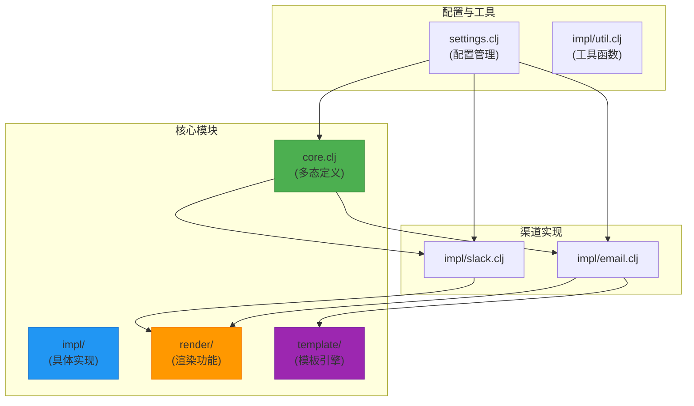
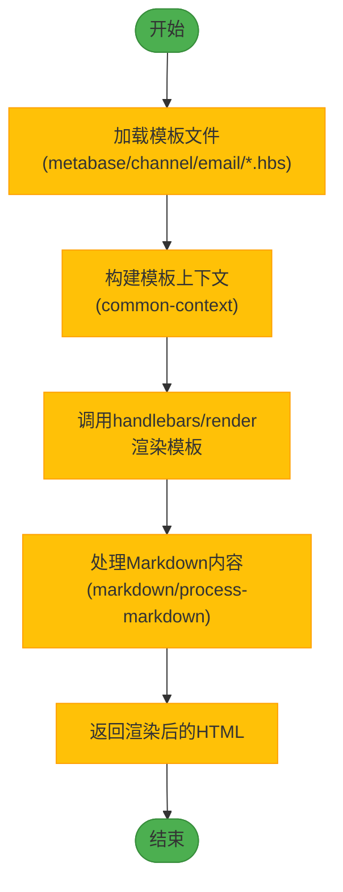
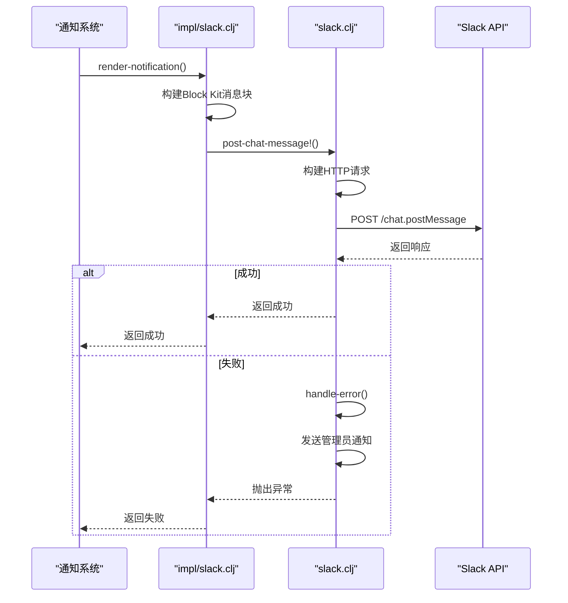
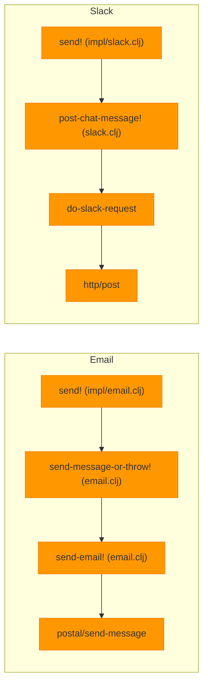
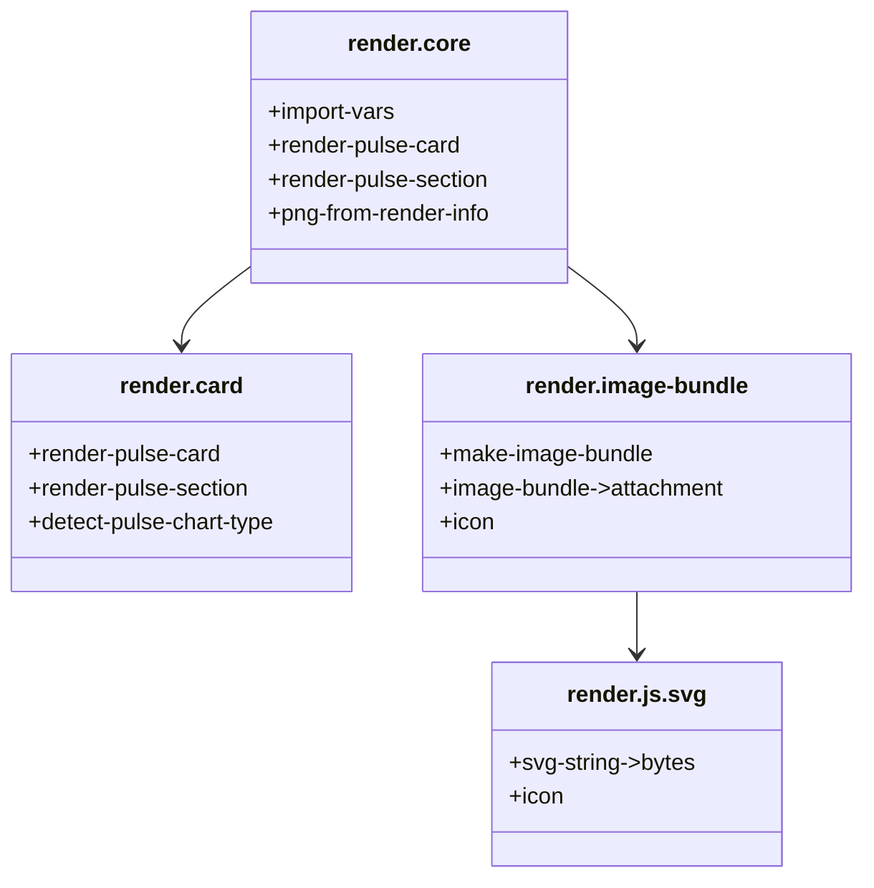
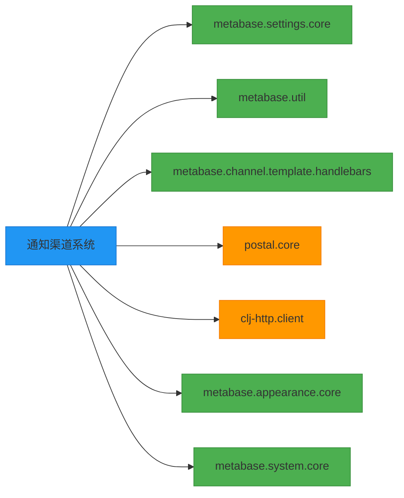

# 通知渠道 (Channel) 集成

<cite>
**本文档中引用的文件**  
- [core.clj](file://src/metabase/channel/core.clj)
- [email/messages.clj](file://src/metabase/channel/email/messages.clj)
- [slack.clj](file://src/metabase/channel/slack.clj)
- [impl/email.clj](file://src/metabase/channel/impl/email.clj)
- [impl/slack.clj](file://src/metabase/channel/impl/slack.clj)
- [settings.clj](file://src/metabase/channel/settings.clj)
- [render/core.clj](file://src/metabase/channel/render/core.clj)
- [template/core.clj](file://src/metabase/channel/template/core.clj)
- [email.clj](file://src/metabase/channel/email.clj)
- [init.clj](file://src/metabase/channel/init.clj)
- [notification/send.clj](file://src/metabase/notification/send.clj)
</cite>

## 目录
1. [简介](#简介)
2. [项目结构](#项目结构)
3. [核心组件](#核心组件)
4. [架构概述](#架构概述)
5. [详细组件分析](#详细组件分析)
6. [依赖分析](#依赖分析)
7. [性能考虑](#性能考虑)
8. [故障排除指南](#故障排除指南)
9. [结论](#结论)

## 简介
本文档详细介绍了Metabase通知渠道系统的实现，重点阐述了通过Email和Slack发送Pulse报表与警报的技术细节。系统采用多态分发机制，支持多种通知渠道，包括Email和Slack。核心功能包括消息分发、模板渲染、API交互、发送实现、配置管理、内容定制和错误处理。系统设计注重可扩展性和可靠性，通过重试机制和限流策略确保通知的稳定送达。

## 项目结构
通知渠道系统位于`src/metabase/channel/`目录下，采用模块化设计，各组件职责分明。



**Diagram sources**
- [core.clj](file://src/metabase/channel/core.clj)
- [impl/email.clj](file://src/metabase/channel/impl/email.clj)
- [impl/slack.clj](file://src/metabase/channel/impl/slack.clj)
- [render/core.clj](file://src/metabase/channel/render/core.clj)
- [template/core.clj](file://src/metabase/channel/template/core.clj)
- [settings.clj](file://src/metabase/channel/settings.clj)

**Section sources**
- [core.clj](file://src/metabase/channel/core.clj)
- [impl/email.clj](file://src/metabase/channel/impl/email.clj)
- [impl/slack.clj](file://src/metabase/channel/impl/slack.clj)
- [render/core.clj](file://src/metabase/channel/render/core.clj)
- [template/core.clj](file://src/metabase/channel/template/core.clj)
- [settings.clj](file://src/metabase/channel/settings.clj)

## 核心组件
通知渠道系统的核心是`core.clj`文件中定义的多态函数，它们构成了系统的骨架。`render-notification`函数负责将通知载荷转换为特定渠道的消息格式，而`send!`函数则负责将消息发送到指定渠道。这些多态函数的具体实现分布在`impl/`目录下的各个文件中，如`impl/email.clj`和`impl/slack.clj`。系统通过`init.clj`文件加载所有实现模块，确保它们在系统启动时被正确初始化。

**Section sources**
- [core.clj](file://src/metabase/channel/core.clj#L1-L42)
- [init.clj](file://src/metabase/channel/init.clj#L1-L12)

## 架构概述
通知渠道系统采用分层架构，从上到下分为应用层、核心层、实现层和外部服务层。应用层通过调用核心层的多态函数来触发通知。核心层根据通知类型和渠道类型，将请求分发到相应的实现层。实现层负责具体的渠道逻辑，如模板渲染、消息构建和API调用。外部服务层则代表了实际的邮件服务器和Slack API。

```mermaid
graph TD
A[应用层\n(触发通知)] --> B[核心层\n(core.clj)]
B --> C[实现层\n(impl/email.clj)]
B --> D[实现层\n(impl/slack.clj)]
C --> E[外部服务\n(SMTP服务器)]
D --> F[外部服务\n(Slack API)]
style A fill:#E8F5E8,stroke:#4CAF50
style B fill:#E3F2FD,stroke:#2196F3
style C fill:#FFF3E0,stroke:#FF9800
style D fill:#FFF3E0,stroke:#FF9800
style E fill:#F3E5F5,stroke:#9C27B0
style F fill:#F3E5F5,stroke:#9C27B0
```

**Diagram sources**
- [core.clj](file://src/metabase/channel/core.clj#L1-L42)
- [impl/email.clj](file://src/metabase/channel/impl/email.clj#L1-L325)
- [impl/slack.clj](file://src/metabase/channel/impl/slack.clj#L1-L203)

## 详细组件分析

### 消息分发机制分析
系统的核心是`core.clj`中定义的多态函数，它们实现了基于类型的消息分发。`render-notification`函数根据`channel-type`和`payload_type`两个参数来选择具体的实现。这种设计模式使得系统可以轻松地扩展新的通知类型和渠道，而无需修改核心逻辑。

```mermaid
classDiagram
class render-notification {
+channel-type
+notification-payload
+handler
+return Sequence of Messages
}
class send! {
+channel
+message
}
class can-connect? {
+channel-type
+details
+return Boolean
}
note right of render-notification
多态函数，根据channel-type和
payload_type选择具体实现
end
note right of send!
多态函数，根据channel的type
选择具体发送实现
end
```

**Diagram sources**
- [core.clj](file://src/metabase/channel/core.clj#L1-L42)

**Section sources**
- [core.clj](file://src/metabase/channel/core.clj#L1-L42)

### 邮件模板渲染逻辑分析
邮件模板渲染由`email/messages.clj`和`impl/email.clj`协同完成。`messages.clj`提供了各种预定义的邮件模板和上下文构建函数，而`impl/email.clj`则负责将通知载荷与模板结合，生成最终的HTML内容。系统使用Handlebars作为模板引擎，支持动态变量和条件渲染。



**Diagram sources**
- [email/messages.clj](file://src/metabase/channel/email/messages.clj#L1-L402)
- [impl/email.clj](file://src/metabase/channel/impl/email.clj#L1-L325)
- [template/core.clj](file://src/metabase/channel/template/core.clj#L1-L9)

**Section sources**
- [email/messages.clj](file://src/metabase/channel/email/messages.clj#L1-L402)
- [impl/email.clj](file://src/metabase/channel/impl/email.clj#L1-L325)
- [template/core.clj](file://src/metabase/channel/template/core.clj#L1-L9)

### Slack API交互流程分析
Slack API交互由`slack.clj`和`impl/slack.clj`共同实现。`slack.clj`封装了底层的HTTP请求，提供了`GET`和`POST`等便捷函数，并处理了错误和重试逻辑。`impl/slack.clj`则利用这些函数，实现了`post-chat-message!`等高层操作，并将通知内容转换为Slack的Block Kit格式。



**Diagram sources**
- [slack.clj](file://src/metabase/channel/slack.clj#L1-L337)
- [impl/slack.clj](file://src/metabase/channel/impl/slack.clj#L1-L203)

**Section sources**
- [slack.clj](file://src/metabase/channel/slack.clj#L1-L337)
- [impl/slack.clj](file://src/metabase/channel/impl/slack.clj#L1-L203)

### 具体发送实现分析
具体的发送实现位于`impl/email.clj`和`impl/slack.clj`中。`impl/email.clj`实现了`send!`多态函数，它调用`email/send-message-or-throw!`来发送邮件，并处理了附件、BCC等复杂逻辑。`impl/slack.clj`同样实现了`send!`函数，它将消息分块发送，以避免单次请求过大。



**Diagram sources**
- [impl/email.clj](file://src/metabase/channel/impl/email.clj#L1-L325)
- [email.clj](file://src/metabase/channel/email.clj#L1-L362)
- [impl/slack.clj](file://src/metabase/channel/impl/slack.clj#L1-L203)
- [slack.clj](file://src/metabase/channel/slack.clj#L1-L337)

**Section sources**
- [impl/email.clj](file://src/metabase/channel/impl/email.clj#L1-L325)
- [email.clj](file://src/metabase/channel/email.clj#L1-L362)
- [impl/slack.clj](file://src/metabase/channel/impl/slack.clj#L1-L203)
- [slack.clj](file://src/metabase/channel/slack.clj#L1-L337)

### 可视化渲染功能分析
可视化渲染功能由`render/`目录下的模块提供。`render/core.clj`是入口，它导入了`render/card.clj`和`render/image-bundle.clj`等模块。`render/card.clj`负责将卡片数据渲染为HTML或PNG，而`render/image-bundle.clj`则负责将SVG或HTML转换为可作为邮件附件的PNG图像。



**Diagram sources**
- [render/core.clj](file://src/metabase/channel/render/core.clj#L1-L35)
- [render/card.clj](file://src/metabase/channel/render/card.clj)
- [render/image-bundle.clj](file://src/metabase/channel/render/image_bundle.clj)
- [render/js/svg.clj](file://src/metabase/channel/render/js/svg.clj)

**Section sources**
- [render/core.clj](file://src/metabase/channel/render/core.clj#L1-L35)

## 依赖分析
通知渠道系统依赖于多个内部和外部模块。内部依赖包括`metabase.settings.core`用于配置管理，`metabase.util`提供各种工具函数，`metabase.channel.template.handlebars`用于模板渲染。外部依赖包括`postal.core`用于发送邮件，`clj-http.client`用于与Slack API通信。



**Diagram sources**
- [settings.clj](file://src/metabase/channel/settings.clj#L1-L320)
- [email.clj](file://src/metabase/channel/email.clj#L1-L362)
- [slack.clj](file://src/metabase/channel/slack.clj#L1-L337)
- [impl/email.clj](file://src/metabase/channel/impl/email.clj#L1-L325)
- [impl/slack.clj](file://src/metabase/channel/impl/slack.clj#L1-L203)

**Section sources**
- [settings.clj](file://src/metabase/channel/settings.clj#L1-L320)
- [email.clj](file://src/metabase/channel/email.clj#L1-L362)
- [slack.clj](file://src/metabase/channel/slack.clj#L1-L337)

## 性能考虑
系统在设计时考虑了性能和可靠性。`email.clj`中实现了基于`throttle.core`的邮件发送节流器，通过`email-max-recipients-per-second`设置来限制发送速率，防止被邮件服务器封禁。对于Slack API，系统实现了缓存机制，通过`slack-cached-channels-and-usernames`设置缓存频道和用户列表，避免频繁调用API。此外，`notification/send.clj`中的`channel-send-retrying!`函数实现了指数退避重试策略，确保在网络波动时通知仍能成功送达。

**Section sources**
- [email.clj](file://src/metabase/channel/email.clj#L1-L362)
- [settings.clj](file://src/metabase/channel/settings.clj#L1-L320)
- [slack.clj](file://src/metabase/channel/slack.clj#L1-L337)
- [notification/send.clj](file://src/metabase/notification/send.clj#L1-L463)

## 故障排除指南
当通知发送失败时，应首先检查相关配置。对于邮件，确认`email-smtp-host`等SMTP设置是否正确，并使用`check-and-update-settings`函数测试连接。对于Slack，确认`slack-app-token`有效，并检查`slack-token-valid?`设置。系统日志会记录详细的错误信息，如`Slack API error`或`Failed to send email`。如果遇到认证错误，系统会自动向管理员发送通知。对于重试失败的通知，可以在任务历史中查看详细的重试报告。

**Section sources**
- [email.clj](file://src/metabase/channel/email.clj#L1-L362)
- [slack.clj](file://src/metabase/channel/slack.clj#L1-L337)
- [settings.clj](file://src/metabase/channel/settings.clj#L1-L320)
- [notification/send.clj](file://src/metabase/notification/send.clj#L1-L463)

## 结论
Metabase的通知渠道系统是一个设计精良、功能完备的模块。它通过多态分发机制实现了渠道的可扩展性，通过模板引擎和渲染模块实现了内容的灵活性，通过重试和节流机制保证了系统的可靠性。该系统不仅支持Email和Slack，其架构也为未来集成更多通知渠道（如HTTP Webhook）奠定了坚实的基础。开发者在使用或扩展此系统时，应遵循其模块化设计原则，确保新功能与现有架构的无缝集成。