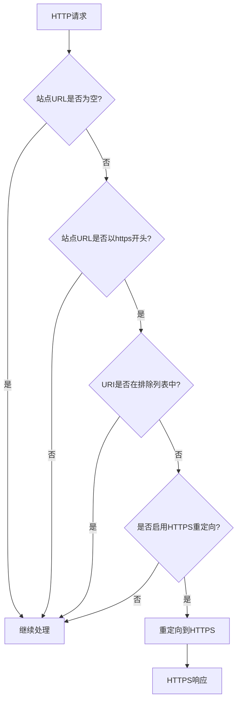
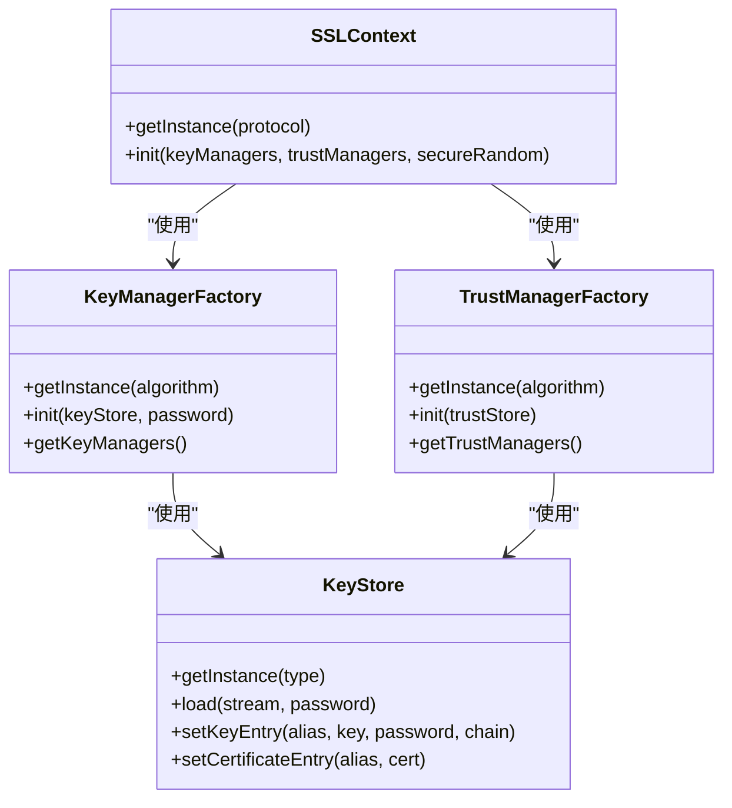
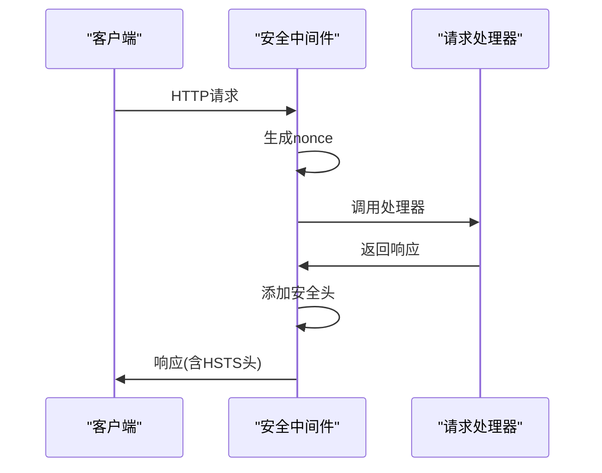
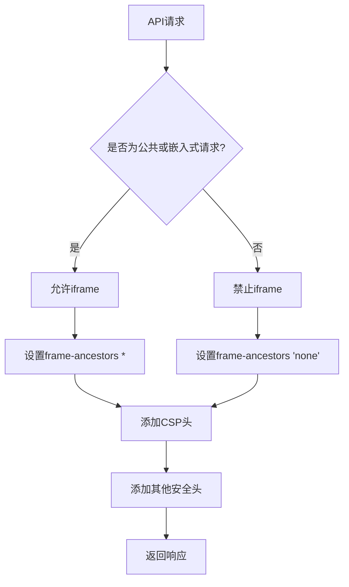
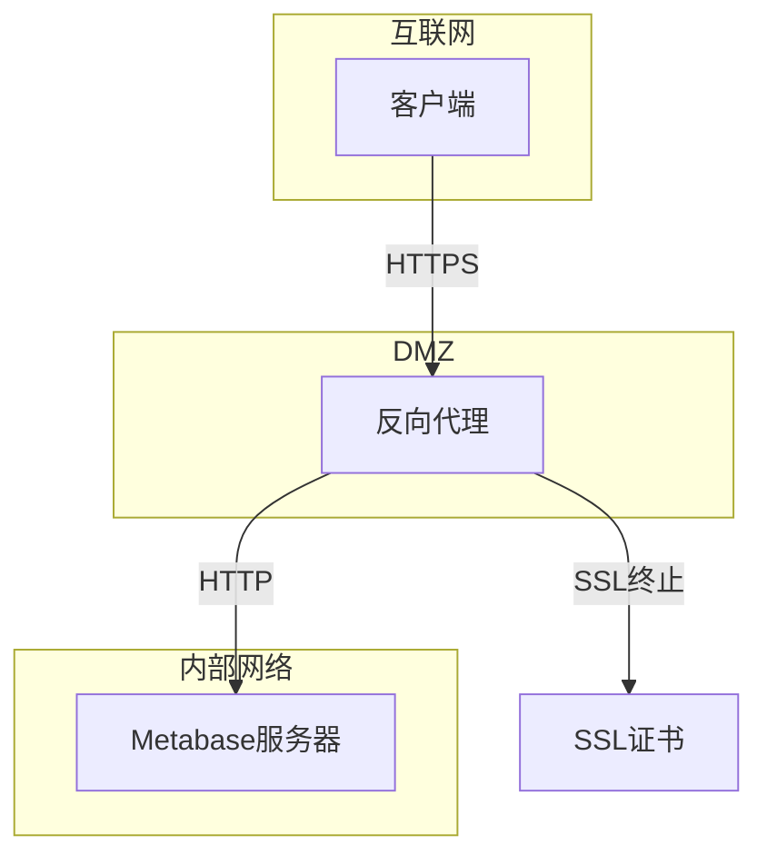

# 传输安全

<cite>
**本文档引用的文件**
- [ssl.clj](file://src/metabase/server/middleware/ssl.clj)
- [security.clj](file://src/metabase/server/middleware/security.clj)
- [util.clj](file://src/metabase/driver/util.clj)
- [settings.clj](file://src/metabase/server/settings.clj)
- [request.clj](file://src/metabase/request/util.clj)
- [other-env-vars.md](file://src/metabase/cmd/resources/other-env-vars.md)
- [instance.clj](file://src/metabase/server/instance.clj)
</cite>

## 目录
1. [引言](#引言)
2. [HTTPS/SSL/TLS配置与强制策略](#httpsssltls配置与强制策略)
3. [HSTS头实现](#hsts头实现)
4. [API端点传输安全](#api端点传输安全)
5. [安全网络部署架构建议](#安全网络部署架构建议)
6. [常见传输安全漏洞防范](#常见传输安全漏洞防范)
7. [结论](#结论)

## 引言
Metabase是一个开源的数据分析和可视化平台，其传输层安全机制对于保护用户数据和系统完整性至关重要。本文档全面分析Metabase的传输安全实现，涵盖HTTPS/SSL/TLS配置、HSTS头实现、API端点安全要求以及安全部署建议。通过深入研究代码库，我们将揭示Metabase如何确保数据在传输过程中的机密性、完整性和可用性。

## HTTPS/SSL/TLS配置与强制策略

Metabase实现了全面的HTTPS/SSL/TLS配置和强制策略，确保所有敏感数据通过加密通道传输。系统通过中间件和配置选项来管理SSL/TLS设置，支持多种数据库连接的SSL模式。

### HTTPS重定向机制
Metabase通过`redirect-to-https-middleware`中间件实现HTTPS重定向。当站点URL配置为HTTPS且`redirect-all-requests-to-https`设置为true时，所有HTTP请求将被重定向到HTTPS。该中间件会检查请求的URI，对于健康检查端点（如`/api/health`、`/livez`、`/readyz`）不会强制重定向，以确保监控系统正常工作。



**Diagram sources**
- [ssl.clj](file://src/metabase/server/middleware/ssl.clj#L34-L51)

### SSL/TLS协议版本与加密套件
Metabase使用Java的SSLContext API来创建安全的SSL/TLS连接。在`ssl-context`函数中，系统创建TLS实例并初始化密钥管理器和信任管理器。这确保了使用现代TLS协议版本（如TLS 1.2或更高版本），避免使用已知不安全的旧版本。

对于数据库连接，Metabase支持多种SSL模式，包括：
- `require`：要求SSL连接，但不验证证书
- `verify-ca`：验证证书颁发机构
- `verify-full`：完全验证证书，包括主机名



**Diagram sources**
- [util.clj](file://src/metabase/driver/util.clj#L616-L645)

### 证书管理
Metabase提供了灵活的证书管理机制，支持自定义SSL证书和信任库。系统通过`generate-identity-store`和`generate-trust-store`函数来处理证书存储：

- `generate-identity-store`：创建包含私钥和证书的身份存储
- `generate-trust-store`：创建包含信任证书的存储，包括内置证书和自定义证书

这些函数支持PEM格式的证书和PKCS-8/DER格式的私钥，允许用户上传自己的证书文件。

**Section sources**
- [util.clj](file://src/metabase/driver/util.clj#L591-L617)

## HSTS头实现

Metabase实现了HTTP严格传输安全（HSTS）头，以增强传输层安全性。HSTS头确保浏览器只通过HTTPS访问Metabase实例，防止中间人攻击和SSL剥离攻击。

### HSTS头配置
在`security.clj`文件中，Metabase定义了严格的HSTS头：

```clojure
(def ^:private ^:const strict-transport-security-header
  "Tell browsers to only access this resource over HTTPS for the next year (prevent MTM attacks). (This only applies if
  the original request was HTTPS; if sent in response to an HTTP request, this is simply ignored)"
  {"Strict-Transport-Security" "max-age=31536000"})
```

该配置设置了31536000秒（约一年）的max-age，指示浏览器在指定时间内只通过HTTPS访问资源。

### HSTS头应用
HSTS头通过`add-security-headers`中间件应用到所有响应中。该中间件在处理请求时，会将HSTS头与其他安全头一起添加到响应中：



**Diagram sources**
- [security.clj](file://src/metabase/server/middleware/security.clj#L54-L83)

### HSTS头条件应用
HSTS头仅在原始请求通过HTTPS时应用。如果请求通过HTTP发送，HSTS头将被忽略，这是HSTS规范的要求。这种设计防止了在不安全连接上发送HSTS策略，确保安全策略的完整性。

**Section sources**
- [security.clj](file://src/metabase/server/middleware/security.clj#L54-L83)

## API端点传输安全

Metabase对API端点实施了严格的传输安全要求，确保所有API通信都通过安全通道进行，并应用适当的安全头。

### API端点安全头
Metabase为API响应添加了多种安全头，包括：

- **内容安全策略（CSP）**：限制可执行的脚本来源，防止XSS攻击
- **X-Frame-Options**：防止点击劫持攻击
- **X-XSS-Protection**：启用浏览器的XSS过滤器
- **X-Content-Type-Options**：防止MIME类型混淆攻击
- **Access-Control-Allow-Origin**：控制跨域资源共享



**Diagram sources**
- [security.clj](file://src/metabase/server/middleware/security.clj#L283-L306)

### 认证与会话安全
API端点的安全性还体现在认证和会话管理上。Metabase使用安全的会话cookie，当通过HTTPS访问时，cookie会标记为secure和SameSite=None，允许跨域使用：

```clojure
(if (request/https? request)
  {:same-site :none, :secure true}
  {:same-site :lax})
```

这种配置确保了在安全连接上，嵌入式内容可以正常工作，同时防止CSRF攻击。

**Section sources**
- [browser_cookie.clj](file://src/metabase/server/middleware/browser_cookie.clj#L26-L45)

### CORS策略
Metabase实现了灵活的CORS（跨域资源共享）策略，允许配置批准的来源。系统通过`approved-origin?`函数验证来源，支持通配符和端口匹配：

```clojure
(defn approved-domain?
  "Checks if the domain is compatible with the reference one"
  [domain reference-domain]
  (or (= reference-domain "*")
      (if (str/starts-with? reference-domain "*.")
        (str/ends-with? domain (str/replace-first reference-domain "*." "."))
        (= domain reference-domain))))
```

这种实现允许管理员配置特定的域名或使用通配符来允许子域名。

**Section sources**
- [security.clj](file://src/metabase/server/middleware/security.clj#L198-L235)

## 安全网络部署架构建议

基于Metabase的传输安全实现，我们提出以下安全网络部署架构建议，以最大化系统的安全性。

### 反向代理配置
推荐在Metabase前面部署反向代理（如Nginx或Apache），以处理SSL终止和负载均衡。反向代理应配置以下安全特性：

1. **SSL/TLS终结**：在反向代理层处理SSL/TLS，使用最新的TLS版本和强加密套件
2. **HSTS预加载**：将站点提交到HSTS预加载列表，确保浏览器始终使用HTTPS
3. **OCSP装订**：启用OCSP装订以提高证书验证性能
4. **HTTP/2支持**：启用HTTP/2以提高性能和安全性



**Diagram sources**
- [ssl.clj](file://src/metabase/server/middleware/ssl.clj)
- [security.clj](file://src/metabase/server/middleware/security.clj)

### 环境变量安全配置
Metabase支持通过环境变量配置安全设置，建议使用以下关键环境变量：

- `MB_JETTY_SSL=true`：启用Jetty的SSL支持
- `MB_JETTY_SSL_PORT`：配置HTTPS端口
- `MB_JETTY_SSL_KEYSTORE`：指定密钥库文件路径
- `MB_JETTY_SSL_KEYSTORE_PASSWORD`：密钥库密码
- `MB_JETTY_SSL_TRUSTSTORE`：信任库文件路径
- `MB_JETTY_SKIP_SNI=true`：跳过SNI检查（默认）

这些环境变量允许在不修改代码的情况下配置SSL/TLS设置。

**Section sources**
- [other-env-vars.md](file://src/metabase/cmd/resources/other-env-vars.md#L430-L467)

### 安全组和防火墙规则
部署Metabase时，应配置严格的安全组和防火墙规则：

1. **入站规则**：
   - 仅允许443端口（HTTPS）的外部访问
   - 限制管理端口（如3000）的访问IP范围
   - 禁止直接访问数据库端口

2. **出站规则**：
   - 仅允许必要的出站连接（如数据库、认证服务）
   - 限制到特定IP范围的连接

3. **内部通信**：
   - 使用私有网络进行内部服务通信
   - 实施网络分段，隔离不同安全级别的服务

## 常见传输安全漏洞防范

Metabase的传输安全机制设计用于防范多种常见的安全漏洞，以下是主要防范措施。

### 中间人攻击（MITM）防范
通过实施HSTS和严格的证书验证，Metabase有效防范中间人攻击：

- **HSTS**：强制浏览器使用HTTPS，防止SSL剥离
- **证书验证**：支持CA验证和完全验证模式
- **公钥固定**：虽然不推荐使用HPKP，但支持通过`MB_SSL_CERTIFICATE_PUBLIC_KEY`环境变量配置

### 跨站脚本（XSS）攻击防范
Metabase通过多种机制防范XSS攻击：

- **内容安全策略（CSP）**：限制脚本来源，使用nonce和哈希白名单
- **X-XSS-Protection**：启用浏览器的XSS过滤器
- **输入验证**：对所有用户输入进行验证和清理

```clojure
{"Content-Security-Policy"
 (str/join
  (for [[k vs] {:default-src  ["'none'"]
                :script-src   (concat
                               ["'self'"]
                               (map (partial format "'sha256-%s'") inline-js-hashes)))
                :style-src    ["'self'"
                               (when nonce
                                 (format "'nonce-%s'" nonce))]
                :frame-src    (parse-allowed-iframe-hosts (server.settings/allowed-iframe-hosts))}]
    (format "%s %s; " (name k) (str/join " " vs))))}
```

**Section sources**
- [security.clj](file://src/metabase/server/middleware/security.clj#L100-L150)

### 点击劫持攻击防范
通过X-Frame-Options头和CSP的frame-ancestors指令，Metabase防范点击劫持攻击：

- 默认设置`X-Frame-Options: DENY`，禁止在iframe中显示
- 对于嵌入式场景，使用`ALLOW-FROM`指定允许的来源
- CSP的frame-ancestors提供更灵活的控制

### 会话劫持防范
Metabase实施了多种措施防范会话劫持：

- **安全cookie**：HTTPS连接上设置secure标志
- **SameSite属性**：防止跨站请求伪造
- **会话超时**：通过`MAX_SESSION_AGE`环境变量配置会话有效期
- **IP绑定**：可选地将会话与客户端IP绑定

## 结论
Metabase的传输安全机制全面而强大，涵盖了从HTTPS重定向到HSTS、从证书管理到API安全的各个方面。通过中间件架构和灵活的配置选项，Metabase能够在不同部署环境中提供一致的安全保障。

关键安全特性包括：
1. **自动HTTPS重定向**：确保所有流量通过加密通道
2. **严格的HSTS策略**：防止中间人攻击
3. **全面的安全头**：防范XSS、点击劫持等常见攻击
4. **灵活的SSL/TLS配置**：支持多种数据库连接的安全设置
5. **环境变量安全**：通过环境变量实现安全配置

建议部署时结合反向代理使用，将SSL/TLS终止放在边缘层，同时遵循最小权限原则配置防火墙规则。定期更新证书和监控安全日志也是保持系统安全的重要措施。

通过正确配置和部署，Metabase能够为用户提供安全可靠的数据分析服务，保护敏感数据免受传输过程中的各种威胁。