# 匿名统计与监控集成

<cite>
**本文档中引用的文件**
- [src/metabase/analytics/init.clj](file://src/metabase/analytics/init.clj)
- [src/metabase/analytics/core.clj](file://src/metabase/analytics/core.clj)
- [src/metabase/analytics/task/send_anonymous_stats.clj](file://src/metabase/analytics/task/send_anonymous_stats.clj)
- [src/metabase/analytics/prometheus.clj](file://src/metabase/analytics/prometheus.clj)
- [src/metabase/analytics/snowplow.clj](file://src/metabase/analytics/snowplow.clj)
- [src/metabase/analytics/settings.clj](file://src/metabase/analytics/settings.clj)
- [src/metabase/analytics/stats.clj](file://src/metabase/analytics/stats.clj)
- [src/metabase/analytics/quartz.clj](file://src/metabase/analytics/quartz.clj)
- [src/metabase/analytics/sdk.clj](file://src/metabase/analytics/sdk.clj)
- [src/metabase/analytics/api.clj](file://src/metabase/analytics/api.clj)
</cite>

## 目录
1. [简介](#简介)
2. [架构概览](#架构概览)
3. [核心组件分析](#核心组件分析)
4. [匿名统计收集机制](#匿名统计收集机制)
5. [Prometheus集成](#prometheus集成)
6. [Snowplow事件跟踪](#snowplow事件跟踪)
7. [任务调度机制](#任务调度机制)
8. [数据脱敏与隐私保护](#数据脱敏与隐私保护)
9. [配置管理](#配置管理)
10. [监控与调试](#监控与调试)
11. [故障排除指南](#故障排除指南)
12. [总结](#总结)

## 简介

Metabase的匿名统计与监控集成模块是一个综合性的数据分析和监控系统，旨在收集匿名使用统计数据以支持产品改进，同时提供实时的系统性能监控。该模块通过多个独立但协调的子系统实现功能：匿名统计收集、Prometheus指标暴露、Snowplow事件跟踪以及嵌入式SDK监控。

该系统设计遵循最小化数据收集原则，在确保产品改进所需信息的同时，严格遵守隐私保护要求。所有数据收集都经过用户明确同意，并提供完全的透明度和控制权。

## 架构概览

匿名统计与监控集成采用模块化架构，各组件职责明确且相互协作：

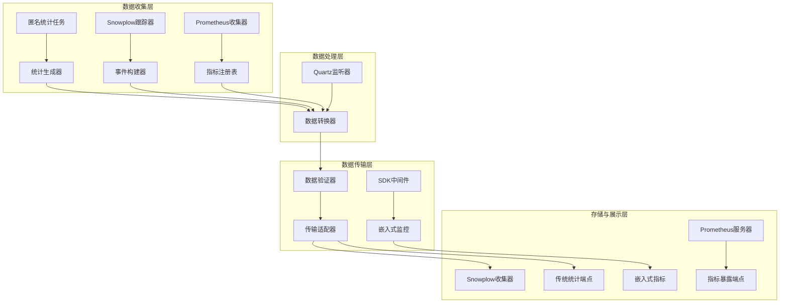

**图表来源**
- [src/metabase/analytics/core.clj](file://src/metabase/analytics/core.clj#L1-L59)
- [src/metabase/analytics/task/send_anonymous_stats.clj](file://src/metabase/analytics/task/send_anonymous_stats.clj#L1-L41)

## 核心组件分析

### 初始化模块

初始化模块负责启动和配置所有监控组件：

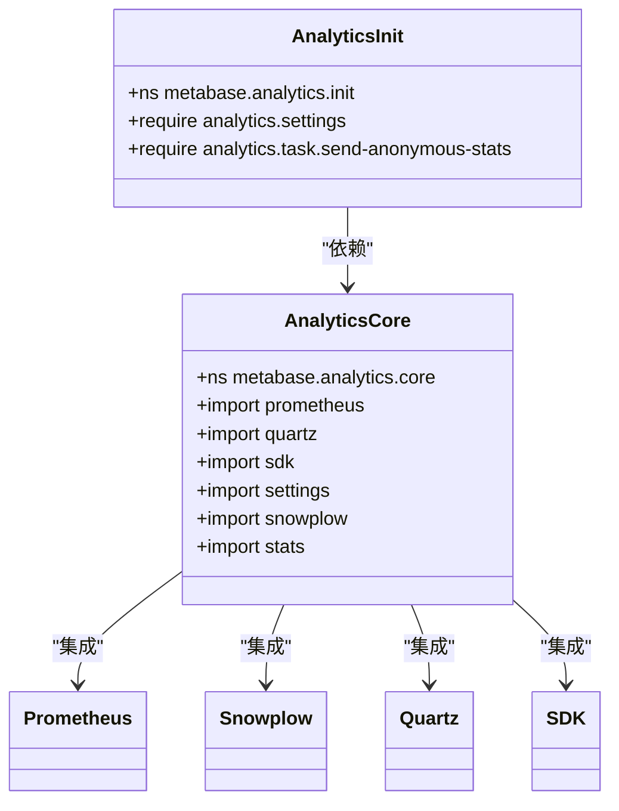

**图表来源**
- [src/metabase/analytics/init.clj](file://src/metabase/analytics/init.clj#L1-L5)
- [src/metabase/analytics/core.clj](file://src/metabase/analytics/core.clj#L1-L15)

**章节来源**
- [src/metabase/analytics/init.clj](file://src/metabase/analytics/init.clj#L1-L5)
- [src/metabase/analytics/core.clj](file://src/metabase/analytics/core.clj#L1-L59)

### 设置管理

设置管理系统提供了灵活的配置选项，支持运行时动态调整：

| 配置项 | 类型 | 默认值 | 描述 |
|--------|------|--------|------|
| `anon-tracking-enabled` | 布尔值 | true | 启用匿名使用数据收集 |
| `snowplow-available` | 布尔值 | 生产环境为true | Snowplow收集器可用性 |
| `snowplow-enabled` | 布尔值 | 自动计算 | 实际是否发送Snowplow事件 |
| `snowplow-url` | 字符串 | 生产环境URL | Snowplow收集器地址 |
| `prometheus-server-port` | 整数 | 无 | Prometheus指标暴露端口 |

**章节来源**
- [src/metabase/analytics/settings.clj](file://src/metabase/analytics/settings.clj#L28-L89)

## 匿名统计收集机制

### send_anonymous_stats任务

匿名统计收集的核心是定期执行的统计任务，该任务负责收集和发送使用数据：

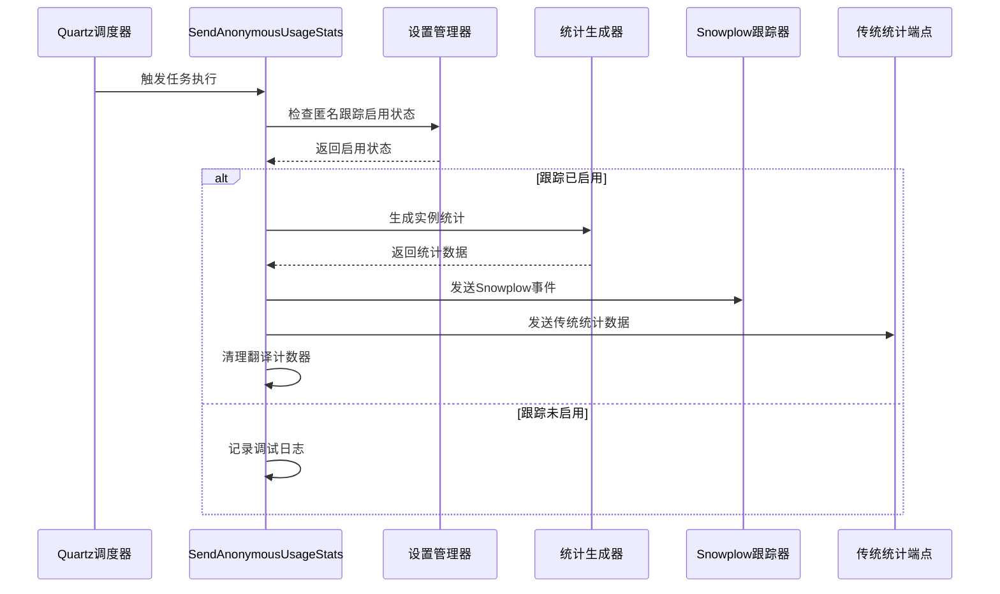

**图表来源**
- [src/metabase/analytics/task/send_anonymous_stats.clj](file://src/metabase/analytics/task/send_anonymous_stats.clj#L14-L25)

### 数据收集范围

统计收集涵盖以下关键维度：

| 统计类别 | 收集指标 | 数据类型 | 用途 |
|----------|----------|----------|------|
| 用户统计 | 总用户数、活跃用户、管理员数量 | 数值计数 | 用户规模分析 |
| 数据库统计 | 连接池状态、数据库引擎类型 | 结构化数据 | 技术栈分析 |
| 查询统计 | 执行次数、成功率、延迟分布 | 时间序列数据 | 性能监控 |
| 内容统计 | 仪表板数量、问题数量、集合数量 | 分类计数 | 功能使用情况 |
| 系统统计 | 内存使用、处理器数量、部署模型 | 系统元数据 | 基础设施分析 |

**章节来源**
- [src/metabase/analytics/stats.clj](file://src/metabase/analytics/stats.clj#L150-L300)

## Prometheus集成

### 指标收集架构

Prometheus集成提供了实时的系统性能监控能力：

```mermaid
graph LR
subgraph "指标源"
A[JVM指标] --> D[指标注册表]
B[Jetty指标] --> D
C[C3P0连接池] --> D
E[应用特定指标] --> D
F[Quartz任务] --> D
end
subgraph "指标处理"
D --> G[标签标准化]
G --> H[数值验证]
H --> I[时间戳添加]
end
subgraph "指标暴露"
I --> J[HTTP服务器]
J --> K[/metrics端点]
K --> L[Prometheus抓取]
end
```

**图表来源**
- [src/metabase/analytics/prometheus.clj](file://src/metabase/analytics/prometheus.clj#L400-L500)

### 关键监控指标

Prometheus系统暴露以下核心指标类别：

| 指标类别 | 具体指标 | 类型 | 描述 |
|----------|----------|------|------|
| JVM指标 | `metabase_application/jvm_gc` | 计数器 | 垃圾回收统计 |
| 连接池指标 | `metabase_database/c3p0_*` | 指标组 | 数据库连接池状态 |
| 应用指标 | `metabase-query-processor/query` | 计数器 | 查询执行统计 |
| 搜索指标 | `metabase-search/*` | 多类别 | 搜索功能使用情况 |
| 通知指标 | `metabase-notification/*` | 多类别 | 通知系统性能 |

**章节来源**
- [src/metabase/analytics/prometheus.clj](file://src/metabase/analytics/prometheus.clj#L300-L450)

### Prometheus配置

Prometheus集成支持以下配置选项：

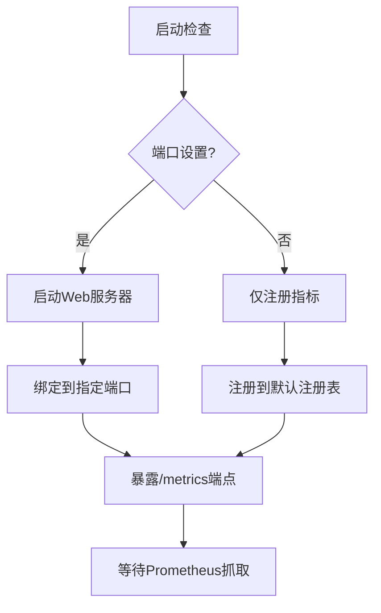

**图表来源**
- [src/metabase/analytics/prometheus.clj](file://src/metabase/analytics/prometheus.clj#L600-L667)

## Snowplow事件跟踪

### 事件跟踪架构

Snowplow集成实现了企业级的事件跟踪和分析：

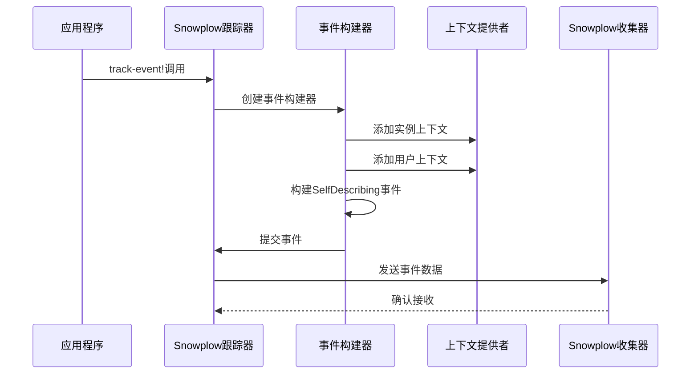

**图表来源**
- [src/metabase/analytics/snowplow.clj](file://src/metabase/analytics/snowplow.clj#L145-L160)

### 事件分类体系

Snowplow系统支持多种事件类型的分类：

| 事件类型 | Schema版本 | 主要用途 | 数据结构 |
|----------|------------|----------|----------|
| instance_stats | 2.0.0 | 实例统计报告 | 完整的使用统计 |
| dashboard | 1.1.4 | 仪表板操作 | 仪表板生命周期事件 |
| database | 1.0.1 | 数据库连接 | 连接和同步事件 |
| account | 1.0.1 | 账户活动 | 用户账户相关事件 |
| search | 1.0.1 | 搜索行为 | 搜索查询和结果 |
| llm_usage | 1.0.0 | AI功能使用 | 大语言模型交互 |

**章节来源**
- [src/metabase/analytics/snowplow.clj](file://src/metabase/analytics/snowplow.clj#L30-L50)

### 数据传输安全

Snowplow事件传输采用多层安全措施：

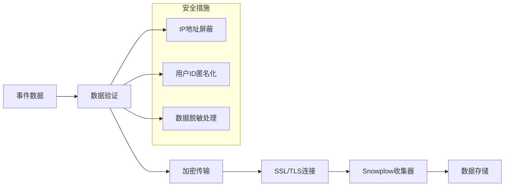

**图表来源**
- [src/metabase/analytics/snowplow.clj](file://src/metabase/analytics/snowplow.clj#L80-L120)

## 任务调度机制

### Quartz集成

任务调度系统基于Quartz框架实现，提供可靠的任务执行保障：

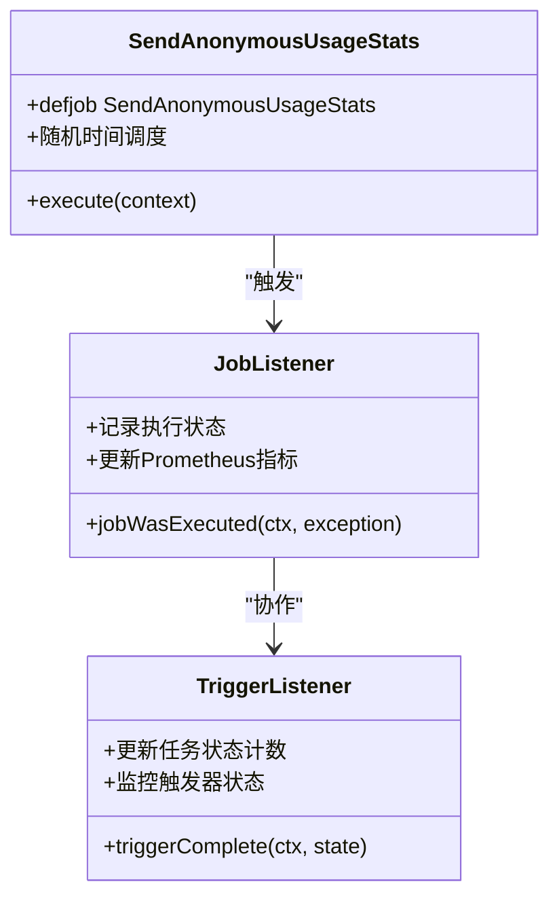

**图表来源**
- [src/metabase/analytics/task/send_anonymous_stats.clj](file://src/metabase/analytics/task/send_anonymous_stats.clj#L14-L40)
- [src/metabase/analytics/quartz.clj](file://src/metabase/analytics/quartz.clj#L20-L50)

### 调度策略

任务调度采用智能的时间分布策略：

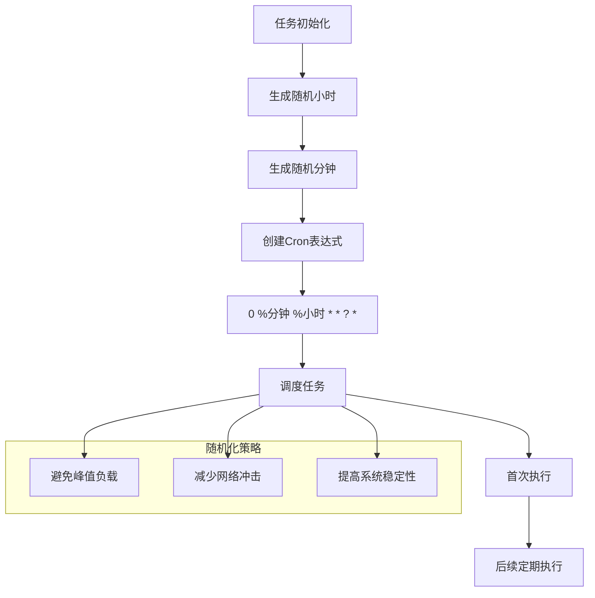

**图表来源**
- [src/metabase/analytics/task/send_anonymous_stats.clj](file://src/metabase/analytics/task/send_anonymous_stats.clj#L25-L40)

**章节来源**
- [src/metabase/analytics/task/send_anonymous_stats.clj](file://src/metabase/analytics/task/send_anonymous_stats.clj#L1-L41)
- [src/metabase/analytics/quartz.clj](file://src/metabase/analytics/quartz.clj#L1-L93)

## 数据脱敏与隐私保护

### 隐私保护策略

系统实施多层次的数据脱敏和隐私保护措施：

| 保护层级 | 措施 | 实现方式 | 适用场景 |
|----------|------|----------|----------|
| IP地址脱敏 | 本地回环地址替换 | 127.0.0.1 | 所有事件 |
| 用户标识 | 用户ID匿名化 | UUID转换 | 用户相关事件 |
| 数据传输 | SSL加密 | HTTPS协议 | 所有网络通信 |
| 存储限制 | 最小数据保留 | 及时清理 | 历史数据处理 |

### 数据最小化原则

系统严格遵循数据最小化原则：

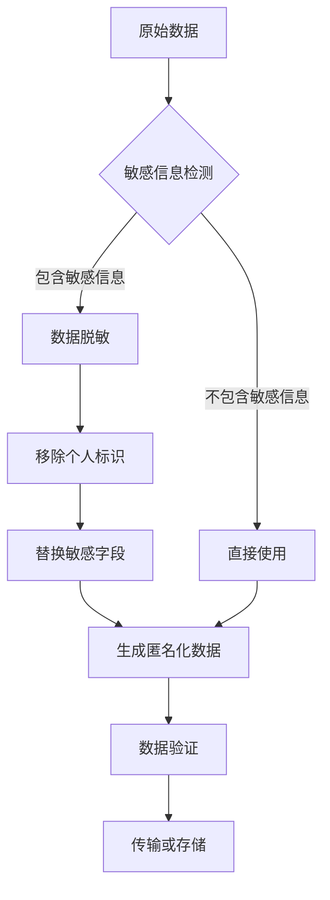

**图表来源**
- [src/metabase/analytics/snowplow.clj](file://src/metabase/analytics/snowplow.clj#L90-L120)

**章节来源**
- [src/metabase/analytics/snowplow.clj](file://src/metabase/analytics/snowplow.clj#L90-L120)

## 配置管理

### 启用和禁用监控

监控功能可以通过多种方式进行配置：

#### 环境变量配置

```bash
# 启用匿名跟踪
MB_ANON_TRACKING_ENABLED=true

# 配置Prometheus端口
MB_PROMETHEUS_SERVER_PORT=9091

# 配置Snowplow收集器
MB_SNOWPLOW_URL=https://custom-collector.example.com
```

#### 运行时配置

```clojure
;; 启用匿名跟踪
(metabase.analytics.settings/anon-tracking-enabled! true)

;; 获取当前配置状态
(metabase.analytics.settings/anon-tracking-enabled)
```

### 自定义监控项

系统支持扩展自定义监控指标：

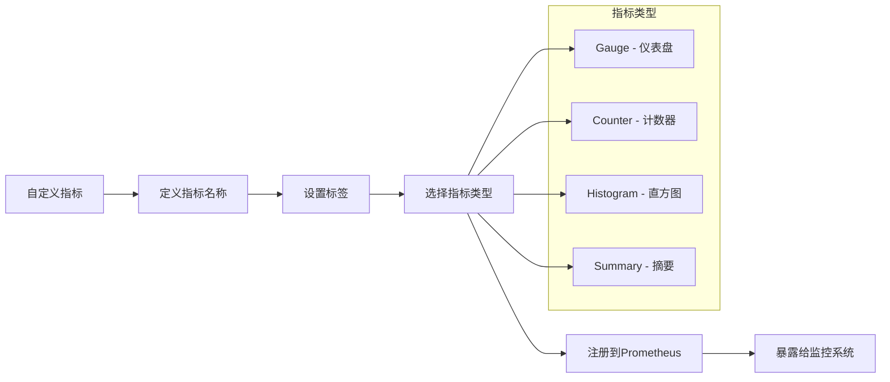

**图表来源**
- [src/metabase/analytics/prometheus.clj](file://src/metabase/analytics/prometheus.clj#L550-L600)

**章节来源**
- [src/metabase/analytics/settings.clj](file://src/metabase/analytics/settings.clj#L1-L110)
- [src/metabase/analytics/prometheus.clj](file://src/metabase/analytics/prometheus.clj#L550-L667)

## 监控与调试

### 嵌入式SDK监控

SDK监控系统专门针对嵌入式场景提供详细的使用分析：

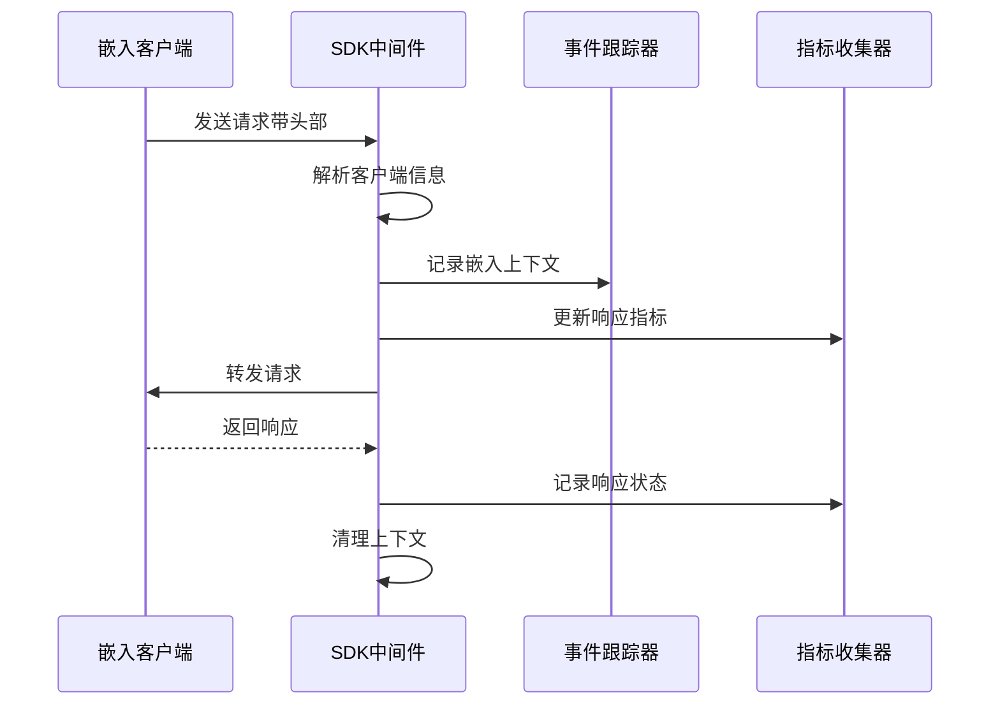

**图表来源**
- [src/metabase/analytics/sdk.clj](file://src/metabase/analytics/sdk.clj#L50-L80)

### 调试工具

系统提供多种调试和诊断工具：

| 工具类型 | 功能描述 | 使用方法 | 输出格式 |
|----------|----------|----------|----------|
| 日志记录 | 事件跟踪日志 | 启用DEBUG级别日志 | 结构化JSON |
| API端点 | 匿名统计查看 | GET /api/analytics/anonymous-stats | JSON格式 |
| Prometheus端点 | 指标导出 | GET :port/metrics | 文本格式 |
| 事件验证 | Snowplow事件验证 | 测试模式运行 | 控制台输出 |

**章节来源**
- [src/metabase/analytics/api.clj](file://src/metabase/analytics/api.clj#L1-L14)
- [src/metabase/analytics/sdk.clj](file://src/metabase/analytics/sdk.clj#L1-L80)

## 故障排除指南

### 常见问题诊断

#### 匿名统计无法发送

**症状**: 统计数据没有发送到远程服务器

**排查步骤**:
1. 检查匿名跟踪是否启用
2. 验证网络连接和防火墙设置
3. 确认Snowplow收集器可用性
4. 查看错误日志中的具体异常

**解决方案**:
```clojure
;; 检查配置状态
(metabase.analytics.settings/anon-tracking-enabled)
(metabase.analytics.settings/snowplow-enabled)

;; 强制重新初始化
(require '[metabase.analytics.init :as init])
(init/init!)
```

#### Prometheus指标缺失

**症状**: Prometheus无法抓取指标

**排查步骤**:
1. 检查Prometheus端口配置
2. 验证HTTP服务器状态
3. 确认指标注册成功
4. 检查防火墙规则

**解决方案**:
```bash
# 检查端口占用
netstat -tlnp | grep :9091

# 验证指标端点
curl http://localhost:9091/metrics
```

### 性能优化建议

#### 减少网络开销

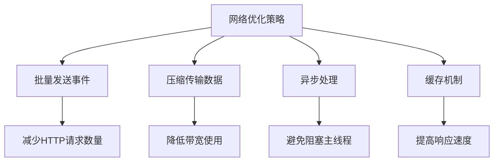

#### 内存使用优化

系统采用以下策略优化内存使用：
- 延迟加载非关键指标
- 定期清理过期数据
- 使用对象池管理资源
- 实施垃圾回收优化

**章节来源**
- [src/metabase/analytics/stats.clj](file://src/metabase/analytics/stats.clj#L980-L1005)

## 总结

Metabase的匿名统计与监控集成模块是一个功能完整、设计精良的监控解决方案。它成功地平衡了产品改进需求和用户隐私保护，通过以下特点体现了其价值：

### 核心优势

1. **模块化设计**: 各组件职责明确，便于维护和扩展
2. **隐私优先**: 严格的数据脱敏和最小化收集原则
3. **实时监控**: Prometheus集成提供即时的系统状态反馈
4. **事件驱动**: Snowplow事件跟踪支持复杂的分析场景
5. **可配置性**: 灵活的配置选项满足不同部署需求

### 最佳实践建议

1. **定期审查**: 定期检查收集的数据类型和频率
2. **性能监控**: 利用Prometheus指标监控系统性能
3. **安全审计**: 定期审计数据传输和存储安全性
4. **用户沟通**: 向用户清晰说明数据收集的目的和范围

该模块为Metabase提供了强大的数据分析和监控能力，同时确保了用户隐私和数据安全的最佳实践。通过持续的优化和改进，它将继续为产品的持续发展提供重要支持。