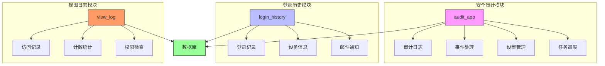
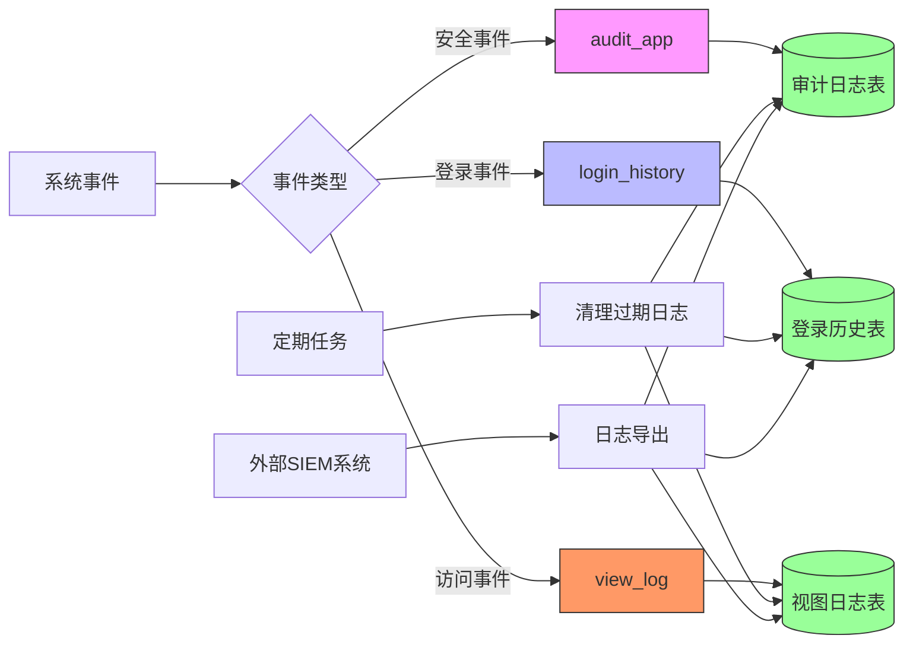
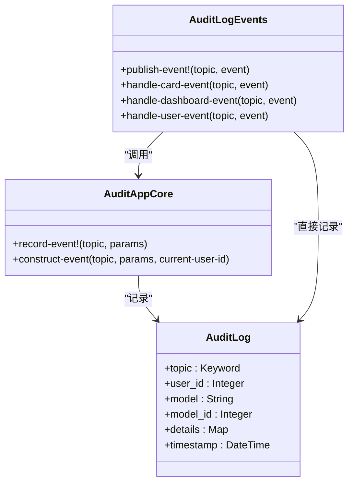
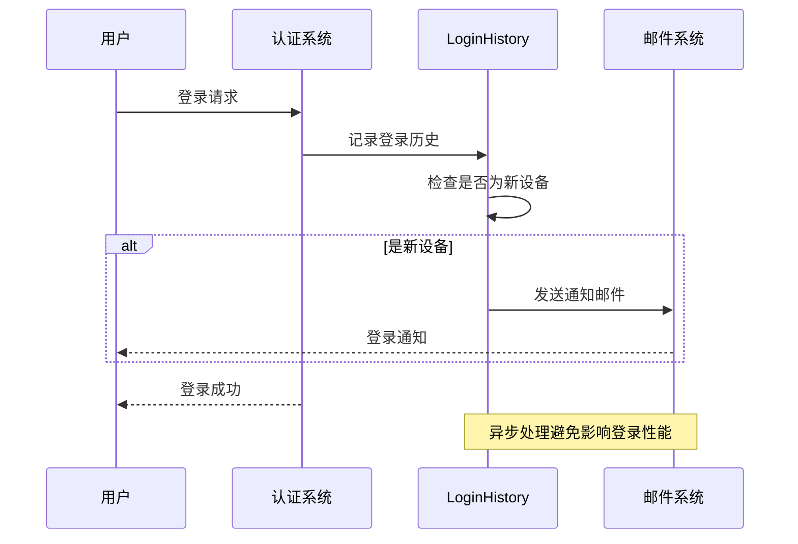
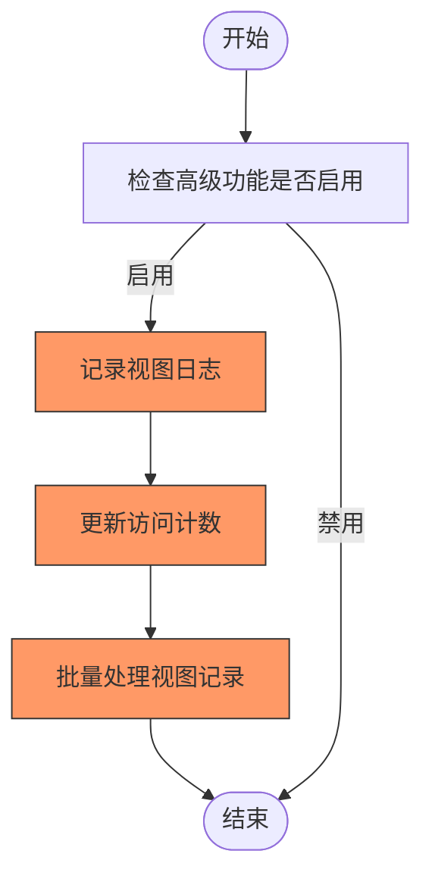
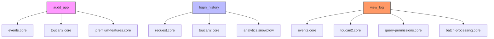

# 安全审计与监控

<cite>
**本文档引用的文件**
- [audit_log.clj](file://src/metabase/audit_app/models/audit_log.clj)
- [audit_log.clj](file://src/metabase/audit_app/events/audit_log.clj)
- [core.clj](file://src/metabase/audit_app/core.clj)
- [settings.clj](file://src/metabase/audit_app/settings.clj)
- [truncate_audit_tables.clj](file://src/metabase/audit_app/task/truncate_audit_tables.clj)
- [login_history.clj](file://src/metabase/login_history/models/login_history.clj)
- [record.clj](file://src/metabase/login_history/record.clj)
- [core.clj](file://src/metabase/login_history/core.clj)
- [view_log.clj](file://src/metabase/view_log/events/view_log.clj)
- [view_log_impl.clj](file://src/metabase/view_log/models/view_log_impl.clj)
- [core.clj](file://src/metabase/view_log/core.clj)
</cite>

## 目录
1. [简介](#简介)
2. [项目结构](#项目结构)
3. [核心组件](#核心组件)
4. [架构概述](#架构概述)
5. [详细组件分析](#详细组件分析)
6. [依赖分析](#依赖分析)
7. [性能考虑](#性能考虑)
8. [故障排除指南](#故障排除指南)
9. [结论](#结论)

## 简介
本文档详细说明了Metabase系统中的安全审计与监控机制，重点关注`audit_app`、`login_history`和`view_log`模块的实现。这些模块共同构成了系统的安全审计基础，记录关键安全事件、用户登录历史和资源访问日志，为安全审计、异常检测和合规性检查提供数据支持。

## 项目结构
Metabase的安全审计与监控功能主要由三个核心模块组成：`audit_app`用于记录关键安全事件，`login_history`跟踪用户登录活动，`view_log`记录资源访问情况。这些模块通过事件驱动架构协同工作，确保所有重要操作都被记录和分析。

**图源**
- [audit_log.clj](file://src/metabase/audit_app/models/audit_log.clj)
- [login_history.clj](file://src/metabase/login_history/models/login_history.clj)
- [view_log_impl.clj](file://src/metabase/view_log/models/view_log_impl.clj)

**本节来源**
- [audit_log.clj](file://src/metabase/audit_app/models/audit_log.clj)
- [login_history.clj](file://src/metabase/login_history/models/login_history.clj)
- [view_log_impl.clj](file://src/metabase/view_log/models/view_log_impl.clj)

## 核心组件
安全审计与监控系统的核心组件包括审计日志、登录历史和视图日志。`audit_app`模块记录所有关键安全事件，如用户操作、配置更改和权限变更；`login_history`模块跟踪用户的登录活动，包括设备信息和地理位置；`view_log`模块记录用户对仪表板、问题和集合的访问情况。这些组件共同提供了全面的安全监控能力。

**本节来源**
- [audit_log.clj](file://src/metabase/audit_app/models/audit_log.clj)
- [login_history.clj](file://src/metabase/login_history/models/login_history.clj)
- [view_log_impl.clj](file://src/metabase/view_log/models/view_log_impl.clj)

## 架构概述
安全审计与监控系统采用事件驱动架构，通过发布-订阅模式实现各组件间的解耦。当系统中发生重要事件时，相应的事件处理器会记录到审计日志、登录历史或视图日志中。日志数据存储在数据库中，并通过定期任务进行清理和维护。

**图源**
- [audit_log.clj](file://src/metabase/audit_app/models/audit_log.clj)
- [events.clj](file://src/metabase/audit_app/events/audit_log.clj)
- [view_log.clj](file://src/metabase/view_log/events/view_log.clj)

## 详细组件分析

### audit_app模块分析
`audit_app`模块是安全审计的核心，负责记录系统中的关键安全事件。该模块通过`record-event!`函数记录事件，支持多种事件类型，包括用户操作、配置更改和权限变更。审计日志包含事件主题、用户ID、模型名称、模型ID和详细信息等字段。

**图源**
- [audit_log.clj](file://src/metabase/audit_app/models/audit_log.clj)
- [core.clj](file://src/metabase/audit_app/core.clj)
- [events.clj](file://src/metabase/audit_app/events/audit_log.clj)

### login_history模块分析
`login_history`模块跟踪用户的登录活动，记录登录时间、设备信息和IP地址等数据。该模块还支持在用户首次从新设备登录时发送通知邮件，增强了账户安全性。登录历史数据可用于检测异常登录行为和进行安全审计。

**图源**
- [record.clj](file://src/metabase/login_history/record.clj)
- [login_history.clj](file://src/metabase/login_history/models/login_history.clj)

### view_log模块分析
`view_log`模块记录用户对系统资源的访问情况，包括仪表板、问题和集合的查看。该模块还维护资源的访问计数，用于显示热门内容。视图日志支持权限检查，确保即使用户没有访问权限的尝试也会被记录，有助于检测潜在的安全威胁。

**图源**
- [view_log.clj](file://src/metabase/view_log/events/view_log.clj)
- [view_log_impl.clj](file://src/metabase/view_log/models/view_log_impl.clj)

**本节来源**
- [audit_log.clj](file://src/metabase/audit_app/models/audit_log.clj)
- [events.clj](file://src/metabase/audit_app/events/audit_log.clj)
- [record.clj](file://src/metabase/login_history/record.clj)
- [login_history.clj](file://src/metabase/login_history/models/login_history.clj)
- [view_log.clj](file://src/metabase/view_log/events/view_log.clj)
- [view_log_impl.clj](file://src/metabase/view_log/models/view_log_impl.clj)

## 依赖分析
安全审计与监控模块依赖于多个核心系统组件，包括事件系统、数据库访问层和权限管理系统。这些依赖关系确保了日志记录的完整性和安全性。

**图源**
- [audit_log.clj](file://src/metabase/audit_app/models/audit_log.clj)
- [record.clj](file://src/metabase/login_history/record.clj)
- [view_log.clj](file://src/metabase/view_log/events/view_log.clj)

**本节来源**
- [audit_log.clj](file://src/metabase/audit_app/models/audit_log.clj)
- [record.clj](file://src/metabase/login_history/record.clj)
- [view_log.clj](file://src/metabase/view_log/events/view_log.clj)

## 性能考虑
安全审计与监控系统在设计时充分考虑了性能影响。日志记录采用异步批量处理机制，避免阻塞主业务流程。访问计数的更新通过批量队列处理，减少数据库写入压力。系统还提供了日志保留策略配置，平衡审计需求和存储成本。

**本节来源**
- [view_log.clj](file://src/metabase/view_log/events/view_log.clj)
- [truncate_audit_tables.clj](file://src/metabase/audit_app/task/truncate_audit_tables.clj)

## 故障排除指南
当安全审计与监控功能出现问题时，可以检查以下方面：确保高级功能已启用，验证数据库连接正常，检查事件处理器是否正确注册，确认日志保留策略配置合理。对于性能问题，可以调整批量处理的容量和间隔。

**本节来源**
- [settings.clj](file://src/metabase/audit_app/settings.clj)
- [truncate_audit_tables.clj](file://src/metabase/audit_app/task/truncate_audit_tables.clj)

## 结论
Metabase的安全审计与监控系统提供了全面的安全事件记录能力，通过`audit_app`、`login_history`和`view_log`三个核心模块，实现了对用户操作、登录活动和资源访问的全面监控。系统采用事件驱动架构和异步批量处理机制，在保证审计完整性的同时，最大限度地减少了对系统性能的影响。通过合理的配置和外部SIEM系统集成，可以满足各种安全审计和合规性要求。