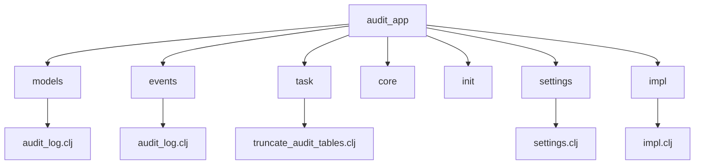
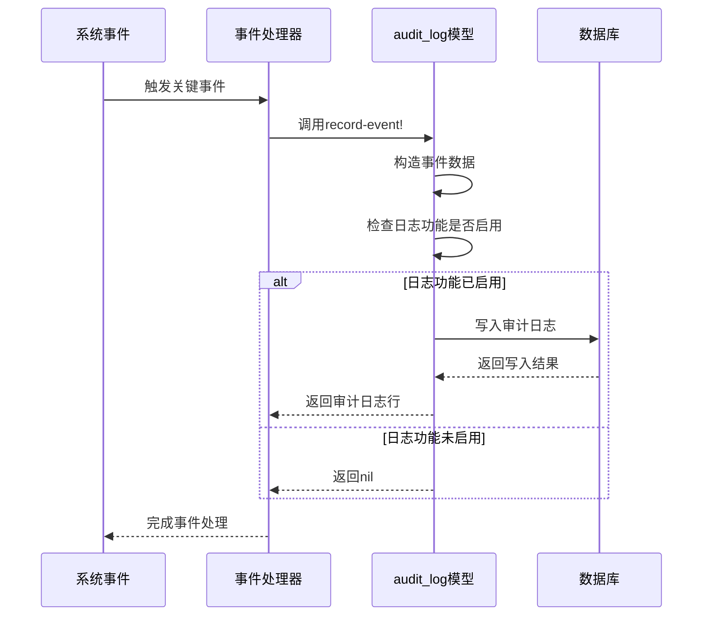
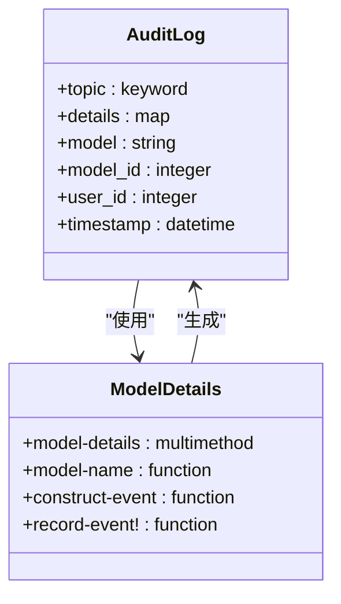
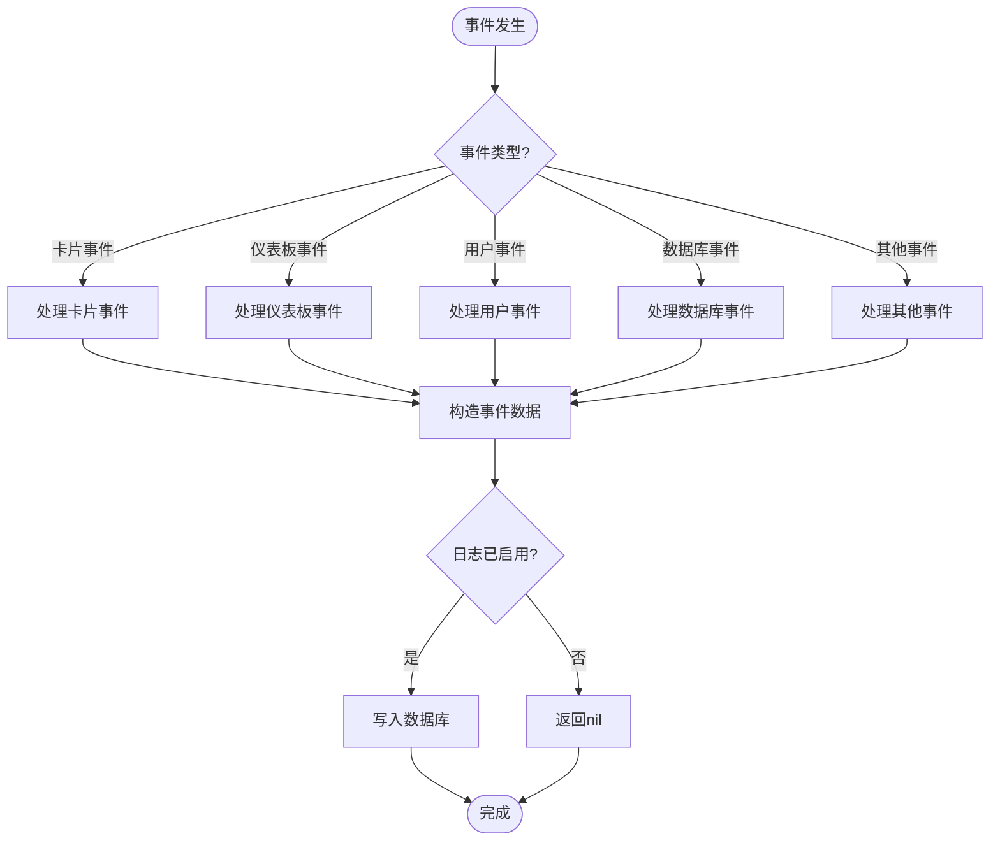
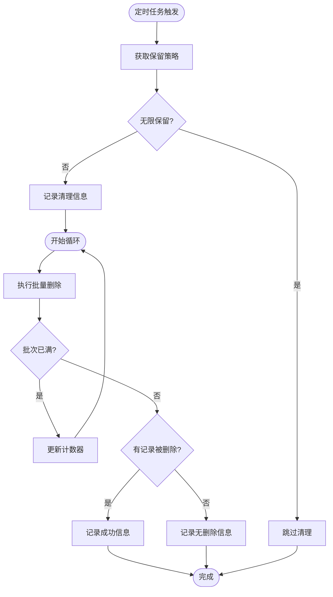
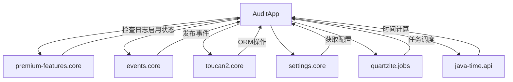

# 审计日志管理

<cite>
**本文档引用的文件**
- [audit_log.clj](file://src/metabase/audit_app/models/audit_log.clj)
- [audit_log.clj](file://src/metabase/audit_app/events/audit_log.clj)
- [truncate_audit_tables.clj](file://src/metabase/audit_app/task/truncate_audit_tables.clj)
- [core.clj](file://src/metabase/audit_app/core.clj)
- [init.clj](file://src/metabase/audit_app/init.clj)
- [settings.clj](file://src/metabase/audit_app/settings.clj)
- [impl.clj](file://src/metabase/audit_app/impl.clj)
</cite>

## 目录
1. [简介](#简介)
2. [项目结构](#项目结构)
3. [核心组件](#核心组件)
4. [架构概述](#架构概述)
5. [详细组件分析](#详细组件分析)
6. [依赖分析](#依赖分析)
7. [性能考虑](#性能考虑)
8. [故障排除指南](#故障排除指南)
9. [结论](#结论)

## 简介
本文档详细说明了Metabase系统中`audit_app`模块的审计日志管理机制。该系统负责记录系统中的关键安全事件，包括用户操作、权限变更和配置修改等。文档将深入解析`audit_log`模型的数据结构、字段含义及存储策略，描述事件触发机制和日志写入流程（包括同步与异步处理模式），并提供日志查询API的使用示例。此外，文档还将介绍如何通过`truncate_audit_tables`任务管理日志生命周期，讨论性能影响和索引优化建议，并给出与外部SIEM系统集成的推荐方式。

## 项目结构
审计日志功能主要集中在`src/metabase/audit_app`目录下，该模块遵循Metabase的模块化设计原则，将不同职责的代码分离到不同的子目录中。核心功能包括模型定义、事件处理、后台任务和系统设置。

**图示来源**
- [audit_log.clj](file://src/metabase/audit_app/models/audit_log.clj)
- [audit_log.clj](file://src/metabase/audit_app/events/audit_log.clj)
- [truncate_audit_tables.clj](file://src/metabase/audit_app/task/truncate_audit_tables.clj)
- [settings.clj](file://src/metabase/audit_app/settings.clj)
- [impl.clj](file://src/metabase/audit_app/impl.clj)

**本节来源**
- [src/metabase/audit_app](file://src/metabase/audit_app)

## 核心组件
审计日志系统的核心组件包括`audit_log`模型、事件发布机制、日志截断任务和系统设置。`audit_log`模型定义了审计日志的数据结构和存储方式，事件发布机制负责在系统发生关键事件时记录日志，日志截断任务用于管理日志的生命周期，而系统设置则提供了配置审计日志行为的接口。

**本节来源**
- [audit_log.clj](file://src/metabase/audit_app/models/audit_log.clj)
- [audit_log.clj](file://src/metabase/audit_app/events/audit_log.clj)
- [truncate_audit_tables.clj](file://src/metabase/audit_app/task/truncate_audit_tables.clj)
- [settings.clj](file://src/metabase/audit_app/settings.clj)

## 架构概述
审计日志系统的架构采用事件驱动模式，当系统中发生关键安全事件时，相应的事件处理器会调用`record-event!`函数将事件记录到审计日志中。整个流程包括事件触发、数据构造、条件检查和数据库写入等步骤。

**图示来源**
- [audit_log.clj](file://src/metabase/audit_app/models/audit_log.clj#L150-L250)
- [audit_log.clj](file://src/metabase/audit_app/events/audit_log.clj#L10-L50)

## 详细组件分析

### audit_log模型分析
`audit_log`模型是审计日志系统的核心数据结构，负责定义日志记录的字段和存储方式。该模型通过Toucan2 ORM框架实现，与数据库中的`audit_log`表对应。

#### 数据结构分析

**图示来源**
- [audit_log.clj](file://src/metabase/audit_app/models/audit_log.clj#L10-L100)

#### 字段含义及存储策略
`audit_log`模型包含以下关键字段：
- **topic**: 事件主题，使用关键字类型存储，表示事件的类型，如`:dashboard-create`、`:user-update`等
- **details**: 事件详情，使用JSON类型存储，包含与事件相关的具体数据
- **model**: 模型名称，字符串类型，表示事件关联的实体模型
- **model_id**: 模型ID，整数类型，表示事件关联的实体ID
- **user_id**: 用户ID，整数类型，表示触发事件的用户
- **timestamp**: 时间戳，datetime类型，记录事件发生的时间，由数据库自动生成

存储策略方面，系统通过`premium-features/log-enabled?`检查来确定是否启用日志记录功能。只有在企业版功能启用的情况下，才会将事件写入数据库。此外，系统在插入记录前会自动设置默认值，如当前时间戳和空的详情字段。

**本节来源**
- [audit_log.clj](file://src/metabase/audit_app/models/audit_log.clj#L1-L250)

### 事件触发机制分析
审计日志系统的事件触发机制基于Metabase的事件总线系统，通过多方法（multimethod）模式实现。当系统中发生关键事件时，相应的事件处理器会捕获这些事件并将其转发到审计日志系统。

#### 事件处理流程

**图示来源**
- [audit_log.clj](file://src/metabase/audit_app/events/audit_log.clj#L10-L200)

#### 同步与异步处理模式
审计日志系统主要采用同步处理模式，即在事件发生的同时立即记录日志。这种模式确保了日志的实时性和完整性，但可能会对系统性能产生一定影响。系统通过以下方式实现同步处理：

1. 事件处理器直接调用`record-event!`函数
2. `record-event!`函数在当前线程中执行数据库写入操作
3. 只有在写入完成后，事件处理才会返回

目前系统没有实现异步处理模式，所有日志记录都是同步完成的。这种设计选择可能是为了确保关键安全事件的可靠记录，避免因异步处理可能导致的日志丢失问题。

**本节来源**
- [audit_log.clj](file://src/metabase/audit_app/events/audit_log.clj#L1-L340)
- [audit_log.clj](file://src/metabase/audit_app/models/audit_log.clj#L150-L250)

### 日志生命周期管理分析
日志生命周期管理通过`truncate_audit_tables`任务实现，该任务定期清理过期的审计日志记录，以控制数据库的存储增长。

#### 截断任务流程

**图示来源**
- [truncate_audit_tables.clj](file://src/metabase/audit_app/task/truncate_audit_tables.clj#L10-L90)

#### truncate_audit_tables任务
`truncate_audit_tables`任务是审计日志生命周期管理的核心组件，负责定期清理过期的日志记录。该任务的实现特点包括：

1. **配置驱动**: 任务的行为由`audit-max-retention-days`设置控制，允许管理员配置日志的保留天数
2. **批量处理**: 采用分批删除的方式，每次最多删除`audit-table-truncation-batch-size`（默认50000）条记录，避免对数据库造成过大压力
3. **数据库兼容**: 针对不同的数据库类型（PostgreSQL/H2和MySQL/MariaDB）生成不同的SQL语句，确保跨数据库兼容性
4. **错误处理**: 包含完整的异常处理机制，确保任务失败时能够记录错误日志
5. **调度执行**: 通过Quartz调度器每12小时执行一次，调度配置为`0 0 */12 * * ? *`

任务首先检查`audit-max-retention-days`设置，如果设置为0或无穷大，则跳过清理。否则，计算过期时间阈值，并执行批量删除操作，直到某一批次删除的记录数少于批次大小，表明所有过期记录都已被删除。

**本节来源**
- [truncate_audit_tables.clj](file://src/metabase/audit_app/task/truncate_audit_tables.clj#L1-L92)
- [settings.clj](file://src/metabase/audit_app/settings.clj#L30-L70)

## 依赖分析
审计日志系统依赖于多个核心组件和外部系统，这些依赖关系确保了系统的完整性和功能性。

**图示来源**
- [audit_log.clj](file://src/metabase/audit_app/models/audit_log.clj#L5-L10)
- [audit_log.clj](file://src/metabase/audit_app/events/audit_log.clj#L5-L10)
- [truncate_audit_tables.clj](file://src/metabase/audit_app/task/truncate_audit_tables.clj#L5-L10)
- [settings.clj](file://src/metabase/audit_app/settings.clj#L5-L10)

**本节来源**
- [audit_log.clj](file://src/metabase/audit_app/models/audit_log.clj)
- [audit_log.clj](file://src/metabase/audit_app/events/audit_log.clj)
- [truncate_audit_tables.clj](file://src/metabase/audit_app/task/truncate_audit_tables.clj)
- [settings.clj](file://src/metabase/audit_app/settings.clj)

## 性能考虑
审计日志系统的设计考虑了性能影响，并提供了相应的优化建议。

### 性能影响分析
审计日志系统的主要性能影响体现在以下几个方面：
1. **数据库写入开销**: 每个关键事件都会产生一次数据库写入操作，可能影响系统响应时间
2. **存储增长**: 长期运行会产生大量日志数据，占用数据库存储空间
3. **查询性能**: 随着日志数据量的增长，查询操作可能变慢

### 索引优化建议
为了优化审计日志的查询性能，建议在以下字段上创建索引：
- `topic`字段：用于快速过滤特定类型的事件
- `user_id`字段：用于按用户查询日志
- `model`和`model_id`字段：用于查询特定实体的日志
- `timestamp`字段：用于时间范围查询

此外，可以考虑创建复合索引以支持常见的查询模式，例如`(timestamp, topic)`或`(user_id, timestamp)`。

**本节来源**
- [audit_log.clj](file://src/metabase/audit_app/models/audit_log.clj)
- [truncate_audit_tables.clj](file://src/metabase/audit_app/task/truncate_audit_tables.clj)

## 故障排除指南
在使用审计日志系统时，可能会遇到一些常见问题，以下是相应的故障排除建议。

### 常见问题及解决方案
1. **日志未记录**
   - 检查`premium-features/log-enabled?`返回值，确保企业版功能已启用
   - 确认事件类型是否被正确捕获和处理
   - 检查数据库连接是否正常

2. **日志清理任务未执行**
   - 检查Quartz调度器是否正常运行
   - 确认`audit-max-retention-days`设置是否正确
   - 查看系统日志中是否有任务执行的错误信息

3. **数据库性能下降**
   - 检查审计日志表的索引是否合理
   - 调整`audit-table-truncation-batch-size`设置，避免单次删除过多记录
   - 考虑增加数据库资源或优化查询

**本节来源**
- [audit_log.clj](file://src/metabase/audit_app/models/audit_log.clj)
- [truncate_audit_tables.clj](file://src/metabase/audit_app/task/truncate_audit_tables.clj)
- [settings.clj](file://src/metabase/audit_app/settings.clj)

## 结论
Metabase的审计日志管理系统提供了一套完整的机制来记录和管理关键安全事件。系统通过`audit_app`模块实现了事件捕获、日志记录、生命周期管理和配置控制等功能。`audit_log`模型定义了日志的数据结构，事件处理器负责在系统发生关键事件时记录日志，而`truncate_audit_tables`任务则确保日志数据不会无限增长。系统设计考虑了性能影响，并提供了相应的优化建议。通过合理配置和使用，该系统能够有效支持安全审计和合规性要求。