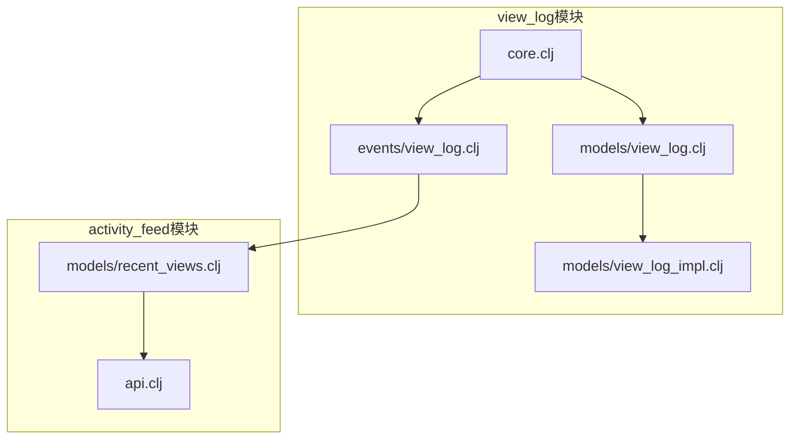
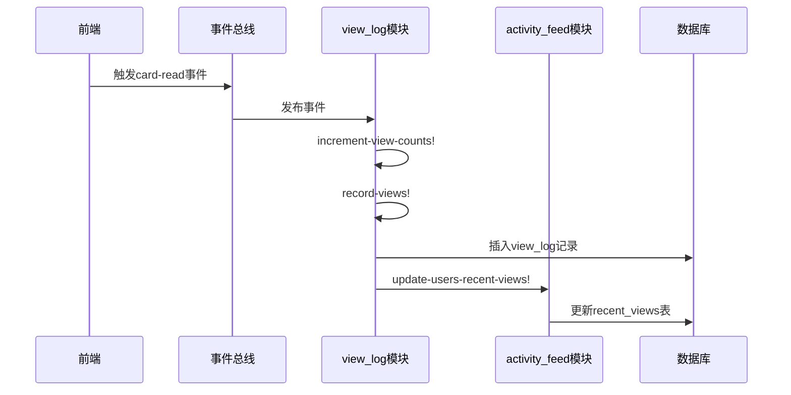
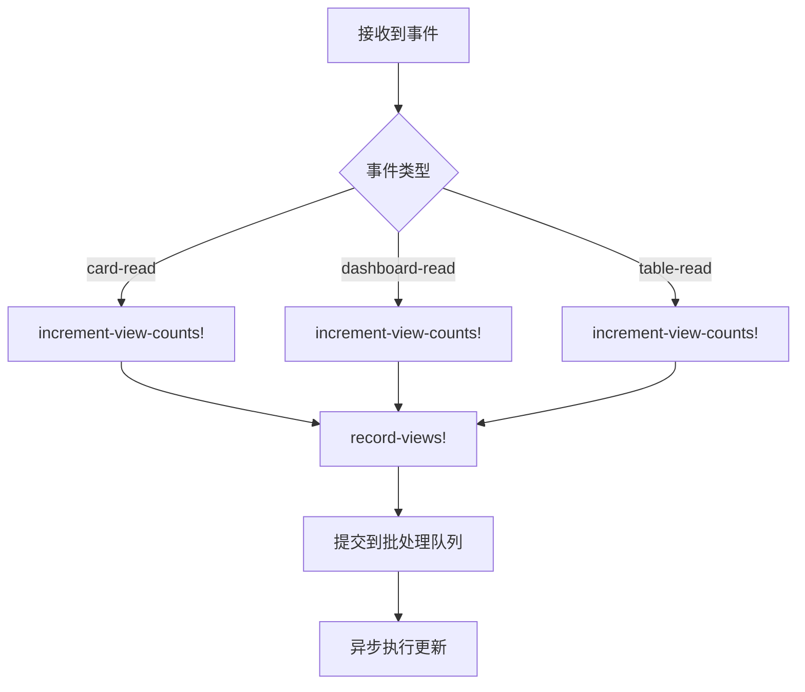
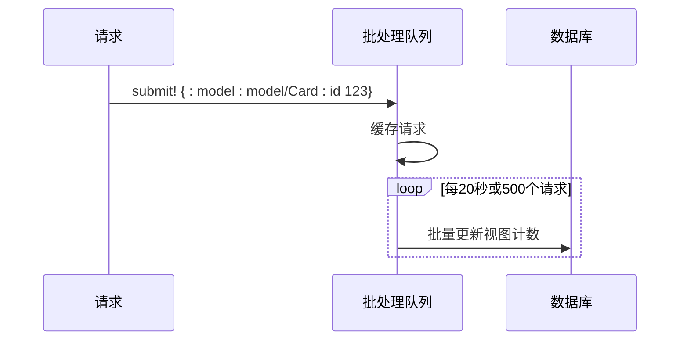
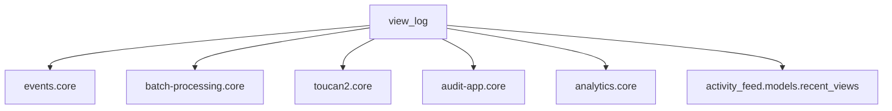

# 数据访问日志

<cite>
**本文档引用的文件**  
- [core.clj](file://src/metabase/view_log/core.clj)
- [init.clj](file://src/metabase/view_log/init.clj)
- [view_log.clj](file://src/metabase/view_log/models/view_log.clj)
- [view_log_impl.clj](file://src/metabase/view_log/models/view_log_impl.clj)
- [view_log.clj](file://src/metabase/view_log/events/view_log.clj)
- [recent_views.clj](file://src/metabase/activity_feed/models/recent_views.clj)
- [api.clj](file://src/metabase/activity_feed/api.clj)
</cite>

## 目录
1. [简介](#简介)
2. [项目结构](#项目结构)
3. [核心组件](#核心组件)
4. [架构概述](#架构概述)
5. [详细组件分析](#详细组件分析)
6. [依赖分析](#依赖分析)
7. [性能考虑](#性能考虑)
8. [故障排除指南](#故障排除指南)
9. [结论](#结论)

## 简介
本文档详细描述了Metabase系统中数据访问日志的功能实现，重点聚焦于`view_log`模块如何记录用户对数据内容（如仪表板、卡片）的查看行为。文档解释了`view_log`实体的结构设计及其与用户、内容项的关联关系，描述了日志生成的事件驱动机制，包括前端埋点与后端记录的协作流程。同时，文档说明了日志数据的聚合分析方法，支持使用行为分析和热点内容识别，并提供了性能优化建议，如日志采样策略和存储压缩方案。

## 项目结构
`view_log`模块位于`src/metabase/view_log/`目录下，包含核心逻辑、事件处理和模型定义。该模块与`activity_feed`模块紧密协作，共同实现用户行为跟踪和最近访问记录功能。`view_log`模块通过事件驱动机制记录用户对各种内容项的访问行为，而`activity_feed`模块则利用这些日志数据生成用户的最近访问列表和热门内容推荐。



**Diagram sources**
- [core.clj](file://src/metabase/view_log/core.clj)
- [events/view_log.clj](file://src/metabase/view_log/events/view_log.clj)
- [models/view_log.clj](file://src/metabase/view_log/models/view_log.clj)
- [view_log_impl.clj](file://src/metabase/view_log/models/view_log_impl.clj)
- [recent_views.clj](file://src/metabase/activity_feed/models/recent_views.clj)
- [api.clj](file://src/metabase/activity_feed/api.clj)

**Section sources**
- [core.clj](file://src/metabase/view_log/core.clj)
- [init.clj](file://src/metabase/view_log/init.clj)

## 核心组件
`view_log`模块的核心组件包括`view_log`实体模型、事件处理机制和视图计数更新功能。该模块通过订阅系统事件来记录用户对数据内容的访问行为，并将这些行为记录到数据库中。同时，模块还负责更新相关内容项的视图计数，以支持热门内容识别和用户行为分析。

**Section sources**
- [core.clj](file://src/metabase/view_log/core.clj#L0-L16)
- [view_log.clj](file://src/metabase/view_log/models/view_log.clj#L0-L32)

## 架构概述
`view_log`模块采用事件驱动架构，通过订阅系统事件来记录用户对数据内容的访问行为。当用户访问某个内容项时，前端会触发相应的事件，后端事件处理器接收到事件后，会记录访问日志并更新视图计数。该模块与`activity_feed`模块协作，将访问日志用于生成用户的最近访问列表和热门内容推荐。



**Diagram sources**
- [view_log.clj](file://src/metabase/view_log/events/view_log.clj#L0-L218)
- [recent_views.clj](file://src/metabase/activity_feed/models/recent_views.clj#L0-L621)

## 详细组件分析

### view_log实体模型分析
`view_log`实体模型定义了访问日志的数据结构，包括用户ID、内容项ID、内容项类型、访问时间戳和上下文信息。该模型通过Toucan2 ORM框架映射到数据库表`view_log`，并提供了数据验证和转换功能。

```mermaid
classDiagram
class ViewLog {
+user_id : int
+model : string
+model_id : int
+timestamp : datetime
+has_access : boolean
+context : enum
}
ViewLog : +table-name : model/ViewLog
ViewLog : +before-insert hook
ViewLog : +transforms
```

**Diagram sources**
- [view_log.clj](file://src/metabase/view_log/models/view_log.clj#L0-L32)
- [view_log_impl.clj](file://src/metabase/view_log/models/view_log_impl.clj#L0-L4)

### 事件处理机制分析
`view_log`模块通过事件处理器监听系统中的各种读取事件，如卡片读取、仪表板读取和表格读取。当接收到事件时，处理器会调用`increment-view-counts!`函数更新视图计数，并调用`record-views!`函数记录访问日志。该机制采用批处理方式，通过`grouper`库将多个更新操作合并为一个批次，以提高性能。



**Diagram sources**
- [view_log.clj](file://src/metabase/view_log/events/view_log.clj#L0-L218)
- [core.clj](file://src/metabase/view_log/core.clj#L0-L16)

### 视图计数更新分析
视图计数更新功能采用批处理机制，通过`grouper`库将多个更新操作合并为一个批次。当接收到视图计数更新请求时，请求会被提交到批处理队列中。批处理队列每隔20秒或达到500个请求时，会将所有请求合并为一个数据库更新操作，以减少数据库的写入压力。



**Diagram sources**
- [view_log.clj](file://src/metabase/view_log/events/view_log.clj#L60-L96)
- [impl.clj](file://src/metabase/batch_processing/impl.clj#L28-L62)

**Section sources**
- [view_log.clj](file://src/metabase/view_log/events/view_log.clj#L0-L218)
- [core.clj](file://src/metabase/view_log/core.clj#L0-L16)

## 依赖分析
`view_log`模块依赖于多个核心组件，包括事件系统、批处理库和ORM框架。该模块通过事件系统接收用户行为事件，通过批处理库实现高效的视图计数更新，通过ORM框架与数据库交互。同时，`view_log`模块与`activity_feed`模块紧密协作，共享用户行为数据。



**Diagram sources**
- [view_log.clj](file://src/metabase/view_log/events/view_log.clj#L0-L218)
- [core.clj](file://src/metabase/view_log/core.clj#L0-L16)
- [recent_views.clj](file://src/metabase/activity_feed/models/recent_views.clj#L0-L621)

**Section sources**
- [view_log.clj](file://src/metabase/view_log/events/view_log.clj#L0-L218)
- [core.clj](file://src/metabase/view_log/core.clj#L0-L16)
- [recent_views.clj](file://src/metabase/activity_feed/models/recent_views.clj#L0-L621)

## 性能考虑
`view_log`模块在设计时充分考虑了性能因素，采用了多种优化策略。首先，视图计数更新采用批处理机制，将多个更新操作合并为一个批次，显著减少了数据库的写入压力。其次，模块使用集群锁机制避免并发更新导致的死锁问题。此外，模块还提供了配置选项，允许管理员根据需要调整批处理的间隔时间和容量。

**Section sources**
- [view_log.clj](file://src/metabase/view_log/events/view_log.clj#L60-L96)
- [impl.clj](file://src/metabase/batch_processing/impl.clj#L28-L62)

## 故障排除指南
在使用`view_log`模块时，可能会遇到一些常见问题。如果发现视图计数没有正确更新，可以检查批处理队列是否正常工作，以及是否有异常日志。如果访问日志没有正确记录，可以检查事件订阅是否正常，以及用户是否有相应的访问权限。此外，还可以通过查看数据库中的`view_log`和`recent_views`表来验证数据是否正确写入。

**Section sources**
- [view_log.clj](file://src/metabase/view_log/events/view_log.clj#L0-L218)
- [recent_views.clj](file://src/metabase/activity_feed/models/recent_views.clj#L0-L621)

## 结论
`view_log`模块是Metabase系统中重要的用户行为跟踪组件，通过事件驱动机制记录用户对数据内容的访问行为。该模块采用批处理和集群锁等优化策略，确保了高性能和高可靠性。通过与`activity_feed`模块的协作，`view_log`模块为用户提供了最近访问列表和热门内容推荐功能，增强了用户体验。未来可以考虑增加更多的上下文类型和分析维度，以支持更精细化的用户行为分析。