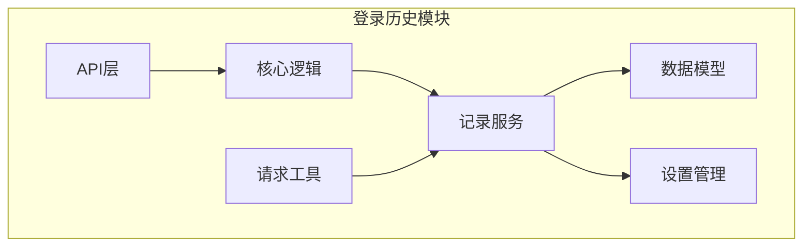
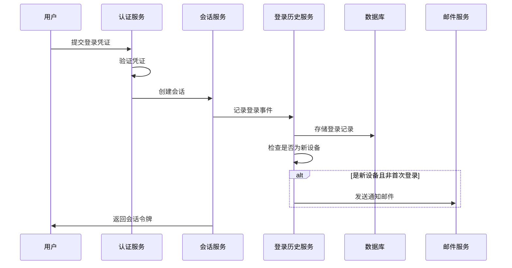
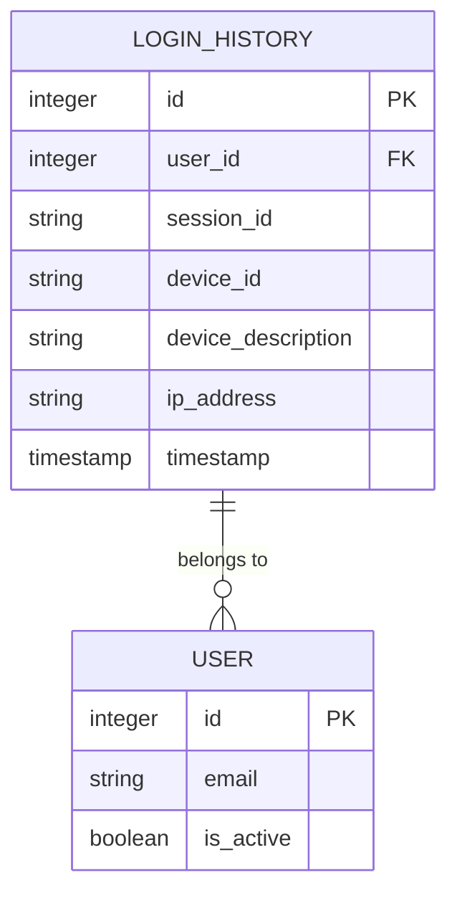
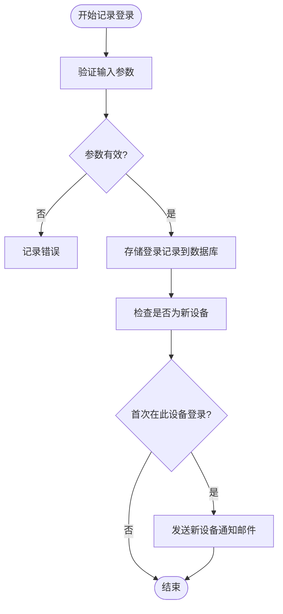
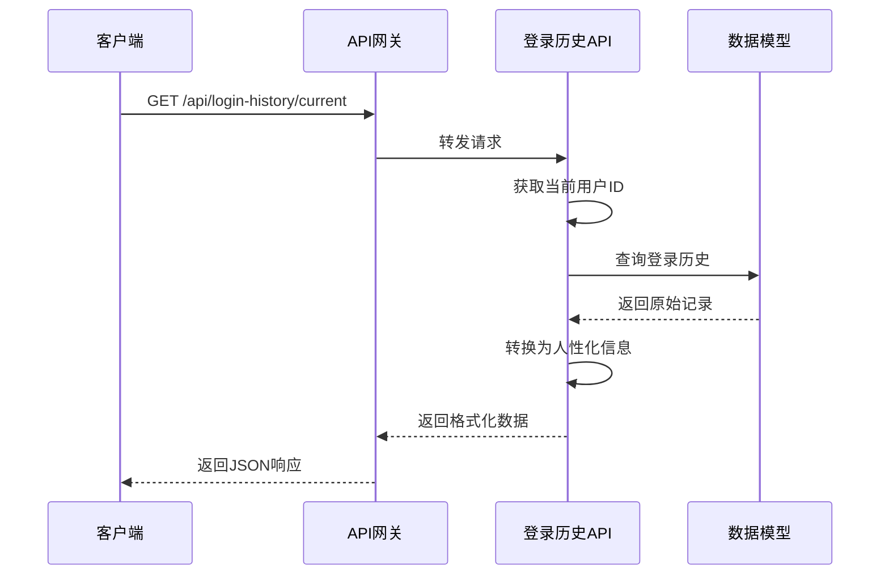
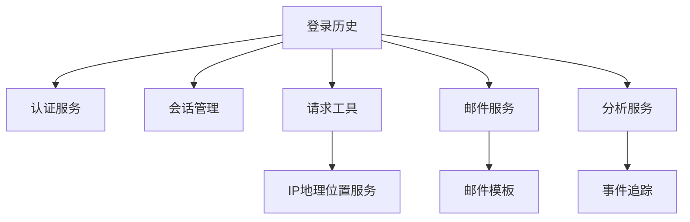

# 登录历史追踪

<cite>
**本文档引用的文件**  
- [core.clj](file://src/metabase/login_history/core.clj)
- [api.clj](file://src/metabase/login_history/api.clj)
- [record.clj](file://src/metabase/login_history/record.clj)
- [settings.clj](file://src/metabase/login_history/settings.clj)
- [login_history.clj](file://src/metabase/login_history/models/login_history.clj)
- [session.clj](file://src/metabase/auth_identity/session.clj)
- [util.clj](file://src/metabase/request/util.clj)
</cite>

## 目录
1. [简介](#简介)
2. [项目结构](#项目结构)
3. [核心组件](#核心组件)
4. [架构概述](#架构概述)
5. [详细组件分析](#详细组件分析)
6. [依赖分析](#依赖分析)
7. [性能考虑](#性能考虑)
8. [故障排除指南](#故障排除指南)
9. [结论](#结论)

## 简介
本文档详细阐述了Metabase系统中`login_history`模块的设计与实现，重点介绍用户登录行为的追踪机制。该模块负责记录所有成功与失败的登录尝试，捕获包括IP地址、用户代理、时间戳等关键信息，并支持通过API进行审计查询。文档还说明了异常登录检测机制、与会话管理的集成方式以及安全相关的最佳实践。

## 项目结构
`login_history`模块位于`src/metabase/login_history/`目录下，采用分层架构设计，各组件职责明确：

**Diagram sources**
- [core.clj](file://src/metabase/login_history/core.clj)
- [api.clj](file://src/metabase/login_history/api.clj)
- [record.clj](file://src/metabase/login_history/record.clj)
- [login_history.clj](file://src/metabase/login_history/models/login_history.clj)
- [util.clj](file://src/metabase/request/util.clj)

**Section sources**
- [src/metabase/login_history/](file://src/metabase/login_history/)

## 核心组件
`login_history`模块的核心功能包括登录事件的记录、查询和通知。系统在用户成功认证后自动触发登录历史记录，捕获设备信息和网络位置，并在特定条件下发送安全通知邮件。API端点允许管理员和用户查询自己的登录历史，支持审计和安全监控。

**Section sources**
- [core.clj](file://src/metabase/login_history/core.clj)
- [record.clj](file://src/metabase/login_history/record.clj)
- [api.clj](file://src/metabase/login_history/api.clj)

## 架构概述
登录历史追踪系统与认证和会话管理模块紧密集成，形成完整的用户访问追踪链路。

**Diagram sources**
- [session.clj](file://src/metabase/auth_identity/session.clj#L37)
- [record.clj](file://src/metabase/login_history/record.clj#L24-L42)
- [login_history.clj](file://src/metabase/login_history/models/login_history.clj#L31-L60)

## 详细组件分析

### 登录历史模型分析
`LoginHistory`数据模型是登录追踪系统的核心，存储了用户登录的关键信息。

**Diagram sources**
- [login_history.clj](file://src/metabase/login_history/models/login_history.clj#L31-L60)

**Section sources**
- [login_history.clj](file://src/metabase/login_history/models/login_history.clj)

#### 模型字段说明
- **user_id**: 关联的用户ID，外键引用用户表
- **session_id**: 会话标识符，用于关联登录事件与会话
- **device_id**: 设备唯一标识，用于识别不同设备
- **device_description**: 设备描述信息，由用户代理字符串解析而来
- **ip_address**: 用户登录的IP地址，用于地理位置追踪
- **timestamp**: 登录时间戳，记录事件发生时间

#### 模型行为
模型定义了以下关键行为：
- **不可更新性**: 通过`define-before-update`钩子禁止修改已创建的登录记录，确保审计数据的完整性
- **敏感信息处理**: 通过`define-after-select`钩子在返回数据时移除`session_id`，替换为`active`布尔值，保护会话安全
- **首次登录检测**: 提供`first-login-ever?`和`first-login-on-this-device?`函数，用于判断登录场景

### 登录事件记录分析
登录事件的记录发生在用户成功认证并创建会话之后，由会话服务触发。

**Diagram sources**
- [record.clj](file://src/metabase/login_history/record.clj#L24-L42)
- [login_history.clj](file://src/metabase/login_history/models/login_history.clj#L31-L60)

**Section sources**
- [record.clj](file://src/metabase/login_history/record.clj)
- [login_history.clj](file://src/metabase/login_history/models/login_history.clj)

#### 记录流程
1. **参数验证**: 使用Malli库验证`session-id`、`user`和`device-info`参数的类型和格式
2. **数据存储**: 调用`record-login-history!`函数将登录信息插入`login_history`表
3. **异步通知**: 如果是用户首次在此设备登录（且非账户首次登录），则在独立线程中发送通知邮件
4. **事件追踪**: 对于新用户，发送Snowplow分析事件

#### 安全考虑
- **异步处理**: 邮件发送在独立线程中执行，避免阻塞登录流程，防止潜在的拒绝服务攻击
- **连接管理**: 在异步线程中解绑数据库连接，避免跨线程使用连接导致的问题
- **错误处理**: 捕获邮件发送过程中的所有异常，记录错误日志但不影响主流程

### API访问控制分析
登录历史API提供了安全的访问接口，支持用户和管理员查询登录记录。

**Diagram sources**
- [api.clj](file://src/metabase/login_history/api.clj#L8-L22)
- [login_history.clj](file://src/metabase/login_history/models/login_history.clj#L10-L30)

**Section sources**
- [api.clj](file://src/metabase/login_history/api.clj)

#### API端点
- **GET /current**: 获取当前用户的登录历史，按时间倒序排列
- **GET /:user-id**: 获取指定用户的完整登录历史（需管理员权限）

#### 数据转换
`human-friendly-infos`函数将原始数据库记录转换为用户友好的格式：
- **地理位置**: 通过`geocode-ip-addresses`函数调用外部服务获取IP地址的地理位置描述
- **时区信息**: 将时间戳转换为用户所在时区的本地时间
- **设备描述**: 解析用户代理字符串，生成可读的设备描述

#### 性能考虑
- **批处理**: 支持批量查询多个IP地址的地理位置，减少网络请求次数
- **超时控制**: 地理位置查询设置5秒超时，防止阻塞主流程
- **缓存机制**: 虽然当前未实现，但建议在生产环境中添加地理位置信息的缓存

## 依赖分析
`login_history`模块依赖多个核心系统组件，形成紧密的集成关系。

**Diagram sources**
- [session.clj](file://src/metabase/auth_identity/session.clj)
- [record.clj](file://src/metabase/login_history/record.clj)
- [util.clj](file://src/metabase/request/util.clj)

**Section sources**
- [src/metabase/](file://src/metabase/)

#### 关键依赖
- **认证服务**: 提供用户身份验证结果，是登录历史记录的触发条件
- **会话管理**: 提供会话创建和管理功能，与登录事件紧密关联
- **请求工具**: 提供IP地址、用户代理解析等HTTP请求相关工具
- **邮件服务**: 用于发送新设备登录通知
- **分析服务**: 用于追踪新用户创建等关键事件

## 性能考虑
登录历史追踪系统在设计时充分考虑了性能影响，特别是在高并发场景下的表现。

- **异步操作**: 所有可能阻塞的操作（如邮件发送、IP地理位置查询）都在独立线程中执行，确保不影响用户登录体验
- **批量处理**: 地理位置查询支持批量处理，减少外部API调用次数
- **超时机制**: 设置合理的超时时间（5秒），防止外部服务响应缓慢导致系统阻塞
- **数据库优化**: 使用Toucan2 ORM的批量插入功能，提高数据写入效率
- **索引策略**: 建议在`user_id`和`timestamp`字段上创建复合索引，优化查询性能

## 故障排除指南
### 常见问题
- **登录历史未记录**: 检查`create-session-with-auth-tracking!`函数是否被正确调用
- **地理位置信息缺失**: 检查外部地理编码服务是否可达，网络连接是否正常
- **邮件通知未发送**: 检查邮件服务配置，确认`send-email-on-first-login-from-new-device`设置为true

### 调试建议
- **日志检查**: 查看`record.clj`中的错误日志，特别是邮件发送失败的记录
- **API测试**: 使用`/api/login-history/current`端点验证数据是否正确存储和返回
- **数据库验证**: 直接查询`login_history`表，确认记录是否被正确插入

**Section sources**
- [record.clj](file://src/metabase/login_history/record.clj#L24-L42)
- [api.clj](file://src/metabase/login_history/api.clj#L8-L22)

## 结论
Metabase的登录历史追踪系统提供了一套完整的用户访问审计解决方案。通过`login_history`模块，系统能够可靠地记录所有登录事件，捕获关键的上下文信息，并支持安全审计和异常检测。该系统与认证、会话管理和通知系统紧密集成，形成了一个闭环的安全监控体系。建议在生产环境中启用相关功能，并定期审查登录历史，以及时发现潜在的安全威胁。