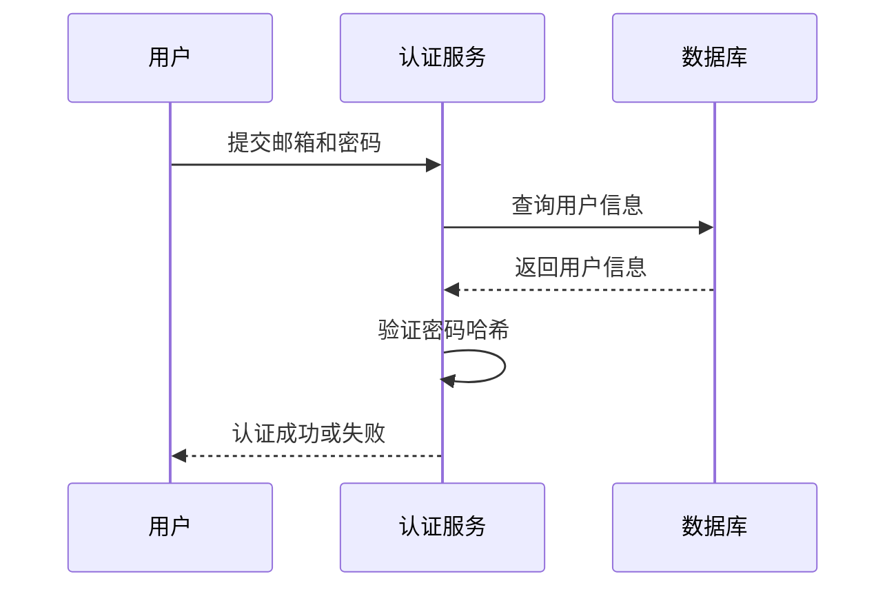
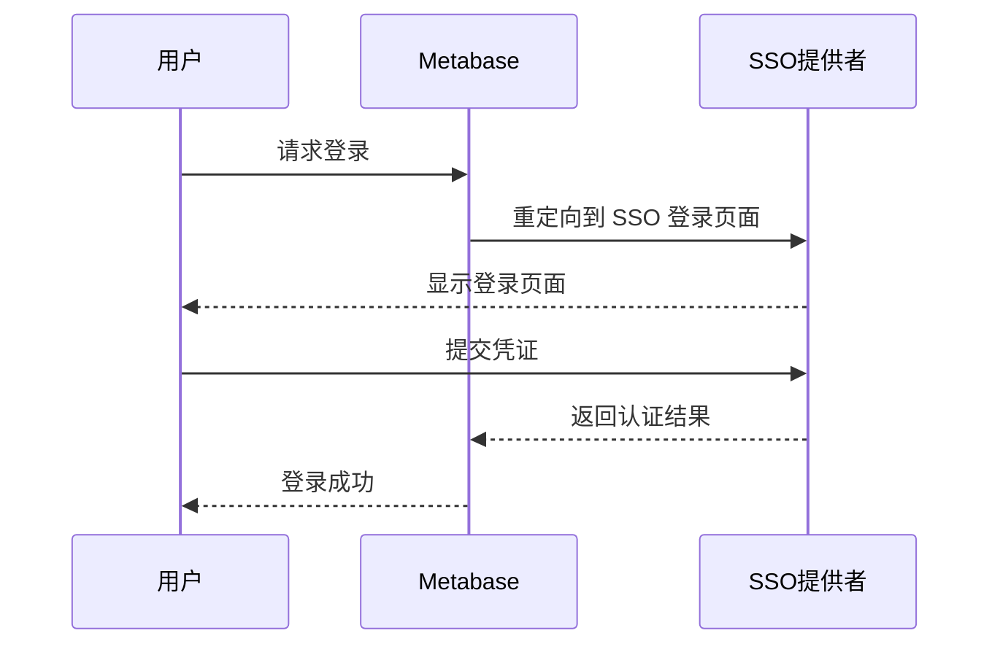
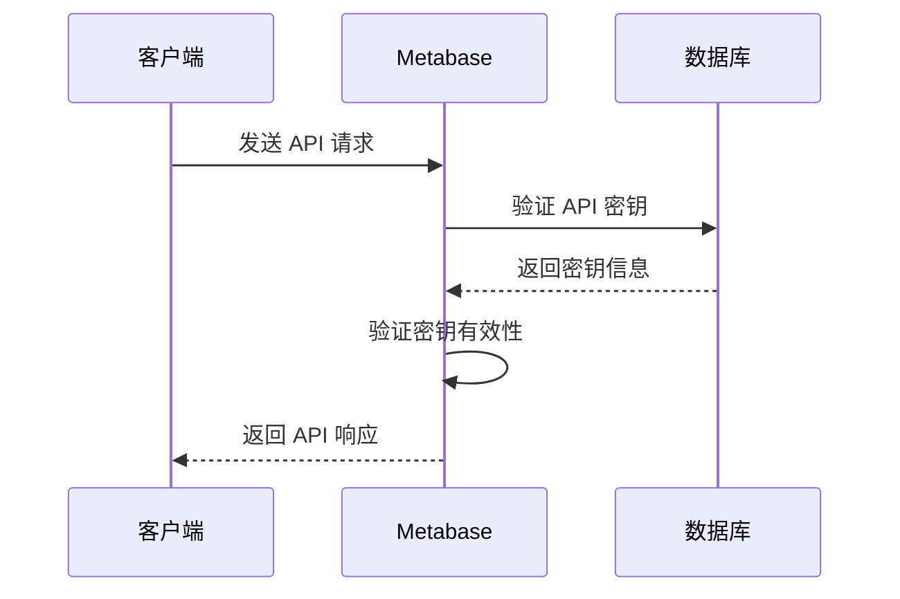

# 安全考虑

<cite>
**本文档中引用的文件**  
- [encryption.clj](file://src/metabase/app_db/encryption.clj)
- [core.clj](file://src/metabase/secrets/core.clj)
- [secret.clj](file://src/metabase/secrets/models/secret.clj)
- [security.clj](file://src/metabase/server/middleware/security.clj)
- [settings.clj](file://src/metabase/server/settings.clj)
- [password.clj](file://src/metabase/auth_identity/providers/password.clj)
- [emailed_secret.clj](file://src/metabase/auth_identity/providers/emailed_secret.clj)
- [core.clj](file://src/metabase/sso/core.clj)
- [api_key.clj](file://src/metabase/api_keys/models/api_key.clj)
- [core.clj](file://src/metabase/api_keys/core.clj)
- [core.clj](file://src/metabase/session/core.clj)
- [util.clj](file://src/metabase/util/encryption.clj)
</cite>

## 目录
1. [介绍](#介绍)
2. [认证机制](#认证机制)
3. [敏感数据加密](#敏感数据加密)
4. [密钥安全管理](#密钥安全管理)
5. [安全配置设置](#安全配置设置)
6. [安全中间件防护](#安全中间件防护)
7. [安全加固检查清单](#安全加固检查清单)
8. [常见威胁应对指南](#常见威胁应对指南)

## 介绍
Metabase 是一个开源的数据分析和可视化平台，其安全性对于保护敏感数据和用户信息至关重要。本文档全面涵盖了 Metabase 的所有安全层面，包括认证机制、数据加密、密钥管理、安全配置和防护措施。通过深入分析源代码，我们将详细解释 Metabase 如何实现这些安全功能，并提供安全加固的建议和应对常见威胁的指南。

## 认证机制
Metabase 支持多种认证机制，包括本地密码认证、单点登录（SSO）和 API 密钥认证。这些机制确保了用户身份的验证和授权，保护了系统的安全。

### 本地密码认证
本地密码认证是 Metabase 默认的认证方式。用户通过输入邮箱和密码进行登录。密码在存储时使用 bcrypt 算法进行哈希处理，确保即使数据库被泄露，攻击者也无法轻易获取明文密码。



**图源**
- [password.clj](file://src/metabase/auth_identity/providers/password.clj#L45-L93)

### 单点登录（SSO）
Metabase 支持通过 Google 和 LDAP 进行单点登录。SSO 机制允许用户使用现有的企业账户进行登录，简化了身份管理并提高了安全性。



**图源**
- [core.clj](file://src/metabase/sso/core.clj#L1-L27)

### API 密钥认证
API 密钥用于程序化访问 Metabase 的 API。每个 API 密钥都与一个用户关联，并具有特定的权限范围。API 密钥在生成时使用随机字符串，并通过 bcrypt 哈希存储。



**图源**
- [api_key.clj](file://src/metabase/api_keys/models/api_key.clj#L1-L252)
- [core.clj](file://src/metabase/api_keys/core.clj#L1-L12)

**本节源**
- [password.clj](file://src/metabase/auth_identity/providers/password.clj#L1-L93)
- [emailed_secret.clj](file://src/metabase/auth_identity/providers/emailed_secret.clj#L1-L197)
- [core.clj](file://src/metabase/sso/core.clj#L1-L27)
- [api_key.clj](file://src/metabase/api_keys/models/api_key.clj#L1-L252)
- [core.clj](file://src/metabase/api_keys/core.clj#L1-L12)

## 敏感数据加密
Metabase 使用 AES256 CBC + HMAC SHA512 加密算法对敏感数据进行加密存储。加密密钥通过环境变量 `MB_ENCRYPTION_SECRET_KEY` 提供，确保了数据在静态时的安全性。

### 数据库密码加密
数据库连接信息中的密码等敏感数据在存储时会被加密。`app_db/encryption.clj` 文件中的 `encrypt-db` 和 `decrypt-db` 函数负责加密和解密操作。

```clojure
(defn encrypt-db
  "使用当前 `MB_ENCRYPTION_SECRET_KEY` 对数据库进行加密"
  [db-type data-source to-key]
  (when (and (not (nil? to-key)) (empty? to-key))
    (throw (ex-info "Cannot encrypt database with an empty key" {})))
  (do-encryption db-type data-source true (fn [maybe-encrypt-fn]
                                            (if
                                             (nil? to-key) maybe-encrypt-fn
                                             (partial maybe-encrypt-fn (encryption/validate-and-hash-secret-key to-key))))))
```

**本节源**
- [encryption.clj](file://src/metabase/app_db/encryption.clj#L45-L60)
- [util.clj](file://src/metabase/util/encryption.clj#L1-L261)

## 密钥安全管理
Metabase 的 `secrets` 模块负责安全地处理密钥。密钥可以存储在文件系统中或作为加密的二进制数据存储在数据库中。

### 密钥存储
密钥可以通过文件路径或上传的二进制数据进行存储。`secrets/models/secret.clj` 文件中的 `upsert-secret-value!` 函数负责插入或更新密钥值。

```clojure
(defn upsert-secret-value!
  "插入新的密钥值，或更新现有密钥值"
  {:added "0.42.0"}
  [existing-id nm kind src value]
  (let [insert-new     (fn [id v]
                         (let [inserted (first (t2/insert-returning-instances! :model/Secret (cond-> {:version    v
                                                                                                      :name       nm
                                                                                                      :kind       kind
                                                                                                      :source     src
                                                                                                      :value      value
                                                                                                      :creator_id api/*current-user-id*}
                                                                                               id
                                                                                               (assoc :id id))))] 
                           (t2/select-one :model/Secret :id (or id (u/the-id inserted)) :version v)))
        latest-version (when existing-id (latest-for-id existing-id))]
    (if latest-version
      (insert-new (u/the-id latest-version) (inc (:version latest-version)))
      (insert-new nil 1))))
```

**本节源**
- [secret.clj](file://src/metabase/secrets/models/secret.clj#L1-L403)
- [core.clj](file://src/metabase/secrets/core.clj#L1-L21)

## 安全配置设置
Metabase 提供了多种安全配置选项，包括 CORS 策略、内容安全策略（CSP）和会话管理。这些配置可以通过环境变量或管理界面进行设置。

### CORS 策略
CORS（跨域资源共享）策略用于控制哪些外部域可以访问 Metabase 的 API。默认情况下，Metabase 允许来自 `localhost` 的请求，但可以通过 `disable-cors-on-localhost` 设置禁用。

```clojure
(defsetting disable-cors-on-localhost
  (deferred-tru "Prevents the server from sending CORS headers for requests originating from localhost.")
  :type       :boolean
  :default    false
  :visibility :admin
  :export?    true)
```

### 内容安全策略（CSP）
CSP 用于防止跨站脚本（XSS）攻击。Metabase 在响应头中添加 `Content-Security-Policy`，限制了可以执行的脚本来源。

```clojure
(defn- content-security-policy-header
  "`Content-Security-Policy` header. See https://content-security-policy.com for more details."
  [nonce]
  {"Content-Security-Policy"
   (str/join
    (for [[k vs] {:default-src  ["'none'"]
                  :script-src   (concat
                                 ["'self'"
                                  "https://maps.google.com"
                                  "https://accounts.google.com"
                                  (when (analytics/anon-tracking-enabled)
                                    "https://www.google-analytics.com")
                                  (when config/is-dev?
                                    frontend-address)
                                  (when config/is-dev?
                                    "'unsafe-inline'")]
                                 (when config/is-dev?
                                   ["'unsafe-eval'"
                                    "http://localhost:9630"])
                                 (when-not config/is-dev?
                                   (map (partial format "'sha256-%s'") inline-js-hashes)))
                  :child-src    ["'self'"
                                 "https://accounts.google.com"]
                  :style-src    ["'self'"
                                 (when nonce
                                   (format "'nonce-%s'" nonce))
                                 (when config/is-dev?
                                   frontend-address)
                                 (when config/is-dev?
                                   "http://localhost:9630")
                                 "https://accounts.google.com"]
                  :frame-src    (parse-allowed-iframe-hosts (server.settings/allowed-iframe-hosts))
                  :font-src     ["*"]
                  :img-src      ["*"
                                 "'self' data:"]
                  :connect-src  ["'self'"
                                 "https://accounts.google.com"
                                 "metabase.us10.list-manage.com"
                                 (when (analytics/anon-tracking-enabled)
                                   (setting/get-value-of-type :string :snowplow-url))
                                 (when config/is-dev?
                                   (str "*:" frontend-dev-port " ws://*:" frontend-dev-port))
                                 (when config/is-dev?
                                   "ws://*:9630")]
                  :manifest-src ["'self'"]
                  :media-src    ["www.metabase.com"]}])
      (format "%s %s; " (name k) (str/join " " vs))))})
```

### 会话管理
会话管理通过设置会话 cookie 的属性来增强安全性。例如，可以设置 `SameSite` 属性以防止跨站请求伪造（CSRF）攻击。

```clojure
(when (and (= (request.settings/session-cookie-samesite) :none) (not (request.util/https? request)))
  (log/warn
   (str "Session cookie's SameSite is configured to \"None\", but site is served over an insecure connection."
        " Some browsers will reject cookies under these conditions."
        " https://www.chromestatus.com/feature/5633521622188032")))
```

**本节源**
- [settings.clj](file://src/metabase/server/settings.clj#L1-L76)
- [security.clj](file://src/metabase/server/middleware/security.clj#L1-L324)

## 安全中间件防护
Metabase 使用 Ring 中间件来添加安全相关的 HTTP 响应头，防止常见的 Web 攻击。

### 安全响应头
`server/middleware/security.clj` 文件中的 `add-security-headers` 函数负责添加各种安全响应头，包括 `Strict-Transport-Security`、`X-Frame-Options` 和 `X-XSS-Protection`。

```clojure
(defn security-headers
  "Fetch a map of security headers that should be added to a response based on the passed options."
  [& {:keys [origin nonce allow-iframes? allow-cache?]
      :or   {allow-iframes? false, allow-cache? false}}]
  (merge
   (if allow-cache? cache-far-future-headers (cache-prevention-headers))
   strict-transport-security-header
   (content-security-policy-header-with-frame-ancestors allow-iframes? nonce)
   (access-control-headers origin
                           (or
                            (setting/get-value-of-type :boolean :enable-embedding-sdk)
                            (setting/get-value-of-type :boolean :enable-embedding-simple))
                           (embedding.settings/embedding-app-origins-sdk))
   (when-not allow-iframes?
     {"X-Frame-Options"                 (if-let [eao (and (setting/get-value-of-type :boolean :enable-embedding-interactive)
                                                          (setting/get-value-of-type :string :embedding-app-origins-interactive))]
                                          (format "ALLOW-FROM %s" (-> eao (str/split #" ") first))
                                          "DENY")})
   {;; Tell browser to block suspected XSS attacks
    "X-XSS-Protection"                  "1; mode=block"
    ;; Prevent Flash / PDF files from including content from site.
    "X-Permitted-Cross-Domain-Policies" "none"
    ;; Tell browser not to use MIME sniffing to guess types of files -- protect against MIME type confusion attacks
    "X-Content-Type-Options"            "nosniff"}))
```

**本节源**
- [security.clj](file://src/metabase/server/middleware/security.clj#L1-L324)

## 安全加固检查清单
为了确保 Metabase 的安全性，建议采取以下措施：

- **启用 HTTPS**：确保所有流量都通过 HTTPS 传输，防止中间人攻击。
- **设置强密码策略**：强制用户使用复杂密码，并定期更换密码。
- **限制 API 密钥权限**：为 API 密钥分配最小必要的权限，避免过度授权。
- **定期更新和打补丁**：及时更新 Metabase 和依赖库，修复已知漏洞。
- **监控和日志记录**：启用详细的日志记录，监控异常活动，及时发现潜在威胁。

## 常见威胁应对指南
### 跨站脚本（XSS）
XSS 攻击通过注入恶意脚本来窃取用户数据。Metabase 通过 CSP 和输入验证来防止 XSS 攻击。

### 跨站请求伪造（CSRF）
CSRF 攻击通过伪造用户请求来执行未经授权的操作。Metabase 通过设置 `SameSite` 属性和使用反 CSRF 令牌来防止 CSRF 攻击。

### SQL 注入
SQL 注入攻击通过操纵 SQL 查询来访问或修改数据库。Metabase 使用参数化查询和输入验证来防止 SQL 注入。

### 会话劫持
会话劫持攻击通过窃取会话 cookie 来冒充用户。Metabase 通过设置安全的会话 cookie 属性（如 `HttpOnly` 和 `Secure`）来防止会话劫持。