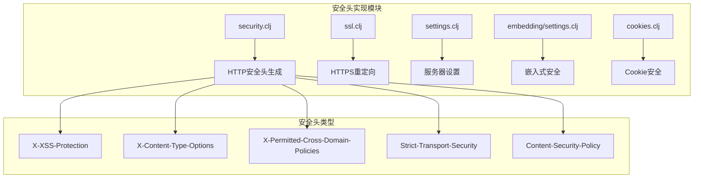
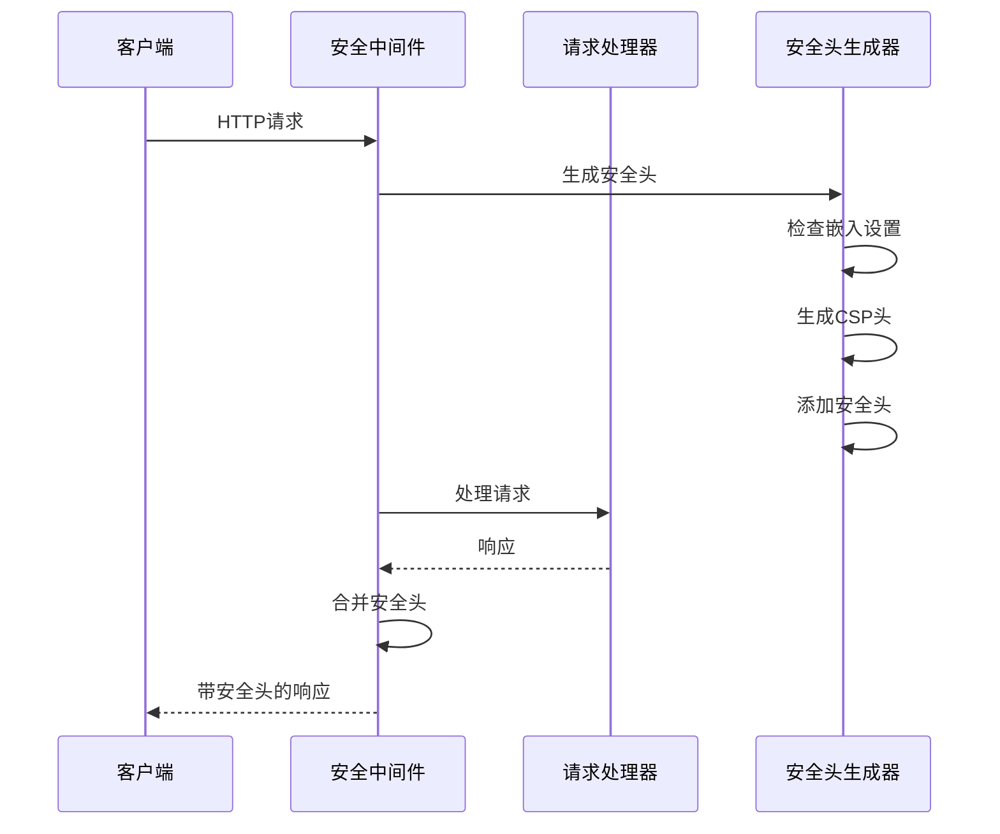
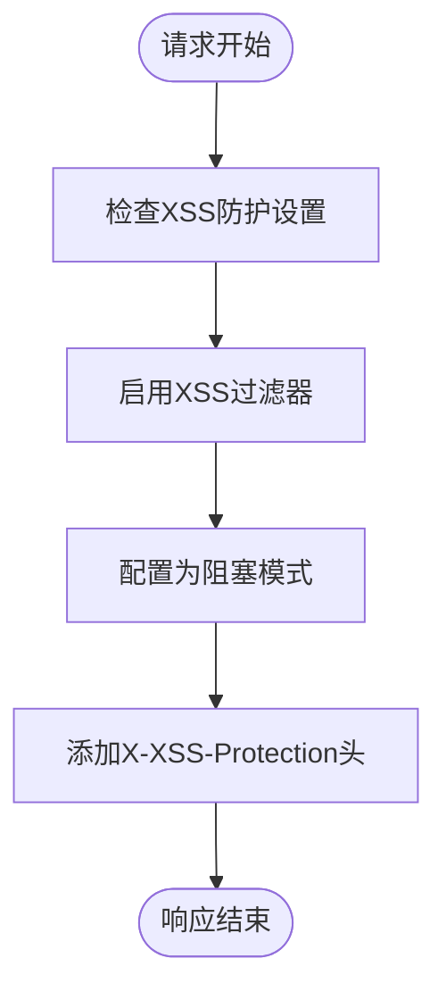
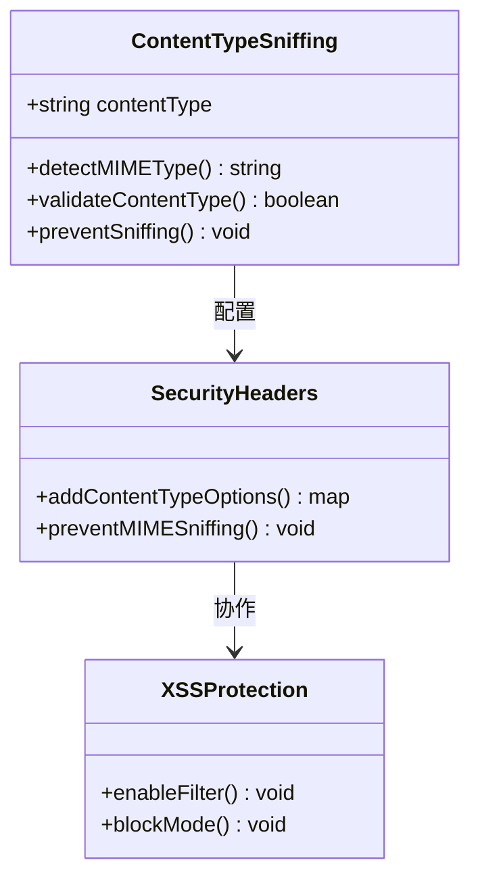
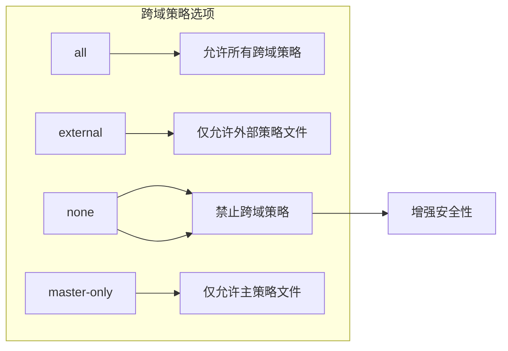
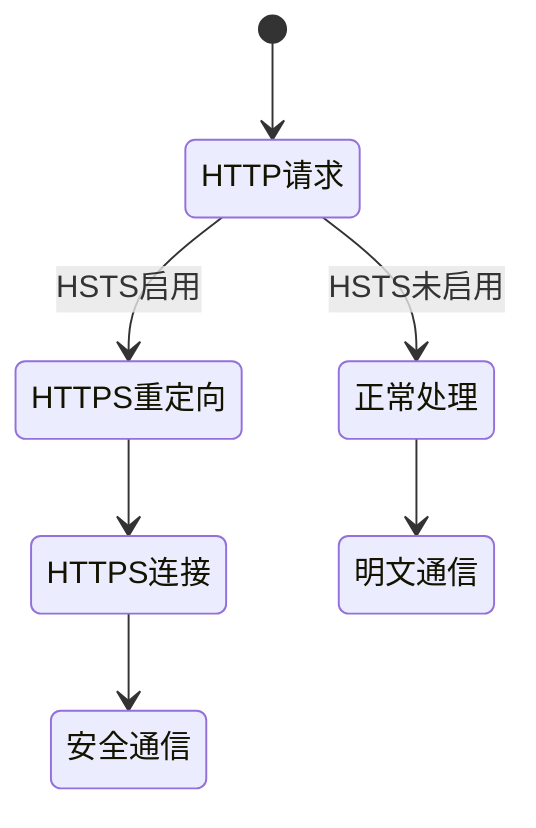
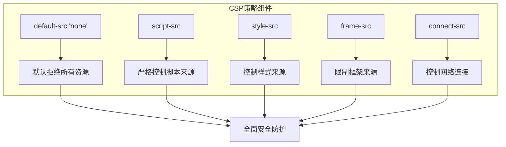
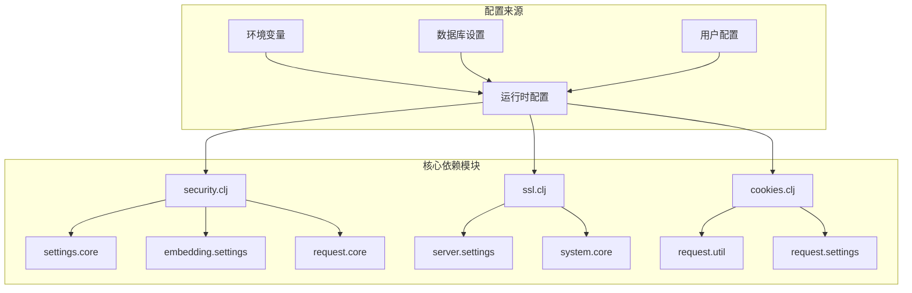

# 其他HTTP安全头

<cite>
**本文档中引用的文件**
- [security.clj](file://src/metabase/server/middleware/security.clj)
- [ssl.clj](file://src/metabase/server/middleware/ssl.clj)
- [settings.clj](file://src/metabase/server/settings.clj)
- [embedding/settings.clj](file://src/metabase/embedding/settings.clj)
- [cookies.clj](file://src/metabase/request/cookies.clj)
</cite>

## 目录
1. [简介](#简介)
2. [项目结构概述](#项目结构概述)
3. [核心安全头组件](#核心安全头组件)
4. [架构概览](#架构概览)
5. [详细组件分析](#详细组件分析)
6. [依赖关系分析](#依赖关系分析)
7. [性能考虑](#性能考虑)
8. [故障排除指南](#故障排除指南)
9. [结论](#结论)

## 简介

Metabase作为一个企业级BI工具，在设计时充分考虑了Web应用的安全性。除了基本的身份验证和授权机制外，Metabase还实现了多层次的HTTP安全头保护机制，构建了一个完整的纵深防御体系。本文档将详细分析Metabase中实现的关键HTTP安全头，包括X-XSS-Protection、X-Content-Type-Options、X-Permitted-Cross-Domain-Policies和Strict-Transport-Security等核心安全头。

这些安全头的实现不仅遵循了现代Web安全最佳实践，还针对Metabase的具体应用场景进行了优化，确保在提供强大功能的同时保持高水平的安全性。

## 项目结构概述

Metabase的安全头实现主要集中在以下几个核心模块中：

**图表来源**
- [security.clj](file://src/metabase/server/middleware/security.clj#L283-L306)
- [ssl.clj](file://src/metabase/server/middleware/ssl.clj#L34-L51)

**章节来源**
- [security.clj](file://src/metabase/server/middleware/security.clj#L0-L325)
- [ssl.clj](file://src/metabase/server/middleware/ssl.clj#L0-L51)

## 核心安全头组件

Metabase实现了以下关键HTTP安全头，每个都针对特定的安全威胁提供防护：

### 安全头配置表

| 安全头名称 | 值 | 功能描述 | 防护威胁 |
|-----------|-----|----------|----------|
| X-XSS-Protection | 1; mode=block | 启用浏览器XSS过滤器并配置为阻塞模式 | 跨站脚本攻击(XSS) |
| X-Content-Type-Options | nosniff | 防止MIME类型混淆攻击 | MIME类型欺骗攻击 |
| X-Permitted-Cross-Domain-Policies | none | 禁止Flash和PDF文件跨域加载资源 | 跨域资源访问攻击 |
| Strict-Transport-Security | max-age=31536000 | 强制浏览器使用HTTPS连接 | 中间人攻击(MITM) |

**章节来源**
- [security.clj](file://src/metabase/server/middleware/security.clj#L283-L306)

## 架构概览

Metabase的安全头实现采用了中间件模式，通过统一的接口为所有HTTP响应添加必要的安全头：

**图表来源**
- [security.clj](file://src/metabase/server/middleware/security.clj#L305-L323)

## 详细组件分析

### X-XSS-Protection头分析

#### 实现机制
X-XSS-Protection头通过设置`1; mode=block`值来启用浏览器的XSS过滤器，并配置为直接阻止可疑的XSS攻击。

**图表来源**
- [security.clj](file://src/metabase/server/middleware/security.clj#L288)

#### 安全防护效果
- **实时检测**: 浏览器会实时检测页面内容中的XSS特征
- **自动阻止**: 当检测到可疑的XSS攻击时，自动阻止执行恶意脚本
- **用户透明**: 对正常用户无感知，仅在检测到攻击时生效

**章节来源**
- [security.clj](file://src/metabase/server/middleware/security.clj#L288)

### X-Content-Type-Options头分析

#### MIME类型混淆防护
X-Content-Type-Options头设置为`nosniff`，防止浏览器尝试猜测文件的真实MIME类型，从而避免MIME类型混淆攻击。

**图表来源**
- [security.clj](file://src/metabase/server/middleware/security.clj#L292)

#### 攻击防护原理
- **固定MIME类型**: 浏览器严格使用服务器声明的Content-Type
- **阻止猜测**: 防止攻击者通过修改文件扩展名或内容来欺骗浏览器
- **增强安全性**: 确保只有预期类型的文件被正确处理

**章节来源**
- [security.clj](file://src/metabase/server/middleware/security.clj#L292)

### X-Permitted-Cross-Domain-Policies头分析

#### 跨域策略控制
X-Permitted-Cross-Domain-Policies头设置为`none`，明确禁止Flash和PDF文件从其他域加载资源。

**图表来源**
- [security.clj](file://src/metabase/server/middleware/security.clj#L290)

#### 安全影响分析
- **Flash安全**: 防止Flash文件从不受信任的源加载资源
- **PDF保护**: 禁止PDF文件执行跨域JavaScript操作
- **最小权限原则**: 默认拒绝所有跨域策略，需要显式配置

**章节来源**
- [security.clj](file://src/metabase/server/middleware/security.clj#L290)

### Strict-Transport-Security头分析

#### HTTPS强制机制
Strict-Transport-Security头设置了`max-age=31536000`（一年），强制浏览器在未来一年内始终使用HTTPS连接。

**图表来源**
- [security.clj](file://src/metabase/server/middleware/security.clj#L54-L59)
- [ssl.clj](file://src/metabase/server/middleware/ssl.clj#L34-L51)

#### 实现细节
- **一年有效期**: 设置max-age为31536000秒（365天）
- **子域名包含**: 自动包含所有子域名
- **HTTPS优先**: 仅在原始请求为HTTPS时生效

**章节来源**
- [security.clj](file://src/metabase/server/middleware/security.clj#L54-L59)
- [ssl.clj](file://src/metabase/server/middleware/ssl.clj#L34-L51)

### Content-Security-Policy集成

#### 综合安全策略
Metabase不仅实现了基本的安全头，还集成了强大的Content-Security-Policy策略：

**图表来源**
- [security.clj](file://src/metabase/server/middleware/security.clj#L133-L199)

**章节来源**
- [security.clj](file://src/metabase/server/middleware/security.clj#L133-L199)

## 依赖关系分析

Metabase的安全头实现涉及多个模块间的协作：

**图表来源**
- [security.clj](file://src/metabase/server/middleware/security.clj#L0-L33)
- [ssl.clj](file://src/metabase/server/middleware/ssl.clj#L0-L39)

**章节来源**
- [security.clj](file://src/metabase/server/middleware/security.clj#L0-L33)
- [ssl.clj](file://src/metabase/server/middleware/ssl.clj#L0-L39)
- [cookies.clj](file://src/metabase/request/cookies.clj#L35-L65)

## 性能考虑

### 安全头性能影响
- **内存开销**: 安全头生成占用少量内存，对系统性能影响微乎其微
- **CPU使用**: 每次请求的安全头生成仅需少量CPU计算
- **网络传输**: 安全头大小通常在几十字节范围内，对带宽影响可忽略

### 优化策略
- **缓存机制**: 安全头配置支持缓存，减少重复计算
- **条件生成**: 仅在需要时生成特定的安全头
- **异步处理**: 安全头生成与业务逻辑分离，不影响主要流程

## 故障排除指南

### 常见问题及解决方案

#### HTTPS重定向问题
当遇到HTTPS重定向相关问题时，检查以下配置：
- `redirect-all-requests-to-https`设置是否正确
- `site-url`是否配置为HTTPS地址
- SSL证书是否有效

#### 嵌入式访问问题
如果嵌入式访问失败，检查：
- 嵌入式原点配置是否正确
- CORS设置是否允许目标域
- Cookie安全属性是否匹配

**章节来源**
- [settings.clj](file://src/metabase/server/settings.clj#L35-L50)
- [embedding/settings.clj](file://src/metabase/embedding/settings.clj#L148-L176)

## 结论

Metabase的HTTP安全头实现体现了现代Web应用安全的最佳实践。通过X-XSS-Protection、X-Content-Type-Options、X-Permitted-Cross-Domain-Policies和Strict-Transport-Security等关键安全头的协同工作，构建了一个完整的纵深防御体系。

这种多层次的安全防护不仅有效抵御了常见的Web攻击，还为用户提供了一个安全可靠的BI平台。随着Web安全威胁的不断演进，Metabase的安全头实现也为其他Web应用提供了宝贵的参考和借鉴价值。

通过持续的安全更新和优化，Metabase将继续为用户提供最前沿的安全保护，确保数据安全和隐私保护达到最高标准。