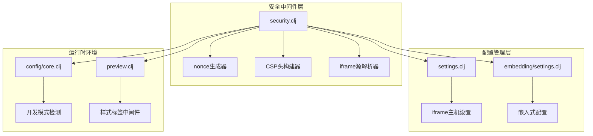
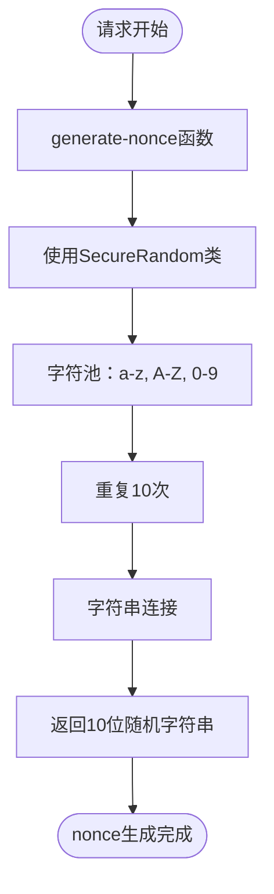
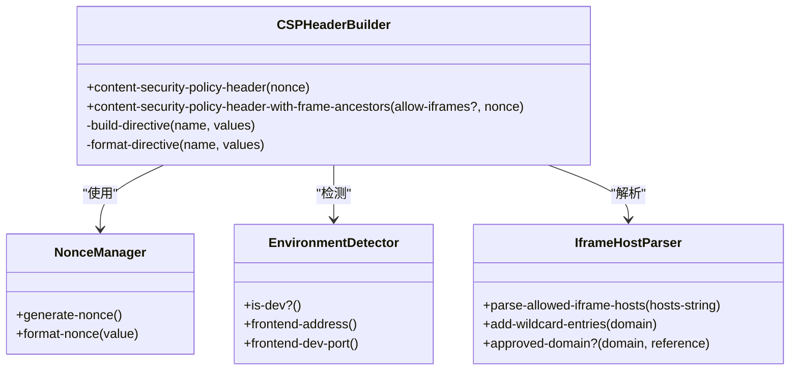
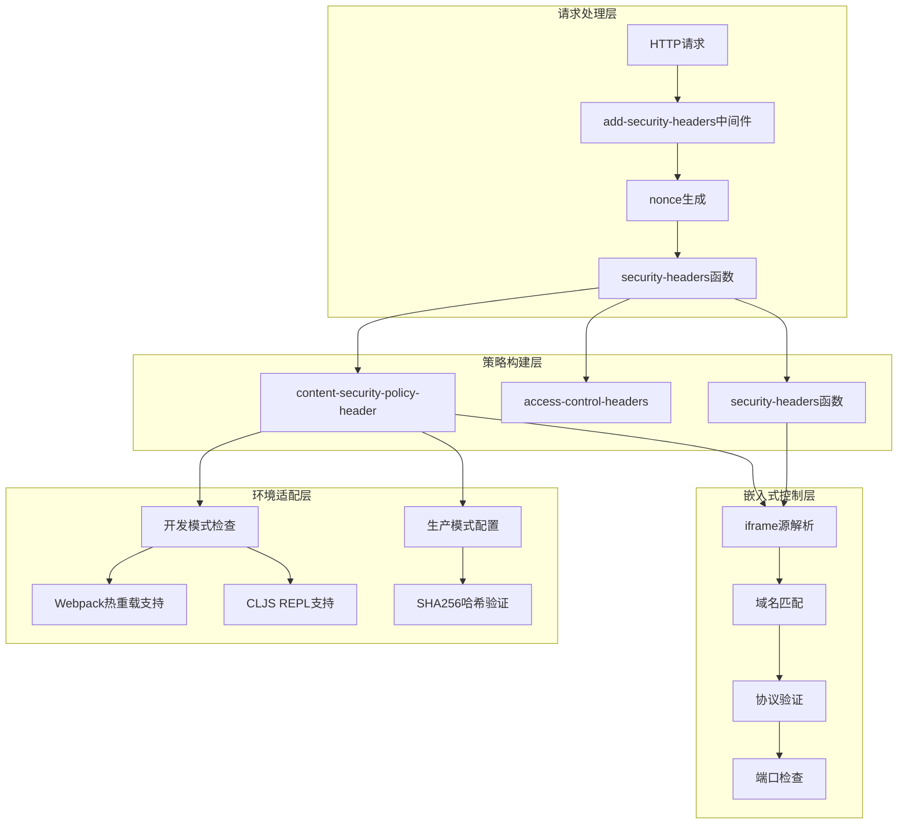
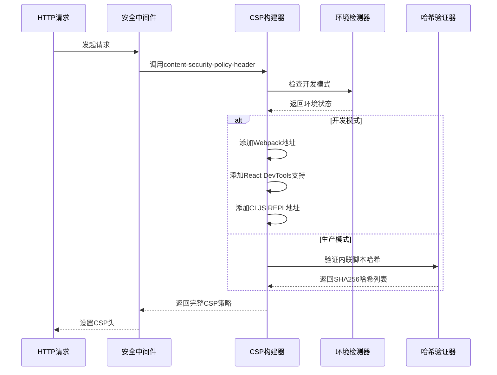
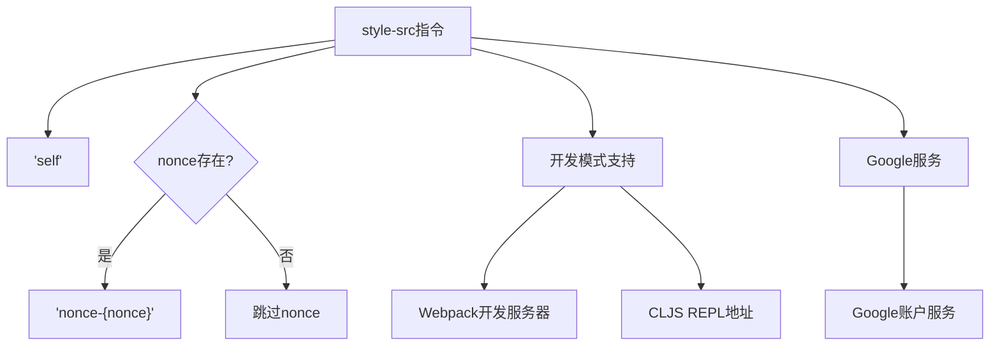
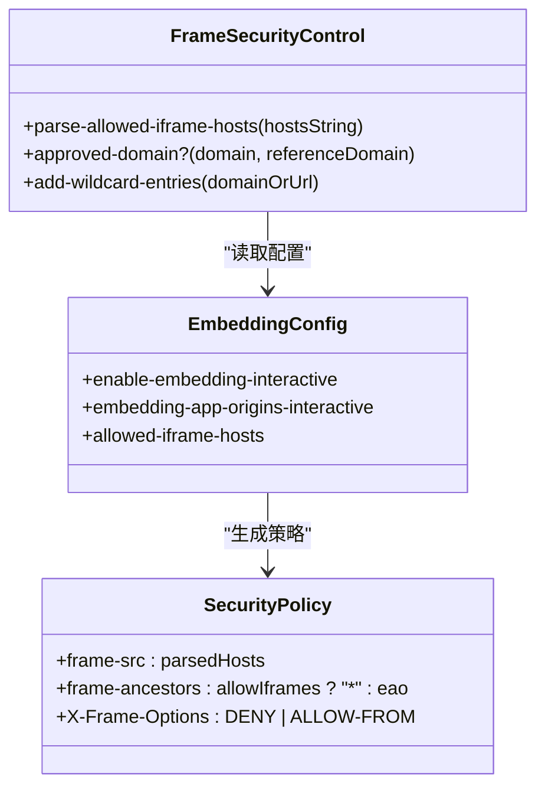
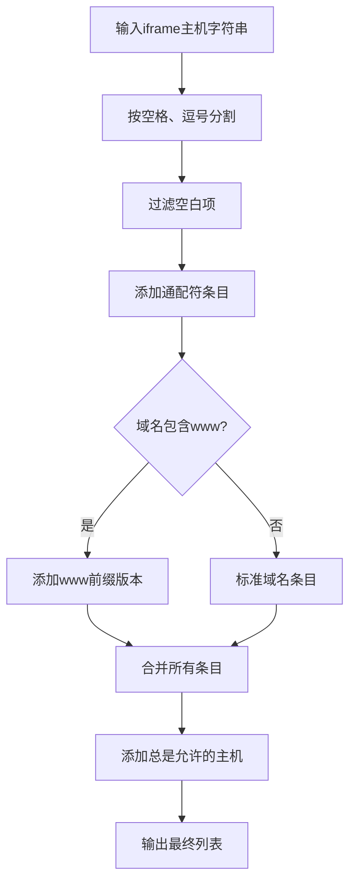
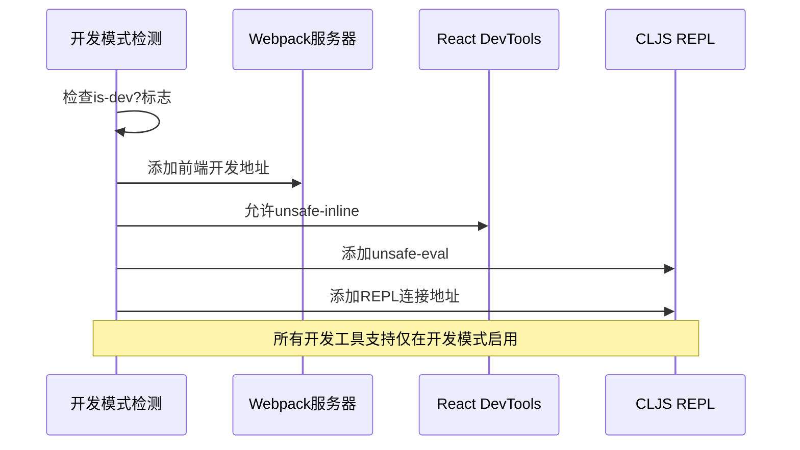
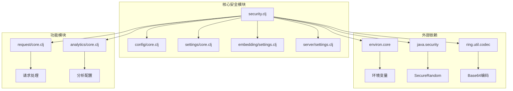

# 内容安全策略(CSP)

<cite>
**本文档中引用的文件**
- [security.clj](file://src/metabase/server/middleware/security.clj)
- [settings.clj](file://src/metabase/server/settings.clj)
- [embedding/settings.clj](file://src/metabase/embedding/settings.clj)
- [config/core.clj](file://src/metabase/config/core.clj)
- [preview.clj](file://src/metabase/channel/render/preview.clj)
</cite>

## 目录
1. [简介](#简介)
2. [项目结构概览](#项目结构概览)
3. [核心组件分析](#核心组件分析)
4. [架构概览](#架构概览)
5. [详细组件分析](#详细组件分析)
6. [依赖关系分析](#依赖关系分析)
7. [性能考虑](#性能考虑)
8. [故障排除指南](#故障排除指南)
9. [结论](#结论)

## 简介

Metabase的内容安全策略(CSP)实现是一个复杂而精密的安全机制，旨在保护应用程序免受跨站脚本(XSS)攻击和其他恶意内容注入威胁。该系统通过动态生成和管理CSP头，结合nonce机制和iframe源控制，为现代Web应用提供了强大的安全防护。

CSP机制的核心目标是：
- 防止恶意脚本执行
- 控制资源加载来源
- 支持开发环境的特殊需求
- 提供灵活的嵌入式配置

## 项目结构概览

Metabase的CSP实现主要分布在以下关键模块中：

**图表来源**
- [security.clj](file://src/metabase/server/middleware/security.clj#L1-L325)
- [settings.clj](file://src/metabase/server/settings.clj#L1-L77)
- [embedding/settings.clj](file://src/metabase/embedding/settings.clj#L1-L315)

**章节来源**
- [security.clj](file://src/metabase/server/middleware/security.clj#L1-L50)
- [settings.clj](file://src/metabase/server/settings.clj#L1-L49)

## 核心组件分析

### nonce生成机制

Metabase的nonce生成器是CSP安全机制的核心组件，负责为每个HTTP响应生成唯一的随机令牌。

**图表来源**
- [security.clj](file://src/metabase/server/middleware/security.clj#L25-L33)

nonce生成算法具有以下特点：
- 使用Java SecureRandom确保密码学安全性
- 生成长度固定为10个字符的随机字符串
- 字符集包含大小写字母和数字
- 每个响应都生成新的唯一nonce值

### CSP头构建系统

CSP头构建器负责根据当前环境和配置动态生成完整的CSP策略：

**图表来源**
- [security.clj](file://src/metabase/server/middleware/security.clj#L124-L199)
- [security.clj](file://src/metabase/server/middleware/security.clj#L25-L33)

**章节来源**
- [security.clj](file://src/metabase/server/middleware/security.clj#L25-L33)
- [security.clj](file://src/metabase/server/middleware/security.clj#L124-L199)

## 架构概览

Metabase的CSP架构采用分层设计，确保安全策略的灵活性和可维护性：

**图表来源**
- [security.clj](file://src/metabase/server/middleware/security.clj#L315-L325)
- [security.clj](file://src/metabase/server/middleware/security.clj#L275-L306)

## 详细组件分析

### script-src指令配置

script-src指令控制JavaScript资源的加载来源，是CSP中最关键的指令之一：

**图表来源**
- [security.clj](file://src/metabase/server/middleware/security.clj#L124-L199)

script-src指令的关键配置项：

| 指令类型 | 开发模式 | 生产模式 | 说明 |
|---------|---------|---------|------|
| `'self'` | ✓ | ✓ | 允许同源脚本 |
| `'unsafe-inline'` | ✓ | ✗ | 开发模式下的内联脚本支持 |
| `'unsafe-eval'` | ✓ | ✗ | CLJS REPL需要的评估支持 |
| Google服务 | ✓ | ✓ | 地图和身份验证服务 |
| Webpack地址 | ✓ | ✗ | 热重载开发服务器 |
| SHA256哈希 | ✗ | ✓ | 内联脚本的精确验证 |

### style-src指令配置

style-src指令专门控制CSS资源的加载和内联样式脚本的执行：

**图表来源**
- [security.clj](file://src/metabase/server/middleware/security.clj#L145-L175)

### frame-src和frame-ancestors指令

iframe安全控制是CSP的重要组成部分，通过frame-src和frame-ancestors指令实现精细的嵌入式访问控制：

**图表来源**
- [security.clj](file://src/metabase/server/middleware/security.clj#L115-L130)
- [security.clj](file://src/metabase/server/middleware/security.clj#L174-L199)

iframe源解析的特殊处理逻辑：

**图表来源**
- [security.clj](file://src/metabase/server/middleware/security.clj#L115-L130)

**章节来源**
- [security.clj](file://src/metabase/server/middleware/security.clj#L115-L130)
- [security.clj](file://src/metabase/server/middleware/security.clj#L145-L175)
- [security.clj](file://src/metabase/server/middleware/security.clj#L174-L199)

### connect-src指令配置

connect-src指令控制应用程序可以发起的网络连接，包括API调用、资源加载等：

| 连接类型 | 来源 | 用途 |
|---------|------|------|
| `'self'` | 同源 | 应用程序API调用 |
| Google服务 | `https://accounts.google.com` | 身份验证和地图服务 |
| 分析服务 | `metabase.us10.list-manage.com` | 邮件订阅服务 |
| Snowplow分析 | 动态配置 | 用户行为分析 |
| 开发服务器 | `*:{port}` | Webpack热重载 |
| CLJS REPL | `ws://*:9630` | 实时调试连接 |

### 开发模式特殊处理

开发模式下的CSP配置针对前端开发工具进行了特殊优化：

**图表来源**
- [security.clj](file://src/metabase/server/middleware/security.clj#L133-L155)

**章节来源**
- [security.clj](file://src/metabase/server/middleware/security.clj#L133-L155)
- [security.clj](file://src/metabase/server/middleware/security.clj#L174-L199)

## 依赖关系分析

Metabase的CSP实现涉及多个模块间的复杂依赖关系：

**图表来源**
- [security.clj](file://src/metabase/server/middleware/security.clj#L1-L20)

关键依赖关系说明：

1. **环境检测依赖**：通过`config/is-dev?`标志确定运行环境
2. **配置读取依赖**：从设置模块读取iframe主机和嵌入式配置
3. **安全随机数依赖**：使用Java SecureRandom生成nonce
4. **URL解析依赖**：解析和验证iframe源的域名、协议和端口

**章节来源**
- [security.clj](file://src/metabase/server/middleware/security.clj#L1-L20)

## 性能考虑

CSP实现的性能优化主要体现在以下几个方面：

### 缓存友好性

- **静态CSP策略**：对于非嵌入式请求，CSP策略保持不变
- **动态nonce生成**：每次请求生成新nonce，不影响缓存策略
- **memoized解析器**：iframe主机解析结果被缓存以提高性能

### 内存使用优化

- **延迟计算**：只有在需要时才计算CSP策略
- **字符串拼接优化**：使用高效的字符串连接方式
- **常量预编译**：内联脚本哈希值作为编译时常量

### 计算复杂度

CSP策略构建的时间复杂度为O(n)，其中n是配置项的数量。由于配置项数量有限，实际性能影响可以忽略不计。

## 故障排除指南

### 常见CSP问题及解决方案

| 问题类型 | 症状 | 可能原因 | 解决方案 |
|---------|------|---------|---------|
| 脚本加载失败 | JavaScript功能异常 | script-src限制过严 | 检查开发模式配置或添加必要源 |
| iframe无法显示 | 嵌入内容被阻止 | frame-src或frame-ancestors限制 | 配置allowed-iframe-hosts设置 |
| 热重载失效 | 开发时页面不更新 | 开发模式CSP配置错误 | 确认前端开发服务器地址正确 |
| 内联样式被阻止 | 样式显示异常 | style-src限制 | 检查nonce机制是否正常工作 |

### 调试技巧

1. **浏览器开发者工具**：查看CSP违规报告
2. **日志记录**：启用详细的CSP日志
3. **配置验证**：定期检查iframe主机配置
4. **环境测试**：在不同环境中测试CSP配置

**章节来源**
- [security.clj](file://src/metabase/server/middleware/security.clj#L283-L306)

## 结论

Metabase的CSP实现体现了现代Web应用安全的最佳实践，通过以下关键特性提供了强大的安全保障：

### 主要优势

1. **动态nonce机制**：为每个请求生成唯一令牌，有效防止XSS攻击
2. **环境感知配置**：智能区分开发和生产环境的不同需求
3. **灵活的嵌入控制**：精细的iframe源管理和域名验证
4. **全面的安全覆盖**：涵盖脚本、样式、连接等多种资源类型

### 最佳实践建议

1. **生产环境配置**：始终使用严格的CSP策略，避免使用unsafe-inline
2. **开发环境优化**：合理配置开发工具支持，提升开发体验
3. **定期审计**：定期审查iframe主机配置，移除不必要的来源
4. **监控告警**：建立CSP违规监控机制，及时发现潜在安全问题

### 未来发展方向

随着Web安全技术的发展，CSP实现可以进一步优化：
- 引入更细粒度的权限控制
- 增强对新兴威胁的防护能力
- 优化性能开销，减少对用户体验的影响
- 提供更直观的配置界面和可视化工具

通过持续改进和优化，Metabase的CSP实现将继续为用户提供可靠的安全保障。