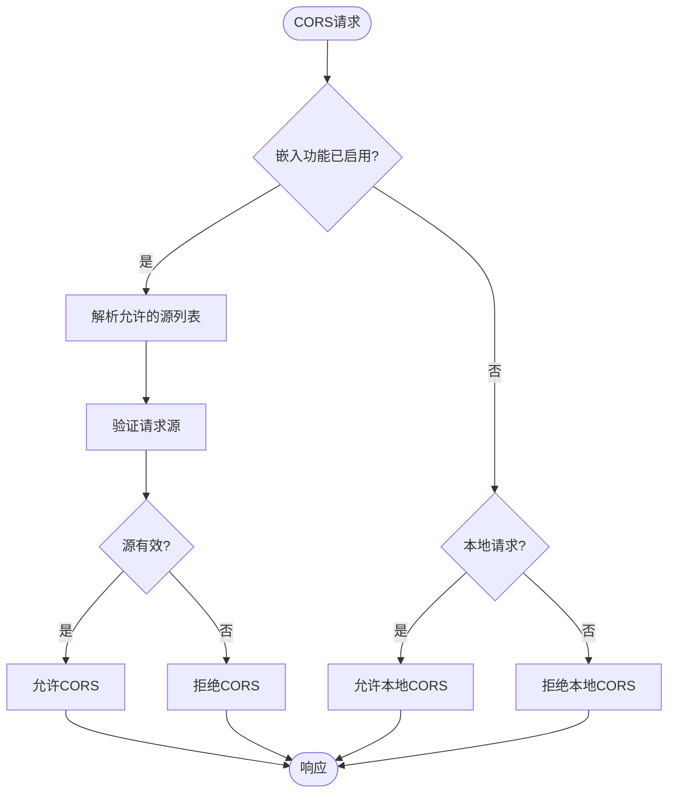
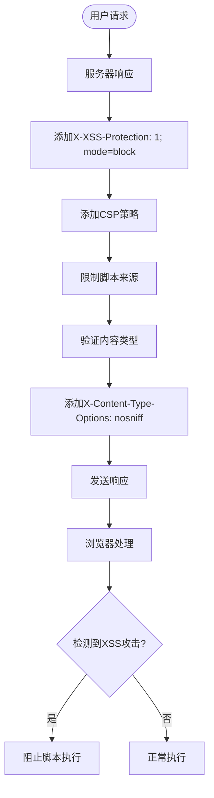
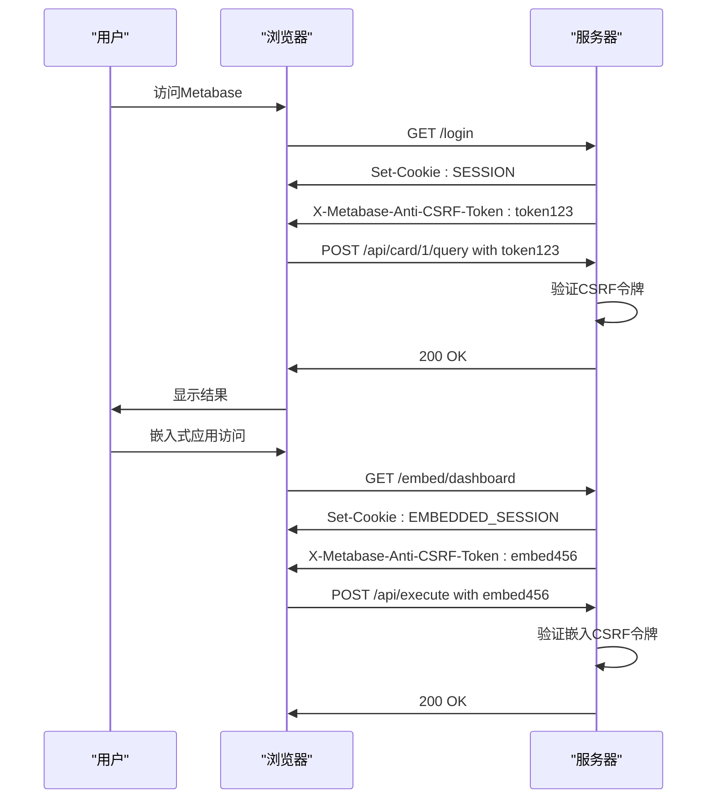
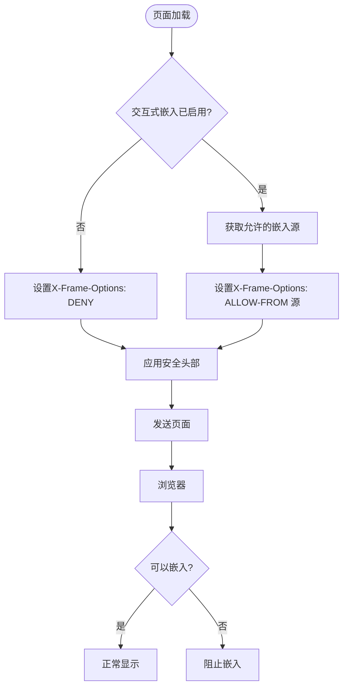
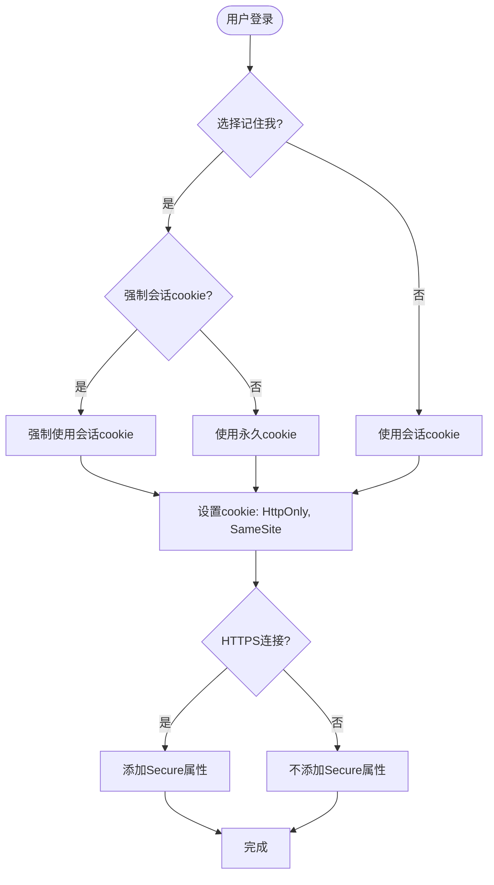
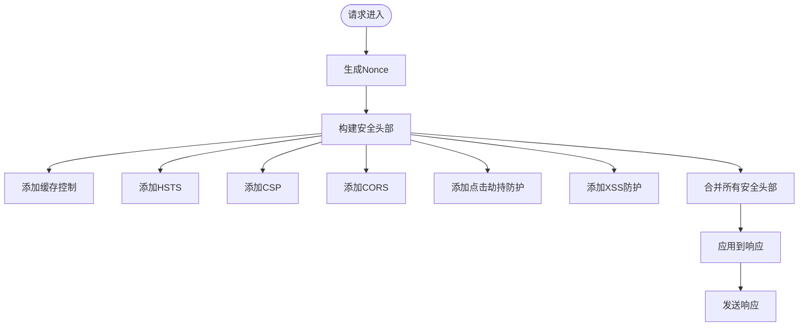

# 安全配置与策略

<cite>
**本文档中引用的文件**  
- [security.clj](file://src/metabase/server/middleware/security.clj)
- [embedding/settings.clj](file://src/metabase/embedding/settings.clj)
- [server/settings.clj](file://src/metabase/server/settings.clj)
- [request/settings.clj](file://src/metabase/request/settings.clj)
- [session/settings.clj](file://src/metabase/session/settings.clj)
- [cookies.clj](file://src/metabase/request/cookies.clj)
</cite>

## 目录
1. [引言](#引言)
2. [安全配置概览](#安全配置概览)
3. [CORS策略](#cors策略)
4. [内容安全策略(CSP)](#内容安全策略csp)
5. [XSS防护](#xss防护)
6. [CSRF防御](#csrf防御)
7. [点击劫持防护](#点击劫持防护)
8. [会话安全配置](#会话安全配置)
9. [安全中间件实现](#安全中间件实现)
10. [最佳实践与生产环境推荐](#最佳实践与生产环境推荐)

## 引言
Metabase系统通过一系列安全配置选项和中间件来确保应用程序的安全性。本文档详细说明了`settings`模块中的安全设置，包括跨域资源共享(CORS)策略、内容安全策略(CSP)、跨站脚本(XSS)防护、跨站请求伪造(CSRF)防御以及点击劫持防护等关键安全机制。同时，本文档还解释了`server/middleware/security.clj`中实现的安全中间件及其作用，为系统管理员提供安全配置的最佳实践、默认值解释和生产环境推荐设置。

## 安全配置概览
Metabase的安全配置主要分布在多个模块中，通过`settings`系统进行集中管理。这些配置通过环境变量或管理界面进行设置，为系统提供了灵活的安全控制能力。安全配置涵盖了从HTTP头部安全到会话管理的各个方面，确保了应用程序在不同部署环境下的安全性。

**Section sources**
- [security.clj](file://src/metabase/server/middleware/security.clj#L0-L33)
- [embedding/settings.clj](file://src/metabase/embedding/settings.clj#L0-L314)

## CORS策略
跨域资源共享(CORS)策略在Metabase中通过`embedding.settings/embedding-app-origins-sdk`和`server.settings/disable-cors-on-localhost`等设置进行管理。系统允许管理员配置哪些外部源可以嵌入Metabase内容，从而控制跨域访问权限。

当启用SDK嵌入或简单嵌入功能时，系统会根据配置的允许源列表验证请求来源。对于本地开发环境，localhost默认被允许，除非明确禁用。系统还实现了特殊的CORS处理逻辑，确保在SSO认证失败等情况下仍能正确处理跨域请求。



**Diagram sources**
- [security.clj](file://src/metabase/server/middleware/security.clj#L261-L283)
- [embedding/settings.clj](file://src/metabase/embedding/settings.clj#L148-L176)

**Section sources**
- [security.clj](file://src/metabase/server/middleware/security.clj#L261-L283)
- [embedding/settings.clj](file://src/metabase/embedding/settings.clj#L148-L176)

## 内容安全策略CSP
内容安全策略(CSP)是Metabase防止跨站脚本攻击的核心机制之一。系统通过`Content-Security-Policy`头部定义了严格的资源加载规则，限制了脚本、样式、框架等资源的来源。

CSP配置包括多个指令：
- `default-src 'none'`：默认禁止所有资源加载
- `script-src`：限制脚本来源，包括自定义nonce和SHA-256哈希值
- `style-src`：限制样式表来源，使用nonce机制保护内联样式
- `frame-src`：控制iframe嵌入的允许源
- `connect-src`：限制AJAX、WebSocket等连接的目标

对于嵌入场景，系统根据请求类型动态调整`frame-ancestors`指令，允许特定来源的页面嵌入Metabase内容。

```mermaid
flowchart TD
Start([HTTP响应]) --> GenerateNonce["生成Nonce值"]
GenerateNonce --> BuildCSP["构建CSP策略"]
BuildCSP --> AddDirectives["添加策略指令"]
AddDirectives --> script-src["script-src: 'self', nonce, 哈希值"]
AddDirectives --> style-src["style-src: 'self', nonce"]
AddDirectives --> frame-src["frame-src: 允许的嵌入源"]
AddDirectives --> frame-ancestors["frame-ancestors: 根据嵌入状态"]
AddDirectives --> OtherDirectives["其他资源限制"]
OtherDirectives --> ApplyCSP["应用CSP头部"]
ApplyCSP --> SendResponse["发送响应"]
```

**Diagram sources**
- [security.clj](file://src/metabase/server/middleware/security.clj#L133-L155)
- [security.clj](file://src/metabase/server/middleware/security.clj#L174-L199)

**Section sources**
- [security.clj](file://src/metabase/server/middleware/security.clj#L133-L199)

## XSS防护
Metabase通过多种机制提供跨站脚本(XSS)防护。系统在HTTP响应中添加了`X-XSS-Protection`头部，指示浏览器启用内置的XSS过滤器。

此外，通过内容安全策略(CSP)的严格配置，系统有效防止了反射型和存储型XSS攻击。CSP的`script-src`指令限制了脚本的执行来源，仅允许来自可信域的脚本或具有正确nonce值的内联脚本执行。

系统还通过`X-Content-Type-Options: nosniff`头部防止MIME类型混淆攻击，确保浏览器不会尝试猜测文件的实际类型，从而避免将非脚本文件当作脚本执行。



**Diagram sources**
- [security.clj](file://src/metabase/server/middleware/security.clj#L283-L306)

**Section sources**
- [security.clj](file://src/metabase/server/middleware/security.clj#L283-L306)

## CSRF防御
跨站请求伪造(CSRF)防御在Metabase中通过反CSRF令牌机制实现。系统在用户会话中生成并验证反CSRF令牌，确保敏感操作请求来自合法的用户会话。

当用户登录或创建嵌入会话时，系统会生成反CSRF令牌并将其作为响应头部`X-Metabase-Anti-CSRF-Token`返回。后续的敏感操作请求必须包含此令牌，服务器会验证令牌的有效性。

对于嵌入式应用，系统通过`metabase.EMBEDDED_SESSION` cookie和相应的反CSRF令牌提供安全的跨域认证机制，同时确保SameSite cookie属性的正确配置以增强安全性。



**Diagram sources**
- [cookies.clj](file://src/metabase/request/cookies.clj#L167-L181)
- [request/settings.clj](file://src/metabase/request/settings.clj#L37-L65)

**Section sources**
- [cookies.clj](file://src/metabase/request/cookies.clj#L167-L181)
- [request/settings.clj](file://src/metabase/request/settings.clj#L37-L65)

## 点击劫持防护
点击劫持防护通过`X-Frame-Options`和CSP的`frame-ancestors`指令实现。系统默认设置`X-Frame-Options: DENY`，防止Metabase界面被嵌入到其他网站的iframe中。

当启用交互式嵌入功能时，系统会根据`embedding-app-origins-interactive`配置的来源列表，动态调整`X-Frame-Options`为`ALLOW-FROM`特定来源。这种机制确保了只有授权的网站才能嵌入Metabase内容，有效防止了点击劫持攻击。



**Diagram sources**
- [security.clj](file://src/metabase/server/middleware/security.clj#L283-L306)

**Section sources**
- [security.clj](file://src/metabase/server/middleware/security.clj#L283-L306)

## 会话安全配置
会话安全配置通过多个设置进行管理，包括会话cookie的SameSite属性、会话超时和会话cookie类型。`session-cookie-samesite`设置控制cookie的跨站行为，支持`lax`、`none`和`strict`三种模式。

系统还提供了`session-timeout`设置，允许管理员配置非活动用户的会话超时时间。`session-cookies`设置可以强制所有用户使用会话cookie，忽略"记住我"选项，增强安全性。



**Diagram sources**
- [request/settings.clj](file://src/metabase/request/settings.clj#L37-L65)
- [session/settings.clj](file://src/metabase/session/settings.clj#L0-L45)

**Section sources**
- [request/settings.clj](file://src/metabase/request/settings.clj#L37-L65)
- [session/settings.clj](file://src/metabase/session/settings.clj#L0-L45)

## 安全中间件实现
安全中间件`add-security-headers`是Metabase安全机制的核心实现。该中间件在每个HTTP响应中添加必要的安全头部，确保所有响应都符合安全策略。

中间件的工作流程包括：
1. 为每个响应生成唯一的nonce值
2. 根据请求类型和配置构建安全头部
3. 合并CORS相关头部
4. 将安全头部添加到响应中

中间件还实现了缓存控制，对静态资源使用长期缓存，对动态内容禁用缓存，平衡了性能和安全性。



**Diagram sources**
- [security.clj](file://src/metabase/server/middleware/security.clj#L305-L323)

**Section sources**
- [security.clj](file://src/metabase/server/middleware/security.clj#L305-L323)

## 最佳实践与生产环境推荐
在生产环境中部署Metabase时，应遵循以下安全配置最佳实践：

### CORS配置
- 仅允许必要的嵌入源
- 避免使用通配符(*)，指定具体的域名
- 在开发环境中谨慎使用`disable-cors-on-localhost`

### CSP配置
- 定期审查允许的脚本来源
- 使用nonce和哈希值保护内联脚本
- 限制frame-src到必要的第三方服务

### 会话安全
- 在生产环境中使用HTTPS
- 当设置`SameSite: None`时，必须同时设置`Secure`属性
- 根据业务需求合理配置会话超时时间

### 其他推荐
- 启用`redirect-all-requests-to-https`强制HTTPS
- 定期轮换`embedding-secret-key`
- 监控安全相关日志，及时发现异常

这些配置共同构成了Metabase的纵深防御体系，确保了系统的整体安全性。

**Section sources**
- [server/settings.clj](file://src/metabase/server/settings.clj#L0-L76)
- [embedding/settings.clj](file://src/metabase/embedding/settings.clj#L0-L314)
- [security.clj](file://src/metabase/server/middleware/security.clj#L0-L324)