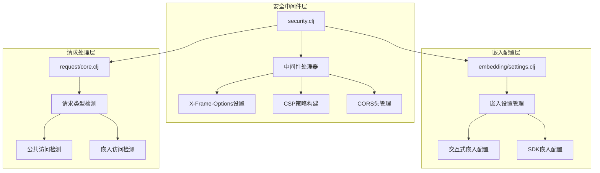
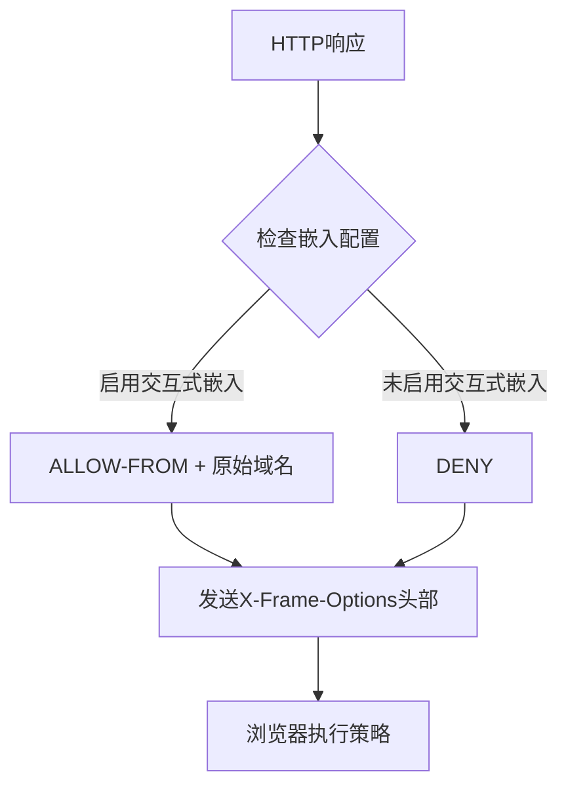
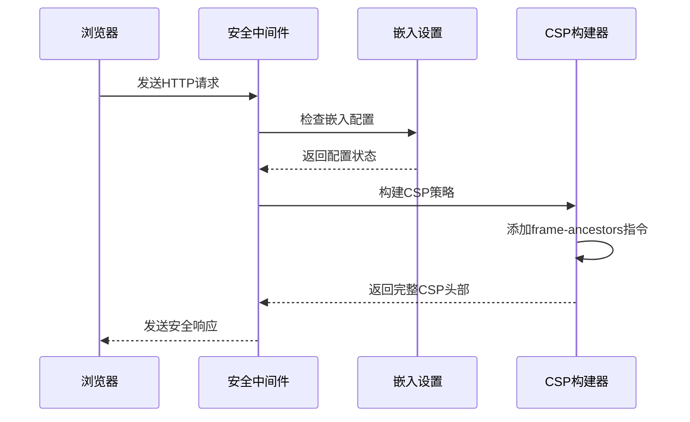
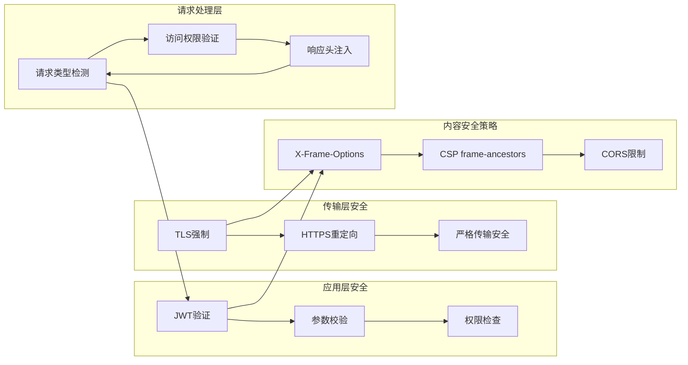
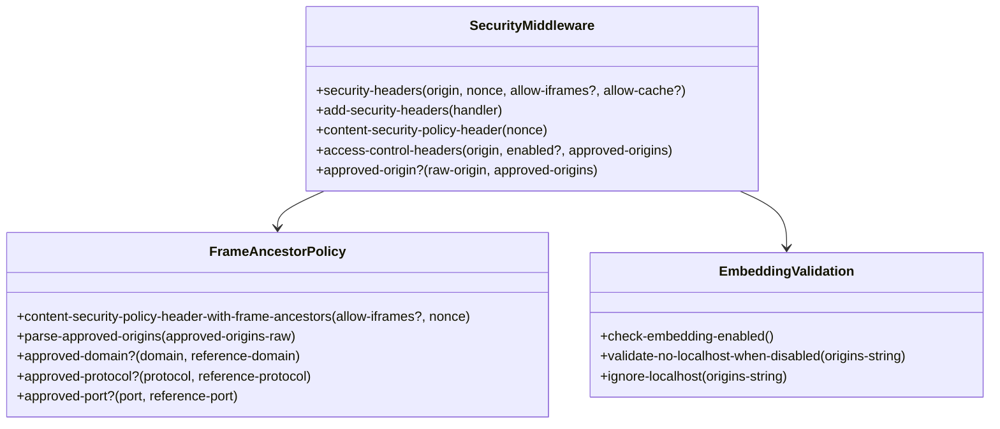
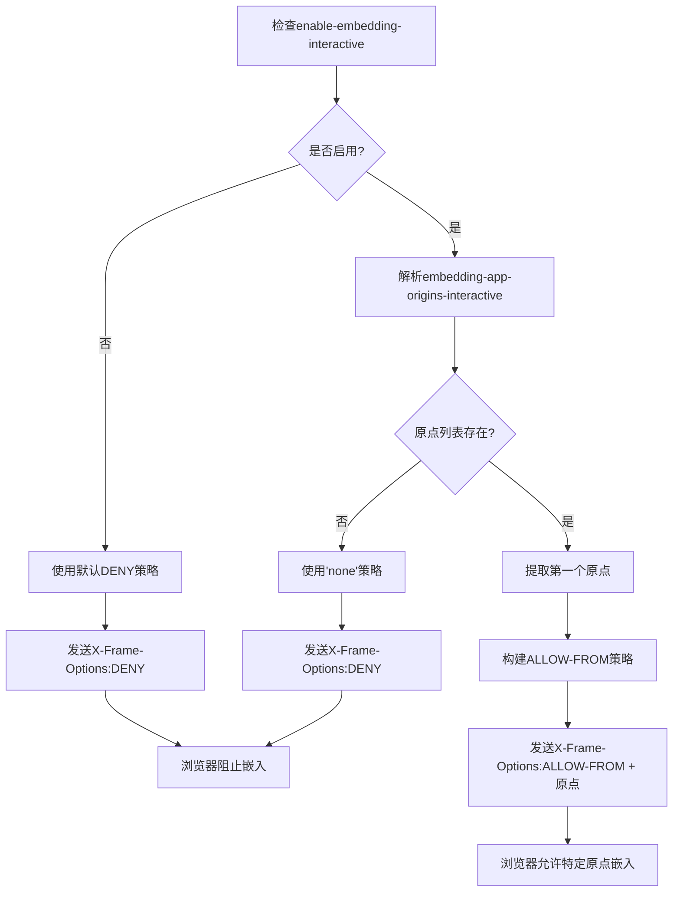
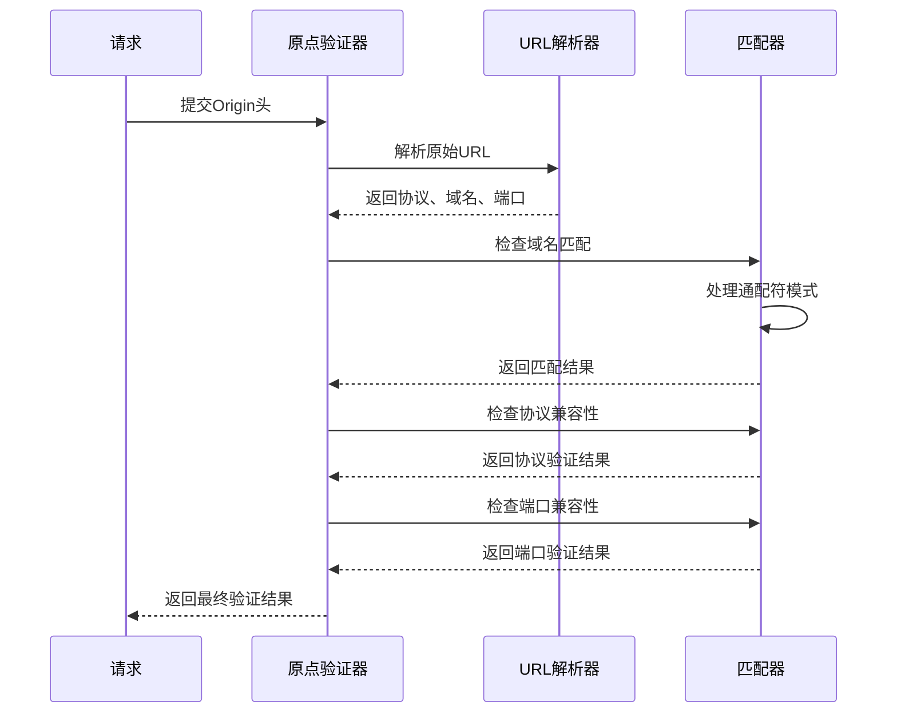
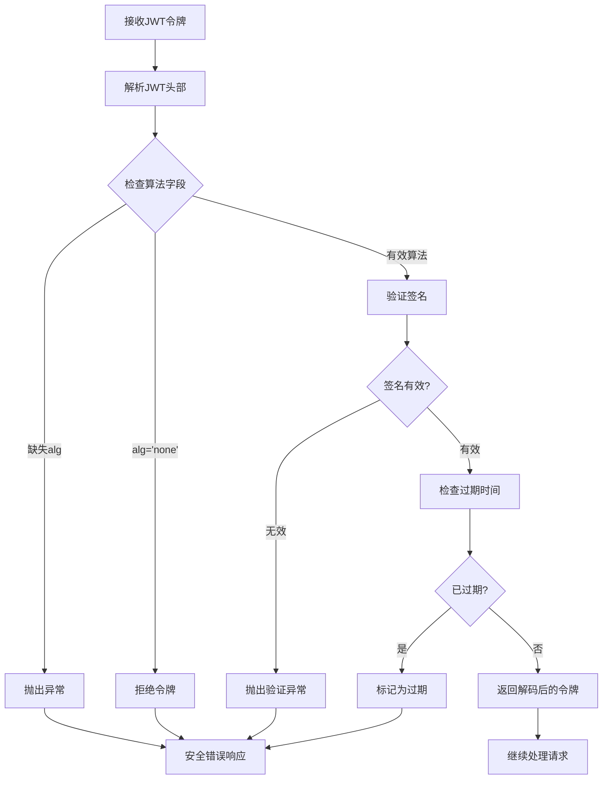
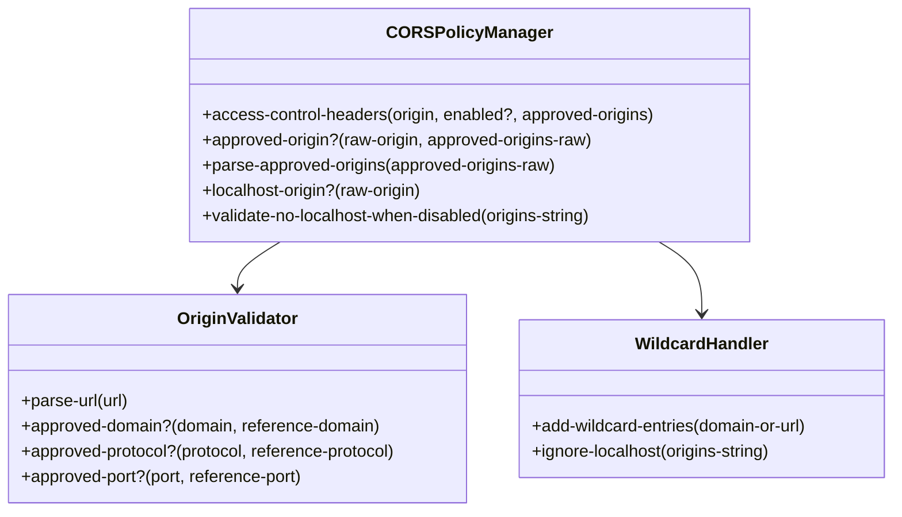
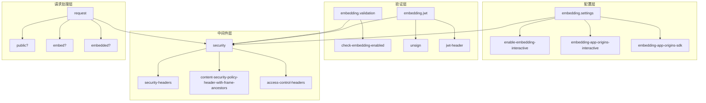

# 点击劫持与X-Frame-Options

<cite>
**本文档中引用的文件**
- [security.clj](file://src/metabase/server/middleware/security.clj)
- [settings.clj](file://src/metabase/embedding/settings.clj)
- [jwt.clj](file://src/metabase/embedding/jwt.clj)
- [validation.clj](file://src/metabase/embedding/validation.clj)
- [core.clj](file://src/metabase/request/core.clj)
- [settings.clj](file://src/metabase/server/settings.clj)
</cite>

## 目录
1. [简介](#简介)
2. [项目结构概览](#项目结构概览)
3. [核心安全组件](#核心安全组件)
4. [架构概览](#架构概览)
5. [详细组件分析](#详细组件分析)
6. [依赖关系分析](#依赖关系分析)
7. [性能考虑](#性能考虑)
8. [故障排除指南](#故障排除指南)
9. [结论](#结论)

## 简介

Metabase实现了多层次的安全防护机制来防止点击劫持攻击（Clickjacking），这是一种通过在透明或半透明的iframe中嵌入恶意内容来欺骗用户进行非预期操作的攻击方式。本文档深入分析了Metabase的点击劫持防护体系，重点介绍了X-Frame-Options头部、Content-Security-Policy的frame-ancestors指令，以及交互式嵌入的安全策略实现。

## 项目结构概览

Metabase的安全防护机制主要分布在以下关键模块中：

**图表来源**
- [security.clj](file://src/metabase/server/middleware/security.clj#L1-L325)
- [settings.clj](file://src/metabase/embedding/settings.clj#L1-L315)
- [core.clj](file://src/metabase/request/core.clj#L1-L58)

## 核心安全组件

### X-Frame-Options头部实现

Metabase使用X-Frame-Options头部作为第一层防护，直接告诉浏览器是否允许页面被嵌入iframe中：

**图表来源**
- [security.clj](file://src/metabase/server/middleware/security.clj#L283-L286)

### Content-Security-Policy框架祖先策略

CSP的frame-ancestors指令提供了更细粒度的控制：

**图表来源**
- [security.clj](file://src/metabase/server/middleware/security.clj#L176-L182)
- [security.clj](file://src/metabase/server/middleware/security.clj#L275-L286)

**节来源**
- [security.clj](file://src/metabase/server/middleware/security.clj#L275-L286)

## 架构概览

Metabase的安全架构采用分层防护策略，确保即使某一层防护失效，其他层仍能提供保护：

**图表来源**
- [security.clj](file://src/metabase/server/middleware/security.clj#L275-L306)
- [jwt.clj](file://src/metabase/embedding/jwt.clj#L30-L49)
- [validation.clj](file://src/metabase/embedding/validation.clj#L8-L11)

## 详细组件分析

### 安全中间件核心逻辑

安全中间件是整个防护体系的核心，负责协调各种安全策略：

**图表来源**
- [security.clj](file://src/metabase/server/middleware/security.clj#L275-L306)
- [security.clj](file://src/metabase/server/middleware/security.clj#L176-L182)
- [validation.clj](file://src/metabase/embedding/validation.clj#L8-L11)

### 交互式嵌入安全策略

当启用交互式嵌入时，系统会动态调整安全策略以实现受控的交互：

**图表来源**
- [security.clj](file://src/metabase/server/middleware/security.clj#L283-L286)

### 原点验证机制

系统实现了复杂的原点验证机制来确保只有授权的域可以嵌入：

**图表来源**
- [security.clj](file://src/metabase/server/middleware/security.clj#L208-L235)

**节来源**
- [security.clj](file://src/metabase/server/middleware/security.clj#L208-L235)

### JWT安全验证

嵌入功能依赖于JWT令牌的安全验证：

**图表来源**
- [jwt.clj](file://src/metabase/embedding/jwt.clj#L20-L49)

**节来源**
- [jwt.clj](file://src/metabase/embedding/jwt.clj#L20-L49)

### CORS策略管理

跨域资源共享(CORS)策略确保只有授权的源可以访问嵌入资源：

**图表来源**
- [security.clj](file://src/metabase/server/middleware/security.clj#L234-L263)
- [security.clj](file://src/metabase/server/middleware/security.clj#L80-L102)

**节来源**
- [security.clj](file://src/metabase/server/middleware/security.clj#L234-L263)

## 依赖关系分析

系统的安全组件之间存在复杂的依赖关系：

**图表来源**
- [security.clj](file://src/metabase/server/middleware/security.clj#L1-L20)
- [settings.clj](file://src/metabase/embedding/settings.clj#L1-L20)
- [core.clj](file://src/metabase/request/core.clj#L1-L20)

**节来源**
- [security.clj](file://src/metabase/server/middleware/security.clj#L1-L325)
- [settings.clj](file://src/metabase/embedding/settings.clj#L1-L315)

## 性能考虑

### 缓存策略优化

系统实现了智能的缓存控制策略：

- **静态资源**：使用长期缓存策略（max-age=31536000）
- **动态内容**：禁用缓存以确保安全性
- **CSP策略**：根据请求类型动态调整

### 计算复杂度分析

1. **原点验证**：O(n)复杂度，其中n是批准的原点数量
2. **JWT验证**：O(1)复杂度，涉及签名计算和时间戳验证
3. **CSP构建**：O(m)复杂度，其中m是策略指令数量

### 内存使用优化

- 使用memoization缓存频繁调用的解析函数
- 实现了内存高效的字符串处理
- 避免不必要的对象创建

## 故障排除指南

### 常见问题诊断

#### X-Frame-Options拒绝访问

**症状**：嵌入的仪表板显示"该页面无法在框架中显示"

**排查步骤**：
1. 检查`enable-embedding-interactive`设置
2. 验证`embedding-app-origins-interactive`配置
3. 确认域名格式正确（不包含协议）

#### CORS跨域错误

**症状**：浏览器控制台显示CORS相关错误

**排查步骤**：
1. 检查`disable-cors-on-localhost`设置
2. 验证嵌入原点是否在允许列表中
3. 确认SSL证书配置正确

#### JWT验证失败

**症状**：嵌入请求返回400错误，提示JWT无效

**排查步骤**：
1. 检查`embedding-secret-key`设置
2. 验证JWT令牌格式和签名
3. 确认令牌未过期

**节来源**
- [security.clj](file://src/metabase/server/middleware/security.clj#L283-L306)
- [jwt.clj](file://src/metabase/embedding/jwt.clj#L30-L49)

## 结论

Metabase的点击劫持防护机制体现了现代Web应用安全的最佳实践。通过多层次的安全策略、严格的原点验证、以及灵活的配置选项，系统能够在保证安全性的同时提供必要的功能性。

### 关键安全特性

1. **多层防护**：X-Frame-Options + CSP + CORS的组合防护
2. **动态策略**：根据配置动态调整安全策略
3. **精确控制**：支持精确的域名匹配和通配符模式
4. **审计跟踪**：完整的安全事件记录和监控

### 最佳实践建议

1. **定期审查配置**：定期检查嵌入配置和原点列表
2. **监控安全事件**：启用并监控安全相关的日志
3. **保持更新**：及时更新到最新的安全补丁
4. **最小权限原则**：只授予必要的嵌入权限

这种综合性的安全策略确保了Metabase在提供强大嵌入功能的同时，能够有效防范点击劫持等常见Web攻击。