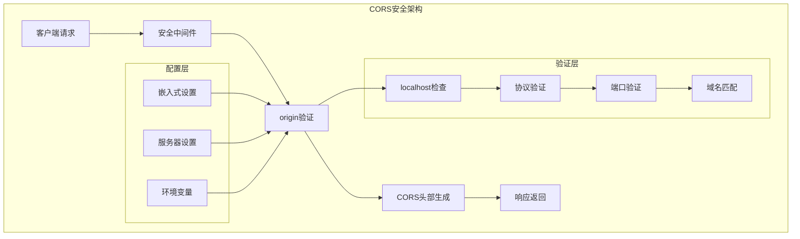
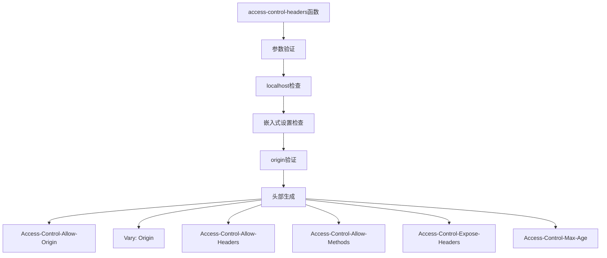
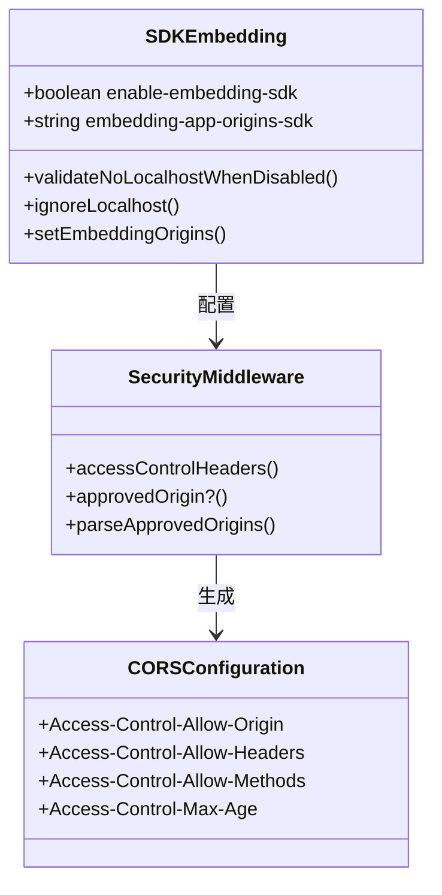
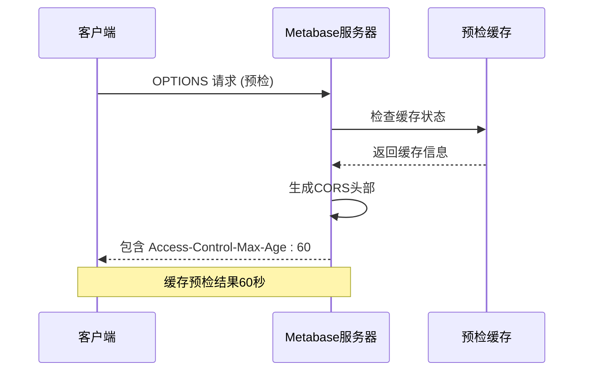
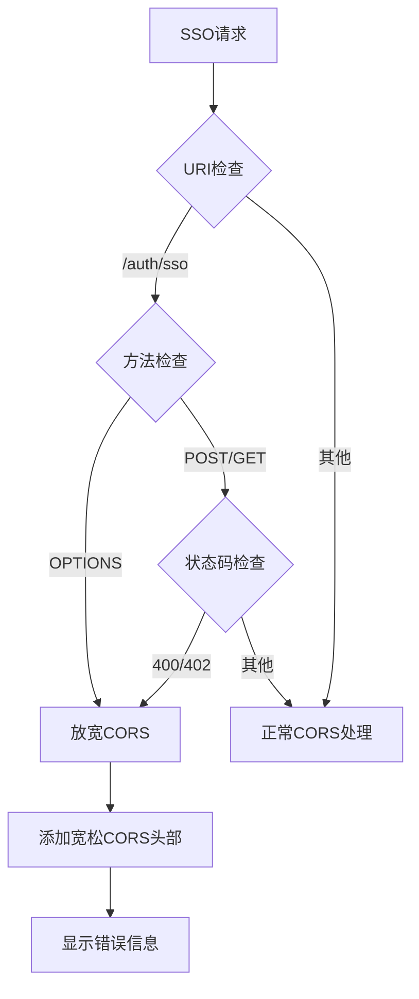
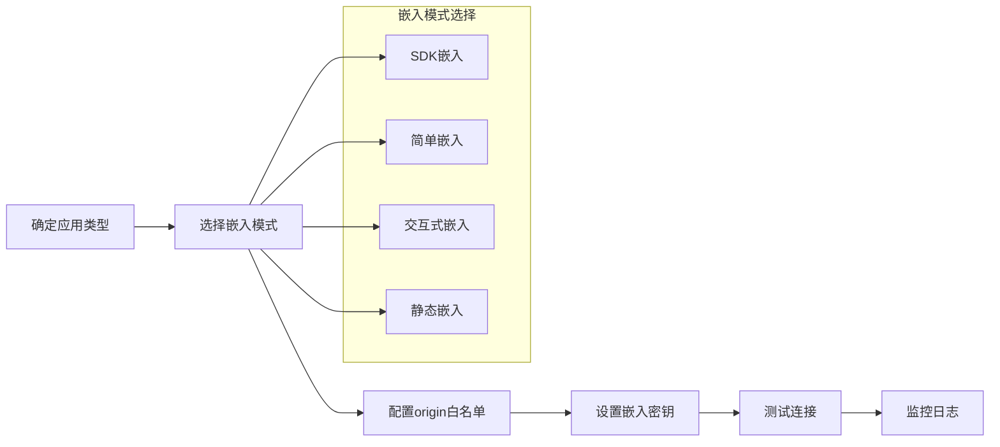
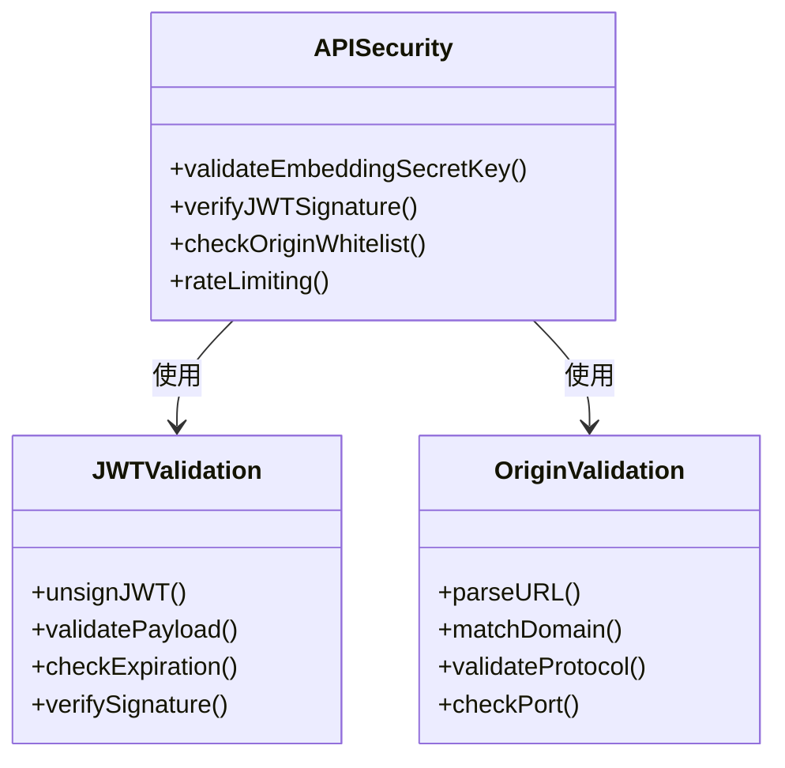

# 跨域资源共享(CORS)

<cite>
**本文档中引用的文件**
- [security.clj](file://src/metabase/server/middleware/security.clj)
- [settings.clj](file://src/metabase/embedding/settings.clj)
- [server_settings.clj](file://src/metabase/server/settings.clj)
- [embed.clj](file://src/metabase/embedding_rest/api/embed.clj)
- [api.clj](file://src/metabase/embedding_rest/api/api.clj)
- [sso_api.clj](file://src/metabase/sso/api.clj)
- [session_api.clj](file://src/metabase/session/api.clj)
</cite>

## 目录
1. [简介](#简介)
2. [核心架构概述](#核心架构概述)
3. [access-control-headers函数详解](#access-control-headers函数详解)
4. [嵌入式BI设置与CORS策略](#嵌入式bi设置与cors策略)
5. [预检请求处理机制](#预检请求处理机制)
6. [SSO认证失败时的CORS放宽策略](#sso认证失败时的cors放宽策略)
7. [外部应用安全访问配置](#外部应用安全访问配置)
8. [最佳实践与安全建议](#最佳实践与安全建议)
9. [故障排除指南](#故障排除指南)
10. [总结](#总结)

## 简介

Metabase的跨域资源共享(CORS)配置是一个精心设计的安全机制，它根据嵌入式BI设置动态生成CORS头部，确保只有授权的应用程序能够安全地访问Metabase API。该系统通过多个层次的安全控制，既保证了功能的可用性，又维护了系统的安全性。

## 核心架构概述

Metabase的CORS配置采用分层架构设计，主要包含以下组件：

**图表来源**
- [security.clj](file://src/metabase/server/middleware/security.clj#L234-L263)
- [settings.clj](file://src/metabase/embedding/settings.clj#L148-L176)

**章节来源**
- [security.clj](file://src/metabase/server/middleware/security.clj#L1-L325)
- [settings.clj](file://src/metabase/embedding/settings.clj#L1-L315)

## access-control-headers函数详解

`access-control-headers`函数是CORS配置的核心，它根据嵌入式BI设置动态生成CORS头部。该函数的设计体现了灵活性和安全性的平衡。

### 函数签名与参数

**图表来源**
- [security.clj](file://src/metabase/server/middleware/security.clj#L248-L268)

### 动态CORS头部生成逻辑

函数的核心逻辑包括以下几个步骤：

1. **localhost权限检查**：当`disable-cors-on-localhost`设置为false时，允许本地主机访问
2. **嵌入式设置检查**：检查是否启用了SDK或简单嵌入功能
3. **origin验证**：使用`approved-origin?`函数验证请求的origin是否在白名单中
4. **头部组合**：根据验证结果组合相应的CORS头部

### 安全特性

- **最小权限原则**：只对授权的origin提供完整的CORS支持
- **缓存优化**：设置60秒的`Access-Control-Max-Age`缓存时间
- **暴露头部控制**：明确指定可暴露的头部字段

**章节来源**
- [security.clj](file://src/metabase/server/middleware/security.clj#L248-L268)

## 嵌入式BI设置与CORS策略

Metabase提供了多种嵌入式BI设置，每种设置都对应不同的CORS策略：

### enable-embedding-sdk设置

SDK嵌入模式是最灵活的嵌入方式，需要启用相应的CORS支持：

**图表来源**
- [settings.clj](file://src/metabase/embedding/settings.clj#L148-L176)
- [security.clj](file://src/metabase/server/middleware/security.clj#L248-L268)

### enable-embedding-simple设置

简单嵌入模式提供基础的嵌入功能，具有简化的CORS配置：

| 设置项 | 类型 | 默认值 | 描述 |
|--------|------|--------|------|
| enable-embedding-simple | boolean | false | 启用简单嵌入功能 |
| embedding-app-origins-sdk | string | "" | 允许访问的SDK源列表 |
| disable-cors-on-localhost | boolean | false | 是否禁用localhost CORS |

### origin白名单管理

Metabase支持复杂的origin白名单管理，包括：

- **域名匹配**：支持精确匹配和通配符匹配
- **协议验证**：自动验证HTTP/HTTPS协议兼容性
- **端口处理**：支持特定端口或通配符端口
- **localhost特殊处理**：提供灵活的本地开发支持

**章节来源**
- [settings.clj](file://src/metabase/embedding/settings.clj#L112-L176)
- [security.clj](file://src/metabase/server/middleware/security.clj#L198-L235)

## 预检请求处理机制

预检请求(Preflight)是CORS机制的重要组成部分，Metabase对此进行了专门的优化处理。

### Access-Control-Max-Age缓存设置

**图表来源**
- [security.clj](file://src/metabase/server/middleware/security.clj#L261-L268)

### 预检请求优化

- **缓存策略**：设置60秒的预检请求缓存时间
- **性能优化**：减少重复的预检请求开销
- **浏览器兼容**：符合现代浏览器的CORS规范

### 预检请求处理流程

1. **OPTIONS方法检测**：识别预检请求
2. **CORS头部验证**：检查必要的CORS头部
3. **缓存命中检查**：利用预检缓存
4. **响应生成**：返回包含缓存控制的响应

**章节来源**
- [security.clj](file://src/metabase/server/middleware/security.clj#L261-L268)

## SSO认证失败时的CORS放宽策略

在SSO认证失败等特殊情况下，Metabase采用了特殊的CORS放宽策略，以确保错误信息能够正确显示。

### always-allow-cors?函数机制

**图表来源**
- [security.clj](file://src/metabase/server/middleware/security.clj#L295-L302)

### 特殊情况处理

这种机制主要用于以下场景：

1. **嵌入功能未启用**：当SDK或交互式嵌入未启用时
2. **SSO配置问题**：SSO服务不可用或配置错误
3. **认证失败**：用户认证过程中出现错误

### 放宽策略特点

- **条件性**：仅在特定条件下启用
- **临时性**：只针对SSO相关的请求
- **安全性**：不会影响正常的API访问

**章节来源**
- [security.clj](file://src/metabase/server/middleware/security.clj#L295-L302)

## 外部应用安全访问配置

为了确保外部应用能够安全地访问Metabase API，需要正确配置CORS设置。

### 配置步骤

### 推荐的origin白名单管理策略

#### 开发环境配置

对于开发环境，建议采用以下策略：

| 环境类型 | 配置示例 | 安全级别 | 适用场景 |
|----------|----------|----------|----------|
| 本地开发 | localhost:* | 中等 | 开发调试 |
| 局域网测试 | 192.168.1.* | 高 | 内部测试 |
| 开发服务器 | dev.example.com | 高 | 远程开发 |

#### 生产环境配置

生产环境应遵循严格的白名单策略：

1. **域名精确匹配**：避免使用通配符
2. **HTTPS强制**：确保所有连接使用HTTPS
3. **定期审查**：定期检查和更新白名单
4. **监控告警**：监控异常的origin访问

### API访问安全配置

**图表来源**
- [embed.clj](file://src/metabase/embedding_rest/api/embed.clj#L60-L85)

**章节来源**
- [embed.clj](file://src/metabase/embedding_rest/api/embed.clj#L1-L368)
- [settings.clj](file://src/metabase/embedding/settings.clj#L176-L201)

## 最佳实践与安全建议

### 安全配置最佳实践

1. **最小权限原则**
   - 只允许必要的origin访问
   - 使用具体的域名而非通配符
   - 定期审查和清理白名单

2. **HTTPS强制**
   - 所有生产环境必须使用HTTPS
   - 配置HSTS头部增强安全性
   - 使用强TLS版本

3. **密钥管理**
   - 使用强随机数生成的嵌入密钥
   - 定期轮换密钥
   - 密钥存储加密保护

### 性能优化建议

1. **缓存策略**
   - 合理设置Access-Control-Max-Age
   - 利用浏览器预检缓存
   - 优化CORS头部生成性能

2. **网络优化**
   - 使用CDN加速静态资源
   - 实施适当的缓存控制
   - 监控CORS相关性能指标

### 监控和审计

建立完善的监控体系：

- **访问日志记录**：记录所有CORS请求
- **异常检测**：监控不合规的origin访问
- **性能监控**：跟踪CORS处理时间
- **安全事件**：记录安全相关的CORS事件

## 故障排除指南

### 常见问题诊断

#### CORS头部缺失

**症状**：浏览器控制台显示CORS错误
**原因**：origin不在白名单中或嵌入功能未启用
**解决方案**：
1. 检查嵌入设置是否正确启用
2. 验证origin白名单配置
3. 确认disable-cors-on-localhost设置

#### 预检请求失败

**症状**：OPTIONS请求返回403错误
**原因**：预检请求被拒绝或缓存过期
**解决方案**：
1. 检查Access-Control-Allow-Origin头部
2. 验证Access-Control-Allow-Methods
3. 清除浏览器预检缓存

#### SSO认证错误

**症状**：SSO认证失败但看不到错误信息
**原因**：CORS策略阻止了错误响应
**解决方案**：
1. 检查always-allow-cors?逻辑
2. 验证错误响应的状态码
3. 确认SSO配置正确性

### 调试工具和技巧

1. **浏览器开发者工具**
   - Network面板查看CORS头部
   - Console面板检查CORS错误
   - Application面板查看Cookie和Storage

2. **服务器日志**
   - 启用详细日志记录
   - 分析CORS相关的访问模式
   - 监控异常请求

3. **测试工具**
   - 使用curl命令测试CORS
   - 编写自动化测试脚本
   - 利用Postman进行API测试

**章节来源**
- [security.clj](file://src/metabase/server/middleware/security.clj#L295-L302)
- [settings.clj](file://src/metabase/embedding/settings.clj#L148-L176)

## 总结

Metabase的CORS配置系统是一个多层次、高安全性的解决方案，它通过以下关键特性确保了系统的安全性：

1. **动态CORS头部生成**：根据嵌入设置动态调整CORS策略
2. **灵活的origin验证**：支持精确匹配和通配符匹配
3. **智能的预检缓存**：优化性能的同时保持安全性
4. **特殊情况处理**：在SSO失败时提供错误信息显示能力
5. **严格的安全控制**：最小权限原则和HTTPS强制执行

该系统的设计充分考虑了企业级应用的需求，在保证功能可用性的同时，维护了系统的安全性。通过合理的配置和监控，可以为外部应用提供安全可靠的API访问服务。

对于管理员而言，理解这些机制的工作原理有助于更好地配置和维护CORS设置，确保系统的安全性和可用性。对于开发者而言，掌握这些配置细节有助于开发出更加稳定和安全的集成应用。