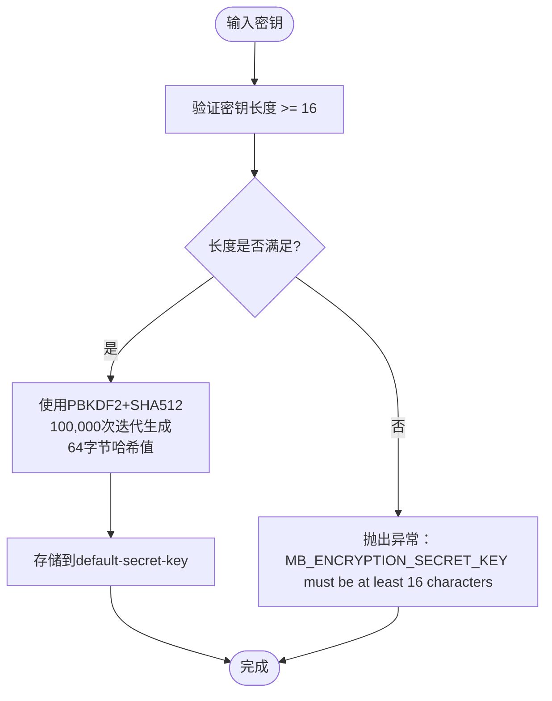
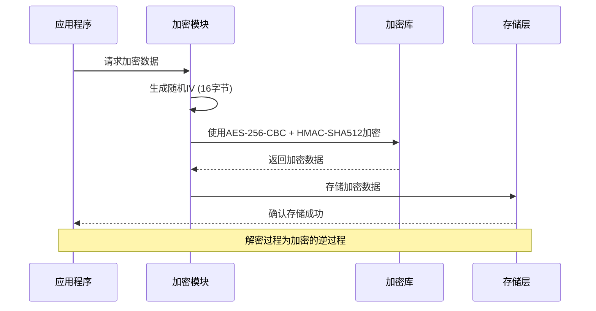
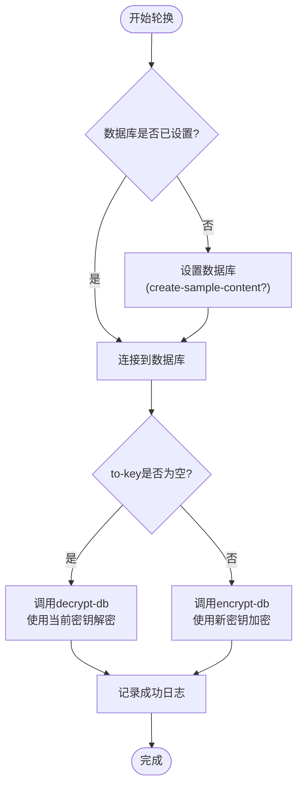
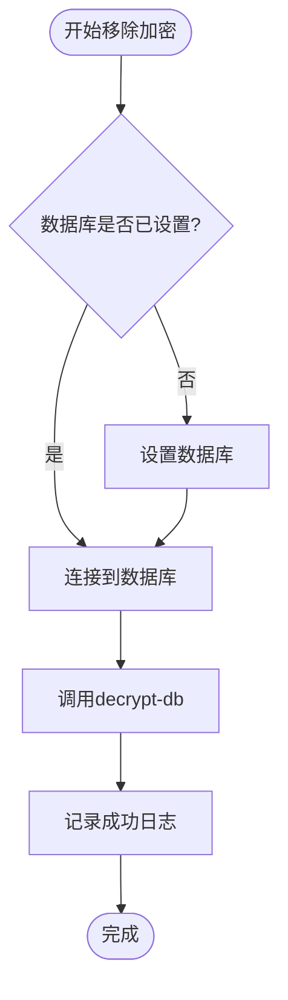
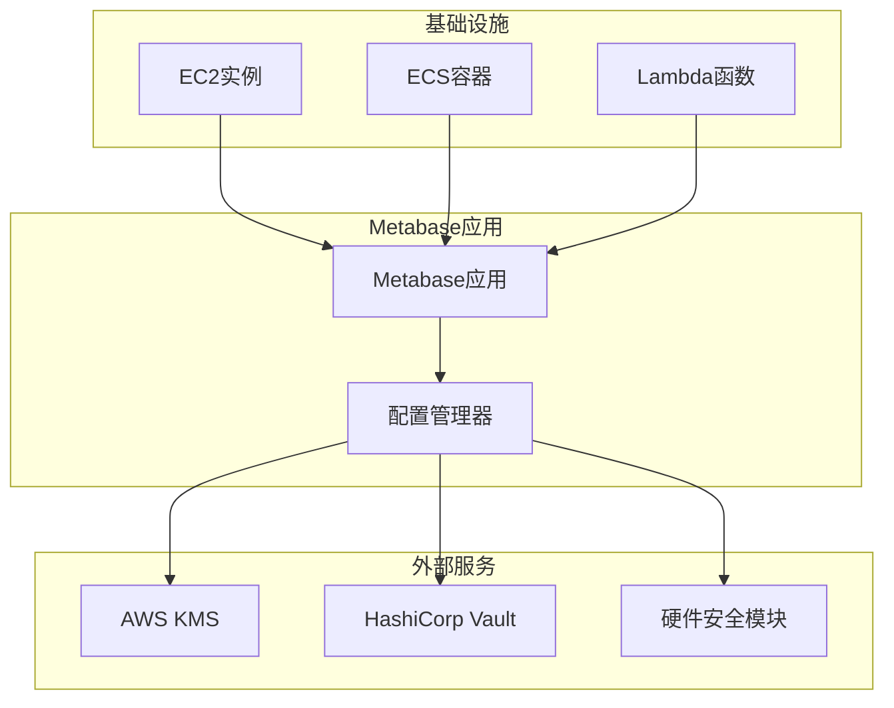

# 密钥管理与轮换

<cite>
**本文档中引用的文件**
- [src/metabase/util/encryption.clj](file://src/metabase/util/encryption.clj)
- [src/metabase/app_db/encryption.clj](file://src/metabase/app_db/encryption.clj)
- [src/metabase/cmd/rotate_encryption_key.clj](file://src/metabase/cmd/rotate_encryption_key.clj)
- [src/metabase/cmd/remove_encryption.clj](file://src/metabase/cmd/remove_encryption.clj)
- [src/metabase/cmd/core.clj](file://src/metabase/cmd/core.clj)
- [src/metabase/cmd/resources/other-env-vars.md](file://src/metabase/cmd/resources/other-env-vars.md)
- [src/metabase/app_db/setup.clj](file://src/metabase/app_db/setup.clj)
</cite>

## 目录
1. [简介](#简介)
2. [加密密钥配置](#加密密钥配置)
3. [核心加密组件](#核心加密组件)
4. [密钥轮换操作](#密钥轮换操作)
5. [密钥移除功能](#密钥移除功能)
6. [标准操作流程](#标准操作流程)
7. [应急响应方案](#应急响应方案)
8. [最佳实践建议](#最佳实践建议)
9. [外部密钥管理集成](#外部密钥管理集成)
10. [故障排除指南](#故障排除指南)

## 简介

Metabase采用强大的加密机制保护存储在应用程序数据库中的敏感信息，如数据库连接凭据和其他机密数据。系统基于AES-256-CBC + HMAC-SHA512算法，使用PBKDF2+SHA512进行密钥派生，确保数据的安全性和完整性。

## 加密密钥配置

### MB_ENCRYPTION_SECRET_KEY环境变量

`MB_ENCRYPTION_SECRET_KEY`是Metabase加密系统的核心配置项，必须满足以下要求：

#### 配置要求
- **最小长度**：16个字符
- **编码格式**：Base64编码字符串
- **安全性**：推荐使用强随机生成的密钥

#### 密钥生成示例
系统提供了安全的密钥生成方法：
```clojure
(let [ba (byte-array 32)
      _  (.nextBytes (java.security.SecureRandom.) ba)
      k  (codecs/bytes->b64-str ba)]
  (alter-var-root #'env/env assoc :mb-encryption-secret-key k)
  k)
```

#### 环境变量设置
支持多种设置方式：

**JAR文件部署：**
```bash
# Unix/Linux/macOS
export MB_ENCRYPTION_SECRET_KEY="your-base64-encoded-key-here"

# Windows PowerShell
$env:MB_ENCRYPTION_SECRET_KEY="your-base64-encoded-key-here"

# Windows 命令提示符
set MB_ENCRYPTION_SECRET_KEY="your-base64-encoded-key-here"
```

**Docker部署：**
```bash
docker run -d -p 3000:3000 \
  -e MB_ENCRYPTION_SECRET_KEY="your-base64-encoded-key-here" \
  --name metabase metabase/metabase
```

**Section sources**
- [src/metabase/cmd/resources/other-env-vars.md](file://src/metabase/cmd/resources/other-env-vars.md#L440-L445)
- [src/metabase/util/encryption.clj](file://src/metabase/util/encryption.clj#L18-L28)

## 核心加密组件

### 密钥验证与哈希处理

系统通过`validate-and-hash-secret-key`函数对密钥进行验证和处理：



**图表来源**
- [src/metabase/util/encryption.clj](file://src/metabase/util/encryption.clj#L47-L54)

### 加密算法实现

#### 密钥派生过程
- **算法**：PBKDF2+SHA512
- **迭代次数**：100,000次（约160ms）
- **输出长度**：64字节

#### 数据加密过程
- **算法**：AES-256-CBC + HMAC-SHA512
- **初始化向量**：16字节随机数
- **模式**：CBC（密码块链接）



**图表来源**
- [src/metabase/util/encryption.clj](file://src/metabase/util/encryption.clj#L70-L85)

**Section sources**
- [src/metabase/util/encryption.clj](file://src/metabase/util/encryption.clj#L35-L98)

## 密钥轮换操作

### rotate-encryption-key!命令实现

密钥轮换通过`rotate-encryption-key!`函数实现，该函数位于`metabase.cmd.rotate-encryption-key`命名空间中。

#### 函数签名与参数
```clojure
(defn rotate-encryption-key!
  "旋转当前配置的数据库，使用当前的MB_ENCRYPTION_SECRET_KEY环境变量和to-key参数。
  空的to-key将解密数据库。"
  [to-key])
```

#### 轮换流程



**图表来源**
- [src/metabase/cmd/rotate_encryption_key.clj](file://src/metabase/cmd/rotate_encryption_key.clj#L8-L15)

### 数据库重新加密过程

系统会重新加密所有敏感数据：

#### 涉及的数据表
1. **metabase_database** - 数据库连接详情
2. **model/Setting** - 系统设置
3. **model/Secret** - 机密值
4. **查询缓存** - 清理临时数据

#### 加密范围
- **数据库连接详情**：加密JSON格式的连接配置
- **系统设置**：加密敏感的配置值
- **机密值**：加密API密钥等敏感信息

**Section sources**
- [src/metabase/cmd/rotate_encryption_key.clj](file://src/metabase/cmd/rotate_encryption_key.clj#L1-L17)
- [src/metabase/app_db/encryption.clj](file://src/metabase/app_db/encryption.clj#L11-L60)

## 密钥移除功能

### remove-encryption!命令

移除加密功能通过`remove-encryption!`函数实现，允许完全禁用数据库加密。

#### 功能特性
- **完全解密**：移除所有加密数据
- **密钥验证**：需要当前加密密钥
- **数据恢复**：解密后数据以明文形式存储

#### 执行流程


**图表来源**
- [src/metabase/cmd/remove_encryption.clj](file://src/metabase/cmd/remove_encryption.clj#L8-L13)

**Section sources**
- [src/metabase/cmd/remove_encryption.clj](file://src/metabase/cmd/remove_encryption.clj#L1-L15)

## 标准操作流程

### 密钥轮换标准操作流程（SOP）

#### 1. 备份阶段
```bash
# 创建完整数据库备份
java -jar metabase.jar dump-to-h2 --path backup-before-rotation.h2.db

# 备份配置文件
cp config.yml config-backup.yml

# 记录当前密钥状态
echo "Current encryption key: $MB_ENCRYPTION_SECRET_KEY" > key-rotation-log.txt
```

#### 2. 密钥生成
```bash
# 生成新的加密密钥
NEW_KEY=$(java -cp metabase.jar clojure.main -e "(require '[metabase.util.encryption :refer [secret-key->hash]]) (let [ba (byte-array 32) _ (.nextBytes (java.security.SecureRandom.) ba) k (buddy.core.codecs/bytes->b64-str ba)] (println k))")

# 设置新密钥环境变量
export MB_ENCRYPTION_SECRET_KEY="$NEW_KEY"
```

#### 3. 执行轮换
```bash
# 执行密钥轮换
java -jar metabase.jar rotate-encryption-key "$NEW_KEY"

# 或使用空密钥解密
java -jar metabase.jar rotate-encryption-key ""
```

#### 4. 验证阶段
```bash
# 检查加密状态
curl -X GET "http://localhost:3000/api/session" \
  -H "Authorization: Bearer $ADMIN_TOKEN" \
  | jq '.is_superuser'

# 验证数据完整性
java -jar metabase.jar setup-check
```

#### 5. 回滚准备
```bash
# 创建回滚点
cp backup-before-rotation.h2.db backup-rollback-point.h2.db

# 记录新密钥
echo "New encryption key: $NEW_KEY" >> key-rotation-log.txt
```

### 密钥轮换检查清单

| 步骤 | 操作 | 验证点 | 时间窗口 |
|------|------|--------|----------|
| 1 | 创建备份 | 备份文件存在且可访问 | 15分钟 |
| 2 | 生成新密钥 | 密钥符合16字符要求 | 5分钟 |
| 3 | 设置环境变量 | 密钥正确加载 | 2分钟 |
| 4 | 执行轮换 | 日志显示成功 | 10-30分钟 |
| 5 | 验证功能 | 用户登录正常 | 5分钟 |
| 6 | 清理旧密钥 | 从环境变量移除 | 2分钟 |

## 应急响应方案

### 密钥泄露应急响应

#### 情景1：密钥被意外泄露
```bash
# 立即响应
1. 停止所有Metabase实例
2. 生成新的加密密钥
3. 更新所有部署环境
4. 执行密钥轮换
5. 通知相关团队
```

#### 情景2：生产环境密钥丢失
```bash
# 紧急恢复流程
1. 使用最近的备份恢复数据库
2. 生成新的加密密钥
3. 重新配置所有连接
4. 测试所有功能
5. 更新文档和流程
```

#### 情景3：多实例密钥不一致
```bash
# 同步修复流程
1. 停止所有实例
2. 确定主密钥
3. 在所有实例上应用相同密钥
4. 重启服务
5. 验证一致性
```

### 故障恢复时间线

| 事件 | 响应时间 | 恢复时间 | 影响范围 |
|------|----------|----------|----------|
| 密钥泄露检测 | 5分钟 | 30分钟 | 单实例 |
| 生产环境故障 | 10分钟 | 2小时 | 全部实例 |
| 多实例同步问题 | 15分钟 | 1小时 | 集群环境 |

## 最佳实践建议

### 密钥管理最佳实践

#### 1. 密钥强度要求
- **长度**：至少32字节（256位）
- **熵值**：使用真正的随机数生成器
- **编码**：Base64编码确保兼容性

#### 2. 密钥存储安全
```bash
# 安全存储示例
# 使用环境变量
export MB_ENCRYPTION_SECRET_KEY="$(openssl rand -base64 32)"

# 或使用专用密钥管理工具
export MB_ENCRYPTION_SECRET_KEY="$(vault kv get -field=key secret/metabase/encryption)"
```

#### 3. 访问控制
- **最小权限原则**：仅授权必要人员访问
- **审计日志**：记录所有密钥访问操作
- **定期轮换**：建议每6个月轮换一次

#### 4. 环境隔离
```yaml
# 开发环境
MB_ENCRYPTION_SECRET_KEY: "dev-key-for-testing-only"

# 生产环境
MB_ENCRYPTION_SECRET_KEY: "${PROD_ENCRYPTION_KEY}"
```

### 性能优化建议

#### 1. 密钥派生性能
- 当前配置：100,000次迭代（约160ms）
- 可调整范围：50,000-200,000次迭代
- 性能影响：迭代次数×0.001秒

#### 2. 加密操作优化
- 批量处理：一次性加密多个数据项
- 缓存策略：缓存频繁使用的加密结果
- 异步处理：对于大文件使用流式加密

**Section sources**
- [src/metabase/util/encryption.clj](file://src/metabase/util/encryption.clj#L35-L42)

## 外部密钥管理集成

### AWS KMS集成可能性

虽然Metabase当前直接使用环境变量管理密钥，但可以设计外部KMS集成架构：

#### 集成架构设计



#### 集成实现要点

1. **密钥获取接口**
```clojure
(defn fetch-kms-key [key-id]
  (let [response (aws/kms/get-secret-key {:key-id key-id})]
    (-> response :plaintext base64-decode)))
```

2. **密钥轮换触发**
```clojure
(defn trigger-kms-rotation [key-id]
  (aws/kms/rotate-key {:key-id key-id})
  (fetch-kms-key key-id))
```

3. **本地缓存策略**
```clojure
(defonce ^:private cached-kms-key
  (memoize (fn [] (fetch-kms-key current-key-id))))
```

### Azure Key Vault集成

#### 配置示例
```bash
# Azure Key Vault配置
export AZURE_CLIENT_ID="your-app-id"
export AZURE_TENANT_ID="your-tenant-id"
export AZURE_CLIENT_SECRET="your-client-secret"
export MB_ENCRYPTION_SECRET_KEY="${AZURE_KEY_VAULT_URL}/secrets/mb-encryption-key"
```

#### 集成优势
- **集中管理**：统一的密钥生命周期管理
- **审计跟踪**：完整的访问和使用日志
- **合规性**：满足企业安全合规要求
- **高可用性**：云服务商提供的SLA保障

## 故障排除指南

### 常见问题与解决方案

#### 1. 密钥长度不足错误
**错误信息**：`MB_ENCRYPTION_SECRET_KEY must be at least 16 characters`

**解决方案**：
```bash
# 检查密钥长度
echo ${#MB_ENCRYPTION_SECRET_KEY}

# 生成新的密钥
export MB_ENCRYPTION_SECRET_KEY="$(openssl rand -base64 32)"
```

#### 2. 数据库加密状态不匹配
**错误信息**：`Database is encrypted but the MB_ENCRYPTION_SECRET_KEY environment variable was NOT set`

**解决方案**：
```bash
# 检查加密状态
java -jar metabase.jar setup-check

# 确保密钥正确设置
echo $MB_ENCRYPTION_SECRET_KEY
```

#### 3. 密钥轮换失败
**错误信息**：`Can't decrypt secret value with MB_ENCRYPTION_SECRET_KEY`

**解决方案**：
```bash
# 检查备份
ls -la backup-before-rotation.h2.db

# 尝试使用旧密钥
export MB_ENCRYPTION_SECRET_KEY="old-valid-key"
java -jar metabase.jar rotate-encryption-key "new-key"
```

#### 4. 性能问题诊断
**监控指标**：
- 密钥派生时间：检查日志中的时间戳
- 数据库连接池使用率
- CPU和内存使用情况

**优化建议**：
```bash
# 调整迭代次数（谨慎操作）
export MB_KDF_ITERATIONS=50000  # 降低到5万次
```

### 诊断工具

#### 1. 加密状态检查
```bash
# 检查加密启用状态
java -jar metabase.jar setup-check

# 验证密钥有效性
java -jar metabase.jar validate-secret-key
```

#### 2. 性能监控
```bash
# 监控加密操作
tail -f metabase.log | grep -E "(encrypt|decrypt|kdf)"
```

#### 3. 数据完整性验证
```bash
# 验证特定数据项
java -jar metabase.jar verify-encryption --id 123
```

**Section sources**
- [src/metabase/app_db/setup.clj](file://src/metabase/app_db/setup.clj#L145-L165)
- [src/metabase/cmd/core.clj](file://src/metabase/cmd/core.clj#L220-L256)

## 结论

Metabase的加密密钥管理系统提供了强大而灵活的安全保护机制。通过合理的配置、定期的轮换和完善的应急响应流程，可以确保敏感数据的安全性。建议组织根据自身安全需求，制定相应的密钥管理策略，并定期审查和更新安全措施。

关键要点总结：
- 必须使用至少16字符的强密钥
- 定期执行密钥轮换
- 建立完善的备份和恢复机制
- 实施适当的访问控制和审计
- 考虑外部密钥管理服务的集成