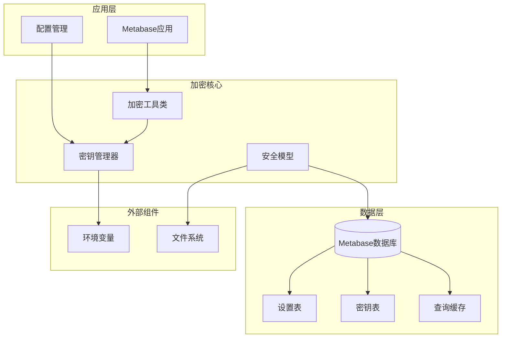
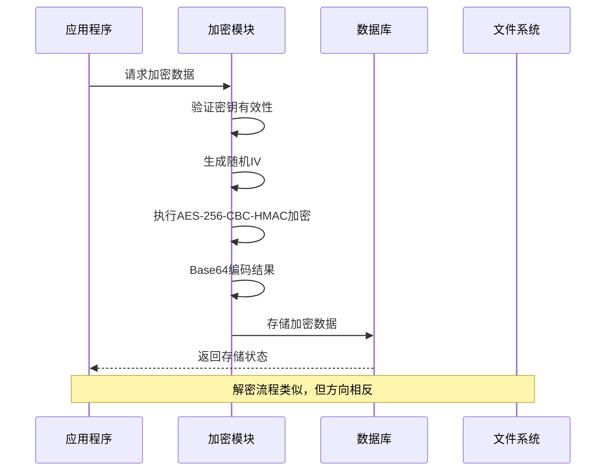
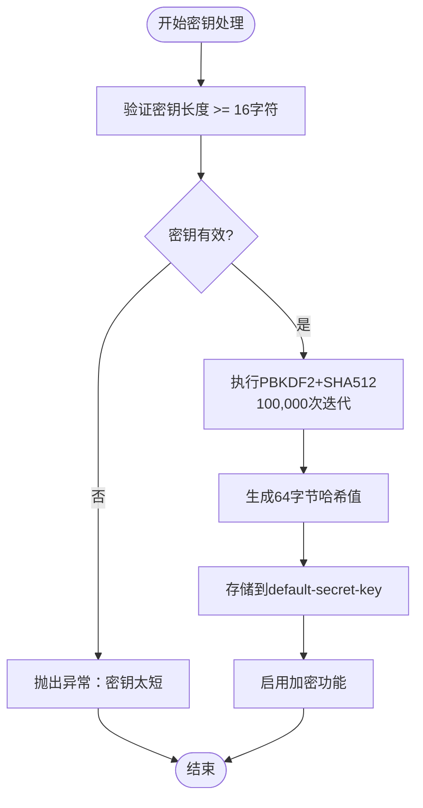
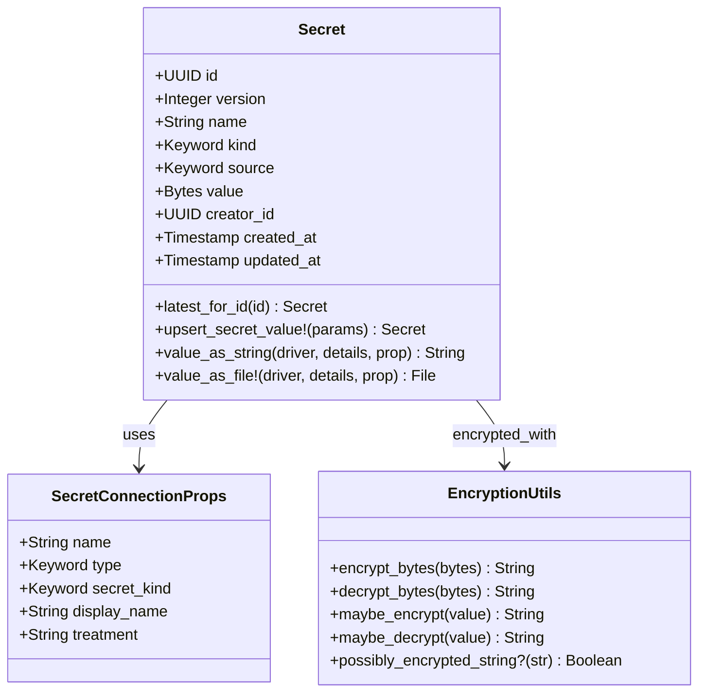
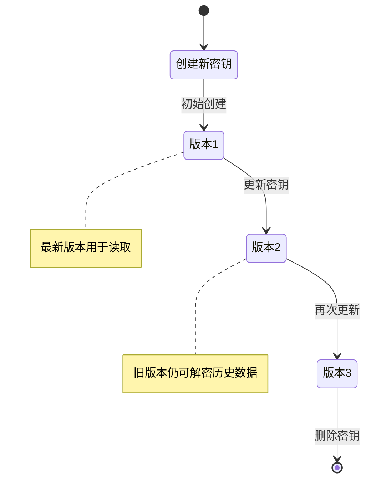
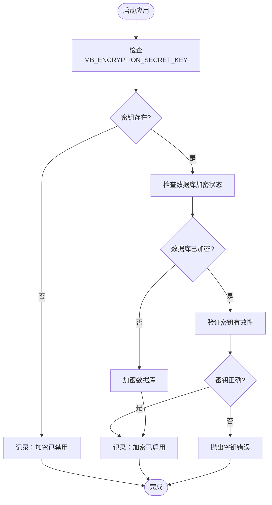
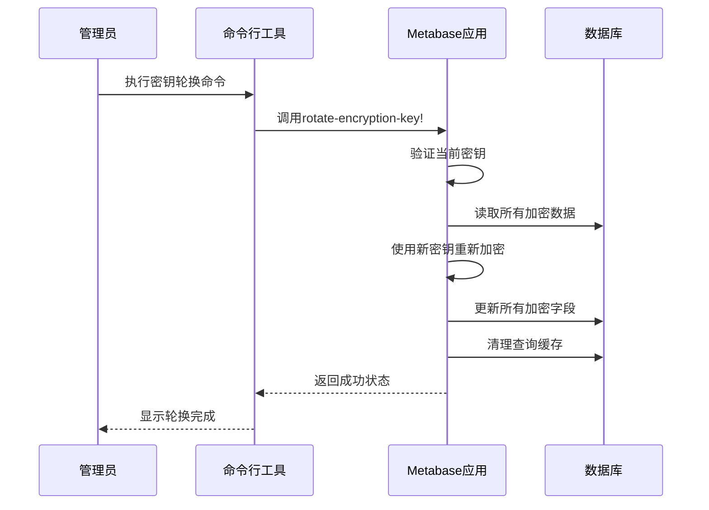
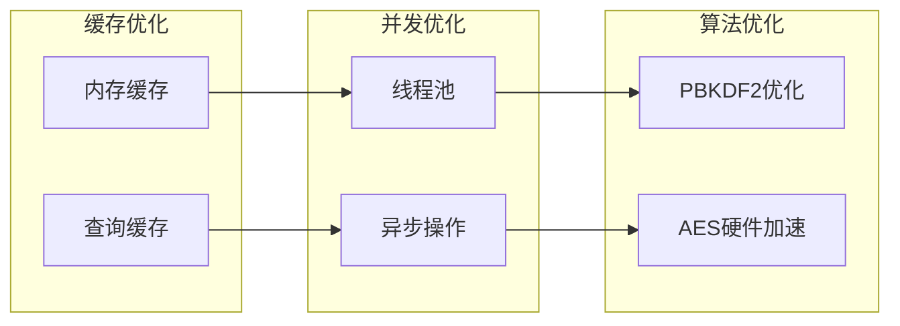
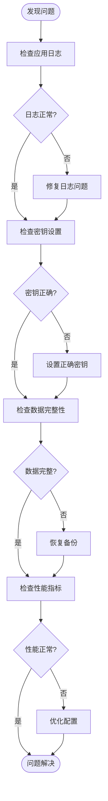

# 数据加密与密钥管理

<cite>
**本文档中引用的文件**
- [app_db/encryption.clj](file://src/metabase/app_db/encryption.clj)
- [secrets/core.clj](file://src/metabase/secrets/core.clj)
- [secrets/models/secret.clj](file://src/metabase/secrets/models/secret.clj)
- [util/encryption.clj](file://src/metabase/util/encryption.clj)
- [cmd/rotate_encryption_key.clj](file://src/metabase/cmd/rotate_encryption_key.clj)
- [cmd/remove_encryption.clj](file://src/metabase/cmd/remove_encryption.clj)
- [settings/models/setting.clj](file://src/metabase/settings/models/setting.clj)
- [app_db/setup.clj](file://src/metabase/app_db/setup.clj)
</cite>

## 目录
1. [概述](#概述)
2. [加密架构概览](#加密架构概览)
3. [透明数据加密机制](#透明数据加密机制)
4. [密钥管理系统](#密钥管理系统)
5. [敏感信息处理](#敏感信息处理)
6. [加密配置与启用](#加密配置与启用)
7. [密钥轮换与备份](#密钥轮换与备份)
8. [性能影响与优化](#性能影响与优化)
9. [故障排除指南](#故障排除指南)
10. [最佳实践](#最佳实践)

## 概述

Metabase采用了一套完整的透明数据加密体系，通过`MB_ENCRYPTION_SECRET_KEY`环境变量实现对数据库中敏感信息的自动加密保护。该系统支持多种加密场景，包括数据库连接详情、设置值、查询缓存等关键数据的加密存储。

### 核心特性

- **透明加密**：应用程序无需修改即可启用加密
- **PBKDF2密钥派生**：使用10万次迭代的PBKDF2+SHA512算法
- **AES-256-CBC-HMAC**：采用业界标准的加密算法
- **密钥轮换支持**：支持在线密钥更新而不中断服务
- **多层加密保护**：涵盖数据库详情、设置值、查询缓存等

## 加密架构概览



**图表来源**
- [app_db/encryption.clj](file://src/metabase/app_db/encryption.clj#L1-L61)
- [util/encryption.clj](file://src/metabase/util/encryption.clj#L1-L262)

## 透明数据加密机制

### 加密算法与参数

Metabase使用以下加密参数：

| 参数 | 值 | 说明 |
|------|-----|------|
| 算法 | AES-256-CBC-HMAC | 对称加密算法 |
| 密钥长度 | 64字节 | PBKDF2输出长度 |
| 迭代次数 | 100,000次 | PBKDF2+SHA512 |
| 初始化向量 | 16字节随机数 | CBC模式必需 |
| 填充模式 | PKCS5Padding | 字节填充 |

### 加密流程



**图表来源**
- [util/encryption.clj](file://src/metabase/util/encryption.clj#L75-L124)

### 自动加密触发点

加密机制在以下场景自动触发：

1. **数据库连接详情**：所有数据库连接信息自动加密存储
2. **设置值**：敏感设置（如时间戳、JSON格式）自动加密
3. **查询缓存**：缓存结果自动加密以保护数据
4. **密钥值**：Secret模型中的敏感值加密存储

**章节来源**
- [app_db/encryption.clj](file://src/metabase/app_db/encryption.clj#L11-L61)
- [util/encryption.clj](file://src/metabase/util/encryption.clj#L75-L124)

## 密钥管理系统

### 密钥生成与验证



**图表来源**
- [util/encryption.clj](file://src/metabase/util/encryption.clj#L45-L66)

### 密钥生命周期管理

| 阶段 | 操作 | 安全措施 |
|------|------|----------|
| 生成 | 随机字节数组 → Base64编码 | SecureRandom生成 |
| 验证 | 长度检查 + PBKDF2处理 | 10万次迭代 |
| 存储 | 内存中缓存 | defonce确保单例 |
| 使用 | 动态加载 | 环境变量监控 |
| 清理 | 应用关闭时清理 | JVM垃圾回收 |

### 密钥配置方式

```bash
# 设置加密密钥
export MB_ENCRYPTION_SECRET_KEY="your-secure-64-character-base64-key"

# 验证密钥是否正确设置
echo $MB_ENCRYPTION_SECRET_KEY | wc -c  # 应该至少16字符
```

**章节来源**
- [util/encryption.clj](file://src/metabase/util/encryption.clj#L45-L66)
- [app_db/setup.clj](file://src/metabase/app_db/setup.clj#L140-L170)

## 敏感信息处理

### Secret模型架构



**图表来源**
- [secrets/models/secret.clj](file://src/metabase/secrets/models/secret.clj#L1-L404)

### 密钥类型与处理

| 密钥类型 | 处理方式 | 存储位置 | 访问控制 |
|----------|----------|----------|----------|
| 上传文件 | Base64编码存储 | 数据库 | 超级用户权限 |
| 本地路径 | 文件路径存储 | 数据库 | 超级用户权限 |
| 内存值 | 直接内存存储 | 内存 | 当前会话 |
| 临时文件 | 自动生成 | 系统临时目录 | 会话隔离 |

### 密钥版本管理



**章节来源**
- [secrets/models/secret.clj](file://src/metabase/secrets/models/secret.clj#L50-L100)

## 加密配置与启用

### 启用加密的步骤

1. **生成强密钥**
```bash
# 生成32字节随机密钥并Base64编码
openssl rand -base64 32
```

2. **设置环境变量**
```bash
export MB_ENCRYPTION_SECRET_KEY="your-generated-base64-key"
```

3. **重启Metabase服务**
```bash
java -jar metabase.jar
```

### 加密状态检测



**图表来源**
- [app_db/setup.clj](file://src/metabase/app_db/setup.clj#L140-L170)

### 设置级别的加密控制

| 设置类型 | 默认加密 | 可选加密 | 加密要求 |
|----------|----------|----------|----------|
| 时间戳 | 是 | 否 | :when-encryption-key-set |
| JSON | 是 | 否 | :when-encryption-key-set |
| CSV | 是 | 否 | :when-encryption-key-set |
| 字符串 | 否 | 是 | :no 或 :when-encryption-key-set |
| 数值 | 否 | 是 | :no 或 :when-encryption-key-set |

**章节来源**
- [settings/models/setting.clj](file://src/metabase/settings/models/setting.clj#L220-L230)
- [app_db/setup.clj](file://src/metabase/app_db/setup.clj#L140-L170)

## 密钥轮换与备份

### 密钥轮换流程



**图表来源**
- [cmd/rotate_encryption_key.clj](file://src/metabase/cmd/rotate_encryption_key.clj#L1-L15)

### 密钥轮换命令

```bash
# 轮换到新密钥
java -jar metabase.jar rotate-encryption-key new-secret-key

# 移除加密（解密）
java -jar metabase.jar remove-encryption
```

### 备份策略

| 备份类型 | 内容 | 频率 | 存储位置 |
|----------|------|------|----------|
| 数据库备份 | 加密后的完整数据库 | 每日 | 安全存储 |
| 密钥备份 | MB_ENCRYPTION_SECRET_KEY | 每次轮换 | 密码管理器 |
| 配置备份 | 应用配置文件 | 变更时 | 版本控制 |
| 日志备份 | 加密操作日志 | 实时 | 安全日志系统 |

### 轮换最佳实践

1. **计划性轮换**：定期（如每6个月）更换密钥
2. **渐进式部署**：先测试新密钥再切换
3. **回滚准备**：保留旧密钥直到确认新密钥正常工作
4. **监控告警**：设置密钥失效监控

**章节来源**
- [cmd/rotate_encryption_key.clj](file://src/metabase/cmd/rotate_encryption_key.clj#L1-L15)
- [cmd/remove_encryption.clj](file://src/metabase/cmd/remove_encryption.clj#L1-L15)

## 性能影响与优化

### 性能开销分析

| 操作类型 | 加密开销 | 解密开销 | 影响程度 |
|----------|----------|----------|----------|
| 数据库查询 | +1-2ms | +1-2ms | 低 |
| 设置读取 | +0.5ms | +0.5ms | 极低 |
| 密钥访问 | +100ms | +100ms | 中等 |
| 大文件处理 | +50ms/MB | +50ms/MB | 高 |

### 优化策略



### 性能监控指标

| 指标 | 正常范围 | 警告阈值 | 监控方法 |
|------|----------|----------|----------|
| 加密延迟 | <5ms | >10ms | 应用日志 |
| 解密延迟 | <5ms | >10ms | 查询跟踪 |
| 内存使用 | <100MB | >200MB | JVM监控 |
| CPU使用 | <10% | >30% | 系统监控 |

### 优化建议

1. **启用查询缓存**：减少重复加密操作
2. **合理设置密钥**：避免过长的PBKDF2迭代
3. **使用SSD存储**：提高磁盘I/O性能
4. **监控资源使用**：及时发现性能瓶颈

**章节来源**
- [util/encryption.clj](file://src/metabase/util/encryption.clj#L35-L40)

## 故障排除指南

### 常见错误与解决方案

| 错误类型 | 症状 | 原因 | 解决方案 |
|----------|------|------|----------|
| 密钥未设置 | 数据库加密但密钥缺失 | MB_ENCRYPTION_SECRET_KEY未设置 | 设置正确的密钥 |
| 密钥不匹配 | 数据库加密但密钥错误 | 密钥被更改或丢失 | 使用原始密钥 |
| 加密数据损坏 | 无法解密特定字段 | 数据传输或存储错误 | 检查数据完整性 |
| 性能下降 | 查询响应时间增加 | 加密开销过大 | 优化配置或升级硬件 |

### 故障诊断流程



### 调试工具

```bash
# 检查加密状态
java -jar metabase.jar check-encryption-status

# 测试密钥有效性
java -jar metabase.jar test-encryption-key

# 生成调试报告
java -jar metabase.jar generate-debug-report
```

### 恢复程序

1. **紧急恢复**
```bash
# 使用原始密钥解密
export MB_ENCRYPTION_SECRET_KEY="original-key-from-backup"
java -jar metabase.jar remove-encryption
```

2. **从备份恢复**
```bash
# 停止应用
systemctl stop metabase

# 恢复数据库备份
pg_restore -d metabase backup.dump

# 重启应用
systemctl start metabase
```

**章节来源**
- [app_db/setup.clj](file://src/metabase/app_db/setup.clj#L140-L170)
- [cmd/core.clj](file://src/metabase/cmd/core.clj#L220-L256)

## 最佳实践

### 安全配置建议

1. **密钥管理**
   - 使用强随机密钥（至少32字节）
   - 定期轮换密钥（建议6个月）
   - 安全存储密钥备份
   - 限制密钥访问权限

2. **环境配置**
   - 在生产环境中始终启用加密
   - 使用环境变量而非配置文件存储密钥
   - 配置密钥变更通知
   - 实施密钥访问审计

3. **监控与维护**
   - 监控加密操作性能
   - 定期检查数据完整性
   - 建立应急响应流程
   - 文档化所有配置变更

### 部署检查清单

- [ ] ✅ 已生成强加密密钥
- [ ] ✅ 已设置MB_ENCRYPTION_SECRET_KEY环境变量
- [ ] ✅ 已备份原始密钥
- [ ] ✅ 已测试密钥轮换流程
- [ ] ✅ 已配置监控告警
- [ ] ✅ 已建立应急恢复程序
- [ ] ✅ 已文档化操作流程

### 合规性考虑

- 符合GDPR等数据保护法规
- 支持数据加密的审计要求
- 提供密钥管理的合规证明
- 实施适当的数据分类策略

通过遵循这些最佳实践，可以确保Metabase的数据加密体系既安全又高效，为组织提供强大的数据保护能力。