# 静态数据加密机制

<cite>
**本文档中引用的文件**
- [src/metabase/app_db/encryption.clj](file://src/metabase/app_db/encryption.clj)
- [src/metabase/util/encryption.clj](file://src/metabase/util/encryption.clj)
- [src/metabase/cmd/rotate_encryption_key.clj](file://src/metabase/cmd/rotate_encryption_key.clj)
- [src/metabase/app_db/setup.clj](file://src/metabase/app_db/setup.clj)
- [src/metabase/secrets/models/secret.clj](file://src/metabase/secrets/models/secret.clj)
- [src/metabase/cache/models/query_cache.clj](file://src/metabase/cache/models/query_cache.clj)
- [src/metabase/query_processor/middleware/cache_backend/db.clj](file://src/metabase/query_processor/middleware/cache_backend/db.clj)
</cite>

## 目录
1. [简介](#简介)
2. [系统架构概览](#系统架构概览)
3. [核心加密组件](#核心加密组件)
4. [加密算法与密钥管理](#加密算法与密钥管理)
5. [数据加密流程](#数据加密流程)
6. [支持的数据类型](#支持的数据类型)
7. [性能优化与并发处理](#性能优化与并发处理)
8. [故障排除指南](#故障排除指南)
9. [最佳实践建议](#最佳实践建议)
10. [总结](#总结)

## 简介

Metabase的静态数据加密机制是一个全面的安全解决方案，用于保护存储在应用数据库中的敏感信息。该系统采用AES256-CBC + HMAC-SHA512加密套件，结合PBKDF2密钥派生函数（100,000次迭代），为数据库中的连接信息、查询缓存和秘密值提供透明的加密保护。

该加密机制的核心目标是：
- 保护存储的数据库连接凭据和敏感配置信息
- 提供透明的加密/解密操作，不影响现有功能
- 支持密钥轮换和动态加密状态管理
- 在高并发环境下保持良好的性能表现

## 系统架构概览

Metabase的加密系统采用分层架构设计，主要包含以下组件：

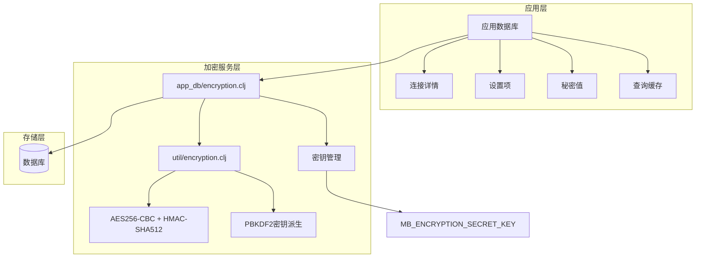

**图表来源**
- [src/metabase/app_db/encryption.clj](file://src/metabase/app_db/encryption.clj#L1-L61)
- [src/metabase/util/encryption.clj](file://src/metabase/util/encryption.clj#L1-L262)

## 核心加密组件

### 应用数据库加密模块

`app_db/encryption.clj`模块提供了数据库级别的加密功能，负责对整个应用数据库进行批量加密和解密操作。

#### 主要函数结构

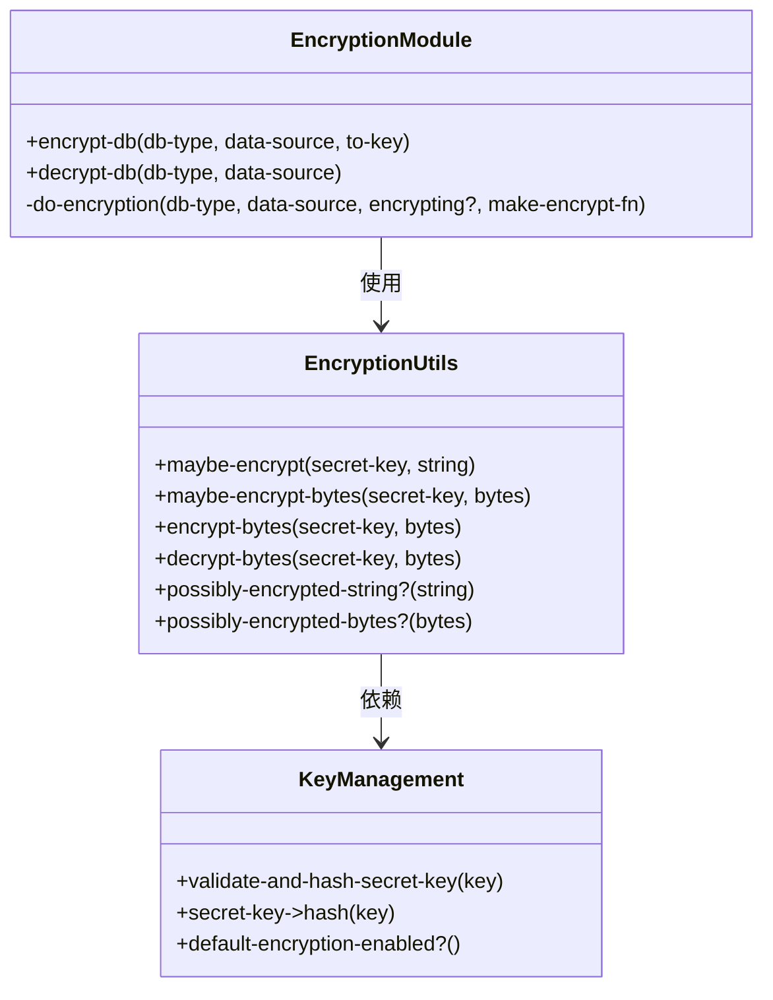

**图表来源**
- [src/metabase/app_db/encryption.clj](file://src/metabase/app_db/encryption.clj#L46-L59)
- [src/metabase/util/encryption.clj](file://src/metabase/util/encryption.clj#L154-L261)

**章节来源**
- [src/metabase/app_db/encryption.clj](file://src/metabase/app_db/encryption.clj#L1-L61)
- [src/metabase/util/encryption.clj](file://src/metabase/util/encryption.clj#L1-L262)

### 底层加密工具模块

`util/encryption.clj`模块提供了基础的加密和解密功能，支持字符串、字节数组和流式加密操作。

#### 加密算法特性

| 特性 | 实现细节 | 安全级别 |
|------|----------|----------|
| 主加密算法 | AES256-CBC | 高 |
| 认证算法 | HMAC-SHA512 | 高 |
| 密钥派生 | PBKDF2+SHA512 | 极高 |
| 迭代次数 | 100,000次 | 极高 |
| 初始化向量 | 16字节随机生成 | 高 |
| 填充模式 | PKCS5Padding | 中等 |

**章节来源**
- [src/metabase/util/encryption.clj](file://src/metabase/util/encryption.clj#L35-L66)

## 加密算法与密钥管理

### PBKDF2密钥派生

系统使用PBKDF2算法从用户提供的主密钥派生出64字节的加密密钥：

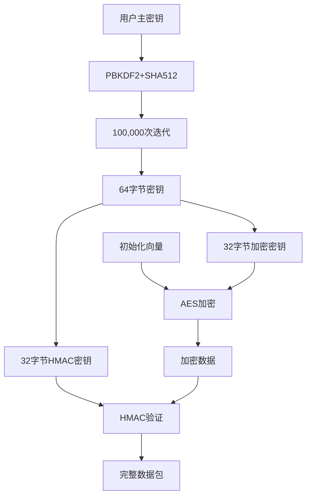

**图表来源**
- [src/metabase/util/encryption.clj](file://src/metabase/util/encryption.clj#L35-L66)

### IV生成策略

每个加密操作都使用独立的16字节随机初始化向量（IV），确保相同的明文在不同时间点加密后产生不同的密文。

### 密钥验证机制

系统实现了严格的密钥验证流程：

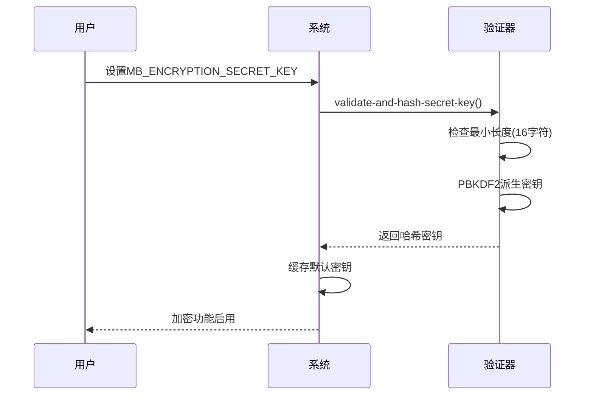

**图表来源**
- [src/metabase/util/encryption.clj](file://src/metabase/util/encryption.clj#L48-L58)

**章节来源**
- [src/metabase/util/encryption.clj](file://src/metabase/util/encryption.clj#L35-L66)

## 数据加密流程

### 整体加密流程

系统对不同类型的数据采用不同的加密策略：

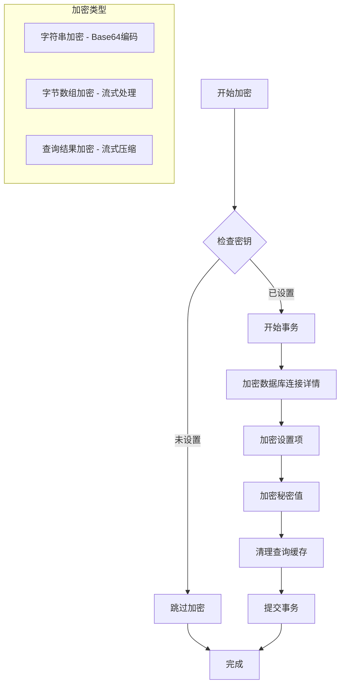

**图表来源**
- [src/metabase/app_db/encryption.clj](file://src/metabase/app_db/encryption.clj#L13-L59)

### 具体数据类型处理

#### 数据库连接详情加密

连接详情是最重要的敏感数据，包含用户名、密码、主机名等信息：

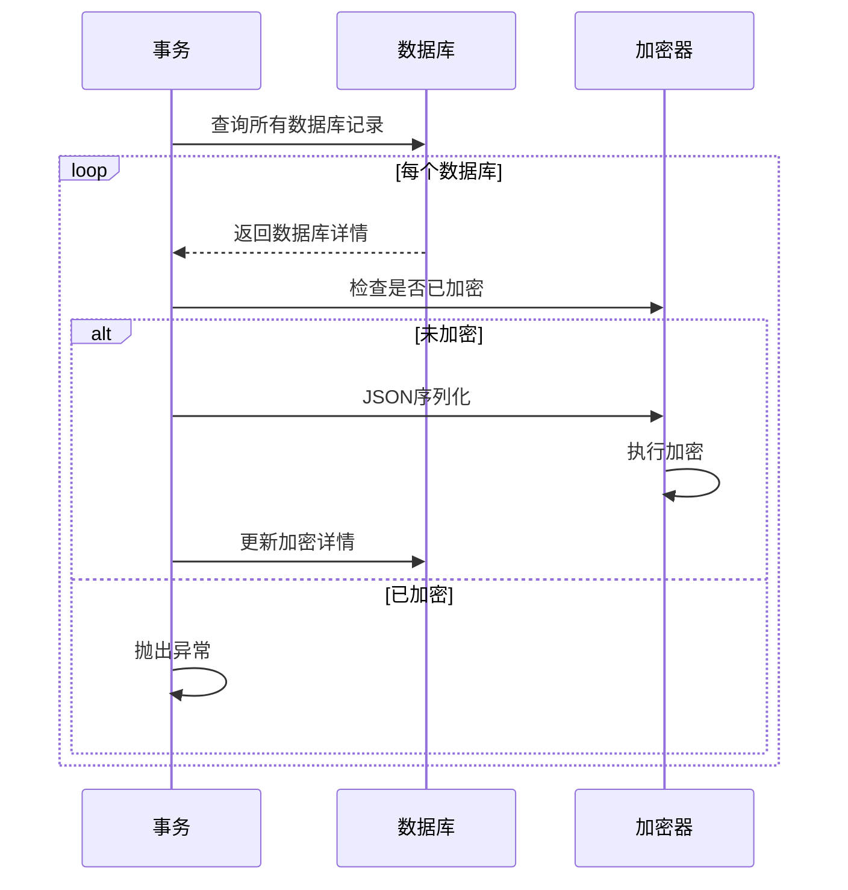

**图表来源**
- [src/metabase/app_db/encryption.clj](file://src/metabase/app_db/encryption.clj#L21-L28)

#### 设置项加密处理

系统设置项中的敏感信息也会被加密：

| 设置键 | 加密方式 | 备注 |
|--------|----------|------|
| settings-last-updated | 特殊处理 | 不加密时间戳 |
| encryption-check | 条件加密 | 加密时生成UUID，解密时验证 |
| 其他设置 | 字符串加密 | 标准Base64编码 |

#### 秘密值加密

秘密值通过专门的Secret模型进行管理：

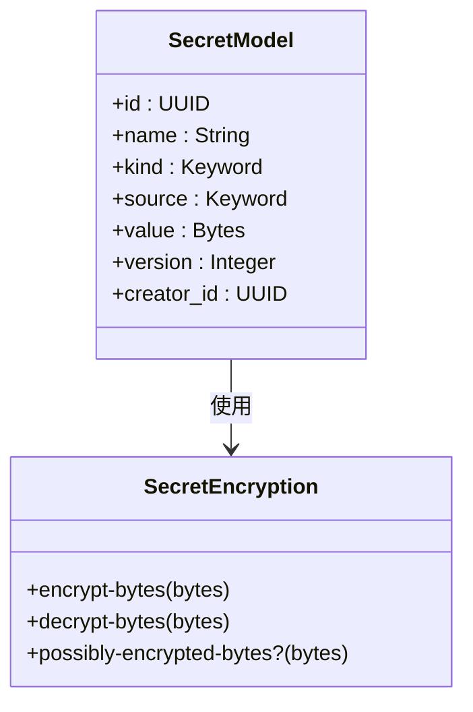

**图表来源**
- [src/metabase/secrets/models/secret.clj](file://src/metabase/secrets/models/secret.clj#L25-L45)

#### 查询缓存加密

查询结果缓存采用流式加密以优化内存使用：

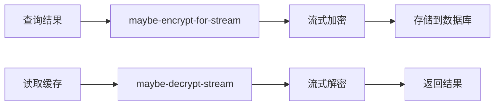

**图表来源**
- [src/metabase/query_processor/middleware/cache_backend/db.clj](file://src/metabase/query_processor/middleware/cache_backend/db.clj#L85-L98)

**章节来源**
- [src/metabase/app_db/encryption.clj](file://src/metabase/app_db/encryption.clj#L13-L59)
- [src/metabase/query_processor/middleware/cache_backend/db.clj](file://src/metabase/query_processor/middleware/cache_backend/db.clj#L70-L98)

## 支持的数据类型

### 字符串数据加密

对于字符串类型的敏感数据，系统采用以下流程：

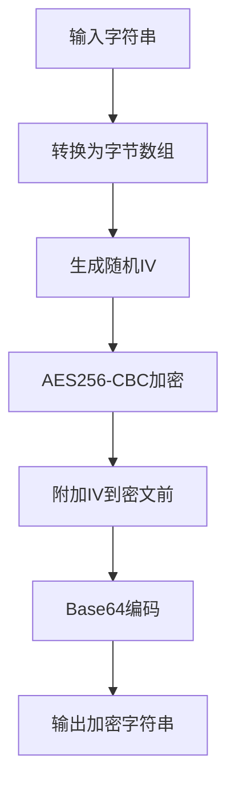

**图表来源**
- [src/metabase/util/encryption.clj](file://src/metabase/util/encryption.clj#L75-L98)

### 字节数组数据加密

对于二进制数据，直接进行字节数组加密：

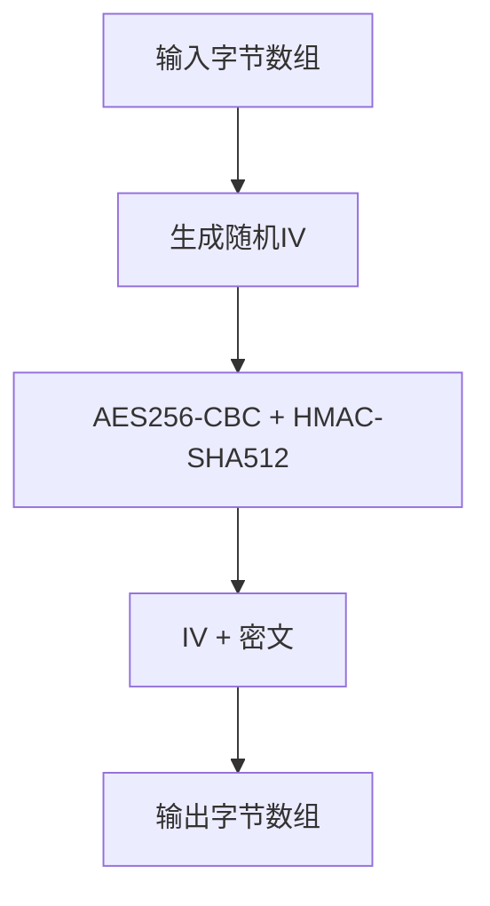

**图表来源**
- [src/metabase/util/encryption.clj](file://src/metabase/util/encryption.clj#L68-L74)

### 流式数据处理

对于大型数据（如查询结果），采用流式处理避免内存溢出：

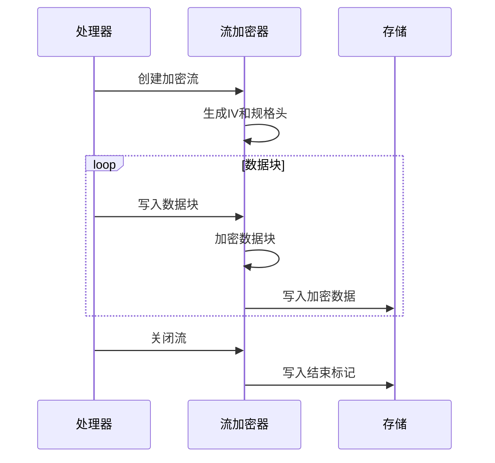

**图表来源**
- [src/metabase/util/encryption.clj](file://src/metabase/util/encryption.clj#L105-L124)

**章节来源**
- [src/metabase/util/encryption.clj](file://src/metabase/util/encryption.clj#L68-L124)

## 性能优化与并发处理

### 数据分块策略

为了提高大文件处理的效率，系统采用分块加密策略：

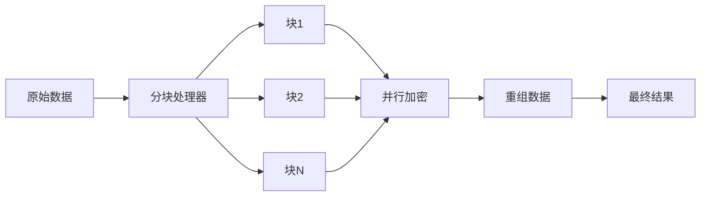

### 流式处理优化

流式加密减少了内存占用，特别适合处理大型查询结果：

| 优化技术 | 实现方式 | 性能提升 |
|----------|----------|----------|
| 流式加密 | CipherInputStream | 减少内存峰值 |
| 分块处理 | SequenceInputStream | 控制内存使用 |
| 异步写入 | 后台线程池 | 提高吞吐量 |
| 缓存机制 | memoized密钥派生 | 减少重复计算 |

### 并发安全机制

系统通过以下机制确保并发安全性：

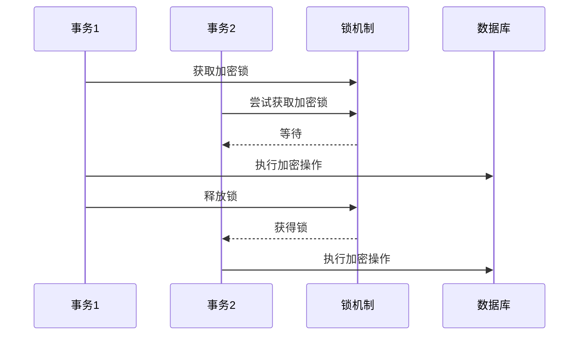

**章节来源**
- [src/metabase/util/encryption.clj](file://src/metabase/util/encryption.clj#L105-L154)

## 故障排除指南

### 常见问题诊断

#### 加密状态检查

系统通过`encryption-check`设置项跟踪加密状态：

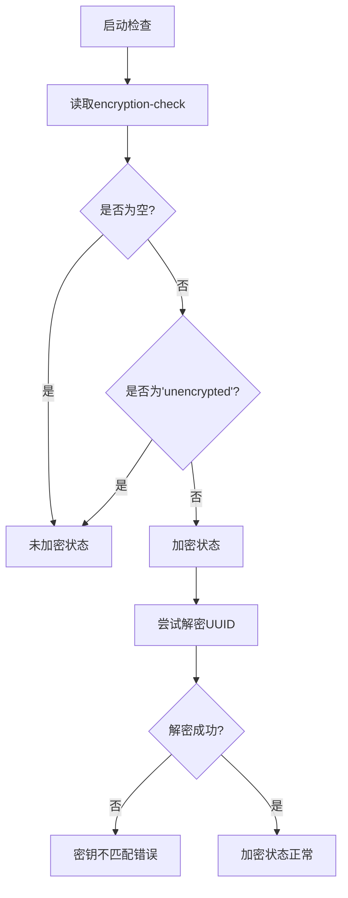

**图表来源**
- [src/metabase/app_db/setup.clj](file://src/metabase/app_db/setup.clj#L147-L165)

#### 错误处理机制

系统实现了完善的错误处理和恢复机制：

| 错误类型 | 处理方式 | 用户提示 |
|----------|----------|----------|
| 密钥缺失 | 抛出详细异常 | MB_ENCRYPTION_SECRET_KEY未设置 |
| 密钥不匹配 | 抛出详细异常 | 数据库加密密钥不匹配 |
| 解密失败 | 记录警告并返回原文 | 无法解密，可能密钥变更 |
| 数据损坏 | 记录错误并返回原文 | 数据格式错误 |

### 性能监控指标

关键性能指标包括：

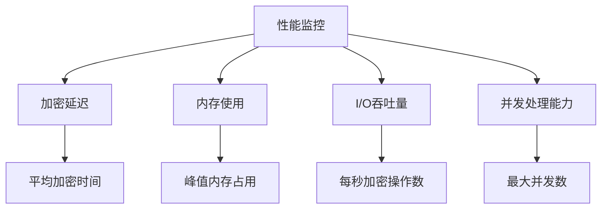

**章节来源**
- [src/metabase/app_db/setup.clj](file://src/metabase/app_db/setup.clj#L147-L165)
- [src/metabase/util/encryption.clj](file://src/metabase/util/encryption.clj#L223-L261)

## 最佳实践建议

### 密钥管理最佳实践

1. **密钥强度要求**
   - 最小长度：16字符
   - 推荐长度：32字符以上
   - 使用强随机源生成

2. **密钥轮换策略**
   - 定期更换加密密钥
   - 使用`rotate-encryption-key!`命令
   - 保持旧密钥直到迁移完成

3. **环境变量管理**
   - 使用安全的环境变量存储
   - 避免在日志中暴露密钥
   - 实施访问控制

### 性能优化建议

1. **硬件加速**
   - 使用支持AES-NI指令集的CPU
   - 配置足够大的JVM堆内存
   - 优化数据库连接池设置

2. **配置调优**
   - 根据负载调整并发参数
   - 监控加密操作延迟
   - 定期清理加密缓存

3. **监控告警**
   - 设置加密性能监控
   - 建立异常处理流程
   - 实施定期备份验证

### 安全加固措施

1. **访问控制**
   - 限制密钥访问权限
   - 实施审计日志记录
   - 使用多因素认证

2. **数据保护**
   - 定期备份加密数据
   - 实施数据脱敏策略
   - 建立灾难恢复计划

## 总结

Metabase的静态数据加密机制提供了一个全面、安全且高效的解决方案，用于保护存储在应用数据库中的敏感信息。该系统的主要优势包括：

### 技术优势

1. **强大的加密算法**：采用AES256-CBC + HMAC-SHA512组合，提供企业级安全保障
2. **灵活的密钥管理**：支持PBKDF2密钥派生和动态密钥轮换
3. **透明的操作体验**：对应用程序完全透明，无需修改现有代码
4. **高性能设计**：支持流式处理和并发操作，适应高负载场景

### 安全特性

1. **完整性保护**：HMAC-SHA512确保数据完整性
2. **抗重放攻击**：每次加密使用独立IV
3. **密钥隔离**：主密钥与加密密钥分离
4. **审计追踪**：完整的加密操作日志

### 可扩展性

1. **模块化设计**：清晰的组件分离便于维护和扩展
2. **配置驱动**：支持多种部署环境和配置需求
3. **版本兼容**：平滑的升级和降级路径

该加密机制为Metabase用户提供了可靠的数据保护能力，在满足合规要求的同时，保持了系统的高性能和易用性。通过遵循最佳实践和持续监控，可以确保加密系统的长期稳定运行。