# 会话管理

<cite>
**本文档中引用的文件**  
- [core.clj](file://src/metabase/session/core.clj)
- [session.clj](file://src/metabase/session/models/session.clj)
- [session_cleanup.clj](file://src/metabase/session/task/session_cleanup.clj)
- [settings.clj](file://src/metabase/session/settings.clj)
- [session.clj](file://src/metabase/request/session.clj)
- [session.clj](file://src/metabase/server/middleware/session.clj)
- [api.clj](file://src/metabase/session/api.clj)
- [cookies.clj](file://src/metabase/request/cookies.clj)
- [core.clj](file://src/metabase/config/core.clj)
</cite>

## 目录
1. [引言](#引言)
2. [会话生命周期管理](#会话生命周期管理)
3. [会话令牌生成与验证](#会话令牌生成与验证)
4. [会话数据结构设计](#会话数据结构设计)
5. [会话清理任务](#会话清理任务)
6. [配置策略](#配置策略)
7. [安全特性](#安全特性)
8. [会话流程序列图](#会话流程序列图)
9. [结论](#结论)

## 引言
Metabase的会话管理机制为用户提供了安全的身份验证和访问控制。该系统通过会话令牌、Cookie管理和后台清理任务的组合，确保用户会话的安全性和系统性能。本文档深入分析了Metabase中会话的创建、维护和销毁全生命周期，重点关注`session/core.clj`中的会话令牌生成与验证逻辑，`session/models/session.clj`中的数据结构设计，以及`session/task/session_cleanup.clj`中的后台清理任务。

**会话管理的核心组件包括**：
- 会话令牌的生成与验证
- 会话数据模型的设计
- 定期清理过期会话的后台任务
- 环境变量和配置策略
- 安全特性如会话固定攻击防护和并发登录控制

**会话管理流程概述**：

**图源**  
- [api.clj](file://src/metabase/session/api.clj#L100-L150)
- [session.clj](file://src/metabase/server/middleware/session.clj#L50-L100)

## 会话生命周期管理
Metabase的会话生命周期管理涵盖了会话的创建、维护和销毁三个阶段。会话的创建发生在用户成功登录时，系统会生成唯一的会话令牌并创建相应的会话记录。会话的维护通过定期验证和更新会话状态来实现，确保用户在有效期内的持续访问。会话的销毁则通过用户主动注销或系统自动清理过期会话来完成。

会话创建过程涉及多个步骤：
1. 用户提交登录凭证（用户名和密码）
2. 系统验证凭证的有效性
3. 生成唯一的会话令牌
4. 创建会话记录并存储到数据库
5. 设置会话Cookie并返回给客户端

会话维护机制包括：
- 每次请求时验证会话令牌的有效性
- 根据配置更新会话的过期时间
- 记录会话活动日志

会话销毁的触发条件：
- 用户主动点击注销按钮
- 会话超时（达到最大会话年龄）
- 管理员强制注销用户
- 系统定期清理任务删除过期会话

**会话生命周期状态图**：

**图源**  
- [api.clj](file://src/metabase/session/api.clj#L100-L200)
- [session.clj](file://src/metabase/server/middleware/session.clj#L150-L200)

**本节源**  
- [api.clj](file://src/metabase/session/api.clj#L100-L200)
- [session.clj](file://src/metabase/server/middleware/session.clj#L150-L200)

## 会话令牌生成与验证
Metabase的会话令牌生成与验证机制是其安全架构的核心。在`session/core.clj`文件中，系统通过`generate-session-key`函数生成唯一的会话令牌，该函数使用`random-uuid`创建一个全局唯一标识符。生成的会话令牌随后通过`hash-session-key`函数进行哈希处理，以确保在数据库中存储的是加密后的值而非明文。

会话令牌的验证过程在`server/middleware/session.clj`中实现，主要通过`current-user-info-for-session`函数完成。该函数首先检查会话令牌的格式是否有效，然后查询数据库验证会话是否存在且未过期。验证过程中，系统会同时检查会话的创建时间和当前时间，确保会话仍在有效期内。

会话令牌的安全特性包括：
- 使用SHA-512哈希算法对令牌进行加密存储
- 通过LRU缓存优化哈希计算性能
- 防止会话ID以明文形式存储在数据库中
- 支持反CSRF令牌以防止跨站请求伪造攻击

**图源**  
- [core.clj](file://src/metabase/session/core.clj#L10-L20)
- [session.clj](file://src/metabase/session/models/session.clj#L20-L40)
- [session.clj](file://src/metabase/server/middleware/session.clj#L100-L150)

**本节源**  
- [core.clj](file://src/metabase/session/core.clj#L10-L20)
- [session.clj](file://src/metabase/session/models/session.clj#L20-L40)
- [session.clj](file://src/metabase/server/middleware/session.clj#L100-L150)

## 会话数据结构设计
Metabase的会话数据结构设计在`session/models/session.clj`文件中定义，采用了Toucan2 ORM框架来管理会话模型。会话模型的主要字段包括：`id`（会话ID）、`user_id`（用户ID）、`auth_identity_id`（认证身份ID）、`session_key`（会话密钥）、`key_hashed`（哈希后的密钥）、`created_at`（创建时间）和`expires_at`（过期时间）。

会话ID的生成通过`generate-session-id`函数实现，该函数使用`string/random-string`创建一个12字符的随机字符串。这种设计避免了使用UUID作为主键可能带来的性能问题，同时保证了足够的唯一性。会话密钥（`session_key`）则使用标准UUID，而哈希后的密钥（`key_hashed`）存储在数据库中，确保即使数据库泄露也无法直接获取有效的会话令牌。

会话模型的约束和钩子包括：
- 在插入前验证会话ID和密钥不以明文形式存储
- 禁止更新会话记录（通过`define-before-update`钩子）
- 在插入后发布用户登录事件
- 自动派生`created-at-timestamped?`特性以记录创建时间

会话类型支持两种模式：
- `:normal` - 普通用户会话
- `:full-app-embed` - 全应用嵌入会话

对于嵌入式会话，系统会额外生成反CSRF令牌以增强安全性，防止跨站请求伪造攻击。

```mermaid
erDiagram
SESSION {
string id PK
int user_id FK
int auth_identity_id FK
string key_hashed
datetime created_at
datetime expires_at
string anti_csrf_token
}
USER {
int id PK
string email
string password_hash
boolean is_active
}
AUTH_IDENTITY {
int id PK
int user_id FK
string provider
datetime expires_at
}
SESSION ||--o{ USER : "belongs to"
SESSION ||--o{ AUTH_IDENTITY : "uses"
```

**图源**  
- [session.clj](file://src/metabase/session/models/session.clj#L10-L50)
- [session.clj](file://src/metabase/auth_identity/session.clj#L10-L20)

**本节源**  
- [session.clj](file://src/metabase/session/models/session.clj#L10-L50)

## 会话清理任务
Metabase的会话清理任务在`session/task/session_cleanup.clj`文件中定义，通过Quartz调度框架定期执行。该任务的主要功能是删除数据库中已过期的会话记录，以维护系统性能和安全性。清理任务每天凌晨2点执行一次，通过Cron表达式"0 0 2 * * ? *"进行调度。

清理逻辑的核心是`cleanup-sessions!`函数，该函数计算出允许的最旧会话时间（当前时间减去最大会话年龄），然后删除所有创建时间早于该阈值的会话记录。最大会话年龄通过`config/config-int :max-session-age`从配置中获取，默认值为20160分钟（14天）。

清理任务的实现细节包括：
- 使用HoneySQL构建安全的数据库查询
- 支持多种数据库类型（H2、MySQL、PostgreSQL）的时间计算
- 通过Toucan2的`delete!`函数执行删除操作
- 作为Quartz作业注册到任务调度系统

任务初始化通过`task/init!`多态方法实现，该方法在系统启动时被调用，负责创建作业和触发器并将其注册到调度器。这种设计确保了清理任务在应用启动后自动运行，无需手动干预。

**图源**  
- [session_cleanup.clj](file://src/metabase/session/task/session_cleanup.clj#L10-L40)

**本节源**  
- [session_cleanup.clj](file://src/metabase/session/task/session_cleanup.clj#L10-L40)

## 配置策略
Metabase的会话管理配置策略主要通过环境变量和系统设置实现。核心配置包括`MB_SESSION_EXPIRE`（通过`MAX_SESSION_AGE`环境变量）和`MB_SESSION_COOKIES`，这些配置共同决定了会话的行为和生命周期。

`MAX_SESSION_AGE`环境变量定义了会话的最大存活时间（以分钟为单位），默认值为20160分钟（14天）。该值可以通过`config-int :max-session-age`在`config/core.clj`中获取。当用户会话超过此时间后，即使用户仍在活动，也需要重新登录。

`MB_SESSION_COOKIES`设置通过`session-cookies`函数在`session/settings.clj`中实现，它强制所有用户使用会话Cookie，这些Cookie在浏览器关闭时过期。此设置会覆盖登录时的"记住我"选项，确保更高的安全性。

其他相关配置包括：
- `session-timeout` - 基于不活动的会话超时设置
- `session-cookie-samesite` - Cookie的SameSite属性设置
- `enable-password-login` - 是否允许密码登录

这些配置的优先级和交互关系如下：
1. `MB_SESSION_COOKIES`设置优先于"记住我"选项
2. 会话的`expires_at`字段优先于`MAX_SESSION_AGE`设置
3. `session-timeout`设置（基于不活动）与`MAX_SESSION_AGE`（绝对时间）独立工作

**图源**  
- [settings.clj](file://src/metabase/session/settings.clj#L20-L40)
- [core.clj](file://src/metabase/config/core.clj#L50-L70)
- [cookies.clj](file://src/metabase/request/cookies.clj#L100-L150)

**本节源**  
- [settings.clj](file://src/metabase/session/settings.clj#L20-L40)
- [core.clj](file://src/metabase/config/core.clj#L50-L70)
- [cookies.clj](file://src/metabase/request/cookies.clj#L100-L150)

## 安全特性
Metabase的会话管理系统实现了多项安全特性，以防止常见的安全威胁并保护用户数据。这些特性包括会话固定攻击防护、并发登录控制、CSRF防护和安全的Cookie管理。

会话固定攻击防护通过以下机制实现：
- 每次登录时生成全新的会话令牌
- 立即使旧会话失效
- 不允许将会话ID作为参数传递
- 在数据库中存储哈希后的会话密钥而非明文

并发登录控制通过会话模型的设计实现，每个用户可以有多个并发会话，但系统会跟踪每个会话的状态。管理员可以查看和管理用户的活动会话，并在必要时强制注销特定会话。

CSRF防护机制包括：
- 为嵌入式会话生成专门的反CSRF令牌
- 将反CSRF令牌存储在会话记录中
- 在每次请求时验证令牌的一致性
- 使用HttpOnly Cookie防止JavaScript访问

安全的Cookie管理特性：
- 使用HttpOnly标志防止XSS攻击
- 支持Secure标志（HTTPS连接时）
- 可配置SameSite属性以防止CSRF
- 支持会话Cookie（浏览器关闭时过期）

此外，系统还实现了登录尝试限制（throttling），防止暴力破解攻击。通过`throttle/make-throttler`创建的限制器可以控制特定IP地址或用户名的登录尝试频率。

**图源**  
- [session.clj](file://src/metabase/server/middleware/session.clj#L50-L100)
- [api.clj](file://src/metabase/session/api.clj#L50-L100)
- [cookies.clj](file://src/metabase/request/cookies.clj#L50-L100)

**本节源**  
- [session.clj](file://src/metabase/server/middleware/session.clj#L50-L100)
- [api.clj](file://src/metabase/session/api.clj#L50-L100)
- [cookies.clj](file://src/metabase/request/cookies.clj#L50-L100)

## 会话流程序列图
以下是Metabase会话管理的完整流程序列图，展示了从用户登录到会话验证的完整过程：

**图源**  
- [api.clj](file://src/metabase/session/api.clj#L100-L200)
- [session.clj](file://src/metabase/server/middleware/session.clj#L100-L200)
- [cookies.clj](file://src/metabase/request/cookies.clj#L100-L150)

## 结论
Metabase的会话管理机制是一个全面而安全的系统，通过多个组件的协同工作实现了用户会话的完整生命周期管理。核心组件包括会话令牌的生成与验证、会话数据结构的设计、后台清理任务以及灵活的配置策略。

系统的主要优势包括：
- **安全性**：通过哈希存储、CSRF防护和登录限制等机制确保会话安全
- **灵活性**：支持多种配置选项，适应不同的安全需求
- **性能**：通过LRU缓存和定期清理维护系统性能
- **可扩展性**：模块化设计便于未来功能扩展

最佳实践建议：
1. 根据安全需求合理配置`MAX_SESSION_AGE`和`MB_SESSION_COOKIES`
2. 定期监控会话清理任务的执行情况
3. 启用适当的Cookie安全属性（Secure、HttpOnly、SameSite）
4. 监控异常登录尝试并及时响应

通过深入理解这些机制，管理员可以更好地配置和维护Metabase实例，确保用户数据的安全和系统的稳定运行。