# Google 单点登录详细实现文档

<cite>
**本文档中引用的文件**
- [src/metabase/sso/google.clj](file://src/metabase/sso/google.clj)
- [src/metabase/sso/providers/google.clj](file://src/metabase/sso/providers/google.clj)
- [src/metabase/sso/api/google.clj](file://src/metabase/sso/api/google.clj)
- [src/metabase/sso/settings.clj](file://src/metabase/sso/settings.clj)
- [src/metabase/sso/common.clj](file://src/metabase/sso/common.clj)
- [src/metabase/sso/api.clj](file://src/metabase/sso/api.clj)
- [src/metabase/sso/init.clj](file://src/metabase/sso/init.clj)
- [src/metabase/auth_identity/provider.clj](file://src/metabase/auth_identity/provider.clj)
- [src/metabase/session/api.clj](file://src/metabase/session/api.clj)
</cite>

## 目录
1. [简介](#简介)
2. [系统架构概览](#系统架构概览)
3. [核心组件分析](#核心组件分析)
4. [OAuth 2.0认证流程](#oauth-20认证流程)
5. [ID令牌验证机制](#id令牌验证机制)
6. [用户身份提取与管理](#用户身份提取与管理)
7. [前端JavaScript客户端交互](#前端javascript客户端交互)
8. [安全防护机制](#安全防护机制)
9. [配置指南](#配置指南)
10. [常见问题与解决方案](#常见问题与解决方案)
11. [总结](#总结)

## 简介

Metabase的Google单点登录(SSO)功能基于OAuth 2.0协议实现，为用户提供安全便捷的身份验证体验。该系统通过Google Cloud Console配置OAuth客户端，支持用户使用Google账户进行身份验证，同时具备完善的域名限制、自动用户创建和安全防护机制。

## 系统架构概览

Google SSO系统采用分层架构设计，包含以下主要层次：

**图表来源**
- [src/metabase/session/api.clj](file://src/metabase/session/api.clj#L250-L270)
- [src/metabase/sso/providers/google.clj](file://src/metabase/sso/providers/google.clj#L1-L20)

**章节来源**
- [src/metabase/sso/init.clj](file://src/metabase/sso/init.clj#L1-L4)
- [src/metabase/sso/api.clj](file://src/metabase/sso/api.clj#L1-L15)

## 核心组件分析

### Google SSO模块结构

Google SSO功能分布在多个核心模块中，每个模块承担特定职责：

**图表来源**
- [src/metabase/sso/google.clj](file://src/metabase/sso/google.clj#L1-L53)
- [src/metabase/sso/providers/google.clj](file://src/metabase/sso/providers/google.clj#L1-L74)

### 认证流程控制器

认证流程通过方法式编程模式实现，支持灵活的扩展和定制：

**图表来源**
- [src/metabase/session/api.clj](file://src/metabase/session/api.clj#L250-L270)
- [src/metabase/sso/providers/google.clj](file://src/metabase/sso/providers/google.clj#L20-L74)

**章节来源**
- [src/metabase/sso/providers/google.clj](file://src/metabase/sso/providers/google.clj#L1-L74)
- [src/metabase/session/api.clj](file://src/metabase/session/api.clj#L250-L270)

## OAuth 2.0认证流程

### 重定向URL生成

Google SSO认证流程基于OAuth 2.0授权码流程，但针对Web应用进行了优化：

**图表来源**
- [src/metabase/sso/google.clj](file://src/metabase/sso/google.clj#L10-L53)
- [src/metabase/sso/providers/google.clj](file://src/metabase/sso/providers/google.clj#L20-L74)

### 授权码交换机制

系统通过HTTP POST请求与Google的tokeninfo端点进行通信，验证ID令牌的有效性：

| 验证项目 | 描述 | 错误处理 |
|---------|------|----------|
| 响应状态码 | 必须为200 OK | 抛出400状态码异常 |
| 受众验证 | ID令牌的aud字段必须匹配配置的客户端ID | 抛出400状态码异常 |
| 邮箱验证 | email_verified字段必须为"true" | 抛出400状态码异常 |
| 域名检查 | 用户邮箱必须属于允许的域名列表 | 返回认证失败 |

**章节来源**
- [src/metabase/sso/google.clj](file://src/metabase/sso/google.clj#L10-L53)

## ID令牌验证机制

### 令牌验证函数详解

`google-auth-token-info`函数实现了完整的ID令牌验证逻辑：

**图表来源**
- [src/metabase/sso/google.clj](file://src/metabase/sso/google.clj#L10-L53)

### 公钥轮换支持

Google SSO系统通过直接调用Google提供的tokeninfo API来验证令牌，该API自动处理公钥轮换和JWK验证，确保了系统的安全性和兼容性。

**章节来源**
- [src/metabase/sso/google.clj](file://src/metabase/sso/google.clj#L10-L53)

## 用户身份提取与管理

### 用户身份提取逻辑

Google提供商负责从ID令牌中提取用户身份信息：

```mermaid
sequenceDiagram
participant Token as ID令牌
participant Provider as Google提供商
participant Validator as 令牌验证器
participant UserManager as 用户管理器
participant Database as 数据库
Token->>Provider : 提交ID令牌
Provider->>Validator : 验证令牌有效性
Validator-->>Provider : 返回用户信息
Provider->>Provider : 解析first_name, last_name, email
Provider->>UserManager : 检查域名限制
UserManager->>Database : 查找现有用户
Database-->>UserManager : 返回用户记录
UserManager->>Database : 创建新用户或更新现有用户
Database-->>UserManager : 返回最终用户
UserManager-->>Provider : 返回用户数据
Provider-->>Token : 返回认证结果
```

**图表来源**
- [src/metabase/sso/providers/google.clj](file://src/metabase/sso/providers/google.clj#L20-L50)

### 邮箱域限制检查

系统提供了细粒度的域名控制机制：

| 配置项 | 类型 | 描述 | 默认值 |
|-------|------|------|--------|
| google-auth-auto-create-accounts-domain | 字符串 | 允许自动创建用户的邮箱域名列表（逗号分隔） | 空 |
| autocreate-user-allowed-for-email? | 函数 | 检查邮箱域名是否在允许列表中的函数 | 内部实现 |

### 自动用户创建逻辑

用户创建遵循以下优先级规则：

**图表来源**
- [src/metabase/sso/providers/google.clj](file://src/metabase/sso/providers/google.clj#L50-L74)

**章节来源**
- [src/metabase/sso/providers/google.clj](file://src/metabase/sso/providers/google.clj#L50-L74)
- [src/metabase/sso/google.clj](file://src/metabase/sso/google.clj#L40-L53)

## 前端JavaScript客户端交互

### 客户端集成模式

前端JavaScript客户端通过标准的Google Sign-In API与后端进行交互：

**图表来源**
- [src/metabase/session/api.clj](file://src/metabase/session/api.clj#L250-L270)

### 请求处理链

Google认证端点的请求处理遵循严格的验证流程：

| 处理阶段 | 验证内容 | 错误类型 |
|---------|----------|----------|
| 初始验证 | Google Auth是否启用 | 400错误："Google Auth is disabled" |
| 令牌验证 | ID令牌格式和签名 | 401错误："Authentication failed" |
| 域名检查 | 用户邮箱域名 | 401错误："You'll need an administrator..." |
| 会话创建 | 创建用户会话 | 401错误："Authentication failed" |

**章节来源**
- [src/metabase/session/api.clj](file://src/metabase/session/api.clj#L250-L270)

## 安全防护机制

### 跨站请求伪造(CSRF)防护

虽然Google SSO本身不直接涉及CSRF攻击，但系统通过以下机制提供全面的安全保护：

**图表来源**
- [src/metabase/server/middleware/security.clj](file://src/metabase/server/middleware/security.clj#L283-L306)

### 令牌过期处理

Google SSO系统通过以下方式处理令牌过期问题：

| 过期类型 | 处理策略 | 实现方式 |
|---------|----------|----------|
| ID令牌过期 | 重新认证 | 前端触发Google Sign-In重新流程 |
| 访问令牌过期 | 自动刷新 | Google SDK自动处理 |
| 会话过期 | 清除本地存储 | 前端清除Cookie和本地存储 |

### 域名不匹配防护

系统实现了多层域名验证机制：

**图表来源**
- [src/metabase/sso/google.clj](file://src/metabase/sso/google.clj#L40-L53)

**章节来源**
- [src/metabase/sso/google.clj](file://src/metabase/sso/google.clj#L40-L53)

## 配置指南

### Google Cloud Console配置步骤

#### 1. 创建OAuth客户端

在Google Cloud Console中创建OAuth客户端：

| 配置项 | 值 | 说明 |
|-------|-----|------|
| 应用名称 | Metabase | 显示在Google登录页面的应用名称 |
| 应用类型 | Web应用 | 选择Web应用类型 |
| 重定向URI | https://your-metabase-domain.com/auth/google/callback | 替换为实际域名 |
| 授权域名 | your-metabase-domain.com | 允许的域名列表 |

#### 2. 启用Google+ API

确保以下API已启用：
- Google+ API
- People API
- OAuth2 API

#### 3. 配置OAuth同意屏幕

填写必要的应用信息：
- 应用名称
- 用户支持邮箱
- 开发者联系信息
- 应用域名

### Metabase配置参数

#### 基础配置

| 设置项 | 类型 | 描述 | 示例值 |
|-------|------|------|--------|
| google-auth-client-id | 字符串 | Google OAuth客户端ID | xxx.apps.googleusercontent.com |
| google-auth-enabled | 布尔值 | 是否启用Google SSO | true |
| google-auth-auto-create-accounts-domain | 字符串 | 允许自动创建的域名 | company.com |

#### 高级配置

| 设置项 | 类型 | 描述 | 注意事项 |
|-------|------|------|----------|
| send-new-sso-user-admin-email? | 布尔值 | 新用户通知管理员 | 仅企业版可用 |
| ldap-group-sync | 布尔值 | 同步LDAP组成员关系 | 与Google SSO共存时需谨慎配置 |

### 配置验证流程

**图表来源**
- [src/metabase/sso/settings.clj](file://src/metabase/sso/settings.clj#L150-L192)

**章节来源**
- [src/metabase/sso/settings.clj](file://src/metabase/sso/settings.clj#L150-L192)

## 常见问题与解决方案

### 令牌验证失败

#### 问题症状
- 错误消息："Invalid Google Sign-In token"
- 状态码：400

#### 可能原因
1. Google Cloud Console中的客户端ID配置错误
2. ID令牌格式不正确
3. 令牌已过期

#### 解决方案
1. 验证Google Cloud Console中的客户端ID配置
2. 检查前端是否正确获取了ID令牌
3. 确认Google Sign-In SDK版本兼容性

### 邮箱验证失败

#### 问题症状
- 错误消息："Email is not verified"
- 状态码：400

#### 可能原因
1. 用户Google账户邮箱未验证
2. Google账户隐私设置限制

#### 解决方案
1. 引导用户验证Google账户邮箱
2. 检查Google账户隐私设置
3. 考虑放宽邮箱验证要求（不推荐）

### 域名限制问题

#### 问题症状
- 错误消息："You'll need an administrator to create a Metabase account..."
- 状态码：401

#### 可能原因
1. 用户邮箱域名不在允许列表中
2. 域名配置格式错误
3. 多域名配置问题

#### 解决方案
1. 添加正确的域名到配置中
2. 使用逗号分隔的域名列表格式
3. 测试域名匹配逻辑

### 跨域请求问题

#### 问题症状
- CORS错误
- 重定向失败

#### 可能原因
1. 重定向URI配置错误
2. HTTPS证书问题
3. 浏览器安全设置

#### 解决方案
1. 验证Google Cloud Console中的重定向URI
2. 确保使用有效的SSL证书
3. 检查浏览器安全设置

### 性能优化建议

#### 缓存策略
- 缓存Google公钥用于令牌验证
- 缓存用户信息减少数据库查询
- 实施适当的会话超时机制

#### 监控指标
- 认证成功率
- 平均响应时间
- 错误率分布
- 用户增长趋势

**章节来源**
- [src/metabase/sso/google.clj](file://src/metabase/sso/google.clj#L10-L53)
- [src/metabase/sso/providers/google.clj](file://src/metabase/sso/providers/google.clj#L35-L50)

## 总结

Metabase的Google SSO实现是一个功能完整、安全可靠的单点登录解决方案。系统通过OAuth 2.0协议确保了认证的安全性，通过细粒度的域名控制提供了灵活的访问管理，通过完善的错误处理和日志记录确保了系统的可维护性。

### 主要特性

1. **安全性**：基于OAuth 2.0协议，支持公钥轮换，实施多层验证
2. **灵活性**：支持域名限制、自动用户创建、组成员同步
3. **可靠性**：完善的错误处理、日志记录和监控机制
4. **易用性**：简洁的配置界面，直观的用户界面

### 最佳实践建议

1. 始终使用HTTPS保护传输安全
2. 定期审查和更新域名白名单
3. 监控认证成功率和错误率
4. 实施适当的速率限制防止滥用
5. 保持Google Cloud Console配置与系统配置同步

通过遵循本文档的指导，您可以成功部署和维护一个安全、高效的Google SSO系统，为用户提供便捷的身份验证体验。