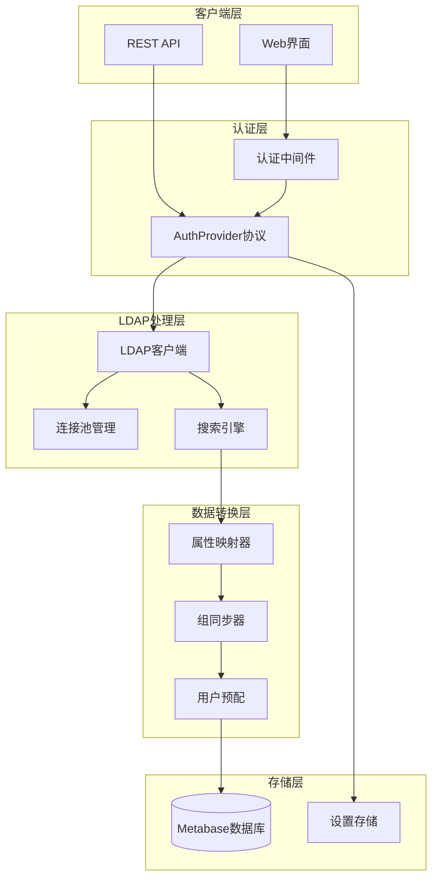
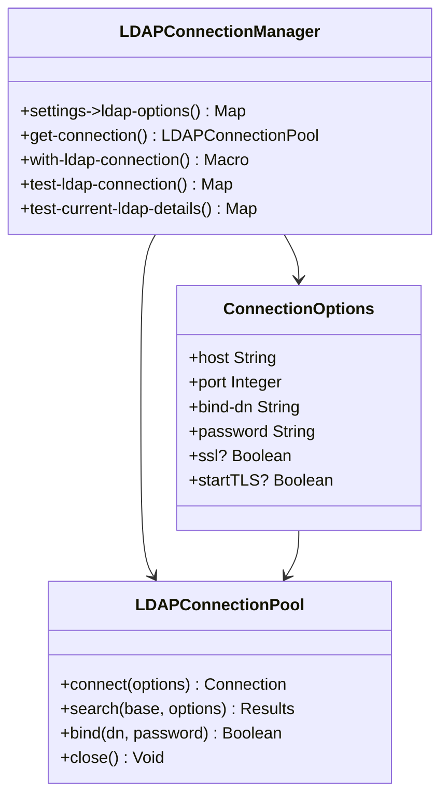
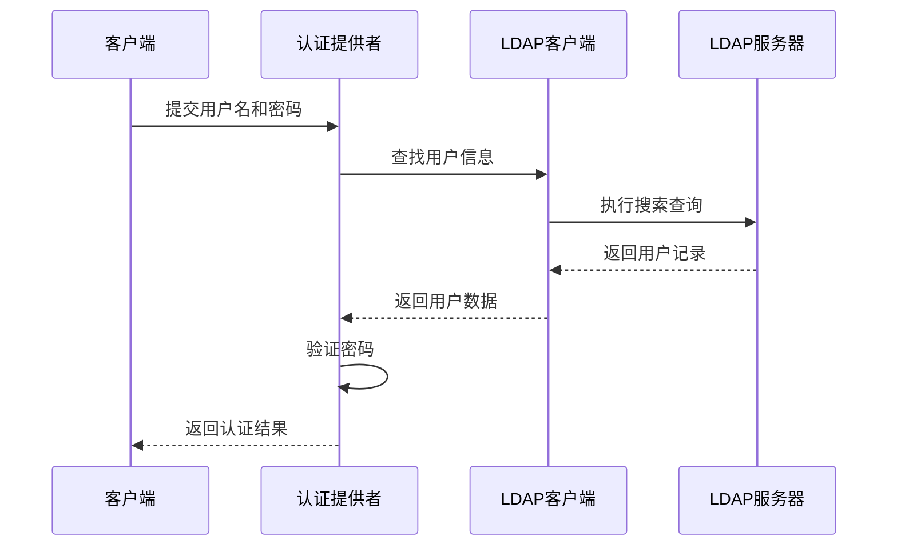
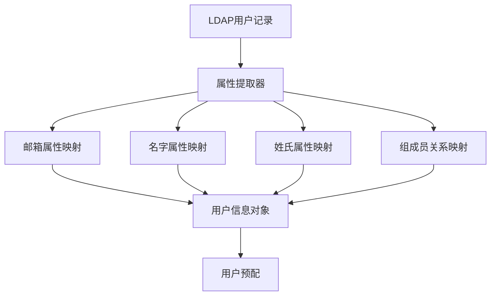
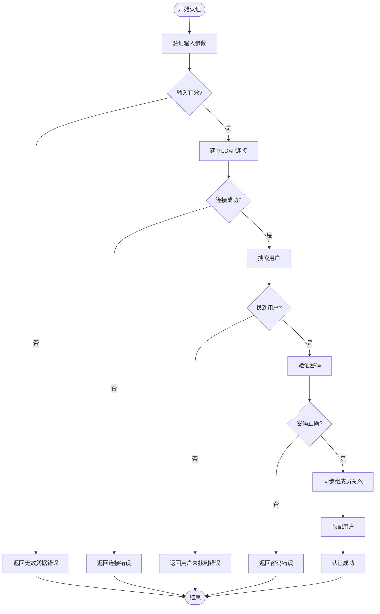
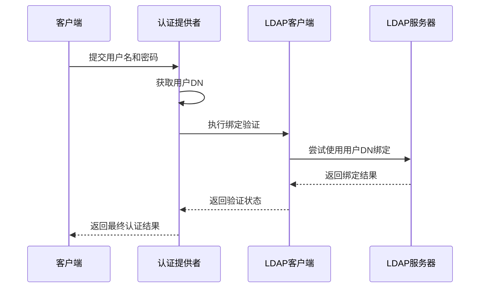
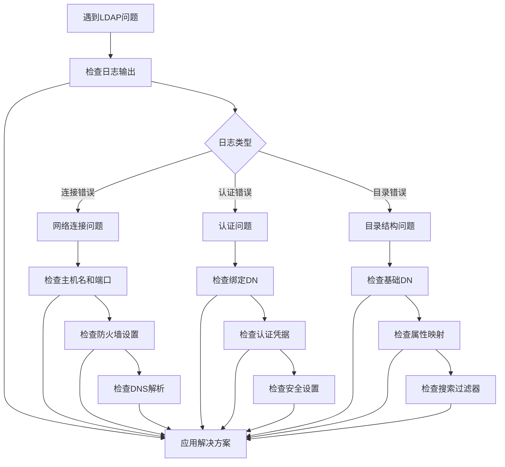
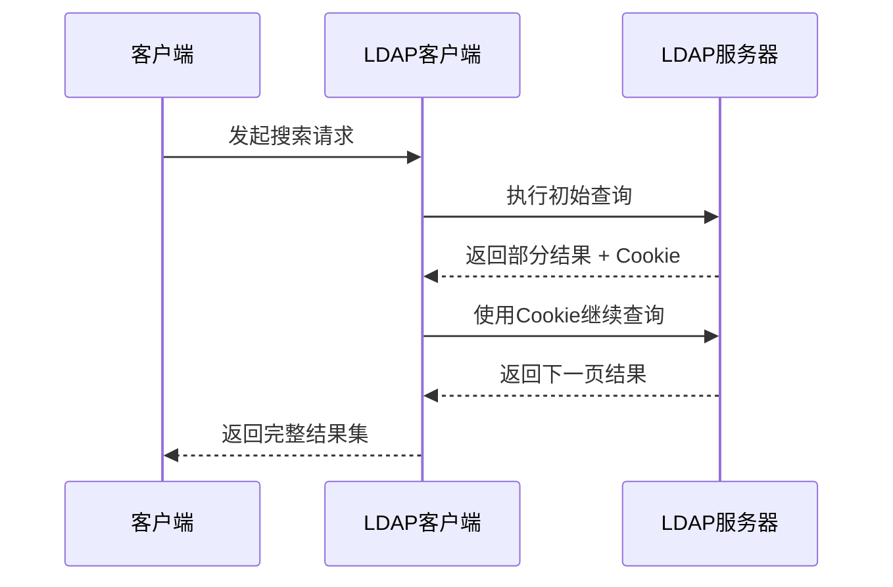
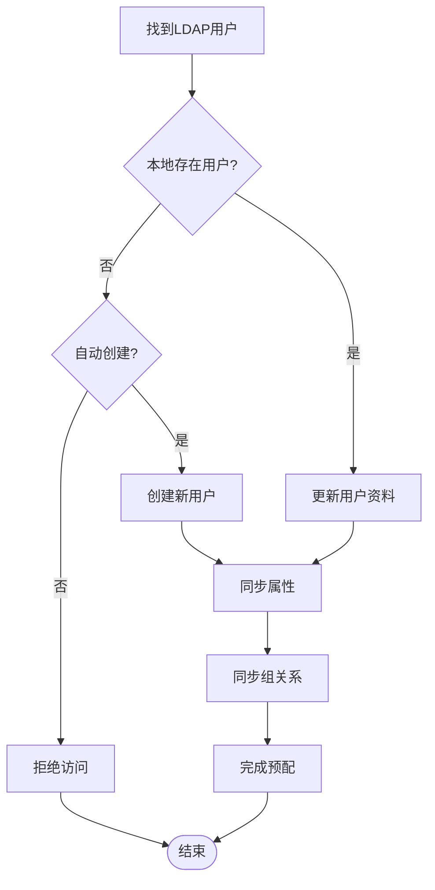

# LDAP 单点登录集成文档

<cite>
**本文档中引用的文件**
- [ldap.clj](file://src/metabase/sso/ldap.clj)
- [providers/ldap.clj](file://src/metabase/sso/providers/ldap.clj)
- [api/ldap.clj](file://src/metabase/sso/api/ldap.clj)
- [default_implementation.clj](file://src/metabase/sso/ldap/default_implementation.clj)
- [settings.clj](file://src/metabase/sso/settings.clj)
- [common.clj](file://src/metabase/sso/common.clj)
</cite>

## 目录
1. [简介](#简介)
2. [系统架构概览](#系统架构概览)
3. [核心组件分析](#核心组件分析)
4. [认证流程详解](#认证流程详解)
5. [配置参数详解](#配置参数详解)
6. [REST API 端点](#rest-api-端点)
7. [错误处理与故障排除](#错误处理与故障排除)
8. [高级功能特性](#高级功能特性)
9. [配置示例](#配置示例)
10. [最佳实践](#最佳实践)

## 简介

Metabase 的 LDAP 单点登录（SSO）集成功为组织提供了通过 LDAP 目录服务进行用户身份验证的能力。该系统支持多种 LDAP 服务器类型，包括 Active Directory、OpenLDAP 和 FreeIPA，同时提供了灵活的用户属性映射、组成员关系同步和安全连接选项。

### 主要特性

- **多目录服务支持**：兼容 Active Directory、OpenLDAP、FreeIPA 等主流 LDAP 实现
- **灵活的用户属性映射**：可自定义用户名、邮箱、姓名等属性的映射规则
- **组成员关系同步**：自动同步 LDAP 组到 Metabase 权限组
- **安全连接支持**：支持 SSL/TLS 加密连接和 StartTLS 升级
- **智能错误处理**：提供详细的错误诊断和用户友好的错误消息
- **可配置超时机制**：防止 LDAP 操作阻塞影响系统性能

## 系统架构概览

LDAP SSO 集成采用模块化设计，主要包含以下核心组件：



**图表来源**
- [providers/ldap.clj](file://src/metabase/sso/providers/ldap.clj#L1-L136)
- [ldap.clj](file://src/metabase/sso/ldap.clj#L1-L222)

## 核心组件分析

### 1. LDAP 连接管理器

LDAP 连接管理是整个系统的基础，负责建立和维护与 LDAP 服务器的安全连接。



**图表来源**
- [ldap.clj](file://src/metabase/sso/ldap.clj#L25-L70)

### 2. 用户查找引擎

用户查找引擎负责在 LDAP 目录中搜索指定的用户，并提取相关信息。



**图表来源**
- [providers/ldap.clj](file://src/metabase/sso/providers/ldap.clj#L30-L85)
- [default_implementation.clj](file://src/metabase/sso/ldap/default_implementation.clj#L45-L85)

### 3. 属性映射系统

属性映射系统将 LDAP 属性转换为 Metabase 用户对象所需的格式。



**图表来源**
- [default_implementation.clj](file://src/metabase/sso/ldap/default_implementation.clj#L90-L115)

**节来源**
- [ldap.clj](file://src/metabase/sso/ldap.clj#L1-L222)
- [providers/ldap.clj](file://src/metabase/sso/providers/ldap.clj#L1-L136)
- [default_implementation.clj](file://src/metabase/sso/ldap/default_implementation.clj#L1-L144)

## 认证流程详解

### 完整认证流程

LDAP 认证遵循标准的身份验证模式，包含多个验证步骤以确保安全性：



**图表来源**
- [providers/ldap.clj](file://src/metabase/sso/providers/ldap.clj#L30-L85)

### 密码验证机制

密码验证采用安全的绑定操作，避免明文传输：



**图表来源**
- [ldap.clj](file://src/metabase/sso/ldap.clj#L130-L155)

**节来源**
- [providers/ldap.clj](file://src/metabase/sso/providers/ldap.clj#L30-L136)

## 配置参数详解

### 基础连接配置

| 参数名称 | 类型 | 默认值 | 描述 | 示例 |
|---------|------|--------|------|------|
| `ldap-host` | 字符串 | - | LDAP服务器主机名或IP地址 | `ldap.company.com` |
| `ldap-port` | 整数 | 389 | LDAP服务器端口 | `389` (LDAP), `636` (LDAPS) |
| `ldap-security` | 关键字 | `:none` | 安全连接类型 | `:none`, `:ssl`, `:starttls` |
| `ldap-bind-dn` | 字符串 | - | 绑定用户的Distinguished Name | `cn=admin,dc=company,dc=com` |
| `ldap-password` | 字符串 | - | 绑定用户的密码 | `secure_password` |

### 用户搜索配置

| 参数名称 | 类型 | 默认值 | 描述 | 示例 |
|---------|------|--------|------|------|
| `ldap-user-base` | 字符串 | - | 用户搜索基础DN | `ou=users,dc=company,dc=com` |
| `ldap-user-filter` | 字符串 | `(&amp;(objectClass=inetOrgPerson)(\|(uid={login})(mail={login})))` | 用户搜索过滤器 | `(&(objectClass=person)(sAMAccountName={login}))` |
| `ldap-attribute-email` | 字符串 | `"mail"` | 邮箱属性字段名 | `"mail"`, `"email"`, `"userPrincipalName"` |
| `ldap-attribute-firstname` | 字符串 | `"givenName"` | 名字属性字段名 | `"givenName"`, `"firstName"` |
| `ldap-attribute-lastname` | 字符串 | `"sn"` | 姓氏属性字段名 | `"sn"`, `"lastName"` |

### 组同步配置

| 参数名称 | 类型 | 默认值 | 描述 | 示例 |
|---------|------|--------|------|------|
| `ldap-group-sync` | 布尔值 | `false` | 是否启用组同步 | `true` |
| `ldap-group-base` | 字符串 | - | 组搜索基础DN | `ou=groups,dc=company,dc=com` |
| `ldap-group-mappings` | JSON | `{}` | LDAP组到Metabase组的映射 | `{"cn=admins,dc=company,dc=com": [1, 2]}` |

### 高级配置

| 参数名称 | 类型 | 默认值 | 描述 | 示例 |
|---------|------|--------|------|------|
| `ldap-timeout-seconds` | 浮点数 | `15.0` | LDAP操作超时时间（秒） | `10.0`, `30.0` |
| `ldap-configured?` | 布尔值 | `false` | LDAP配置是否完整 | 自动计算 |
| `ldap-enabled` | 布尔值 | `false` | LDAP是否启用 | `true` |

**节来源**
- [settings.clj](file://src/metabase/sso/settings.clj#L18-L162)

## REST API 端点

### 设置更新端点

LDAP 设置通过 `/api/ldap/settings` 端点进行管理，支持超级用户权限访问。

#### 端点详情

| 属性 | 值 |
|------|-----|
| 路径 | `/api/ldap/settings` |
| 方法 | `PUT` |
| 权限 | 超级用户 |
| 内容类型 | `application/json` |

#### 请求体结构

```json
{
  "ldap-host": "string",
  "ldap-port": "integer",
  "ldap-security": "keyword",
  "ldap-bind-dn": "string",
  "ldap-password": "string",
  "ldap-user-base": "string",
  "ldap-user-filter": "string",
  "ldap-attribute-email": "string",
  "ldap-attribute-firstname": "string",
  "ldap-attribute-lastname": "string",
  "ldap-group-sync": "boolean",
  "ldap-group-base": "string",
  "ldap-group-mappings": "json_string",
  "ldap-enabled": "boolean"
}
```

#### 响应格式

**成功响应 (200)**:
```json
{
  "status": "success",
  "message": "LDAP settings updated successfully"
}
```

**错误响应 (500)**:
```json
{
  "status": 500,
  "body": {
    "errors": {
      "ldap-host": "Wrong host or port",
      "ldap-port": "Wrong host or port"
    }
  }
}
```

### 安全限制

- **身份验证要求**：必须是超级用户才能修改 LDAP 设置
- **密码保护**：敏感字段（如密码）会自动加密存储
- **配置验证**：设置更新前会测试 LDAP 连接
- **事务性更新**：所有设置变更在单个数据库事务中完成

**节来源**
- [api/ldap.clj](file://src/metabase/sso/api/ldap.clj#L1-L51)

## 错误处理与故障排除

### 常见错误类型

#### 连接错误

| 错误模式 | 错误消息 | 可能原因 | 解决方案 |
|----------|----------|----------|----------|
| `UnknownHostException` | "Wrong host or port" | 主机名解析失败 | 检查主机名拼写和DNS配置 |
| `ConnectException` | "Wrong host or port" | 端口不可达 | 验证端口号和防火墙设置 |
| `SocketException` | "Wrong port or security setting" | SSL/TLS配置错误 | 检查安全连接类型和端口匹配 |
| `SSLException` | "Wrong port or security setting" | SSL证书验证失败 | 验证SSL证书和安全设置 |

#### 认证错误

| 错误模式 | 错误消息 | 可能原因 | 解决方案 |
|----------|----------|----------|----------|
| `password was incorrect` | "Password was incorrect" | 用户密码错误 | 验证用户密码 |
| `Unable to bind as user` | "Wrong bind DN" | 绑定DN错误 | 检查绑定用户DN格式 |
| `AcceptSecurityContext error, data 52e` | "Wrong bind DN or password" | 绑定凭据错误 | 验证绑定用户凭据 |
| `AcceptSecurityContext error, data 532` | "Password is expired" | 密码已过期 | 更新用户密码 |
| `AcceptSecurityContext error, data 533` | "Account is disabled" | 账户被禁用 | 启用用户账户 |
| `AcceptSecurityContext error, data 701` | "Account is expired" | 账户已过期 | 更新用户账户状态 |

#### 目录错误

| 错误模式 | 错误消息 | 可能原因 | 解决方案 |
|----------|----------|----------|----------|
| `User search base does not exist` | "User search base does not exist or is unreadable" | 用户搜索基础DN不存在 | 检查并修正用户搜索基础DN |
| `Group search base does not exist` | "Group search base does not exist or is unreadable" | 组搜索基础DN不存在 | 检查并修正组搜索基础DN |
| `Unable to parse bind DN` | "Invalid bind DN" | 绑定DN语法错误 | 验证DN格式正确性 |

### 故障排除流程



### 调试技巧

1. **启用详细日志**：增加日志级别以获取更多调试信息
2. **使用LDAP浏览器**：直接连接LDAP服务器验证配置
3. **测试连接**：使用内置的连接测试功能
4. **检查属性映射**：验证LDAP属性与Metabase字段的对应关系
5. **监控超时**：调整超时设置以适应网络条件

**节来源**
- [ldap.clj](file://src/metabase/sso/ldap.clj#L158-L222)

## 高级功能特性

### 分页支持

LDAP 查询支持分页以处理大量数据：



### DN 模板系统

LDAP DN 模板允许动态构建用户和组的Distinguished Names：

| 占位符 | 替换值 | 示例 |
|--------|--------|------|
| `{login}` | 用户登录名 | `jsmith` |
| `{dn}` | 用户DN | `cn=John Smith,ou=users,dc=company,dc=com` |
| `{uid}` | 用户唯一标识符 | `12345` |

### 组映射策略

#### 1. 直接映射
将LDAP组直接映射到Metabase权限组：
```json
{
  "cn=admins,dc=company,dc=com": [1],
  "cn=analysts,dc=company,dc=com": [2, 3]
}
```

#### 2. 成员关系检测
对于支持 `memberOf` 属性的目录（如Active Directory），系统会自动检测用户所属组。

#### 3. 反向查询
当目录不支持 `memberOf` 时，系统会执行反向查询来确定用户组成员关系。

### 用户预配策略



**图表来源**
- [providers/ldap.clj](file://src/metabase/sso/providers/ldap.clj#L85-L136)

**节来源**
- [default_implementation.clj](file://src/metabase/sso/ldap/default_implementation.clj#L45-L144)
- [common.clj](file://src/metabase/sso/common.clj#L1-L66)

## 配置示例

### 示例 1：基本 Active Directory 配置

```yaml
# 基本AD配置
ldap-host: "ad.company.com"
ldap-port: 389
ldap-security: "none"
ldap-bind-dn: "CN=metabase-service,CN=Users,DC=company,DC=com"
ldap-password: "service_account_password"
ldap-user-base: "OU=Employees,DC=company,DC=com"
ldap-user-filter: "(&(objectClass=user)(sAMAccountName={login}))"
ldap-attribute-email: "userPrincipalName"
ldap-attribute-firstname: "givenName"
ldap-attribute-lastname: "sn"
ldap-group-sync: true
ldap-group-base: "OU=Groups,DC=company,DC=com"
ldap-group-mappings: '{"CN=Metabase Admins,OU=Groups,DC=company,DC=com": [1], "CN=Metabase Analysts,OU=Groups,DC=company,DC=com": [2]}'
```

### 示例 2：安全的 LDAPS 配置

```yaml
# 安全LDAPS配置
ldap-host: "ldap.company.com"
ldap-port: 636
ldap-security: "ssl"
ldap-bind-dn: "CN=metabase,CN=Users,DC=company,DC=com"
ldap-password: "secure_password_with_special_chars"
ldap-user-base: "OU=People,DC=company,DC=com"
ldap-user-filter: "(&(objectClass=person)(uid={login}))"
ldap-attribute-email: "mail"
ldap-attribute-firstname: "givenName"
ldap-attribute-lastname: "sn"
ldap-group-sync: true
ldap-group-base: "OU=Groups,DC=company,DC=com"
ldap-timeout-seconds: 10.0
```

### 示例 3：OpenLDAP 配置

```yaml
# OpenLDAP配置
ldap-host: "openldap.company.com"
ldap-port: 389
ldap-security: "starttls"
ldap-bind-dn: "cn=metabase,ou=services,dc=company,dc=com"
ldap-password: "service_account_password"
ldap-user-base: "ou=people,dc=company,dc=com"
ldap-user-filter: "(&(objectClass=inetOrgPerson)(|(uid={login})(mail={login})))"
ldap-attribute-email: "mail"
ldap-attribute-firstname: "givenName"
ldap-attribute-lastname: "sn"
ldap-group-sync: true
ldap-group-base: "ou=groups,dc=company,dc=com"
ldap-group-mappings: '{"cn=admin,ou=groups,dc=company,dc=com": [1], "cn=users,ou=groups,dc=company,dc=com": [2]}'
```

### 示例 4：高级配置选项

```yaml
# 高级配置
ldap-host: "ldap.company.com"
ldap-port: 389
ldap-security: "starttls"
ldap-bind-dn: "cn=metabase,ou=services,dc=company,dc=com"
ldap-password: "encrypted_password"
ldap-user-base: "ou=employees,dc=company,dc=com"
ldap-user-filter: "(&(objectClass=person)(|(uid={login})(mail={login})(employeeID={login})))"
ldap-attribute-email: "mail"
ldap-attribute-firstname: "givenName"
ldap-attribute-lastname: "sn"
ldap-group-sync: true
ldap-group-base: "ou=groups,dc=company,dc=com"
ldap-group-mappings: '{"cn=admins,dc=company,dc=com": [1], "cn=analysts,dc=company,dc=com": [2, 3]}'
ldap-timeout-seconds: 15.0
```

## 最佳实践

### 安全配置建议

1. **使用专用服务账户**
   - 创建专门的LDAP服务账户用于Metabase连接
   - 避免使用管理员账户进行日常操作
   - 实施最小权限原则

2. **启用加密连接**
   - 生产环境优先使用LDAPS（端口636）
   - 对于StartTLS，确保强制升级
   - 定期更新SSL证书

3. **配置适当的超时**
   - 根据网络条件设置合理的超时时间
   - 避免过长的超时导致系统阻塞
   - 考虑使用本地缓存减少LDAP查询

### 性能优化

1. **索引优化**
   - 确保LDAP目录对常用查询字段建立索引
   - 优化用户搜索过滤器的性能
   - 考虑使用 `memberOf` 属性加速组查询

2. **连接池管理**
   - 合理配置连接池大小
   - 实施连接健康检查
   - 处理连接异常情况

3. **缓存策略**
   - 缓存用户属性以减少重复查询
   - 实施适当的缓存失效机制
   - 监控缓存命中率

### 监控和维护

1. **日志监控**
   - 启用详细的LDAP操作日志
   - 监控认证成功率和失败原因
   - 设置告警机制处理连接问题

2. **定期测试**
   - 定期验证LDAP连接和认证功能
   - 测试组同步功能的准确性
   - 验证用户属性映射的正确性

3. **备份和恢复**
   - 备份LDAP配置和映射设置
   - 制定灾难恢复计划
   - 测试配置迁移流程

### 故障排除清单

- [ ] 验证LDAP服务器可达性和端口开放
- [ ] 检查绑定DN和密码的正确性
- [ ] 确认用户搜索基础DN和过滤器
- [ ] 验证属性映射配置的准确性
- [ ] 检查网络防火墙和代理设置
- [ ] 确认SSL/TLS证书的有效性
- [ ] 测试组同步功能（如果启用）
- [ ] 验证用户权限和访问控制

通过遵循这些最佳实践，可以确保LDAP SSO集成的稳定性、安全性和高性能运行。