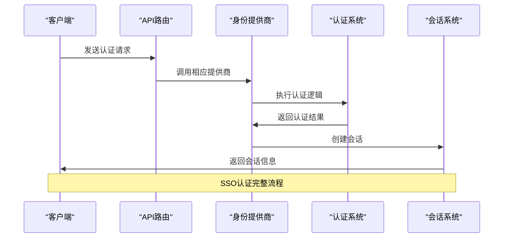
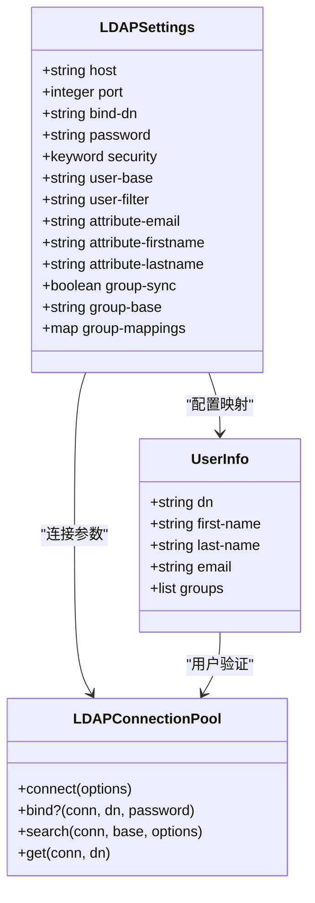
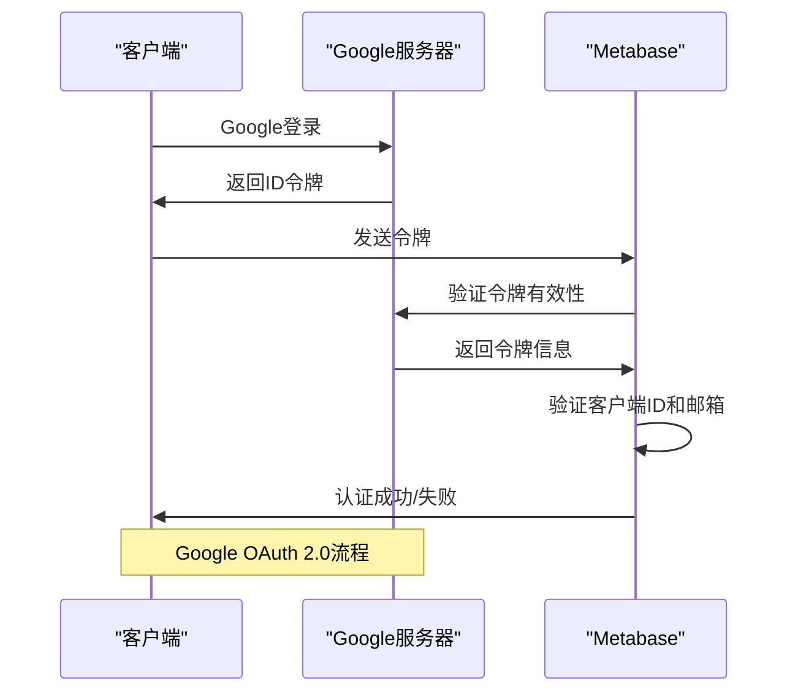
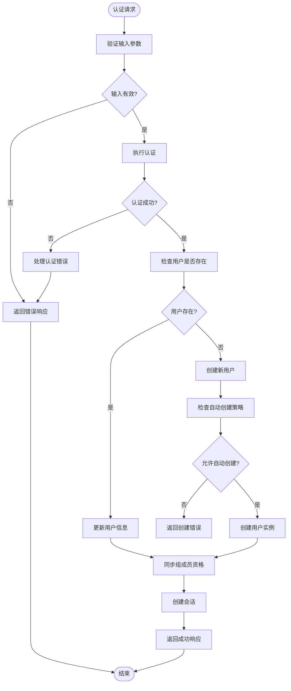

# 单点登录SSO

<cite>
**本文档中引用的文件**  
- [core.clj](file://src/metabase/sso/core.clj)
- [ldap.clj](file://src/metabase/sso/ldap.clj)
- [google.clj](file://src/metabase/sso/google.clj)
- [settings.clj](file://src/metabase/sso/settings.clj)
- [common.clj](file://src/metabase/sso/common.clj)
- [providers/ldap.clj](file://src/metabase/sso/providers/ldap.clj)
- [providers/google.clj](file://src/metabase/sso/providers/google.clj)
- [ldap/default_implementation.clj](file://src/metabase/sso/ldap/default_implementation.clj)
- [api.clj](file://src/metabase/sso/api.clj)
</cite>

## 目录
1. [简介](#简介)
2. [核心流程分析](#核心流程分析)
3. [LDAP实现详解](#ldap实现详解)
4. [Google身份提供商实现](#google身份提供商实现)
5. [配置参数说明](#配置参数说明)
6. [启用步骤与调试技巧](#启用步骤与调试技巧)
7. [常见错误与解决方案](#常见错误与解决方案)
8. [用户会话建立过程](#用户会话建立过程)

## 简介
Metabase支持通过单点登录（SSO）集成LDAP和Google身份提供商，实现集中式用户身份验证和管理。本文档详细分析`sso/core.clj`中的核心流程，包括身份验证请求转发、令牌处理和用户同步机制，深入探讨`ldap.clj`和`google.clj`在`providers`目录下的实现差异，并提供详细的配置指南和故障排除方案。

## 核心流程分析

**Diagram sources**
- [core.clj](file://src/metabase/sso/core.clj)
- [api.clj](file://src/metabase/sso/api.clj)

**Section sources**
- [core.clj](file://src/metabase/sso/core.clj#L1-L27)
- [api.clj](file://src/metabase/sso/api.clj#L1-L17)

## LDAP实现详解

**Diagram sources**
- [ldap.clj](file://src/metabase/sso/ldap.clj)
- [ldap/default_implementation.clj](file://src/metabase/sso/ldap/default_implementation.clj)

**Section sources**
- [ldap.clj](file://src/metabase/sso/ldap.clj#L1-L222)
- [ldap/default_implementation.clj](file://src/metabase/sso/ldap/default_implementation.clj#L1-L150)

## Google身份提供商实现

**Diagram sources**
- [google.clj](file://src/metabase/sso/google.clj)
- [providers/google.clj](file://src/metabase/sso/providers/google.clj)

**Section sources**
- [google.clj](file://src/metabase/sso/google.clj#L1-L53)
- [providers/google.clj](file://src/metabase/sso/providers/google.clj#L1-L72)

## 配置参数说明

### LDAP配置参数

| 参数 | 描述 | 默认值 | 注意事项 |
|------|------|--------|--------|
| ldap-host | LDAP服务器主机名 | 无 | 不要包含'ldap://'或'ldaps://'前缀 |
| ldap-port | 服务器端口 | 389 | SSL使用636 |
| ldap-security | 安全协议 | none | 可选: none, ssl, starttls |
| ldap-bind-dn | 绑定DN | 无 | 用于查找其他用户信息的用户 |
| ldap-password | 绑定密码 | 无 | 敏感信息，加密存储 |
| ldap-user-base | 用户搜索基础 | 无 | 将递归搜索 |
| ldap-user-filter | 用户查找过滤器 | (&(objectClass=inetOrgPerson)(|(uid={login})(mail={login}))) | {login}占位符将被替换 |
| ldap-attribute-email | 邮箱属性 | mail | 通常为'mail', 'email'或'userPrincipalName' |
| ldap-attribute-firstname | 名字属性 | givenName | 通常为'givenName' |
| ldap-attribute-lastname | 姓氏属性 | sn | 通常为'sn' |
| ldap-group-sync | 启用组同步 | false | 同步LDAP组到Metabase |
| ldap-group-base | 组搜索基础 | 无 | Active Directory等提供'memberOf'覆盖的目录不需要 |
| ldap-group-mappings | LDAP到Metabase组映射 | {} | JSON格式: {"cn=组,dc=...": [1, 2, 3]} |

### Google OAuth 2.0配置参数

| 参数 | 描述 | 注意事项 |
|------|------|--------|
| google-auth-client-id | Google登录客户端ID | 必须以".apps.googleusercontent.com"结尾 |
| google-auth-auto-create-accounts-domain | 允许自动创建账户的域名 | 多个域名用逗号分隔，需要企业版功能 |

**Section sources**
- [settings.clj](file://src/metabase/sso/settings.clj#L1-L228)

## 启用步骤与调试技巧

### LDAP启用步骤
1. 在管理界面配置LDAP服务器参数
2. 测试LDAP连接确保配置正确
3. 启用LDAP认证
4. 配置组映射（可选）
5. 测试用户登录

### Google SSO启用步骤
1. 在Google Cloud Console创建OAuth 2.0客户端ID
2. 将客户端ID配置到Metabase
3. 启用Google登录
4. 配置自动创建账户的域名（可选）
5. 测试Google登录

### 调试技巧
- 启用详细日志记录以查看认证过程
- 使用`test-ldap-connection`函数测试LDAP连接
- 检查服务器时间和时区设置，避免证书验证问题
- 验证属性映射是否正确
- 检查网络连接和防火墙设置

**Section sources**
- [ldap.clj](file://src/metabase/sso/ldap.clj#L120-L222)
- [settings.clj](file://src/metabase/sso/settings.clj#L100-L162)

## 常见错误与解决方案

### 证书问题
- **问题**: SSL/TLS证书验证失败
- **解决方案**: 
  - 确保服务器时间正确
  - 检查证书是否过期
  - 验证证书链完整性
  - 考虑使用受信任的CA签发的证书

### 属性映射失败
- **问题**: 用户属性无法正确映射
- **解决方案**:
  - 验证LDAP属性名称拼写
  - 检查属性在LDAP目录中是否存在
  - 确认属性值格式符合预期
  - 使用LDAP浏览器工具验证属性值

### 连接问题
- **问题**: 无法连接到LDAP服务器
- **解决方案**:
  - 验证主机名和端口
  - 检查网络连接和防火墙
  - 确认安全协议设置正确
  - 验证绑定DN和密码

### 组同步问题
- **问题**: 用户组无法正确同步
- **解决方案**:
  - 验证组基础DN设置
  - 检查组映射配置
  - 确认用户在LDAP中的memberOf属性
  - 验证Metabase组ID正确性

**Section sources**
- [ldap.clj](file://src/metabase/sso/ldap.clj#L188-L220)
- [settings.clj](file://src/metabase/sso/settings.clj#L132-L162)

## 用户会话建立过程

**Diagram sources**
- [providers/ldap.clj](file://src/metabase/sso/providers/ldap.clj)
- [providers/google.clj](file://src/metabase/sso/providers/google.clj)
- [common.clj](file://src/metabase/sso/common.clj)

**Section sources**
- [providers/ldap.clj](file://src/metabase/sso/providers/ldap.clj#L1-L104)
- [providers/google.clj](file://src/metabase/sso/providers/google.clj#L1-L72)
- [common.clj](file://src/metabase/sso/common.clj#L1-L66)