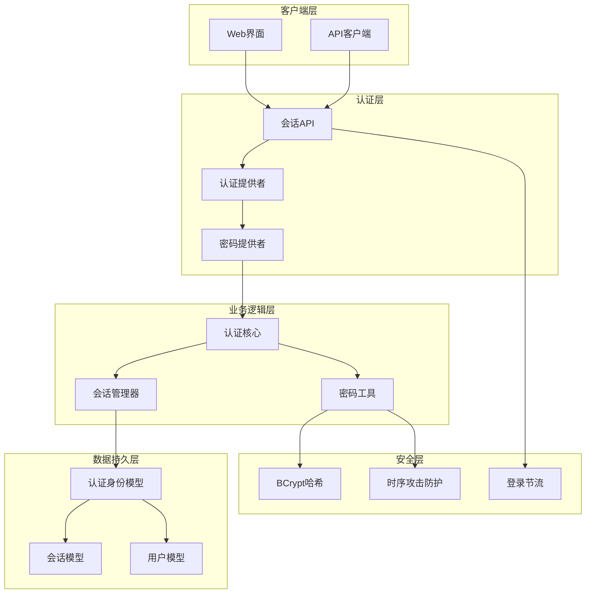
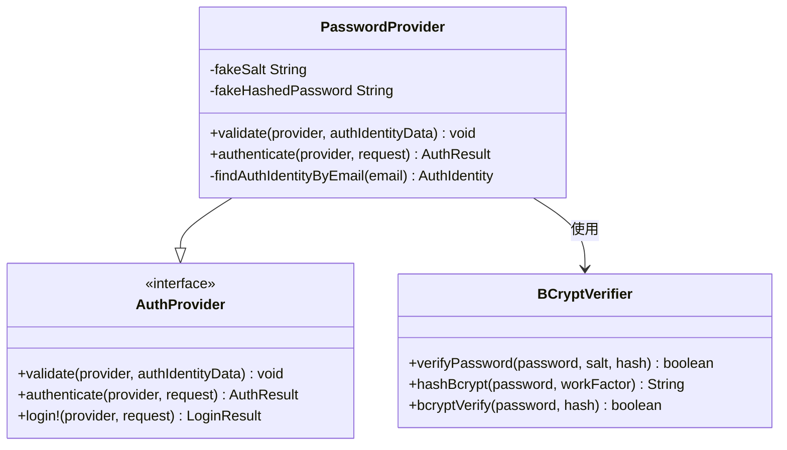
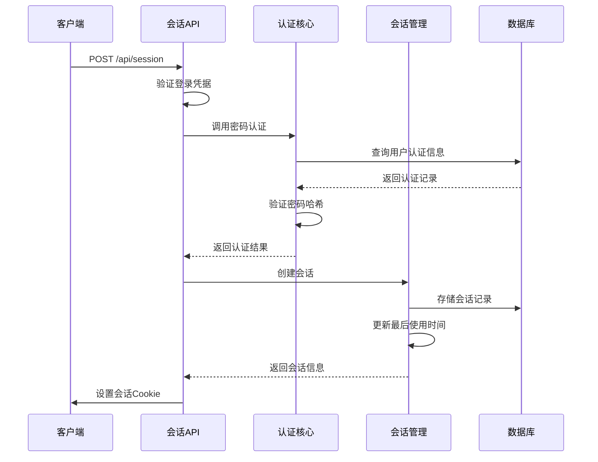
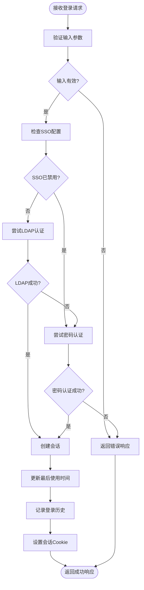
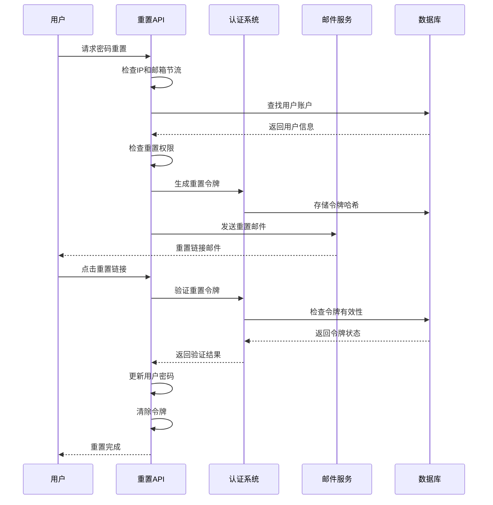

# 本地密码认证

<cite>
**本文档中引用的文件**
- [password.clj](file://src/metabase/auth_identity/providers/password.clj)
- [session/api.clj](file://src/metabase/session/api.clj)
- [auth_identity.clj](file://src/metabase/auth_identity/models/auth_identity.clj)
- [session.clj](file://src/metabase/auth_identity/session.clj)
- [password.clj](file://src/metabase/util/password.clj)
- [core.clj](file://src/metabase/auth_identity/core.clj)
- [provider.clj](file://src/metabase/auth_identity/provider.clj)
- [session.clj](file://src/metabase/session/models/session.clj)
- [settings.clj](file://src/metabase/session/settings.clj)
- [settings.clj](file://src/metabase/request/settings.clj)
</cite>

## 目录
1. [简介](#简介)
2. [系统架构概览](#系统架构概览)
3. [密码认证提供者实现](#密码认证提供者实现)
4. [密码哈希与验证机制](#密码哈希与验证机制)
5. [会话管理系统](#会话管理系统)
6. [配置选项详解](#配置选项详解)
7. [认证流程分析](#认证流程分析)
8. [安全策略与防护措施](#安全策略与防护措施)
9. [常见问题与故障排除](#常见问题与故障排除)
10. [最佳实践建议](#最佳实践建议)

## 简介

Metabase的本地密码认证机制是一个基于用户名（邮箱）和密码的安全认证系统，采用业界标准的BCrypt算法进行密码哈希存储，并实现了多层次的安全防护措施。该系统通过`auth_identity`模块提供核心认证功能，支持密码复杂度验证、会话管理、密码重置等功能。

## 系统架构概览

本地密码认证系统采用分层架构设计，主要包含以下核心组件：



**图表来源**
- [session/api.clj](file://src/metabase/session/api.clj#L1-L50)
- [password.clj](file://src/metabase/auth_identity/providers/password.clj#L1-L30)
- [auth_identity.clj](file://src/metabase/auth_identity/models/auth_identity.clj#L1-L40)

## 密码认证提供者实现

### 提供者注册与初始化

密码认证提供者通过继承认证提供者基类来实现，系统在启动时自动注册提供者类型：



**图表来源**
- [password.clj](file://src/metabase/auth_identity/providers/password.clj#L15-L30)
- [provider.clj](file://src/metabase/auth_identity/provider.clj#L80-L120)

### 认证验证流程

密码认证的核心验证逻辑包含以下关键步骤：

1. **输入参数验证**：检查邮箱和密码是否为空
2. **用户查找**：根据邮箱地址查询认证身份记录
3. **密码验证**：使用BCrypt算法验证密码哈希
4. **时序攻击防护**：即使用户不存在也执行哈希验证

**章节来源**
- [password.clj](file://src/metabase/auth_identity/providers/password.clj#L60-L92)

## 密码哈希与验证机制

### BCrypt哈希算法

Metabase使用BCrypt算法进行密码哈希存储，具有以下特点：

- **工作因子可配置**：默认为10，在测试环境中降为4以提高性能
- **自动盐值生成**：每次哈希都生成新的随机盐值
- **不可逆性**：确保即使数据库泄露也无法直接获取明文密码

### 密码复杂度验证

系统提供多级密码复杂度要求：

| 复杂度级别 | 最小长度 | 字母要求 | 数字要求 | 特殊字符要求 |
|-----------|---------|---------|---------|-------------|
| 弱 | 6 | 无 | 无 | 无 |
| 标准 | 6 | 无 | ≥1 | 无 |
| 强 | 8 | ≥2 | ≥2 | ≥1 |

### 常见密码检测

系统内置了12,000个常见密码的黑名单，防止用户使用过于简单的密码。

**章节来源**
- [password.clj](file://src/metabase/util/password.clj#L90-L122)
- [password.clj](file://src/metabase/util/password.clj#L29-L62)

## 会话管理系统

### 会话创建流程



**图表来源**
- [session/api.clj](file://src/metabase/session/api.clj#L100-L130)
- [session.clj](file://src/metabase/auth_identity/session.clj#L15-L40)

### 会话超时机制

会话超时配置支持多种时间单位和灵活的时间范围设置：

- **配置格式**：JSON对象包含`amount`和`unit`字段
- **支持单位**：秒、分钟、小时
- **最大限制**：不超过100年
- **默认行为**：无限期会话（如果未配置）

**章节来源**
- [settings.clj](file://src/metabase/request/settings.clj#L65-L112)

## 配置选项详解

### 密码登录启用控制

`enable-password-login`配置项控制是否允许通过邮箱和密码登录：

```clojure
(defsetting enable-password-login
  "Allow logging in by email and password."
  :visibility :public
  :type       :boolean
  :default    true
  :feature    :disable-password-login
  :audit      :raw-value
  :getter     (fn []
                ;; 如果启用了SSO且显式设置了值，则使用该值
                ;; 否则始终返回true
                (let [v (setting/get-value-of-type :boolean :enable-password-login)]
                  (if (and (some? v)
                           (sso/sso-enabled?))
                    v
                    true))))
```

### 密码复杂度配置

密码复杂度通过`password-complexity`设置动态计算：

- **弱级别**：仅要求最小长度6字符
- **标准级别**：要求至少1位数字
- **强级别**：要求字母、数字、特殊字符各至少2位

### 会话Cookie设置

`session-cookies`配置强制所有用户使用会话Cookie，浏览器关闭时自动过期。

### 密码重置令牌有效期

`reset-token-ttl-hours`定义密码重置令牌的有效期，默认为48小时。

**章节来源**
- [settings.clj](file://src/metabase/session/settings.clj#L8-L44)

## 认证流程分析

### 登录请求处理流程



**图表来源**
- [session/api.clj](file://src/metabase/session/api.clj#L91-L126)

### 密码重置流程



**图表来源**
- [session/api.clj](file://src/metabase/session/api.clj#L180-L243)

## 安全策略与防护措施

### 时序攻击防护

系统实现了多项时序攻击防护措施：

1. **虚假凭据验证**：当用户不存在时，仍然执行BCrypt验证
2. **固定时间比较**：使用安全的字符串比较函数
3. **异常处理**：捕获并处理所有可能的异常情况

### 登录节流机制

系统对登录尝试实施双重节流保护：

- **IP地址限制**：单IP最多50次尝试
- **用户名限制**：单用户名最多5次失败尝试
- **可配置禁用**：通过`mb-disable-session-throttle`禁用节流

### 密码重置安全

密码重置功能包含以下安全特性：

- **令牌格式**：`USER-ID_RANDOM-UUID`格式，便于用户识别但保持安全性
- **时效性**：默认48小时有效期
- **一次性使用**：令牌消费后立即失效
- **用户隔离**：每个用户的重置令牌独立存储

**章节来源**
- [password.clj](file://src/metabase/auth_identity/providers/password.clj#L25-L30)
- [session/api.clj](file://src/metabase/session/api.clj#L25-L35)

## 常见问题与故障排除

### 登录失败问题

#### 问题1：密码不匹配错误
**症状**：收到"Password did not match stored password"错误
**原因**：
- 输入密码错误
- 密码复杂度要求不满足
- 数据库密码字段损坏

**解决方案**：
1. 检查密码拼写和大小写
2. 验证密码复杂度要求
3. 重新设置密码

#### 问题2：用户不存在错误
**症状**：收到"No user found with that email address"错误
**原因**：
- 邮箱地址错误
- 用户账户被删除或禁用
- 数据库同步问题

**解决方案**：
1. 确认邮箱地址正确性
2. 检查用户账户状态
3. 验证数据库连接

### 密码重置问题

#### 问题1：重置邮件未发送
**症状**：请求密码重置后未收到邮件
**原因**：
- SMTP配置错误
- 邮件服务器限制
- 用户账户状态异常

**解决方案**：
1. 检查SMTP服务器配置
2. 验证邮件发送权限
3. 确认用户账户可用性

#### 问题2：重置令牌无效
**症状**：点击重置链接后提示令牌无效
**原因**：
- 令牌已过期
- 令牌已被消费
- 令牌格式错误

**解决方案**：
1. 重新发起密码重置请求
2. 检查令牌有效期设置
3. 验证令牌生成逻辑

### 性能问题

#### 问题1：登录响应缓慢
**症状**：登录过程耗时较长
**原因**：
- BCrypt工作因子过高
- 数据库查询性能问题
- 网络延迟

**解决方案**：
1. 优化数据库索引
2. 调整BCrypt工作因子
3. 检查网络连接质量

**章节来源**
- [password.clj](file://src/metabase/auth_identity/providers/password.clj#L75-L92)
- [session/api.clj](file://src/metabase/session/api.clj#L180-L210)

## 最佳实践建议

### 密码策略配置

1. **推荐复杂度**：建议使用"strong"级别密码复杂度
2. **最小长度**：设置至少8字符的最小长度要求
3. **定期审查**：定期检查密码策略的有效性

### 安全配置建议

1. **启用会话Cookie**：强制使用会话Cookie提高安全性
2. **合理设置超时**：根据业务需求设置合适的会话超时时间
3. **监控登录活动**：启用登录历史记录功能

### 运维管理建议

1. **定期备份**：确保认证数据的定期备份
2. **监控告警**：设置登录失败率的监控告警
3. **审计日志**：启用详细的认证操作审计日志

### 开发集成建议

1. **错误处理**：妥善处理认证失败的各种错误情况
2. **用户体验**：提供清晰的错误提示信息
3. **兼容性**：确保与现有系统的兼容性

通过遵循这些最佳实践，可以构建一个安全、可靠且易于维护的本地密码认证系统。