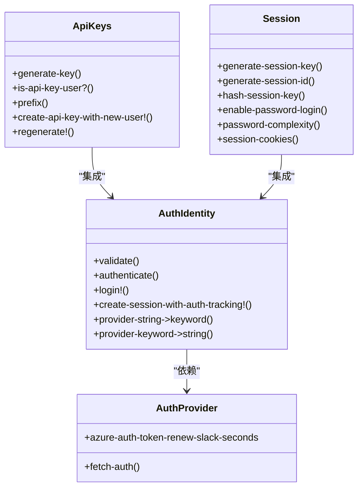
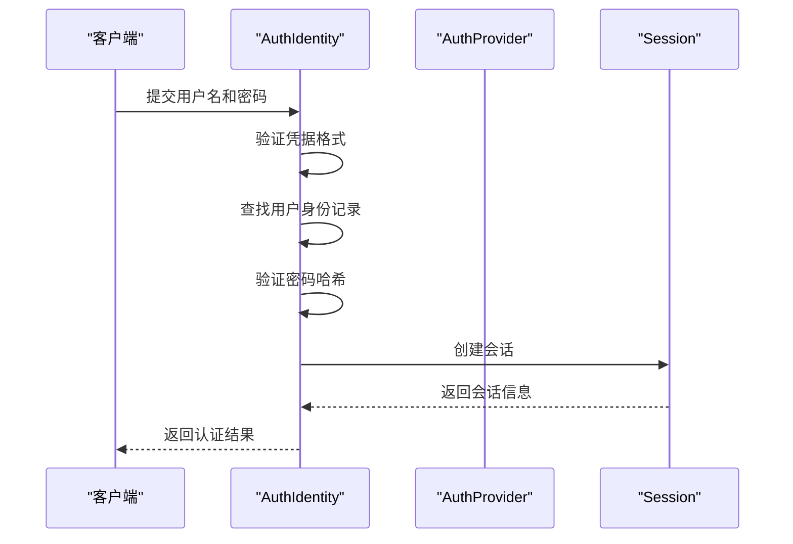
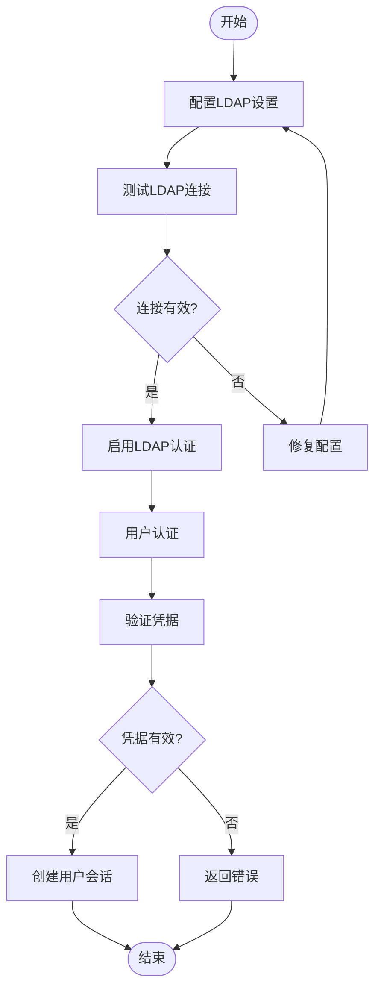
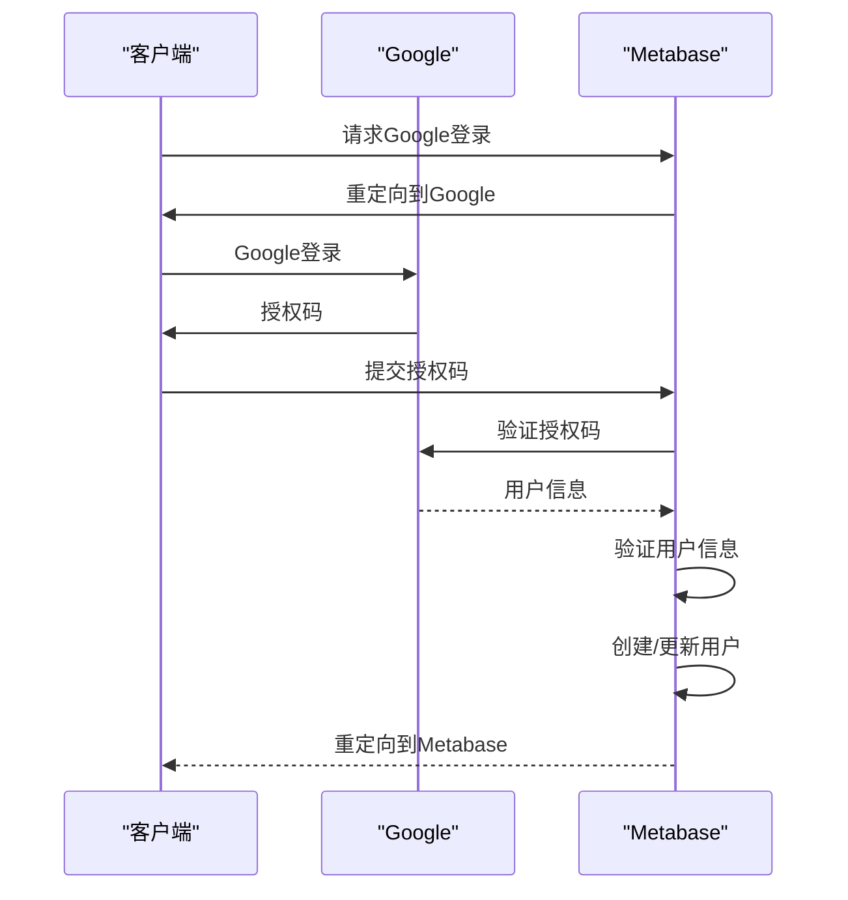
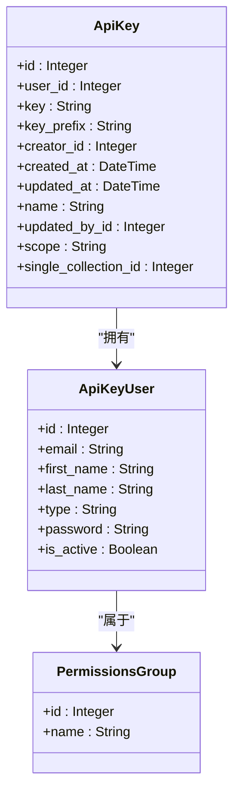
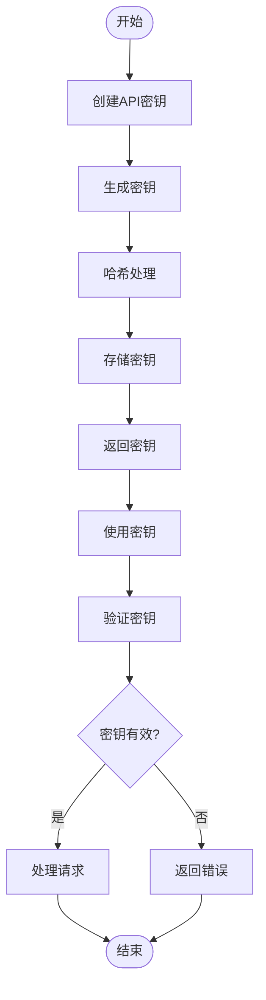
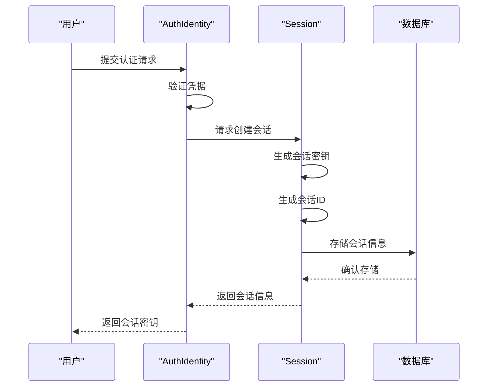
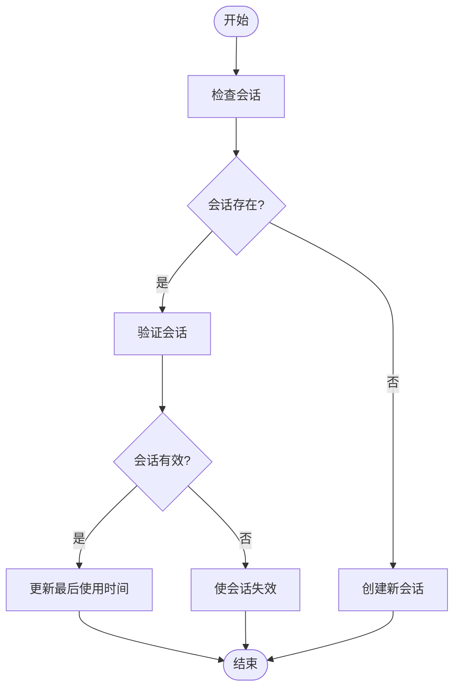

# 认证与授权

<cite>
**本文档引用的文件**
- [auth_provider/core.clj](file://src/metabase/auth_provider/core.clj)
- [auth_provider/impl.clj](file://src/metabase/auth_provider/impl.clj)
- [auth_identity/core.clj](file://src/metabase/auth_identity/core.clj)
- [auth_identity/provider.clj](file://src/metabase/auth_identity/provider.clj)
- [auth_identity/models/auth_identity.clj](file://src/metabase/auth_identity/models/auth_identity.clj)
- [auth_identity/session.clj](file://src/metabase/auth_identity/session.clj)
- [auth_identity/providers/password.clj](file://src/metabase/auth_identity/providers/password.clj)
- [sso/core.clj](file://src/metabase/sso/core.clj)
- [sso/ldap.clj](file://src/metabase/sso/ldap.clj)
- [sso/google.clj](file://src/metabase/sso/google.clj)
- [sso/settings.clj](file://src/metabase/sso/settings.clj)
- [api_keys/core.clj](file://src/metabase/api_keys/core.clj)
- [api_keys/models/api_key.clj](file://src/metabase/api_keys/models/api_key.clj)
- [api_keys/schema.clj](file://src/metabase/api_keys/schema.clj)
- [session/core.clj](file://src/metabase/session/core.clj)
- [session/models/session.clj](file://src/metabase/session/models/session.clj)
- [users/models/user.clj](file://src/metabase/users/models/user.clj)
</cite>

## 目录
1. [简介](#简介)
2. [认证机制架构](#认证机制架构)
3. [本地密码认证](#本地密码认证)
4. [单点登录认证](#单点登录认证)
5. [API密钥认证](#api密钥认证)
6. [会话管理](#会话管理)
7. [配置指南](#配置指南)
8. [最佳实践](#最佳实践)
9. [常见问题](#常见问题)
10. [结论](#结论)

## 简介
Metabase提供了一套灵活的认证与授权系统，支持多种身份验证方式，包括本地密码登录、单点登录（SSO）和API密钥认证。本文档详细解释了`auth_provider`和`auth_identity`模块如何实现这些认证方式，以及`api_keys`模块的实现原理和安全策略。

**Section sources**
- [auth_provider/core.clj](file://src/metabase/auth_provider/core.clj)
- [auth_identity/core.clj](file://src/metabase/auth_identity/core.clj)

## 认证机制架构
Metabase的认证系统基于模块化设计，主要由`auth_provider`、`auth_identity`和`api_keys`三个核心模块组成。这些模块通过多方法（multimethod）系统实现了灵活的认证流程。

**Diagram sources**
- [auth_provider/core.clj](file://src/metabase/auth_provider/core.clj)
- [auth_identity/core.clj](file://src/metabase/auth_identity/core.clj)
- [api_keys/core.clj](file://src/metabase/api_keys/core.clj)
- [session/core.clj](file://src/metabase/session/core.clj)

**Section sources**
- [auth_provider/core.clj](file://src/metabase/auth_provider/core.clj)
- [auth_identity/core.clj](file://src/metabase/auth_identity/core.clj)
- [api_keys/core.clj](file://src/metabase/api_keys/core.clj)

## 本地密码认证
本地密码认证是Metabase最基本的认证方式，通过`auth_identity`模块中的密码提供者实现。该模块使用bcrypt算法对密码进行哈希处理，确保用户凭证的安全存储。

**Diagram sources**
- [auth_identity/providers/password.clj](file://src/metabase/auth_identity/providers/password.clj)
- [auth_identity/provider.clj](file://src/metabase/auth_identity/provider.clj)
- [auth_identity/session.clj](file://src/metabase/auth_identity/session.clj)

**Section sources**
- [auth_identity/providers/password.clj](file://src/metabase/auth_identity/providers/password.clj)
- [auth_identity/models/auth_identity.clj](file://src/metabase/auth_identity/models/auth_identity.clj)

## 单点登录认证
Metabase支持多种单点登录（SSO）认证方式，包括LDAP和Google认证。这些认证方式通过SSO模块实现，提供了企业级的身份验证功能。

### LDAP认证
LDAP认证允许Metabase与企业目录服务集成，实现统一的身份管理。配置包括服务器主机、端口、安全设置和用户搜索基础等。

**Diagram sources**
- [sso/ldap.clj](file://src/metabase/sso/ldap.clj)
- [sso/settings.clj](file://src/metabase/sso/settings.clj)

### Google认证
Google认证通过OAuth 2.0协议实现，允许用户使用Google账户登录Metabase。该认证方式需要配置Google客户端ID，并支持自动创建用户功能。

**Diagram sources**
- [sso/google.clj](file://src/metabase/sso/google.clj)
- [sso/settings.clj](file://src/metabase/sso/settings.clj)

**Section sources**
- [sso/ldap.clj](file://src/metabase/sso/ldap.clj)
- [sso/google.clj](file://src/metabase/sso/google.clj)
- [sso/settings.clj](file://src/metabase/sso/settings.clj)

## API密钥认证
API密钥认证为程序化访问提供了安全的认证方式。`api_keys`模块实现了API密钥的生成、管理和验证功能。

### API密钥模型
API密钥模型定义了密钥的结构和行为，包括密钥生成、哈希处理和权限管理。

**Diagram sources**
- [api_keys/models/api_key.clj](file://src/metabase/api_keys/models/api_key.clj)
- [users/models/user.clj](file://src/metabase/users/models/user.clj)

### API密钥生命周期
API密钥的生命周期包括创建、使用、更新和删除等阶段，每个阶段都有相应的安全策略。

**Diagram sources**
- [api_keys/models/api_key.clj](file://src/metabase/api_keys/models/api_key.clj)
- [api_keys/schema.clj](file://src/metabase/api_keys/schema.clj)

**Section sources**
- [api_keys/core.clj](file://src/metabase/api_keys/core.clj)
- [api_keys/models/api_key.clj](file://src/metabase/api_keys/models/api_key.clj)
- [api_keys/schema.clj](file://src/metabase/api_keys/schema.clj)

## 会话管理
会话管理是认证系统的重要组成部分，负责维护用户登录状态和会话安全。

### 会话创建流程
会话创建流程确保用户认证成功后能够获得有效的会话标识。

**Diagram sources**
- [auth_identity/session.clj](file://src/metabase/auth_identity/session.clj)
- [session/models/session.clj](file://src/metabase/session/models/session.clj)

### 会话安全策略
会话安全策略包括会话超时、会话密钥哈希和会话清理等机制。

**Diagram sources**
- [session/core.clj](file://src/metabase/session/core.clj)
- [session/models/session.clj](file://src/metabase/session/models/session.clj)

**Section sources**
- [auth_identity/session.clj](file://src/metabase/auth_identity/session.clj)
- [session/core.clj](file://src/metabase/session/core.clj)
- [session/models/session.clj](file://src/metabase/session/models/session.clj)

## 配置指南
本节提供各种认证方式的配置步骤和最佳实践。

### 本地密码认证配置
本地密码认证是默认启用的，无需额外配置。可以通过设置密码复杂度要求来增强安全性。

**Section sources**
- [session/core.clj](file://src/metabase/session/core.clj)

### LDAP认证配置
LDAP认证需要配置以下参数：
- LDAP服务器主机和端口
- 绑定DN和密码
- 用户搜索基础和过滤器
- 属性映射（邮箱、姓名等）
- 组同步设置

**Section sources**
- [sso/settings.clj](file://src/metabase/sso/settings.clj)

### Google认证配置
Google认证需要配置以下参数：
- Google客户端ID
- 自动创建账户的域名
- 启用/禁用Google认证

**Section sources**
- [sso/settings.clj](file://src/metabase/sso/settings.clj)

### API密钥配置
API密钥可以通过API或管理界面创建，需要指定密钥名称和权限组。

**Section sources**
- [api_keys/models/api_key.clj](file://src/metabase/api_keys/models/api_key.clj)

## 最佳实践
本节提供认证与授权系统的最佳实践建议。

### 安全性最佳实践
- 定期轮换API密钥
- 启用多因素认证
- 限制会话超时时间
- 监控认证日志

### 性能最佳实践
- 使用连接池优化LDAP查询
- 缓存频繁访问的用户信息
- 优化会话存储性能

**Section sources**
- [api_keys/models/api_key.clj](file://src/metabase/api_keys/models/api_key.clj)
- [sso/ldap.clj](file://src/metabase/sso/ldap.clj)

## 常见问题
本节解答认证与授权系统中的常见问题。

### 认证失败问题
- 检查凭据是否正确
- 验证LDAP服务器连接
- 确认Google客户端ID配置

### 会话管理问题
- 检查会话超时设置
- 验证会话存储配置
- 监控会话清理任务

**Section sources**
- [auth_identity/provider.clj](file://src/metabase/auth_identity/provider.clj)
- [sso/ldap.clj](file://src/metabase/sso/ldap.clj)
- [sso/google.clj](file://src/metabase/sso/google.clj)

## 结论
Metabase的认证与授权系统提供了灵活、安全的身份验证机制，支持多种认证方式和精细的权限管理。通过合理配置和遵循最佳实践，可以确保系统的安全性和可用性。