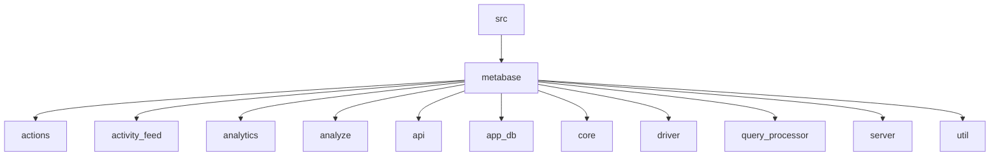
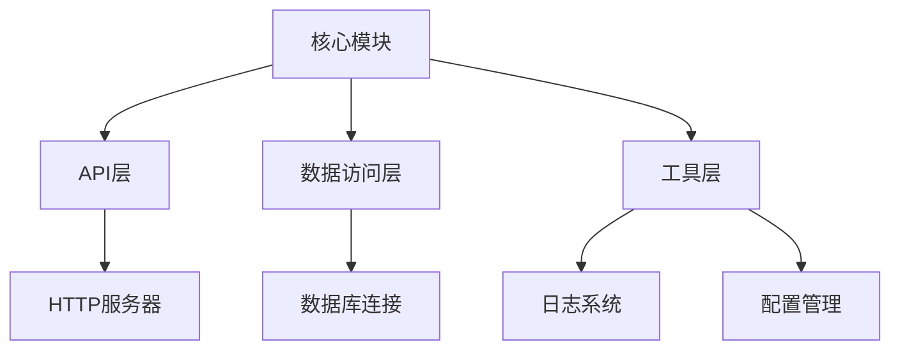
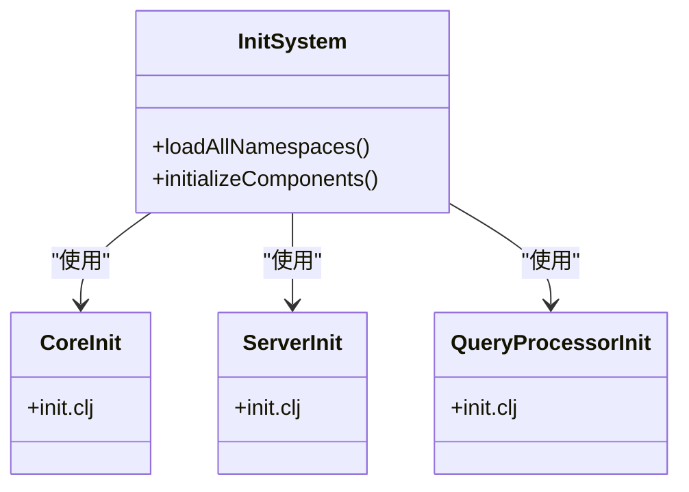
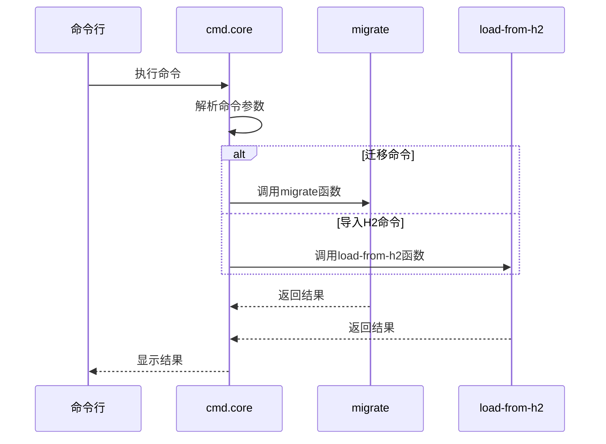
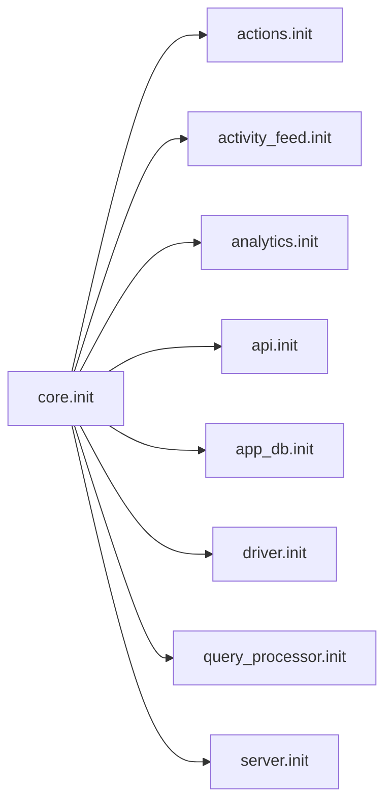

# 开发者指南

<cite>
**本文档中引用的文件**  
- [README.md](file://README.md)
- [core/init.clj](file://src/metabase/core/init.clj)
- [cmd/core.clj](file://src/metabase/cmd/core.clj)
- [server/init.clj](file://src/metabase/server/init.clj)
- [query_processor/init.clj](file://src/metabase/query_processor/init.clj)
- [util/log.clj](file://src/metabase/util/log.clj)
</cite>

## 目录
1. [简介](#简介)
2. [项目结构](#项目结构)
3. [核心组件](#核心组件)
4. [架构概述](#架构概述)
5. [详细组件分析](#详细组件分析)
6. [依赖分析](#依赖分析)
7. [性能考虑](#性能考虑)
8. [故障排除指南](#故障排除指南)
9. [结论](#结论)

## 简介
本文档旨在为Metabase项目的新开发者提供全面的指导。文档详细解读了代码库的结构，帮助开发者快速理解项目的组织方式。同时，文档说明了贡献流程、测试策略、调试技巧、构建打包流程以及性能分析方法，为希望参与项目开发的贡献者提供全面的支持。

## 项目结构

Metabase项目采用Clojure语言开发，其代码库结构遵循模块化设计原则。项目根目录包含README.md文件和src目录，src目录下是主要的源代码。

**图示来源**
- [README.md](file://README.md)

**本节来源**
- [README.md](file://README.md)

## 核心组件

Metabase的核心组件包括初始化系统、命令行工具、服务器模块和查询处理器。这些组件共同构成了Metabase的基础架构。

**本节来源**
- [core/init.clj](file://src/metabase/core/init.clj)
- [cmd/core.clj](file://src/metabase/cmd/core.clj)

## 架构概述

Metabase采用分层架构设计，主要包括核心模块、API层、数据访问层和工具层。系统通过init.clj文件中的命名空间加载机制实现模块化初始化。

**图示来源**
- [core/init.clj](file://src/metabase/core/init.clj)
- [server/init.clj](file://src/metabase/server/init.clj)

## 详细组件分析

### 初始化系统分析
Metabase的初始化系统负责加载所有需要在系统启动时加载的命名空间。这些命名空间遵循metabase.<module-name>.init的命名模式。

**图示来源**
- [core/init.clj](file://src/metabase/core/init.clj)

**本节来源**
- [core/init.clj](file://src/metabase/core/init.clj)

### 命令行工具分析
Metabase提供了丰富的命令行工具，支持数据库迁移、数据导入导出、密码重置等功能。这些命令通过^:command元数据标记来识别。

**图示来源**
- [cmd/core.clj](file://src/metabase/cmd/core.clj)

**本节来源**
- [cmd/core.clj](file://src/metabase/cmd/core.clj)

## 依赖分析

Metabase的模块间依赖关系通过命名空间的require机制实现。核心模块依赖于各个功能模块的初始化文件。

**图示来源**
- [core/init.clj](file://src/metabase/core/init.clj)

**本节来源**
- [core/init.clj](file://src/metabase/core/init.clj)

## 性能考虑

Metabase在设计时考虑了性能优化，包括数据库连接池、查询缓存和异步处理等机制。日志系统提供了性能监控功能，可以跟踪请求处理时间和数据库调用次数。

**本节来源**
- [util/log.clj](file://src/metabase/util/log.clj)

## 故障排除指南

当遇到问题时，建议首先检查日志输出。Metabase的日志系统提供了详细的调试信息，包括请求处理过程、数据库操作和错误堆栈。

**本节来源**
- [util/log.clj](file://src/metabase/util/log.clj)

## 结论

Metabase是一个结构清晰、模块化的数据分析平台。通过理解其代码库结构和核心组件，开发者可以快速上手并为项目做出贡献。建议新开发者从阅读核心模块的初始化代码开始，逐步深入了解各个功能模块的实现细节。