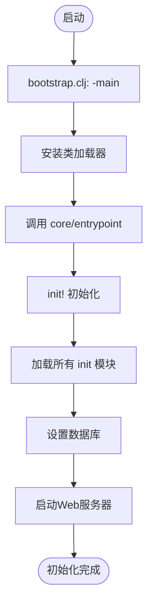
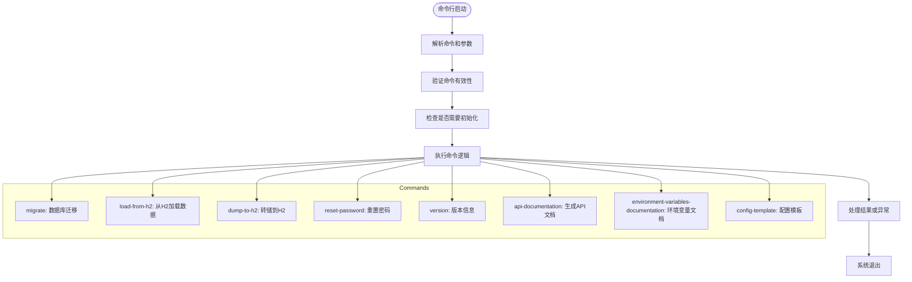

# 开发者设置指南

<cite>
**本文档中引用的文件**   
- [README.md](file://README.md)
- [bootstrap.clj](file://src/metabase/core/bootstrap.clj)
- [init.clj](file://src/metabase/core/init.clj)
- [core.clj](file://src/metabase/core/core.clj)
- [core.clj](file://src/metabase/cmd/core.clj)
- [config.clj](file://src/metabase/config/core.clj)
- [common.clj](file://src/metabase/cmd/common.clj)
</cite>

## 目录
1. [环境准备](#环境准备)
2. [项目克隆与构建](#项目克隆与构建)
3. [开发模式初始化](#开发模式初始化)
4. [开发服务器运行](#开发服务器运行)
5. [命令行工具使用](#命令行工具使用)
6. [测试执行](#测试执行)
7. [调试技巧与问题解决](#调试技巧与问题解决)

## 环境准备

在开始Metabase开发之前，需要正确配置开发环境。首先确保安装了Java Development Kit (JDK) 8或更高版本，这是运行Clojure应用程序的基础。Metabase使用Leiningen作为构建工具，因此需要安装Leiningen来管理项目依赖和构建过程。安装完成后，可以通过命令行验证JDK和Leiningen的安装情况，确保它们能够正常工作。此外，根据项目需求，可能还需要安装其他数据库系统如MySQL或PostgreSQL，以便进行数据迁移和测试。

**Section sources**
- [config.clj](file://src/metabase/config/core.clj#L1-L234)

## 项目克隆与构建

要开始开发，首先需要从版本控制系统中克隆Metabase源代码仓库。克隆完成后，进入项目根目录并使用Leiningen命令构建项目。构建过程会下载所有必要的依赖项，并编译源代码。对于Metabase项目，通常使用`lein deps`命令来获取依赖，然后使用`lein compile`来编译代码。构建成功后，可以运行简单的测试来验证环境配置是否正确。

**Section sources**
- [README.md](file://README.md#L1-L3)

## 开发模式初始化

Metabase的开发模式初始化主要通过`core/init.clj`和`bootstrap.clj`两个文件完成。`core/init.clj`文件负责加载所有需要在系统启动时加载的命名空间，这些命名空间遵循`metabase.<module-name>.init`的命名模式，用于执行初始化任务。`bootstrap.clj`文件则作为应用程序的主入口点，调用`metabase.core.core/entrypoint`函数启动应用。在开发模式下，这些初始化过程确保了所有模块都能正确加载并准备就绪。

**Diagram sources **
- [bootstrap.clj](file://src/metabase/core/bootstrap.clj#L1-L36)
- [init.clj](file://src/metabase/core/init.clj#L1-L76)
- [core.clj](file://src/metabase/core/core.clj#L1-L280)

**Section sources**
- [bootstrap.clj](file://src/metabase/core/bootstrap.clj#L1-L36)
- [init.clj](file://src/metabase/core/init.clj#L1-L76)

## 开发服务器运行

在开发环境中运行Metabase服务器，可以通过执行特定的命令来启动嵌入式Web服务器。这通常涉及到调用`server/start-web-server!`函数，并传递适当的路由和处理器。开发模式下的服务器配置允许热重载和快速反馈，使得开发者可以迅速看到代码更改的效果。此外，开发服务器还会输出详细的日志信息，帮助开发者诊断问题和优化性能。

**Section sources**
- [core.clj](file://src/metabase/core/core.clj#L235-L267)
- [handler.clj](file://src/metabase/server/handler.clj#L96-L125)

## 命令行工具使用

Metabase提供了丰富的命令行工具，位于`cmd/core.clj`文件中，用于执行各种管理和维护任务。这些命令可以通过Clojure CLI或Metabase JAR文件直接调用。例如，`migrate`命令用于运行数据库迁移，`load-from-h2`和`dump-to-h2`用于在H2数据库和其他数据库之间传输数据。`reset-password`命令可以重置用户的密码，而`version`命令则显示Metabase的版本信息。此外，还有生成API文档、环境变量文档和配置模板的命令，如`api-documentation`、`environment-variables-documentation`和`config-template`。

**Diagram sources **
- [core.clj](file://src/metabase/cmd/core.clj#L1-L317)

**Section sources**
- [core.clj](file://src/metabase/cmd/core.clj#L1-L317)
- [common.clj](file://src/metabase/cmd/common.clj#L1-L37)

## 测试执行

执行测试是确保代码质量和功能正确性的关键步骤。Metabase项目中包含了大量的单元测试和集成测试，覆盖了核心功能和各个模块。开发者可以使用Leiningen的测试命令来运行这些测试，例如`lein test`。为了提高测试效率，建议在开发过程中频繁运行相关测试，特别是在修改代码后。此外，还可以利用特定的测试配置和环境变量来定制测试行为，比如启用或禁用某些测试套件。

**Section sources**
- [config.clj](file://src/metabase/config/core.clj#L1-L234)
- [testing_api.clj](file://src/metabase/testing_api/core.clj#L1-L9)

## 调试技巧与问题解决

在开发过程中遇到问题时，有效的调试技巧可以帮助快速定位和解决问题。Metabase的日志系统提供了丰富的日志信息，可以通过设置不同的日志级别来获取更详细的输出。此外，使用IDE的调试功能，如断点和变量观察，也是常用的调试方法。对于常见的环境问题，如依赖缺失或配置错误，应检查项目的依赖管理和配置文件，确保所有设置都正确无误。如果遇到难以解决的问题，查阅官方文档或社区论坛往往能找到解决方案。

**Section sources**
- [log.clj](file://src/metabase/util/log.clj#L90-L122)
- [config.clj](file://src/metabase/config/core.clj#L1-L234)