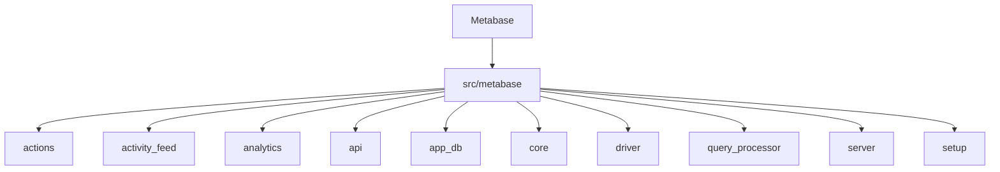
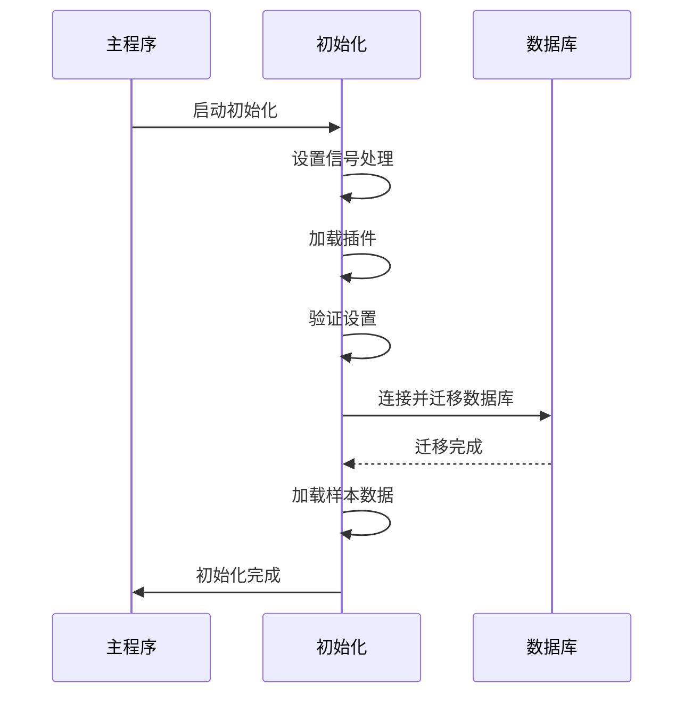
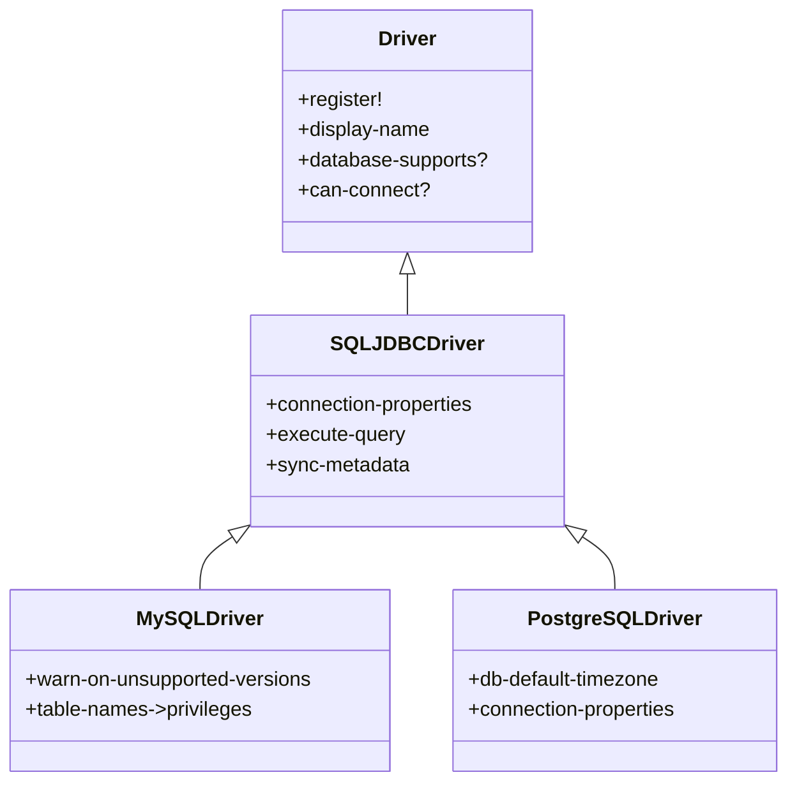

# 快速入门

<cite>
**本文档中引用的文件**  
- [README.md](file://README.md)
- [config-template.yaml](file://src/metabase/cmd/resources/config-template.yaml)
- [init.clj](file://src/metabase/core/init.clj)
- [core.clj](file://src/metabase/core/core.clj)
- [setup.clj](file://src/metabase/app_db/setup.clj)
- [instance.clj](file://src/metabase/server/instance.clj)
- [query_processor.clj](file://src/metabase/query_processor.clj)
- [mysql.clj](file://src/metabase/driver/mysql.clj)
- [postgres.clj](file://src/metabase/driver/postgres.clj)
- [env_var_dox.clj](file://src/metabase/cmd/env_var_dox.clj)
- [config_file_gen.clj](file://src/metabase/cmd/config_file_gen.clj)
</cite>

## 目录
1. [简介](#简介)
2. [项目结构](#项目结构)
3. [安装与环境配置](#安装与环境配置)
4. [初始化设置流程](#初始化设置流程)
5. [启动服务器与访问Web界面](#启动服务器与访问Web界面)
6. [创建数据连接](#创建数据连接)
7. [执行查询与MBQL语言](#执行查询与mbql语言)
8. [看板创建](#看板创建)
9. [关键概念解释](#关键概念解释)
10. [常见问题解决方案](#常见问题解决方案)

## 简介
Metabase是一个开源的数据分析和可视化平台，允许用户通过简单的界面查询和可视化数据库中的数据。本指南将详细介绍如何从零开始搭建Metabase开发环境，包括安装步骤、环境配置要求、初始设置流程以及基本使用示例。我们将深入探讨关键概念如数据库驱动、MBQL查询语言和看板创建，为初学者提供循序渐进的操作指南。

## 项目结构
Metabase的项目结构遵循Clojure的命名空间约定，主要功能模块分布在`src/metabase`目录下。核心组件包括API路由、查询处理器、数据库驱动、服务器实例等。配置文件模板位于`src/metabase/cmd/resources/`目录下，包含示例用户、数据库连接和API密钥的配置。



**Diagram sources**
- [README.md](file://README.md)

## 安装与环境配置
要安装Metabase，首先需要确保系统中已安装Java 8或更高版本。可以通过以下命令检查Java版本：
```bash
java -version
```

Metabase支持通过环境变量或配置文件进行配置。主要的配置选项包括数据库连接信息、服务器端口、加密密钥等。环境变量的命名遵循`MB_`前缀，例如`MB_DB_TYPE`用于指定应用数据库类型。

配置文件模板`config-template.yaml`提供了完整的配置示例，包括用户、数据库和API密钥的设置。该文件位于`src/metabase/cmd/resources/`目录下，可以作为创建自定义配置文件的起点。

**Section sources**
- [config-template.yaml](file://src/metabase/cmd/resources/config-template.yaml)
- [env_var_dox.clj](file://src/metabase/cmd/env_var_dox.clj)

## 初始设置流程
Metabase的初始化流程由`core.clj`文件中的`init!*`函数控制。该函数负责执行一系列启动任务，包括信号处理程序的设置、插件加载、设置验证、数据库迁移和样本数据加载。

数据库迁移是初始化过程中的关键步骤，由`app_db/setup.clj`文件中的`setup-db!`函数处理。该函数验证数据库连接，检查是否需要降级，运行必要的迁移，并检查加密配置。如果启用了自动迁移，系统会自动应用所有待处理的迁移；否则，会打印出需要手动执行的SQL命令。



**Diagram sources**
- [core.clj](file://src/metabase/core/core.clj)
- [setup.clj](file://src/metabase/app_db/setup.clj)

## 启动服务器与访问Web界面
Metabase使用嵌入式Jetty服务器来处理HTTP请求。服务器实例的管理由`server/instance.clj`文件中的函数负责。`start-web-server!`函数用于启动服务器，它创建一个`Server`实例并配置相关的处理程序。

启动服务器的典型流程如下：
1. 创建服务器路由
2. 构建处理程序
3. 启动Web服务器
4. 执行初始化过程
5. 阻塞等待服务器停止

服务器的配置选项（如端口、主机、线程数等）通过环境变量或系统属性进行设置。默认情况下，服务器在端口3000上监听所有接口。


**Diagram sources**
- [core.clj](file://src/metabase/core/core.clj)
- [instance.clj](file://src/metabase/server/instance.clj)

## 创建数据连接
Metabase支持多种数据库驱动，包括MySQL、PostgreSQL、H2等。数据库驱动的实现位于`src/metabase/driver`目录下，每个驱动都有对应的命名空间文件，如`mysql.clj`和`postgres.clj`。

创建数据连接时，需要提供数据库类型、主机、端口、用户名、密码和数据库名称等信息。这些信息可以通过环境变量或配置文件提供。驱动注册通过`driver/register!`宏完成，该宏将驱动与其父驱动关联起来。



**Diagram sources**
- [mysql.clj](file://src/metabase/driver/mysql.clj)
- [postgres.clj](file://src/metabase/driver/postgres.clj)

## 执行查询与MBQL语言
Metabase的查询处理核心位于`query_processor.clj`文件中。查询处理器负责解析、编译和执行MBQL（Metabase Query Language）查询。MBQL是一种领域特定语言，用于描述数据查询操作。

查询处理的主要函数包括：
- `process-query`：查询处理的主要入口点
- `userland-query`：处理用户查询，添加中间件选项
- `userland-query-with-default-constraints`：处理带默认约束的用户查询

查询处理流程包括预处理、编译、执行和后处理四个阶段。预处理阶段对查询进行标准化，编译阶段生成可执行的SQL，执行阶段运行查询，后处理阶段对结果进行格式化。


**Diagram sources**
- [query_processor.clj](file://src/metabase/query_processor.clj)

## 看板创建
看板（Dashboard）是Metabase中用于组织和展示多个查询结果的容器。看板的创建和管理由`dashboards`模块负责，相关代码位于`src/metabase/dashboards`目录下。

一个看板包含多个看板卡片（Dashboard Card），每个卡片对应一个查询结果。看板支持布局自动调整、参数传递和交互式过滤等功能。看板的创建可以通过API或Web界面完成。

## 关键概念解释
### 数据库驱动
数据库驱动是Metabase与不同数据库系统通信的桥梁。每个驱动实现了一组标准化的接口，包括连接管理、查询执行、元数据同步等功能。驱动通过多方法（multimethod）机制实现，允许在运行时根据数据库类型选择合适的实现。

### MBQL查询语言
MBQL（Metabase Query Language）是Metabase的查询语言，用于描述数据查询操作。MBQL查询以Clojure数据结构的形式表示，包含数据库ID、查询类型、数据源表、过滤条件、聚合函数等信息。MBQL的设计目标是简单易用，同时支持复杂的分析需求。

### 看板创建
看板是Metabase中用于组织和展示多个查询结果的容器。看板支持多种布局方式，可以包含不同类型的可视化图表。看板还支持参数化，允许用户通过下拉菜单等控件动态过滤数据。

**Section sources**
- [query_processor.clj](file://src/metabase/query_processor.clj)
- [dashboards](file://src/metabase/dashboards)

## 常见问题解决方案
### 数据库连接问题
如果遇到数据库连接问题，请检查以下几点：
1. 确认数据库服务正在运行
2. 检查连接参数（主机、端口、用户名、密码）是否正确
3. 确认数据库用户具有足够的权限
4. 检查网络连接是否正常

### 迁移问题
如果数据库迁移失败，可以尝试以下解决方案：
1. 检查数据库是否有足够的磁盘空间
2. 确认数据库用户具有DDL权限
3. 检查是否有锁冲突
4. 尝试手动执行迁移SQL

### 性能问题
如果遇到性能问题，可以考虑以下优化措施：
1. 为常用查询创建索引
2. 调整查询缓存设置
3. 优化数据库配置
4. 使用物化视图或汇总表

**Section sources**
- [setup.clj](file://src/metabase/app_db/setup.clj)
- [core.clj](file://src/metabase/core/core.clj)