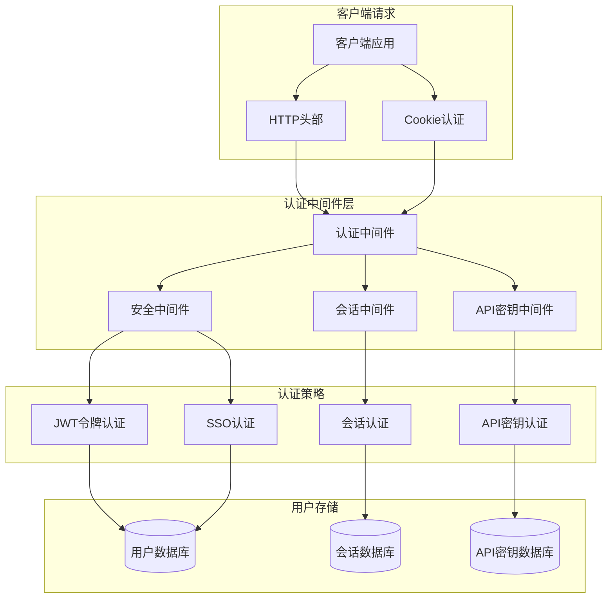
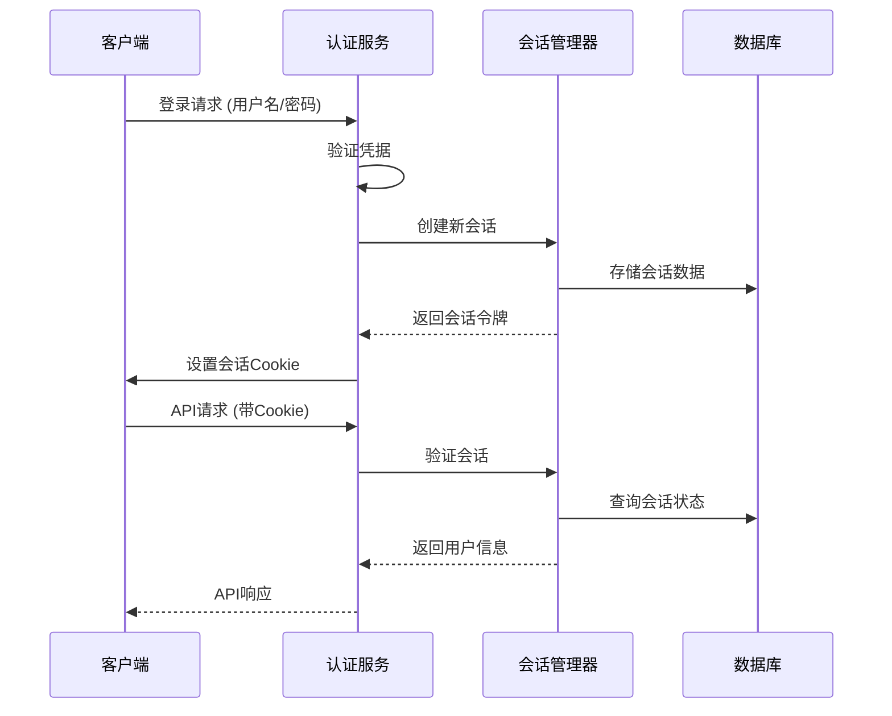
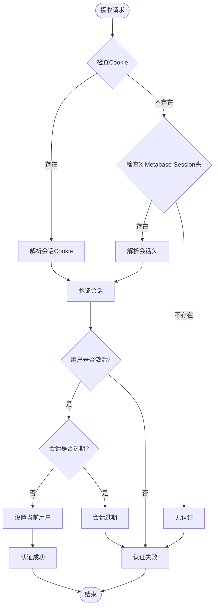
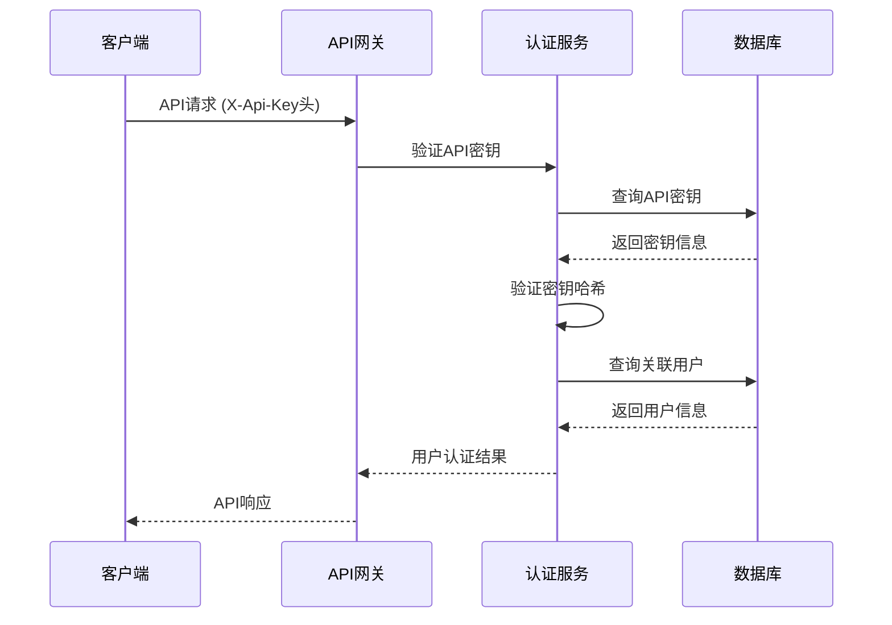
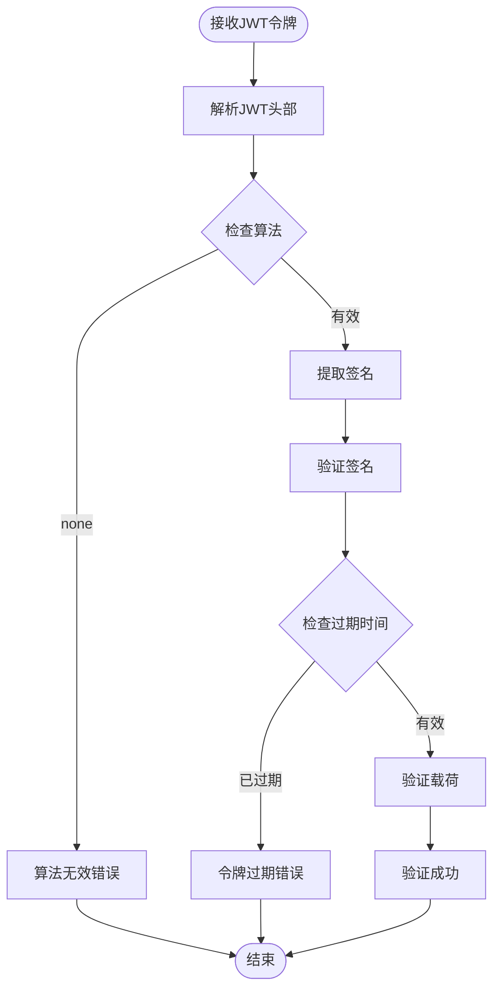
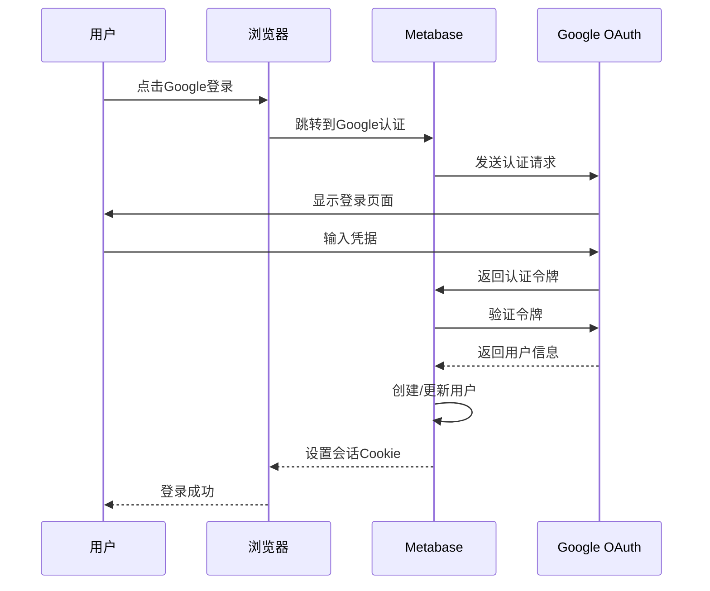
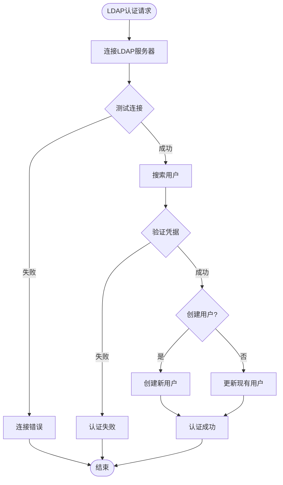
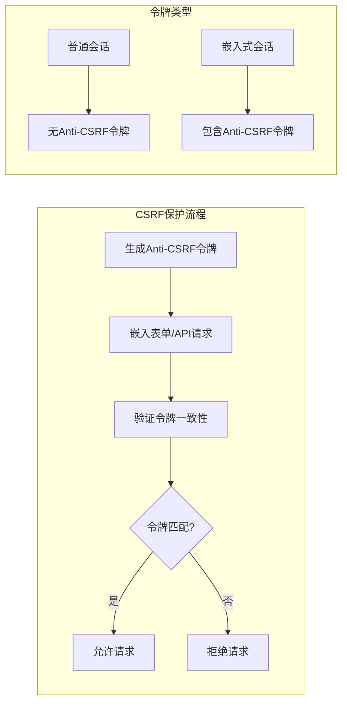
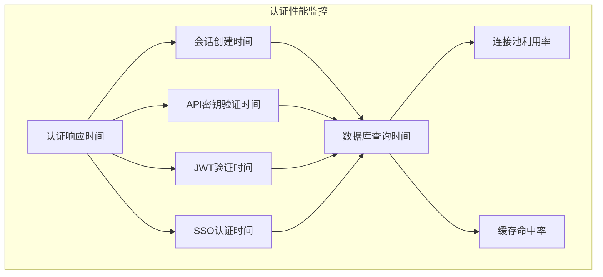

# API认证机制

<cite>
**本文档中引用的文件**
- [session.clj](file://src/metabase/session/models/session.clj)
- [api.clj](file://src/metabase/session/api.clj)
- [session.clj](file://src/metabase/server/middleware/session.clj)
- [jwt.clj](file://src/metabase/embedding/jwt.clj)
- [embed.clj](file://src/metabase/embedding/api/embed.clj)
- [api_keys.clj](file://src/metabase/api_keys/api.clj)
- [api_key.clj](file://src/metabase/api_keys/models/api_key.clj)
- [google.clj](file://src/metabase/sso/google.clj)
- [ldap.clj](file://src/metabase/sso/ldap.clj)
- [core.clj](file://src/metabase/sso/core.clj)
- [settings.clj](file://src/metabase/sso/settings.clj)
- [user.clj](file://src/metabase/users/models/user.clj)
- [security.clj](file://src/metabase/server/middleware/security.clj)
- [cookies.clj](file://src/metabase/request/cookies.clj)
- [settings.clj](file://src/metabase/embedding/settings.clj)
</cite>

## 目录
1. [简介](#简介)
2. [认证架构概览](#认证架构概览)
3. [会话认证机制](#会话认证机制)
4. [API密钥认证](#api密钥认证)
5. [JWT令牌认证](#jwt令牌认证)
6. [单点登录(SSO)集成](#单点登录sso集成)
7. [安全配置与最佳实践](#安全配置与最佳实践)
8. [错误处理与故障排除](#错误处理与故障排除)
9. [客户端实现指南](#客户端实现指南)
10. [总结](#总结)

## 简介

Metabase提供了多种强大的认证机制，确保API访问的安全性和灵活性。本文档详细介绍了Metabase支持的所有认证方式，包括会话认证、API密钥认证、JWT令牌认证和单点登录(SSO)集成。每种认证方式都有其特定的使用场景和安全特性，为不同的部署需求提供了解决方案。

## 认证架构概览

Metabase的认证系统采用多层架构设计，支持多种认证策略的组合使用：



**图表来源**
- [session.clj](file://src/metabase/server/middleware/session.clj#L1-L50)
- [security.clj](file://src/metabase/server/middleware/security.clj#L1-L33)

## 会话认证机制

会话认证是Metabase最常用的认证方式，通过HTTP Cookie和会话令牌实现用户身份验证。

### 会话生命周期



**图表来源**
- [session.clj](file://src/metabase/session/api.clj#L80-L120)
- [session.clj](file://src/metabase/session/models/session.clj#L70-L106)

### 会话管理核心功能

#### 会话创建与验证

会话认证的核心在于安全的会话管理和令牌验证：

**节来源**
- [session.clj](file://src/metabase/session/models/session.clj#L70-L106)
- [session.clj](file://src/metabase/session/api.clj#L80-L120)

#### 会话安全特性

1. **会话哈希存储**: 会话密钥以SHA-512哈希形式存储，确保即使数据库泄露也不会暴露原始密钥
2. **自动过期机制**: 支持基于时间的会话过期，可配置最大会话时长
3. **防重放攻击**: 每个会话包含唯一标识符和创建时间戳
4. **跨域安全**: 支持SameSite属性配置，防止CSRF攻击

### 会话认证流程



**图表来源**
- [session.clj](file://src/metabase/server/middleware/session.clj#L166-L190)

**节来源**
- [session.clj](file://src/metabase/server/middleware/session.clj#L166-L190)

## API密钥认证

API密钥认证为自动化工具和第三方应用程序提供了一种安全的认证方式，特别适用于服务器到服务器的通信。

### API密钥生成与管理

#### 密钥结构与安全

API密钥采用标准化格式，确保安全性和可追溯性：

**节来源**
- [api_key.clj](file://src/metabase/api_keys/models/api_key.clj#L60-L90)
- [api_keys.clj](file://src/metabase/api_keys/api.clj#L25-L50)

#### 密钥操作API

API密钥支持完整的CRUD操作，包括创建、更新、删除和重新生成：

**节来源**
- [api_keys.clj](file://src/metabase/api_keys/api.clj#L25-L102)

### API密钥认证流程



**图表来源**
- [session.clj](file://src/metabase/server/middleware/session.clj#L200-L250)

### API密钥安全特性

1. **前缀唯一性**: 每个API密钥都有唯一的前缀，便于快速识别和验证
2. **动态生成**: 使用加密随机数生成器创建不可预测的密钥
3. **权限隔离**: 每个API密钥关联特定的用户账户和权限组
4. **审计追踪**: 所有API密钥操作都记录在审计日志中

**节来源**
- [api_key.clj](file://src/metabase/api_keys/models/api_key.clj#L150-L200)

## JWT令牌认证

JWT(JSON Web Token)认证专为嵌入式场景设计，支持无状态的身份验证和授权。

### JWT令牌结构与签名

#### 令牌组成

JWT令牌由三部分组成：头部、载荷和签名：

**节来源**
- [jwt.clj](file://src/metabase/embedding/jwt.clj#L10-L30)

#### 签名验证流程



**图表来源**
- [jwt.clj](file://src/metabase/embedding/jwt.clj#L25-L50)

### 嵌入式JWT认证

#### 令牌参数结构

JWT令牌支持灵活的资源访问控制：

**节来源**
- [embed.clj](file://src/metabase/embedding/api/embed.clj#L30-L50)

#### 嵌入式API端点

JWT认证支持多种嵌入式API端点：

**节来源**
- [embed.clj](file://src/metabase/embedding/api/embed.clj#L80-L150)

### JWT安全配置

#### 秘钥管理

JWT认证依赖于安全的秘钥管理：

**节来源**
- [settings.clj](file://src/metabase/embedding/settings.clj#L15-L30)

#### 过期策略

JWT令牌支持灵活的过期配置：

**节来源**
- [jwt.clj](file://src/metabase/embedding/jwt.clj#L35-L50)

## 单点登录(SSO)集成

Metabase支持多种SSO提供商，包括Google OAuth和LDAP目录服务。

### Google SSO认证

#### OAuth流程



**图表来源**
- [google.clj](file://src/metabase/sso/google.clj#L70-L90)

#### Google认证配置

**节来源**
- [google.clj](file://src/metabase/sso/google.clj#L15-L40)
- [settings.clj](file://src/metabase/sso/settings.clj#L150-L180)

### LDAP SSO认证

#### LDAP连接配置

LDAP认证支持多种连接选项和安全协议：

**节来源**
- [ldap.clj](file://src/metabase/sso/ldap.clj#L25-L50)

#### 用户查找与同步



**图表来源**
- [ldap.clj](file://src/metabase/sso/ldap.clj#L150-L200)

#### LDAP安全特性

1. **连接池管理**: 使用连接池优化LDAP性能
2. **超时控制**: 可配置的LDAP操作超时时间
3. **错误处理**: 详细的LDAP错误消息映射
4. **属性映射**: 灵活的用户属性映射配置

**节来源**
- [ldap.clj](file://src/metabase/sso/ldap.clj#L180-L226)

### SSO认证策略

#### 多重认证回退

Metabase实现了智能的认证回退策略：

**节来源**
- [api.clj](file://src/metabase/session/api.clj#L60-L90)

## 安全配置与最佳实践

### CSRF保护机制

#### Anti-CSRF令牌



**图表来源**
- [session.clj](file://src/metabase/session/models/session.clj#L35-L45)
- [cookies.clj](file://src/metabase/request/cookies.clj#L64-L96)

#### CSRF安全配置

**节来源**
- [cookies.clj](file://src/metabase/request/cookies.clj#L64-L96)
- [security.clj](file://src/metabase/server/middleware/security.clj#L283-L306)

### HTTPS与传输安全

#### 安全头配置

Metabase实现了全面的安全头配置：

**节来源**
- [security.clj](file://src/metabase/server/middleware/security.clj#L261-L306)

### 密钥管理最佳实践

#### API密钥轮换

定期轮换API密钥是维护安全的重要措施：

**节来源**
- [api_key.clj](file://src/metabase/api_keys/models/api_key.clj#L220-L252)

#### JWT秘钥管理

JWT秘钥的安全管理至关重要：

**节来源**
- [settings.clj](file://src/metabase/embedding/settings.clj#L15-L30)

### 权限控制与审计

#### 最小权限原则

所有认证方式都遵循最小权限原则：

**节来源**
- [user.clj](file://src/metabase/users/models/user.clj#L100-L150)

#### 审计日志

所有认证活动都被详细记录：

**节来源**
- [session.clj](file://src/metabase/session/api.clj#L120-L150)

## 错误处理与故障排除

### 常见认证错误

#### 会话认证错误

| 错误类型 | HTTP状态码 | 描述 | 解决方案 |
|---------|-----------|------|----------|
| 会话过期 | 401 | 会话已过期或被撤销 | 重新登录获取新会话 |
| 无效会话 | 401 | 会话令牌格式错误 | 检查Cookie或请求头格式 |
| 用户禁用 | 401 | 用户账户已被禁用 | 联系管理员启用账户 |
| 会话冲突 | 401 | 同一会话多次使用 | 清除浏览器Cookie |

#### API密钥认证错误

| 错误类型 | HTTP状态码 | 描述 | 解决方案 |
|---------|-----------|------|----------|
| 密钥无效 | 401 | API密钥格式错误或不存在 | 检查密钥格式和有效性 |
| 权限不足 | 403 | API密钥权限不足以执行操作 | 检查密钥关联的权限组 |
| 密钥过期 | 401 | API密钥已被撤销 | 重新生成新的API密钥 |

#### JWT认证错误

| 错误类型 | HTTP状态码 | 描述 | 解决方案 |
|---------|-----------|------|----------|
| 签名无效 | 400 | JWT签名验证失败 | 检查JWT秘钥配置 |
| 令牌过期 | 400 | JWT令牌已过期 | 生成新的JWT令牌 |
| 算法不支持 | 400 | JWT算法配置错误 | 使用支持的签名算法 |
| 载荷缺失 | 400 | JWT载荷格式错误 | 检查JWT载荷结构 |

### SSO认证故障排除

#### Google SSO问题

**节来源**
- [google.clj](file://src/metabase/sso/google.clj#L40-L70)

#### LDAP连接问题

**节来源**
- [ldap.clj](file://src/metabase/sso/ldap.clj#L100-L150)

### 性能监控与优化

#### 认证性能指标



## 客户端实现指南

### HTTP头设置

#### 会话认证

```javascript
// 设置会话Cookie
fetch('/api/session', {
    method: 'POST',
    credentials: 'include', // 自动发送Cookie
    headers: {
        'Content-Type': 'application/json'
    },
    body: JSON.stringify({
        username: 'user@example.com',
        password: 'password'
    })
});
```

#### API密钥认证

```javascript
// 使用API密钥头
fetch('/api/cards', {
    headers: {
        'X-Api-Key': 'mb_<your-api-key>',
        'Content-Type': 'application/json'
    }
});
```

#### JWT认证

```javascript
// 使用JWT令牌
fetch('/api/embed/card/<jwt-token>', {
    headers: {
        'Authorization': 'Bearer <jwt-token>'
    }
});
```

### 错误处理模式

#### 统一错误处理

```javascript
class MetabaseAPIError extends Error {
    constructor(status, message, details) {
        super(message);
        this.status = status;
        this.details = details;
    }
}

async function handleApiResponse(response) {
    if (!response.ok) {
        const errorData = await response.json().catch(() => ({}));
        throw new MetabaseAPIError(
            response.status,
            errorData.message || 'API请求失败',
            errorData.errors
        );
    }
    return response.json();
}
```

### 令牌刷新机制

#### 自动刷新会话

```javascript
class AuthenticationManager {
    constructor() {
        this.refreshTokenTimer = null;
    }
    
    async refreshToken() {
        try {
            const response = await fetch('/api/session/refresh');
            if (response.ok) {
                // 会话刷新成功，设置新的定时器
                this.scheduleTokenRefresh();
            } else {
                // 刷新失败，需要重新登录
                this.handleAuthFailure();
            }
        } catch (error) {
            console.error('令牌刷新失败:', error);
            this.handleAuthFailure();
        }
    }
    
    scheduleTokenRefresh() {
        // 在会话过期前15分钟刷新
        const refreshTime = Math.max(15 * 60 * 1000, this.sessionExpiryTime - Date.now());
        clearTimeout(this.refreshTokenTimer);
        this.refreshTokenTimer = setTimeout(() => this.refreshToken(), refreshTime);
    }
}
```

### 安全客户端配置

#### 防止敏感信息泄露

```javascript
class SecureAPIClient {
    constructor(baseUrl, authProvider) {
        this.baseUrl = baseUrl;
        this.authProvider = authProvider;
        this.interceptors = [];
    }
    
    async request(endpoint, options = {}) {
        // 添加认证头
        const authHeaders = await this.authProvider.getAuthHeaders();
        const headers = {
            ...authHeaders,
            ...options.headers
        };
        
        // 记录请求但不记录敏感信息
        console.log(`[API Request] ${endpoint}`, {
            method: options.method,
            headers: Object.keys(headers).filter(k => !k.toLowerCase().includes('password')),
            body: options.body ? '[REDACTED]' : undefined
        });
        
        const response = await fetch(`${this.baseUrl}${endpoint}`, {
            ...options,
            headers,
            credentials: 'include'
        });
        
        return response;
    }
}
```

## 总结

Metabase的API认证机制提供了全面而灵活的安全解决方案，支持从简单的会话认证到复杂的嵌入式JWT认证等多种场景。通过合理配置和使用这些认证方式，可以确保API访问的安全性、可靠性和可扩展性。

### 关键安全特性

1. **多重认证支持**: 同时支持会话、API密钥、JWT和SSO认证
2. **强加密保护**: 所有敏感数据都经过加密存储和传输
3. **完善的审计**: 详细记录所有认证活动和变更
4. **灵活的权限控制**: 基于角色的访问控制(RBAC)
5. **安全的默认配置**: 开箱即用的安全设置

### 最佳实践建议

1. **定期轮换密钥**: 包括API密钥和JWT秘钥
2. **监控认证活动**: 及时发现异常认证行为
3. **使用HTTPS**: 确保所有通信都经过加密
4. **实施最小权限原则**: 只授予必要的访问权限
5. **备份认证配置**: 确保能够恢复认证服务

通过遵循本文档中的指导原则和最佳实践，可以构建安全可靠的Metabase API集成，满足各种业务需求。