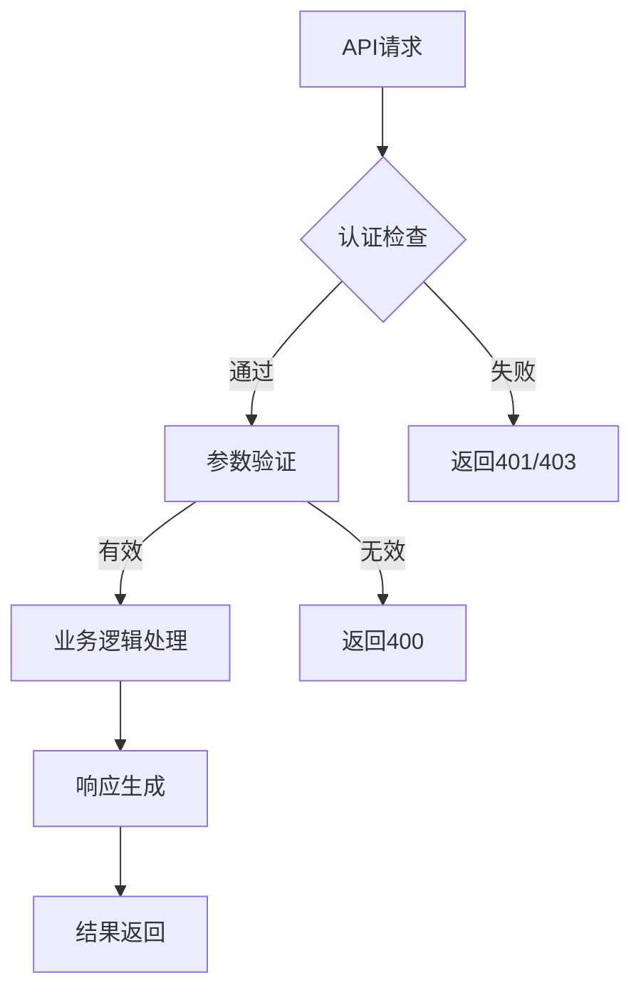
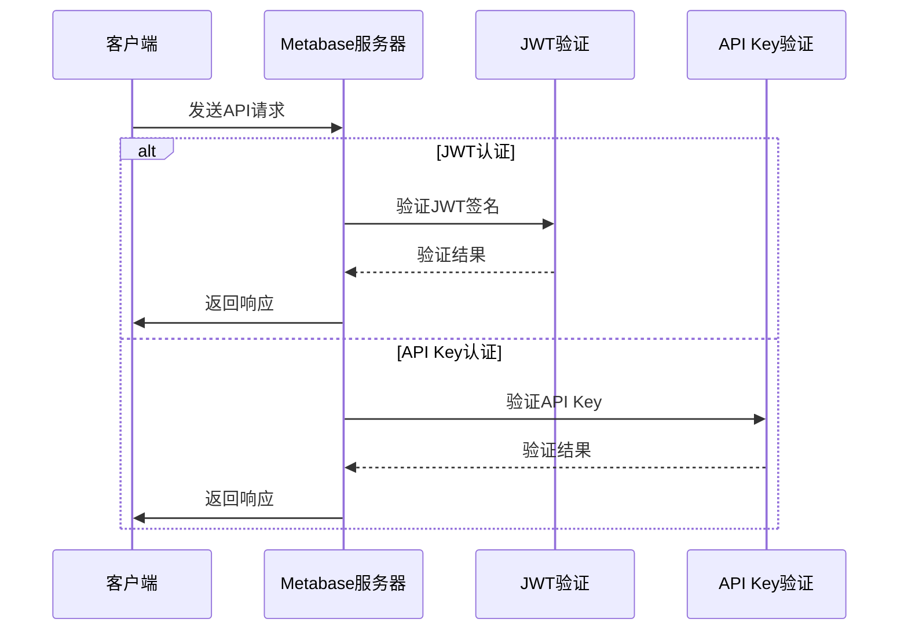
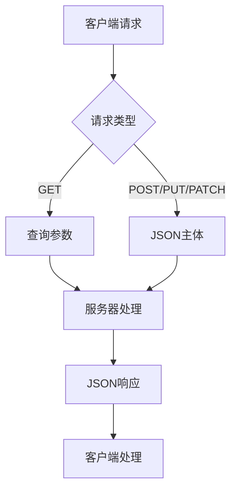
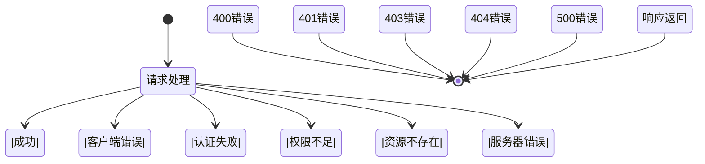
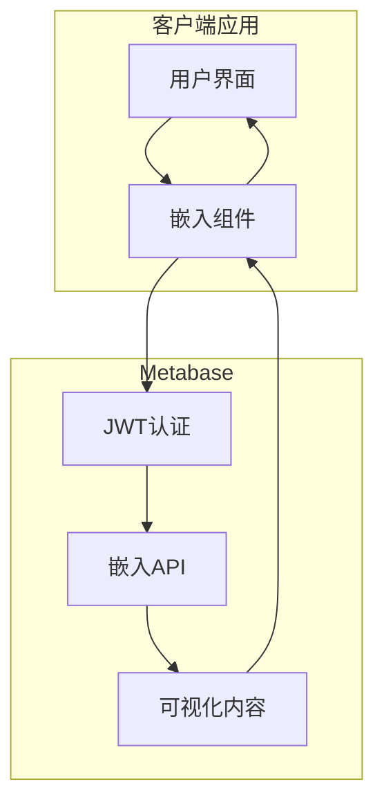
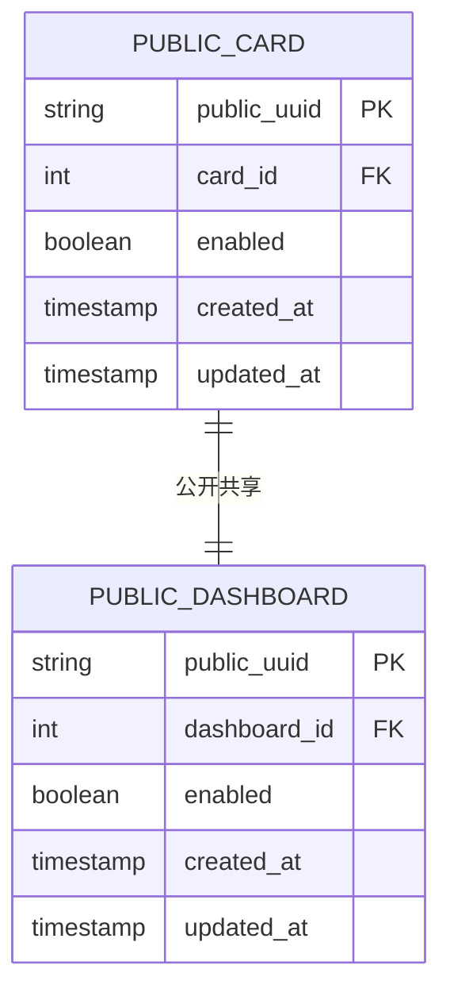
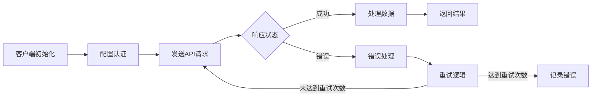
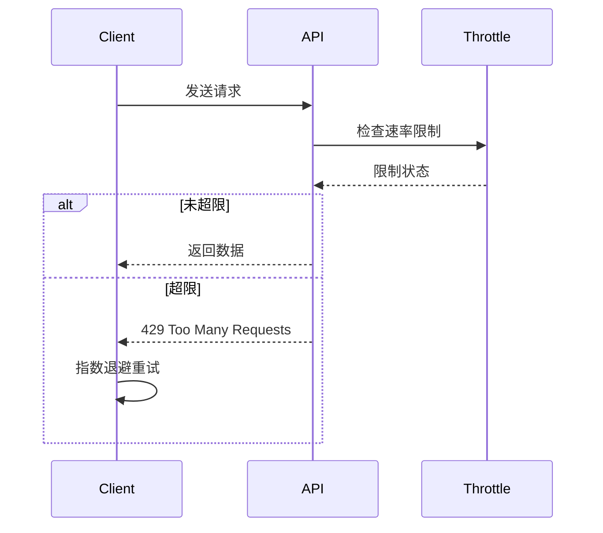
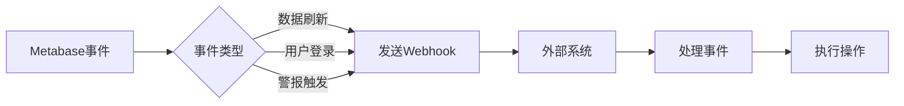

# API集成

<cite>
**本文档中引用的文件**   
- [api.clj](file://src/metabase/api.clj)
- [common.clj](file://src/metabase/api/common.clj)
- [macros.clj](file://src/metabase/api/macros.clj)
- [embedding/api.clj](file://src/metabase/embedding/api.clj)
- [public_sharing/api.clj](file://src/metabase/public_sharing/api.clj)
- [api_keys/api.clj](file://src/metabase/api_keys/api.clj)
- [embedding/jwt.clj](file://src/metabase/embedding/jwt.clj)
- [embedding/settings.clj](file://src/metabase/embedding/settings.clj)
- [routes.clj](file://src/metabase/api_routes/routes.clj)
- [common.clj](file://src/metabase/api/routes/common.clj)
</cite>

## 目录
1. [引言](#引言)
2. [API设计原则](#api设计原则)
3. [认证机制](#认证机制)
4. [请求/响应格式](#请求响应格式)
5. [错误处理](#错误处理)
6. [嵌入式分析API](#嵌入式分析api)
7. [公开共享API](#公开共享api)
8. [客户端开发指南](#客户端开发指南)
9. [速率限制与监控](#速率限制与监控)
10. [Webhook事件驱动集成](#webhook事件驱动集成)

## 引言

Metabase RESTful API为应用程序提供了强大的数据分析和可视化集成能力。本最佳实践文档全面介绍了Metabase API的设计原则、使用模式和安全配置，旨在帮助开发者高效、安全地集成Metabase功能。API支持多种认证机制，包括JWT和API Key，并提供了丰富的端点用于嵌入式分析和公开共享场景。通过遵循本文档中的最佳实践，开发者可以构建稳定、安全且高性能的集成解决方案。

## API设计原则

Metabase API采用现代化的RESTful设计原则，通过`defendpoint`宏定义所有端点，确保了一致性和可维护性。每个端点都包含HTTP动词、路由、文档字符串、参数模式和实现代码。API使用Malli的向量语法进行参数验证，确保输入数据的正确性。路由自动继承命名空间前缀，例如`/api/dashboard/`。API设计强调安全性，通过中间件处理认证和权限检查，同时提供详细的错误信息以帮助调试。

**Diagram sources**
- [api/macros.clj](file://src/metabase/api/macros.clj#L0-L889)
- [api/common.clj](file://src/metabase/api/common.clj#L0-L587)

**Section sources**
- [api/macros.clj](file://src/metabase/api/macros.clj#L0-L889)
- [api/common.clj](file://src/metabase/api/common.clj#L0-L587)

## 认证机制

Metabase API支持多种认证机制，包括JWT和API Key。JWT认证通过`embedding-secret-key`进行签名验证，确保请求的安全性。API Key认证适用于服务器到服务器的通信，通过`MB_API_KEY`环境变量进行配置。对于嵌入式分析，JWT是首选认证方式，它允许在不暴露用户凭据的情况下安全地嵌入内容。公开共享则使用UUID作为公开访问令牌，无需传统认证。

**Diagram sources**
- [embedding/jwt.clj](file://src/metabase/embedding/jwt.clj#L0-L51)
- [api_keys/api.clj](file://src/metabase/api_keys/api.clj#L0-L103)
- [embedding/settings.clj](file://src/metabase/embedding/settings.clj#L0-L315)

**Section sources**
- [embedding/jwt.clj](file://src/metabase/embedding/jwt.clj#L0-L51)
- [api_keys/api.clj](file://src/metabase/api_keys/api.clj#L0-L103)
- [embedding/settings.clj](file://src/metabase/embedding/settings.clj#L0-L315)

## 请求/响应格式

Metabase API使用标准的HTTP方法和状态码，请求和响应通常采用JSON格式。GET请求的参数通过查询字符串传递，而POST、PUT和PATCH请求的主体包含JSON数据。API响应包含状态码、响应头和JSON格式的响应体。对于分页数据，API提供`limit`和`offset`参数来控制返回结果的数量和起始位置。所有日期时间值均使用ISO 8601格式。

**Diagram sources**
- [api/common.clj](file://src/metabase/api/common.clj#L0-L587)
- [api/macros.clj](file://src/metabase/api/macros.clj#L0-L889)

**Section sources**
- [api/common.clj](file://src/metabase/api/common.clj#L0-L587)
- [api/macros.clj](file://src/metabase/api/macros.clj#L0-L889)

## 错误处理

Metabase API提供了一致的错误处理机制，使用标准的HTTP状态码表示不同类型的错误。400系列状态码表示客户端错误，如无效参数或请求格式错误；401和403状态码表示认证和授权问题；500系列状态码表示服务器内部错误。错误响应包含详细的错误信息，包括错误消息和错误代码，帮助开发者快速定位问题。API使用`check`和`checkp`函数进行预条件检查，确保输入数据的有效性。

**Diagram sources**
- [api/common.clj](file://src/metabase/api/common.clj#L0-L587)
- [server/middleware/exceptions.clj](file://src/metabase/server/middleware/exceptions.clj#L0-L30)

**Section sources**
- [api/common.clj](file://src/metabase/api/common.clj#L0-L587)
- [server/middleware/exceptions.clj](file://src/metabase/server/middleware/exceptions.clj#L0-L30)

## 嵌入式分析API

嵌入式分析API允许将Metabase的可视化内容安全地嵌入到其他应用程序中。通过JWT认证，可以在不暴露用户凭据的情况下嵌入卡片和仪表板。嵌入配置包括设置`embedding-secret-key`、启用相应的嵌入类型（SDK、简单嵌入等）和配置允许的来源域。API提供`/api/embed`端点用于获取嵌入内容，支持参数化查询和交互式功能。

**Diagram sources**
- [embedding/api.clj](file://src/metabase/embedding/api.clj#L0-L17)
- [embedding/settings.clj](file://src/metabase/embedding/settings.clj#L0-L315)

**Section sources**
- [embedding/api.clj](file://src/metabase/embedding/api.clj#L0-L17)
- [embedding/settings.clj](file://src/metabase/embedding/settings.clj#L0-L315)

## 公开共享API

公开共享API允许创建无需认证即可访问的公开链接，用于分享卡片和仪表板。通过为内容生成公开UUID，可以创建永久的公开访问链接。API提供`/api/public`端点，支持获取公开卡片和仪表板的数据。公开共享可以配置为启用或禁用，并且可以设置速率限制以防止滥用。此功能适用于创建公开报告或与外部利益相关者共享数据。

**Diagram sources**
- [public_sharing/api.clj](file://src/metabase/public_sharing/api.clj#L0-L632)
- [api_routes/routes.clj](file://src/metabase/api_routes/routes.clj#L0-L209)

**Section sources**
- [public_sharing/api.clj](file://src/metabase/public_sharing/api.clj#L0-L632)
- [api_routes/routes.clj](file://src/metabase/api_routes/routes.clj#L0-L209)

## 客户端开发指南

客户端开发应遵循最佳实践，包括使用适当的认证机制、处理错误响应和实现重试逻辑。对于不同编程语言，可以使用相应的HTTP客户端库来调用Metabase API。建议实现连接池、超时设置和错误重试机制以提高可靠性。对于嵌入式集成，应使用Metabase提供的SDK或遵循JWT认证流程。开发时应充分利用API文档和示例代码，确保集成的正确性和稳定性。

**Diagram sources**
- [api/common.clj](file://src/metabase/api/common.clj#L0-L587)
- [api/macros.clj](file://src/metabase/api/macros.clj#L0-L889)

**Section sources**
- [api/common.clj](file://src/metabase/api/common.clj#L0-L587)
- [api/macros.clj](file://src/metabase/api/macros.clj#L0-L889)

## 速率限制与监控

Metabase API实施速率限制以防止滥用和确保系统稳定性。通过`throttle`库实现基于不同维度（如用户ID、IP地址）的速率限制。监控工具可用于跟踪API使用情况、性能指标和错误率。建议在客户端实现适当的重试策略，使用指数退避算法处理速率限制错误（429状态码）。系统还提供事件跟踪功能，可用于分析API使用模式和优化性能。

**Diagram sources**
- [public_sharing/api.clj](file://src/metabase/public_sharing/api.clj#L0-L632)
- [api/common.clj](file://src/metabase/api/common.clj#L0-L587)

**Section sources**
- [public_sharing/api.clj](file://src/metabase/public_sharing/api.clj#L0-L632)
- [api/common.clj](file://src/metabase/api/common.clj#L0-L587)

## Webhook事件驱动集成

Webhook功能允许Metabase在特定事件发生时向外部系统发送HTTP回调。这支持事件驱动的集成模式，如数据更新通知、警报触发和自动化工作流。通过配置Webhook端点，外部系统可以实时响应Metabase中的变化。事件类型包括数据刷新、用户活动和系统状态变更。Webhook请求包含事件详情和签名，确保消息的完整性和安全性。

**Diagram sources**
- [events/core.clj](file://src/metabase/events/core.clj)
- [public_sharing/api.clj](file://src/metabase/public_sharing/api.clj#L0-L632)

**Section sources**
- [events/core.clj](file://src/metabase/events/core.clj)
- [public_sharing/api.clj](file://src/metabase/public_sharing/api.clj#L0-L632)