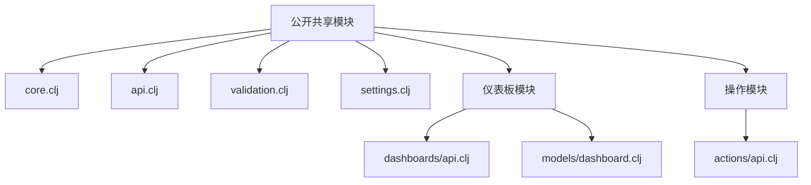
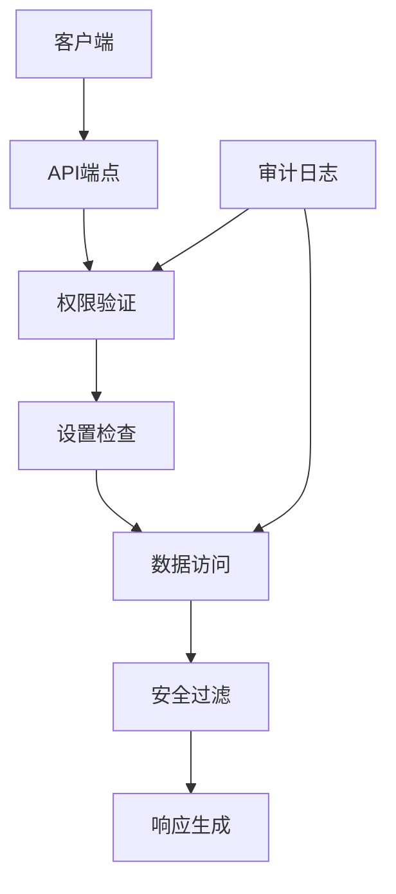
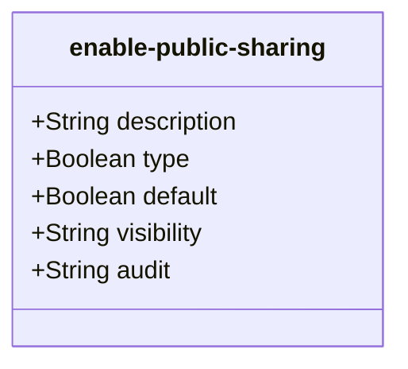
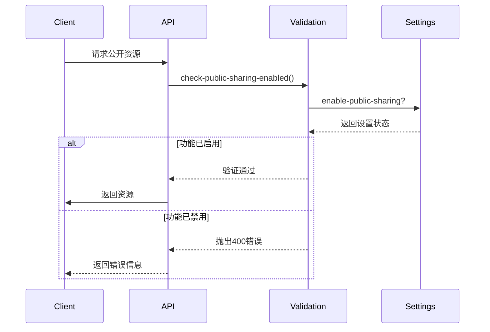
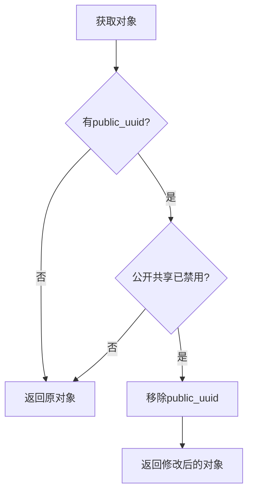
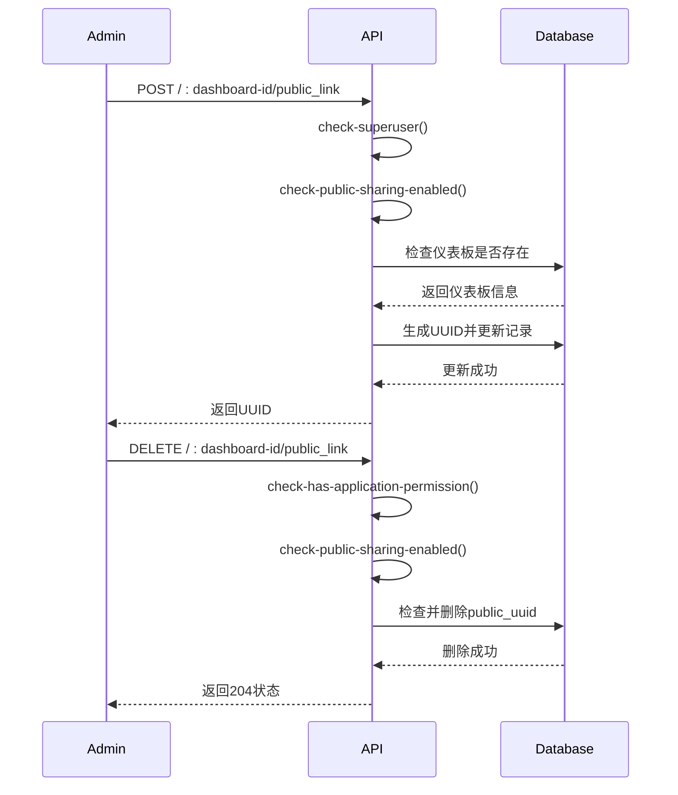
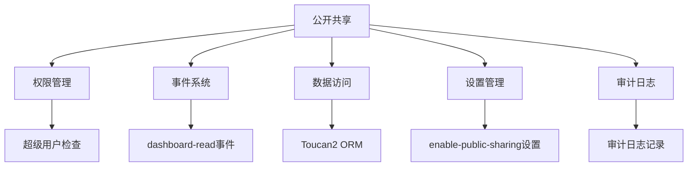

# 公开共享集成

<cite>
**本文档中引用的文件**  
- [core.clj](file://src/metabase/public_sharing/core.clj)
- [api.clj](file://src/metabase/public_sharing/api.clj)
- [validation.clj](file://src/metabase/public_sharing/validation.clj)
- [settings.clj](file://src/metabase/public_sharing/settings.clj)
- [dashboard.clj](file://src/metabase/dashboards/models/dashboard.clj)
- [dashboards/api.clj](file://src/metabase/dashboards/api.clj)
- [actions/api.clj](file://src/metabase/actions/api.clj)
</cite>

## 目录
1. [简介](#简介)
2. [项目结构](#项目结构)
3. [核心组件](#核心组件)
4. [架构概述](#架构概述)
5. [详细组件分析](#详细组件分析)
6. [依赖分析](#依赖分析)
7. [性能考虑](#性能考虑)
8. [故障排除指南](#故障排除指南)
9. [结论](#结论)

## 简介
本文档详细说明了Metabase系统中公开共享功能的技术实现。重点介绍如何通过公共UUID安全地共享仪表板和查询结果，包括启用/禁用共享、生成共享链接和权限验证机制。文档解释了`remove-public-uuid-if-public-sharing-is-disabled`等核心函数的工作原理和调用时机，提供了API端点使用示例，并包含安全注意事项。

## 项目结构
公开共享功能主要分布在`src/metabase/public_sharing/`目录下，包含核心逻辑、API端点、验证和设置模块。相关功能也与仪表板和操作模块紧密集成。

**Diagram sources**
- [core.clj](file://src/metabase/public_sharing/core.clj)
- [api.clj](file://src/metabase/public_sharing/api.clj)
- [validation.clj](file://src/metabase/public_sharing/validation.clj)
- [settings.clj](file://src/metabase/public_sharing/settings.clj)

**Section sources**
- [core.clj](file://src/metabase/public_sharing/core.clj)
- [api.clj](file://src/metabase/public_sharing/api.clj)

## 核心组件
公开共享功能的核心组件包括设置管理、权限验证、API端点和安全过滤。系统通过UUID标识公开共享的资源，并在访问时进行严格的权限检查。

**Section sources**
- [core.clj](file://src/metabase/public_sharing/core.clj#L0-L11)
- [validation.clj](file://src/metabase/public_sharing/validation.clj#L0-L10)
- [settings.clj](file://src/metabase/public_sharing/settings.clj#L0-L10)

## 架构概述
公开共享功能采用分层架构，从设置管理到API端点，再到数据访问层，确保安全性和可维护性。

**Diagram sources**
- [api.clj](file://src/metabase/public_sharing/api.clj#L0-L631)
- [validation.clj](file://src/metabase/public_sharing/validation.clj#L0-L10)

## 详细组件分析

### 公开共享设置
公开共享功能通过设置模块进行全局控制，管理员可以启用或禁用此功能。

**Diagram sources**
- [settings.clj](file://src/metabase/public_sharing/settings.clj#L0-L10)

**Section sources**
- [settings.clj](file://src/metabase/public_sharing/settings.clj#L0-L10)

### 权限验证机制
权限验证是公开共享功能的核心，确保只有在功能启用时才能访问公开资源。

**Diagram sources**
- [validation.clj](file://src/metabase/public_sharing/validation.clj#L0-L10)
- [settings.clj](file://src/metabase/public_sharing/settings.clj#L0-L10)

**Section sources**
- [validation.clj](file://src/metabase/public_sharing/validation.clj#L0-L10)

### 核心函数分析
`remove-public-uuid-if-public-sharing-is-disabled`函数在数据访问后自动移除公共UUID，防止信息泄露。

**Diagram sources**
- [core.clj](file://src/metabase/public_sharing/core.clj#L0-L11)

**Section sources**
- [core.clj](file://src/metabase/public_sharing/core.clj#L0-L11)

### API端点使用示例
公开共享API提供了一系列端点用于创建、验证和撤销共享链接。

**Diagram sources**
- [dashboards/api.clj](file://src/metabase/dashboards/api.clj#L1070-L1110)
- [actions/api.clj](file://src/metabase/actions/api.clj#L130-L160)

**Section sources**
- [dashboards/api.clj](file://src/metabase/dashboards/api.clj#L1070-L1110)
- [actions/api.clj](file://src/metabase/actions/api.clj#L130-L160)

## 依赖分析
公开共享功能依赖于多个核心模块，包括权限管理、事件系统和数据访问层。

**Diagram sources**
- [api.clj](file://src/metabase/public_sharing/api.clj#L0-L631)
- [dashboard.clj](file://src/metabase/dashboards/models/dashboard.clj#L1-L200)

**Section sources**
- [api.clj](file://src/metabase/public_sharing/api.clj#L0-L631)
- [dashboard.clj](file://src/metabase/dashboards/models/dashboard.clj#L1-L200)

## 性能考虑
公开共享功能在设计时考虑了性能优化，包括缓存机制和批量操作。

- 使用`after-select`钩子自动处理公共UUID
- 通过`request/as-admin`绑定确保查询权限
- 采用流式响应处理大数据集
- 实现速率限制防止滥用

## 故障排除指南
常见问题及解决方案：

1. **无法创建公开链接**：检查是否具有超级用户权限和公开共享是否已启用
2. **访问公开资源返回400错误**：确认`enable-public-sharing`设置为true
3. **公开链接突然失效**：检查系统设置是否被修改
4. **性能问题**：监控查询执行时间和资源使用情况

**Section sources**
- [validation.clj](file://src/metabase/public_sharing/validation.clj#L0-L10)
- [core.clj](file://src/metabase/public_sharing/core.clj#L0-L11)

## 结论
Metabase的公开共享功能提供了一套完整的安全机制，通过UUID标识、权限验证和审计日志确保数据安全。系统设计考虑了易用性和安全性，管理员可以轻松管理公开共享设置，同时防止信息泄露。